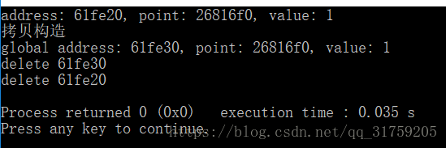
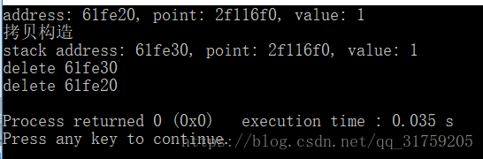
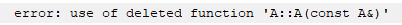
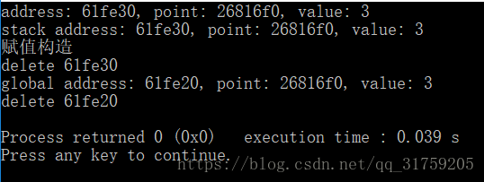
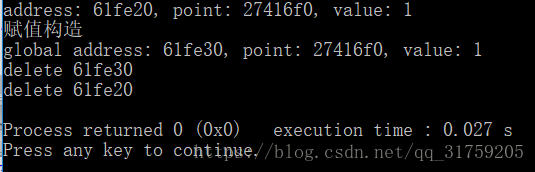

## 一、前言
写一个用到指针的程序时，被拷贝、赋值、析构函数坑了一波，网上查相关博客，发现关于拷贝、赋值构造函数调用时机大多都有错误，因此决定自己总结撸一发博客。
~~~cpp
A (A& a);						//拷贝构造函数
A (const A& a);					//拷贝构造函数
A& operator= (const A& a);		//赋值构造函数
~~~
先写一个类，用作之后的示例
~~~cpp
class A {
public:
    int* x;
    int y;
    A() = default;
    A (const A& a) {
        printf ("拷贝构造\n");
        this->x = a.x;
        this->y = a.y;
    }

    A& operator= (const A& a) {
        printf ("赋值构造\n");
        this->x = a.x;
        this->y = a.y;
    }
    A (int t) {
        x = new int (0);
        y = t;
        printf ("address: %x, point: %x, value: %d\n", this, x, y);
    }
    ~A() {
        printf ("delete %x\n", this);
    }
};

A f () {
    A ret (3);
    printf ("stack address: %x, point: %x, value: %d\n", &ret, ret.x, ret.y);
    return ret;
}
~~~

## 二、拷贝构造函数
1.对象需要通过另外一个对象进行初始化
~~~cpp
int main() {
    A a(1);
    A c = a;
    printf ("global address: %x, point: %x, value: %d\n", &c, c.x, c.y);
    return 0;
}
~~~

2.对象通过值传递方式进入函数
~~~cpp
void g (A ret) {
    printf ("stack address: %x, point: %x, value: %d\n", &ret, ret.x, ret.y);
}

int main() {
    A a (1);
    g (a);
    return 0;
}
~~~

3.当对象以值传递的方式从函数返回
~~~cpp
class A {
public:
    int* x;
    int y;
    A() = default;
    A (const A& a) = delete; //注意把拷贝构造设为禁止使用

    A (int t) {
        x = new int (0);
        y = t;
        printf ("address: %x, point: %x, value: %d\n", this, x, y);
    }
    ~A() {
        printf ("delete %x\n", this);
    }
    A& operator= (const A& a) {
        printf ("赋值构造\n");
        this->x = a.x;
        this->y = a.y;
    }
};

A f () {
    A ret (3);
    printf ("stack address: %x, point: %x, value: %d\n", &ret, ret.x, ret.y);
    return ret;
}
int main() {
    A c = f(); 
    printf ("global address: %x , point: %x, value: %d\n", &c, c.x, c.y);
    return 0;
}
~~~
编译时发生错误，提示return ret调用了被禁止使用的拷贝构造函数

## 三、赋值构造函数
1.对象以值传递方式从函数返回，且接受返回值的对象已经初始化过
~~~cpp
int main() {
    A c;
    c = f();
    printf ("global address: %x, point: %x, value: %d\n", &c, c.x, c.y);
    return 0;
}
~~~

2.对象直接赋值给另一个对象，且接受值的对象已经初始化过
~~~cpp
int main() {
    A a(1);
    A c;
    c = a;
    printf ("global address: %x, point: %x, value: %d\n", &c, c.x, c.y);
    return 0;
}
~~~

## 四、总结
对象以值传递方式从函数返回时，若接受返回值的对象已经初始化过，则会调用赋值构造函数，且该对象还会调用析构函数，当对象中包含指针时，会使该指针失效，因此需要重载赋值构造函数，使用类似深拷贝或移动构造函数的方法赋值，才能避免指针失效。