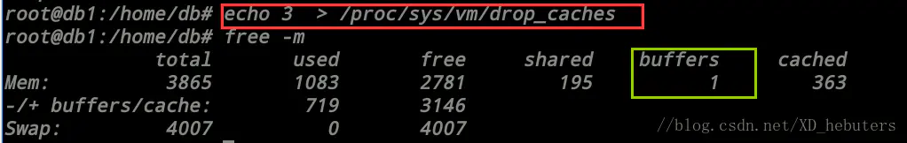

echo N > /proc/sys/vm/drop-caches , 当N数值不同时，free –m存在差异

1.1、echo写入数值之前—free-m内容  
首先查看/proc/sys/vm/drop-caches的默认值，以便可以修改回来

然后free-m查看此时内存使用情况，对于各字段含义，可以参考：

```cpp
第一类单位参数：

1) -b, –bytes， 以Byte为单位显示内存使用情况
2) -k, –kilo， 以KB为单位， 这也是默认值
3) -m, –mega， 以MB为单位显示内容使用情况
4) -g, –giga， 以GB为单位显示内存使用情况

第二类参数：

1)、 -h, –human， 自动将数值转换为人类易读形式
2)、 -c, –count， 展示结果count次，需与-s配合使用
3)、 -s, –seconds， 动态刷新内存使用情况的间隔

free -m各字段含义
第一部分Mem行：
========================
total 内存总数: 3865M 
used 已经使用的内存数: 1545M 
free 空闲的内存数: 2320M 
shared 多个进程共享的内存总额 196M 
buffers Buffer 缓存内存数: 176M 
cached Page 缓存内存数:569M 
关系：total (3865M) = used(1545M) + free(2320M)
第二部分(-/+ buffers/cache):
========================
(-buffers/cache) used内存数：798M 
(指的第一部分Mem行中的used – buffers – cached) 
即为1545 – 176 – 569 = 800 取整时计算差异 2M

(+buffers/cache) free内存数: 3066M 
(指的第一部分Mem行中的free + buffers + cached) 
即为2320 + 176 + 569 = 3065 取整时计算差异 1M
第三部分是指交换分区
========================
当系统的物理内存不够用的时候，就需要将物理内存中的一部分空间释放出来，以供当前运行的程序使用。这些被释放的进程被临时保存到Swap空间中，等到那些程序要运行时，再从Swap分区中恢复保存的数据到内存中。这样，系统总是在物理内存不够时，才进行Swap交换。所以swap分区不被占用或者占用很少，说明现在系统内存够用，运行还算良好，不会影响系统运行
```

执行echo 1 > /proc/sys/vm/drop-caches， 其中绿色框是标记发生改变的部分，由于buffers 和 cached数值变化，第一行free和used均发生变化


执行echo 2 > /proc/sys/vm/drop-caches， 其中绿色框是标记发生改变的部分，这次仅有buffers由0变为1，cached基本没有变化

  


执行echo 3 > /proc/sys/vm/drop-caches， 这次基本上，和写入2区别不大，没有什么变化

  




执行echo N > /proc/sys/vm/drop-caches，再free –m查看内存使用情况，输入不同的N值，free –m内存中缓存buffers会有差异，现在我们就是要解释/proc/sys/vm、drop-caches， 这个文件到底是什么？另外可以写入哪些数值，具体适用于什么场景

查看linux内核文档，可以得到以下信息：

  


可以看出，/proc/sys是一个虚拟文件系统，可以通过对它的读写操作做为与kernel实体间进行通信的一种手段。也就是说可以通过修改/proc中的文件，来对当前kernel的行为做出调整。那么我们可以通过调整/proc/sys/vm/drop-caches来释放内存。其默认数值为0.

向/proc/sys/vm/drop-caches中写入内容，会清理缓存。<font color=red>建议先执行sync</font>（sync 命令将所有未写的系统缓冲区写到磁盘中，包含已修改的 i-node、已延迟的块 I/O 和读写映射文件）。执行echo 1、2、3 至 /proc/sys/vm/drop-caches, 达到不同的清理目的

#### 使用建议


如果因为是应用有像内存泄露、溢出的问题，从swap的使用情况是可以比较快速可以判断的，但free上面反而比较难查看。相反，如果在这个时候，我们告诉用户，修改系统的一个值，“可以”释放内存，free就大了。用户会怎么想？不会觉得操作系统“有问题”吗？所以说，既然核心是可以快速清空buffer或cache，也不难做到（这从上面的操作中可以明显看到），但核心并没有这样做（默认值是0），我们就不应该随便去改变它。

  一般情况下，应用在系统上稳定运行了，free值也会保持在一个稳定值的，虽然看上去可能比较小。当发生内存不足、应用获取不到可用内存、OOM错误等问题时，还是更应该去分析应用方面的原因，如用户量太大导致内存不足、发生应用内存溢出等情况，否则，清空buffer，强制腾出free的大小，可能只是把问题给暂时屏蔽了。

  排除内存不足的情况外，除非是在软件开发阶段，需要临时清掉buffer，以判断应用的内存使用情况；或应用已经不再提供支持，即使应用对内存的时候确实有问题，而且无法避免的情况下，才考虑定时清空buffer。（可惜，这样的应用通常都是运行在老的操作系统版本上，上面的操作也解决不了）

  
  
作者：没意思先生1995  
链接：https://www.jianshu.com/p/016f7cf0380d  
来源：简书  
著作权归作者所有。商业转载请联系作者获得授权，非商业转载请注明出处。