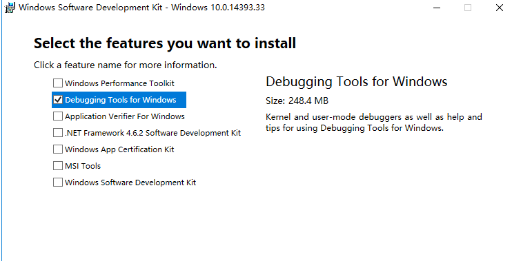

由于工作关系，我又接触到了QT，在之前写过一篇博客是 在vs2017下配置openCV，当时用的是2015做的示范，现在就继续记录一下在VS2015下配置QT吧（VS2017配置是一样的）

## 第一部分：QT5.11的下载

进入官方网站：[http://download.qt.io/archive/qt/](http://download.qt.io/archive/qt/)下载合适的版本（最新版即可）

 

根据自己电脑的版本信息下载，我下载的是[qt-opensource-windows-x86-5.11.2.exe](http://download.qt.io/archive/qt/5.11/5.11.2/qt-opensource-windows-x86-5.11.2.exe)

下载完成之后，直接进行安装，傻瓜式 - 下一步。

 

安装的时候要根据自己的VS版本选择相应的msvc（VC运行库，是 Visual C++ 的运行库。很多程序在编制的时候，使用了微软的运行库，大大减少了软件的编码量，却提高了兼容性。但运行的时候，需要这些运行库。这些运行库简称就是MSVC。）

## 第二部分：安装vs2017

Visual Studio2017官方下载地址： 

[https://www.visualstudio.com/zh-hans/](https://www.visualstudio.com/zh-hans/) 

选择社区版就行，安装过程很简单，一直下一步就行。安装过程较慢，耐心等待。安装内容视情况而定。软件较大，保留足够的空间以供vs使用

## 第三部分：配置QT

如果没有检测到编译器，大多数情况下，是因为安装 VS2015 时候没有勾选“Visual C++”选项。（因为我用的是2015，所以我的版本会和2017稍有出入）

检测不出来没关系，不要卸载重装只需要修改下即可。

进入控制面板 -> 程序和功能，找到 Microsoft Visual Studio Community 2015 Updates，右键选择“更改”。  
  

更新之后重新选择即可

打开 Qt Creator，进入编译器部分，可以看到 Qt 已经自动检测出来了，不需要手动配置。

 工具 -->选项 -->构建和运行 --> 编译器

 工具 -->选项 -->构建和运行 --> 构建套件

 

 可以看到，自动检测出来的构建套件前面显示的警告符号，调试器部分显示“None”,这说明还没有配置调试器！

## 第四部分：配置调试器

调试器默认情况下是没有的，必须手动下载 [windbg](https://developer.microsoft.com/zh-cn/windows/hardware/download-windbg "windbg")（[https://docs.microsoft.com/zh-cn/windows-hardware/drivers/debugger/debugger-download-tools](https://docs.microsoft.com/zh-cn/windows-hardware/drivers/debugger/debugger-download-tools)）

在安装过程中，需要勾选“Debugging Tools for Windows”。

 安装完成之后，打开 Qt Creator（如果已经打开，请先关闭，再重新打开）。这时，可以看到 Qt 已经自动检测出调试器了，在“构建套件（Kit）”中选择自动检测出来的调试器即可。

## 第五部分：在QT Creator 中编写Hello World

拿到编译器也好，学会新语言也好，helllo world 是必须的

第一步新建一个项目：New Project

 选择第一个 Qt Widgets Application

 

然后选择位置，一路下一步就行了，创建好项目之后，双击mainwindow.ui

 将text brower拖拽到右侧，然后双击敲入hello world。

然后点击左下角第一个 绿的的小箭头

一个hello world 就出来了

## 第六部分：VS2015 配置

VS2015 之前集成 Qt 都可以用 Qt Add-In，但在 Visual Studio 2015 中，Qt 插件不可用了，但是提供了一个扩展（工具 -> 扩展和更新…）：

 选择：联机，搜索关键字“Qt”，就会出现相关插件：

选择第一个下载安装。然后重新启动VS2015。在菜单栏上就会看到“Qt VS Tools”菜单项：

选择：Qt VS Tools -> Qt Options，配置 Qt 5.7。点击“Add”按钮，Path 选择 自己的安装目录就行了，我的就是 C:\\Qt\\Qt5.9.4\\5.9.4\\msvc2015\_64，然后点击“Ok”进行保存。

 

现在所有的环境都配置好了。接下来就是测试了

## 第七部分：在VS中选择Hello World

 选择：文件 -> 新建 -> 项目，然后选择：模板 -> Visual C++ -> Qt -> Qt GUI Application。

一路Next

双击.ui文件，重复上面再QT Creator中的操作

然后运行即可

