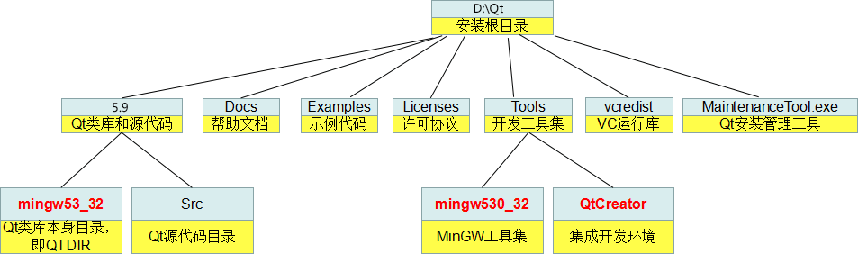

# Qt 整体目录结构
[内容不错，建议系统学习](http://c.biancheng.net/view/3866.html)
不同版本 Qt 的安装目录结构大同小异，本节我们以 Qt 5.9.0 为例来说明，如下图所示。  
  

  
图1：Qt 安装目录的结构

  
为了方便描述，下文我们使用`~`表示 Qt 的安装目录。  
  
注意，~\\5.9\ 和 ~\\Tools\ 目录下都有 mingw53_32 目录（图中我用红色标出来了），但是两者是有区别的：

- ~\\5.9\\mingw53_32\ 目录包含的是 Qt 的类库文件，例如头文件、静态库、动态库等，这些类库文件使用 MinGW 工具集编译而成。
- ~\\Tools\\mingw53_32\ 目录包含的是 MinGW 工具集，例如编译器 g++、链接器 ld、make 工具、打包工具 ar 等。

  
QtCreator 是个例外，QtCreator 使用 MSVC2015 编译生成的，所以安装目录里有一个 vcredist 文件夹存储 VC 运行库安装文件。  
  
最后的 MaintenanceTool.exe ，对于离线安装包，它只能用于删除软件包，如果 Qt 开发环境是用在线安装方式装的，这个工具还可以管理开发环境组件和升级组件。  
  
Qt 类库的帮助文件位于 Docs 文件夹里，需要用 Qt Assistant 工具才能查看。  
  
Examples 里是示例代码，可以用 QtCreator 集成开发环境打开各个示例。

## Qt 类库目录

下面我们再探究一下 Qt 类库目录（~\\5.9\\mingw53_32\\）的结构，如下图所示。  
  

  
图2：Qt 类库目录

  
图上列的比较有限，不一定全面，主要是教大家熟悉一下 Qt 的开发环境。

关注公众号「站长严长生」，在手机上阅读所有教程，随时随地都能学习。本公众号由[站长](http://c.biancheng.net/view/8092.html)亲自运营，长期更新，坚持原创，专注于分享创业故事+学习历程+工作记录+生活日常+编程资料。