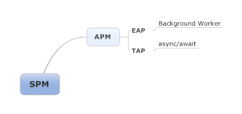

　　今天在看同事新买到的《C#本质论 Edition 4》的时候，对比下以前Edtion3的新特性时，针对Async/Await关键字时发现对一些线程方面的定义还理解的不是很透彻，脉络还不是很清晰，这样有了本文，希望对有同样困惑的朋友有些帮助。

&nbsp;&nbsp;&nbsp;&nbsp;&nbsp;&nbsp;文中部分内容摘取自《Essential C# 5.0 Edition 4》，还有一些我个人的对线程方面知识的理解与概括，如果有错误的地方还请指出，如果您觉得文章还不错，请点击“推荐” ：）

# C#线程模型脉络

缩写：

SPM：Synchronous Programming Mode，同步编程模型。

APM：Asynchronous Programming Mode，异步编程模型。（.Net 1.x的版本可以使用）

EAP：Event-Based Asynchronous Programming，基于事件的异步编程。（.Net Framework2.0中引入）

TAP：Task-Based Asynchronous Programming，基于任务的异步编程。（.Net Framework4.0中引入）

&nbsp;&nbsp;&nbsp;&nbsp;&nbsp;&nbsp;&nbsp;&nbsp;&nbsp;C#的编程模型从SPM发展到APM编程模型，是Winform发展过程中解决界面由于同步执行长时间任务而导致界面“卡住”而发展而来（这里插一句个人对技术的理解：技术的发展总是在旧事物不能得到满足的情况下发展而来，新事物总是在特定的场合“出现”，并更好的代替了旧事物，所以，如果想了深入了解一个新事物的特性，必然要了解其发展脉络以及适用的场景），有了异步编程模式之后，人们又开始探索如何能更好的管理线程，更简单的适用，于是有了类似Background Worker和async/await一类的特性。



C#线程的编程模型到这里也就结束了，如果你有这方面的经验可能都觉得以上都是“废话”，或者“一言以概之”，的确，我不反对，但是有时候写文章有些时候不仅仅是炫耀技术，更多的是总结、归纳，理解的东西不一定说的出来，说出来的东西不一定真正理解！

&nbsp;&nbsp;&nbsp;&nbsp;&nbsp;&nbsp;&nbsp;&nbsp;&nbsp;下面，针对每个内容做一个小结，老鸟飞过：）

# SPM同步编程模型

&nbsp;&nbsp;&nbsp;&nbsp;&nbsp;&nbsp;&nbsp;&nbsp;&nbsp;Winform程序基于消息泵机制，依次执行从“消息泵”中取出的数据”，当某一消息需耗费大量系统资源去执行，则下一条消息不得不等待，这样会造成程序界面“挂起”，这就是同步执行任务的一种模型，当然这只是同步模型下的一种劣势，其实现实中我们同步模型我们无时无刻不在用，包括编写的代码、执行的业务逻辑等。

# APM异步编程模型

&nbsp;&nbsp;&nbsp;&nbsp;&nbsp;&nbsp;&nbsp;&nbsp;&nbsp;为了解决同步模型中由于执行耗时任务而不得不等待的问题，产生了异步编程模式，其核心思想就是将耗时任务交付给其他“线程”去做，释放主线程。这里多出两句，在操作系统级别上Windows采用分时、多核以及多线程等技术来充分利用系统资源；在C#语言上由Thread发展到Task，Task是更高级的对Thread封装，提升资源利用率，有了这些基础才有更广阔的空间。

## BeginXXX和EndXXX

使用BeginXXX和EndXXX实现基本的异步模式。

```html
    class Program
    {
        static void Main(string[] args)
        {
            string url = "http://www.cnblogs.com/cuiyansong/";
            if (args.Length > 0)
                url = args[0];
            Console.WriteLine(url);
            var webRequest = System.Net.WebRequest.Create(url);
            IAsyncResult asyncResult = webRequest.BeginGetResponse(null, null);

            while (!asyncResult.AsyncWaitHandle.WaitOne(200))
            {
                Console.WriteLine(".");
            }

            var webResponse = webRequest.EndGetResponse(asyncResult);
            using (System.IO.StreamReader reader = new System.IO.StreamReader(webResponse.GetResponseStream()))
            {
                var bytes = Encoding.UTF8.GetBytes(reader.ReadToEnd());
                int length = bytes.Length;
                Console.WriteLine(length);
            }

            Console.Read();
        }
    }
```

## TPL+APM模式

TPL：Task Parallel Library 任务并行库，其对task进行扩展，类似于ThreadPool。

这个模式是利用TaskFactory进行并行计算（下载）的例子，这个例子很有意思，很复古的感觉，有情趣的拷贝代码看看运行效果~~~

```html
    class Program
    {
        private static object ConsoleSyncObj = new object();
        static void Main(string[] args)
        {
            string[] urls = args;
            if (args.Length == 0)
            {
                urls = new string[]
                {
                    "http://www.cnblogs.com/cuiyansong/",
                    "https://github.com/Cuiyansong",
                    "http://www.cnblogs.com/",
                };
            }

            Task[] tasks = new Task[urls.Length];
            for (int i = 0; i < tasks.Length; i++)
            {
                tasks[i] = DisplayPageSizeAsync(urls[i], i);
            }

            while (!Task.WaitAll(tasks, 50))
            {
                DisplayProgress(tasks);
            }
            Console.SetCursorPosition(0, urls.Length);
            Console.Read();
        }

        private static void DisplayProgress(Task[] tasks)
        {
            for (int i = 0; i < tasks.Length; i++)
            {
                if (!tasks[i].IsCompleted)
                {
                    DisplayProgress((WebRequestState)tasks[i].AsyncState);
                }
            }
        }

        private static void DisplayProgress(WebRequestState state)
        {
            lock (ConsoleSyncObj)
            {
                int left = state.ConsoleColumn;
                int top = state.ConsoleLine;
                if (left > Console.BufferWidth - int.MaxValue.ToString().Length)
                {
                    left = state.Url.Length;
                    Console.SetCursorPosition(left, top);
                    Console.Write("".PadRight(Console.BufferWidth - state.Url.Length));
                    state.ConsoleColumn = left;
                }
                Write(state, ".");
            }
        }

        private static string FormatBytes(long bytes)
        {
            string[] magintudes = new string[] { "GB", "MB", "KB", "Bytes" };
            long max = (long)Math.Pow(1024, magintudes.Length);

            return string.Format("{1:##.##} {0}", magintudes.FirstOrDefault(mag => bytes > (max /= 1024)) ?? "0 Bytes", (decimal)bytes / (decimal)max).Trim();
        }

        private static Task<System.Net.WebResponse> DisplayPageSizeAsync(string url, int i)
        {
            var webRequest = System.Net.WebRequest.Create(url);
            var requestState = new WebRequestState(webRequest, i);

            Write(requestState, url + "  ");

            return Task<System.Net.WebResponse>.Factory.FromAsync(webRequest.BeginGetResponse, GetResponseAsyncCompleted, requestState);
        }

        private static WebResponse GetResponseAsyncCompleted(IAsyncResult asyncResult)
        {
            WebRequestState completedState = (WebRequestState)asyncResult.AsyncState;
            HttpWebResponse response = (HttpWebResponse)completedState.WebRequest.EndGetResponse(asyncResult);

            using (StreamReader reader = new StreamReader(response.GetResponseStream()))
            {
                int length = reader.ReadToEnd().Length;
                Write(completedState, FormatBytes(length));
            }
            return response;
        }

        private static void Write(WebRequestState completedState, string text)
        {
            lock (ConsoleSyncObj)
            {
                Console.SetCursorPosition(completedState.ConsoleColumn, completedState.ConsoleLine);
                Console.Write(text);
                completedState.ConsoleColumn += text.Length;
            }
        }


        private class WebRequestState
        {
            public System.Net.WebRequest WebRequest { get; private set; }

            public int ConsoleLine { get; set; }

            public int ConsoleColumn { get; set; }

            public string Url
            {
                get
                {
                    return WebRequest.RequestUri.ToString();
                }
            }

            public WebRequestState(System.Net.WebRequest request)
            {
                WebRequest = request;
            }

            public WebRequestState(System.Net.WebRequest request, int line)
            {
                WebRequest = request;
                ConsoleLine = line;
                ConsoleColumn = 0;
            }
        }
    }
```

## BackgroundWorker模型

针对经常出现任务委托后，执行任务并返回进度的需求，提供了BackgroundWorker类，节省开发时间。

```html
    class Program
    {
        static void Main(string[] args)
        {
            /*****************************************************************************
             * 由于是演示，并为增加对BackgroundWorker取消等功能,这里只是简单演示。
             * 详细请参考：http://www.cnblogs.com/RoyYu/archive/2011/08/10/2133309.html
             * ***************************************************************************/

            System.ComponentModel.BackgroundWorker worker = new System.ComponentModel.BackgroundWorker();
            worker.WorkerReportsProgress = true;//报告完成进度
            worker.WorkerSupportsCancellation = true;//允许用户终止后台线程

            worker.DoWork += (sender, e) =>
            {
                for (int i = 0; i < 10; i++)
                {
                    System.Threading.Thread.Sleep(500);
                    worker.ReportProgress(i, i);
                }
            };
            worker.ProgressChanged += (sender, e) =>
            {
                Console.WriteLine(string.Format("完成百分比。。。{0}", e.ProgressPercentage / (float)10));
            };
            worker.RunWorkerCompleted += (sender, e) =>
            {
                if (!e.Cancelled && e.Error == null)
                {
                    Console.WriteLine("处理成功，请按任意键返回。");
                }

                else
                {
                    Console.WriteLine("处理中断，请按任意键返回。");
                }
            };
            worker.RunWorkerAsync();
            Console.Read();
        }
    }
```


## Async/Await模型

这回用窗体程序进行演示，对比起来效果会更明显些。


```html
    public partial class MainWindow : Window
    {
        List<string> urls = new List<string>();
        public MainWindow()
        {
            InitializeComponent();

            urls = new List<string>()
            {
                "www.baidu.com",
                "www.cnblogs.cn",
                "www.stackoverflow.com",
            };
        }

        /// <summary>
        /// 同步执行示例：当点击Button后，界面挂起，等待执行完毕后显示全部内容。
        /// </summary>
        /// <param name="sender"></param>
        /// <param name="e"></param>
        private void Button_Click1(object sender, RoutedEventArgs e)
        {
            InfoList.Text = "Ping....." + System.Environment.NewLine;
            Ping p = new Ping();

            foreach (var item in urls)
            {
                PingReply pingRelay = p.Send(item);
                InfoList.Text += string.Format("Host Name: {0},Roundtrip Time: {1},Status: {2}", item, pingRelay.RoundtripTime.ToString(), pingRelay.Status + System.Environment.NewLine);
            }
        }
        /// <summary>
        /// 异步执行示例：当点击Button后，界面不挂起，界面滚动显示信息。
        /// </summary>
        /// <param name="sender"></param>
        /// <param name="e"></param>
        private async void Button_Click2(object sender, RoutedEventArgs e)
        {
            InfoList.Text = "Ping....." + System.Environment.NewLine;
            Ping p = new Ping();

            foreach (var item in urls)
            {
                PingReply pingRelay = await p.SendPingAsync(item);
                InfoList.Text += string.Format("Host Name: {0},Roundtrip Time: {1},Status: {2}", item, pingRelay.RoundtripTime.ToString(), pingRelay.Status + System.Environment.NewLine);
            }
        }
    }
```


# 结语

下载源代码，请点击[这里](http://files.cnblogs.com/cuiyansong/CSharp5.0Practise.zip)。

文章内容确实不是很深入，但对理解Winform的异步线程模型还是很有帮助的，今后有时间会针对线程单独来分享，希望各位看官不吝赐“赞”，水平有限，有问题欢迎提问：）

# 引用

1.  文中部分例子出自《Essential C# 5.0 Edition 4》
2.  BackgrounWorker例子：http://www.cnblogs.com/RoyYu/archive/2011/08/10/2133309.html

作者：Stephen Cui   
出处：[http://www.cnblogs.com/cuiyansong](https://www.cnblogs.com/cuiyansong/p/URL)   
  
*版权声明：文章属于本人及博客园共有，凡是没有标注\[转载\]的，请在文章末尾加入我的博客地址。*   
  
如果您觉得文章写的还不错，请点击“推荐一下”，谢谢。