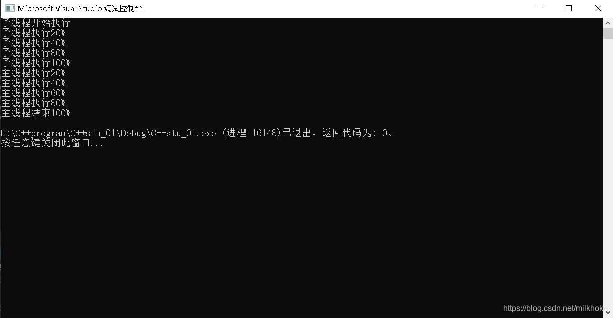
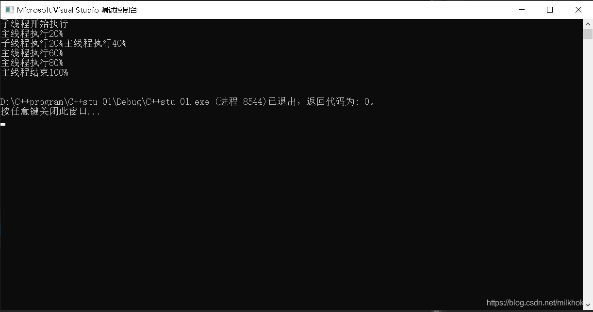

# 线程的创建、开始和结束

主线程从main()函数开始执行，创建的其他线程也要从一个函数开始运行（初始函数），一旦这个函数运行结束，代表线程运行结束

## 1、thread

创建线程：添加头文件thread、编写线程函数并在main()函数中添加线程

首先编写一个线程函数

```cpp
void printThread()
{
	cout << "子线程开始执行" << endl;
	Sleep(1000);
	cout << "子线程执行完毕" << endl;
}
```

 然后在主函数中创建线程

```cpp
thread thread1(printThread);
thread1.join();
```

## 2、join()

阻塞主线程等待子线程执行完。当子线程执行完毕后和主线程汇合，然后继续执行主线程。

如果主线程执行完毕了，但是子线程没有执行完毕，这种程序是不稳定的，所以我们应该尽量保证主线程在所有子线程运行结束后再结束。

## 3、detach()

使用方法同join()。

```cpp
thread thread1(printThread);
thread1.detach();
```

 将子线程和主线程分离，分离后子线程失去和主线程的关联，主线程结束后如果子线程还没有结束，那么会在后台继续运行，当子线程执行完毕后，由运行时库负责清理该线程相关资源

## 4、joinable()

一旦调用了detach(),就不能再调用join(),否则系统会报告异常。

joinable()用来判断是否可以使用join()或这detach()。

返回值：

&nbsp;&nbsp;&nbsp;&nbsp;&nbsp;&nbsp;&nbsp;&nbsp;True：可以进行join()或detach()；

&nbsp;&nbsp;&nbsp;&nbsp;&nbsp;&nbsp;&nbsp;&nbsp;False：不能进行join()或detach()

在 进行join()或者detach()操作时先进行判断，然后再操作

```cpp
thread thread1(printThread);
if (thread1.joinable())
{
	thread1.join();
}
```

这样可以避免系统报错

# join()和detach()效果对比

```cpp
#include <iostream>
#include <windows.h>
#include <thread>


using namespace std;
//创建子线程函数
void printThread()
{
	cout << "子线程开始执行" << endl;
	Sleep(1000);
	cout << "子线程执行20%" << endl;
	Sleep(1000);
	cout << "子线程执行40%" << endl;
	Sleep(1000);
	cout << "子线程执行80%" << endl;
	Sleep(1000);
	cout << "子线程执行100%" << endl;
}
//主函数
int main()
{
	thread thread1(printThread);
	if (thread1.joinable())
	{
		thread1.join();
	}
	
    cout << "主线程执行20%\n";
	cout << "主线程执行40%\n";
	cout << "主线程执行60%\n";
	cout << "主线程执行80%\n";
	cout << "主线程结束100%\n";
	return 0; 
}
```

join()运行结果：主线程等待子线程运行结束后才继续运行



```cpp
#include <iostream>
#include <windows.h>
#include <thread>


using namespace std;
//创建子线程函数
void printThread()
{
	cout << "子线程开始执行" << endl;
	Sleep(1000);
	cout << "子线程执行20%" << endl;
	Sleep(1000);
	cout << "子线程执行40%" << endl;
	Sleep(1000);
	cout << "子线程执行80%" << endl;
	Sleep(1000);
	cout << "子线程执行100%" << endl;
}
//主函数
int main()
{
	thread thread1(printThread);
	if (thread1.joinable())
	{
		thread1.detach();
	}
	
    cout << "主线程执行20%\n";
	Sleep(1000);
	cout << "主线程执行40%\n";
	cout << "主线程执行60%\n";
	cout << "主线程执行80%\n";
	cout << "主线程结束100%\n";
	return 0; 
}
```

detach()运行结果：主线程不等待子线程是否运行结束，主线程运行结束后，该进程结束；子线程继续在后台运行完毕。 

