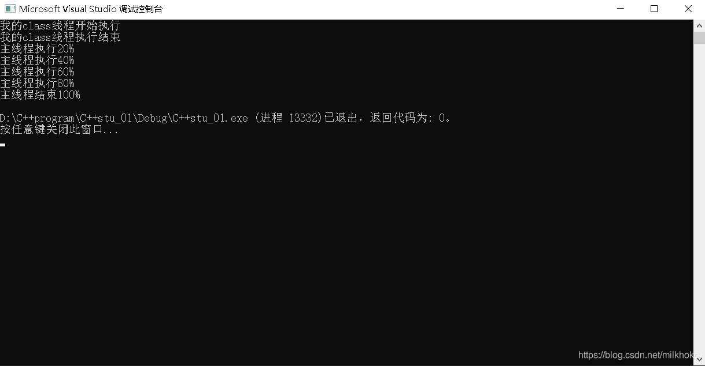
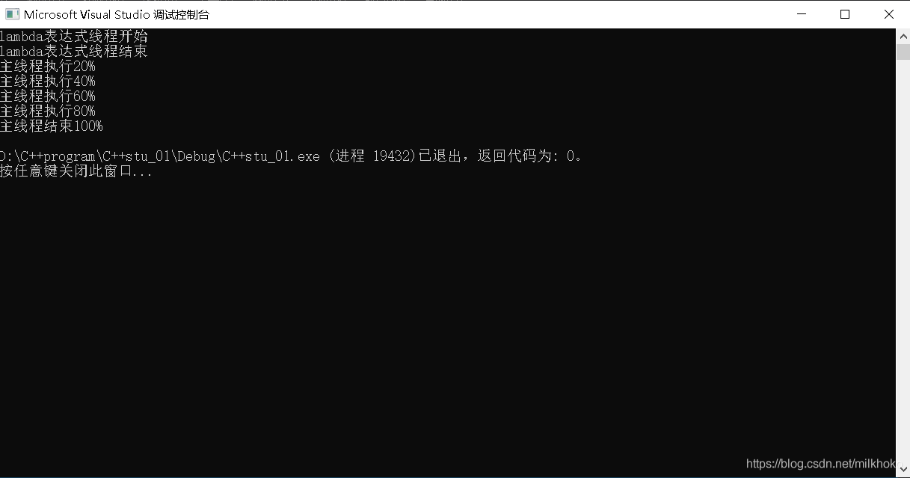

# 使用类创建线程

```cpp
#include <iostream>
#include <windows.h>
#include <thread>

using namespace std;

//创建子线程类
class myClassThread
{
public:
	void operator()()
	{
		cout << "我的class线程开始执行" << endl;
		Sleep(1000);
		cout << "我的class线程执行结束" << endl;
	}

};

int main()
{
	myClassThread classThread;
	thread threadOFclass(classThread);
	if (threadOFclass.joinable())
	{
		threadOFclass.join();
	}
	
    cout << "主线程执行20%\n";
	Sleep(1000);
	cout << "主线程执行40%\n";
	Sleep(1000);
	cout << "主线程执行60%\n";
	Sleep(1000);
	cout << "主线程执行80%\n";
	Sleep(1000);
	cout << "主线程结束100%\n";
	return 0; 
}
```

运行结果：



使用类创建时，如果类中有引用或者指针，必须使用join()，等待子线程处理完成之后再执行主线程程序，否则会导致指针或引用所对应内容出现错误。

如果类中没有引用或者指针，那么当使用detach()时：子线程中的类的实例是从主线程中复制过去的，主线程执行完毕不会对子线程的数据产生影响。

# 使用lambda表达式创建线程

```cpp
    auto myLambdaThread = [] {
		cout << "lambda表达式线程开始" << endl;
		Sleep(1000);
		cout << "lambda表达式线程结束" << endl;
	};

	thread threadOFlambda(myLambdaThread);//classThread是一个可调用对象
	if (threadOFlambda.joinable())
	{
		threadOFlambda.join();
	}
```

主程序中定义lambda表达式，然后使用thread创建线程。

结果是：

