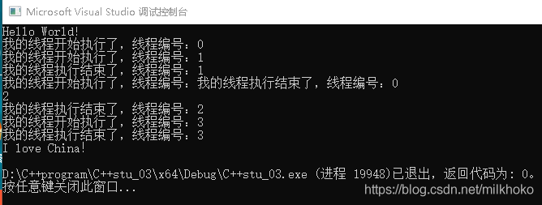
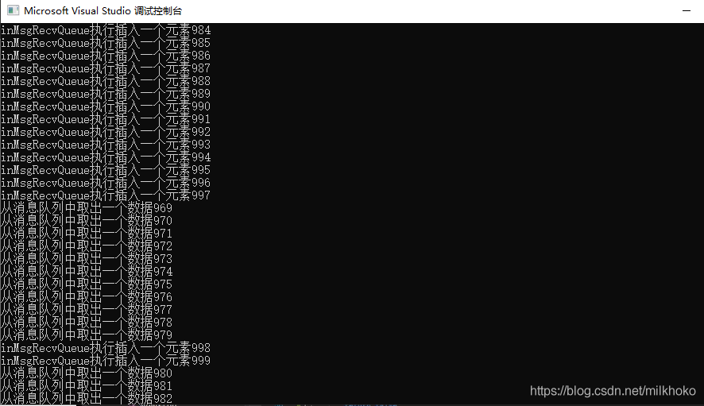

# 创建和等待多个线程

## vetor

vector（称为容器） 是同一种类型的对象的集合,每个对象都有一个对应的整数索引值。  
先看下面例程：

```cpp
// C++stu_03.cpp : 此文件包含 "main" 函数。程序执行将在此处开始并结束。
//本例程用于学习创建多线程以及数据共享问题

#include <iostream>
#include <windows.h>
#include <thread>
#include<vector>

using namespace std;

void myprint(int idnum)
{
	cout << "我的线程开始执行了，线程编号：" << idnum << endl;
	//进行线程内操作
	cout << "我的线程执行结束了，线程编号：" << idnum << endl;
	return;
}

int main()
{
    std::cout << "Hello World!\n";
	//创建10个线程
	vector<thread> mythreads;
	for (int i=0;i<4;i++)
	{
		mythreads.push_back(thread(myprint, i));
	}
	for (auto it = mythreads.begin(); it != mythreads.end(); ++it)
	{
		it->join();
	}
	cout << "I love China！" << endl;
	return 0;
}

```

运行程序得到的结果是:  


*   可以看出多个线程之间的执行顺序出现了错乱，这跟操作系统的运行调度机制有关；
*   这里使用join()等待所有线程都执行完毕后才继续执行主线程，这种写法更容易写出稳定的程序；
*   把thread对象放到容器中进行管理，看起来像thread对象数组（或者说是向量），这使我们一次创建大量的线程并对大量线程进行管理很方便！

# 数据共享问题

## 只读的数据

只读数据在进行线程间的操作时是安全稳定的，不需要特别的处理手段，直接读就可以；

## 有读有写的数据

有的线程写有的线程读，不进行特殊处理，那么程序肯定会崩溃；  
最简单的处理方式就是读的时候不能写，写的时候不能读，而且同一时刻只能有一个线程对数据进行读或写。

## 共享数据保护的案例

例程：网络游戏服务器  
服务器有两个线程：

*   其中一个线程收集玩家命令，并把命令数据（用一个数据代表）写到一个队列中。
*   另外一个线程从队列中取出玩家发送过来的命令，解析并执行玩家的动作

本例程中使用list对数据进行管理  
vector和list的对比：

*   list：进行频繁的按顺序插入和删除数据时效率高。
*   vector：随机的插入和删除数据时效率高。

对于读和写操作，在对某个数据进行读写操作时，先对数据进行上锁，其他线程要等待该操作完成后对数据解锁后才可以使用。

# 保护共享数据

## 互斥量

互斥量（mutex）是个类对象，理解成一把锁，当多个线程尝试使用lock()成员函数来加锁时，只有一个线程可以锁成功（成功标志是lock()返回）；如果没锁成功，那么线程会卡在lock()这里不断进行尝试去加锁。  
在执行多个线程之间的共享数据的读写操作时，在每一个读写操作之前进行上锁lock()，然后在操作完之后进行解锁unlock()，这样可以保证同一时刻只有一个线程对数据进行处理。

## 互斥量的用法

需要引用头文件：

```cpp
#include<mutex>
```

创建一个互斥量

```cpp
std::mutex my_mutex
```

操作步骤：先lock()，再操作共享数据，然后再unlock()。

代码如下：

```cpp
// C++stu_03.cpp : 此文件包含 "main" 函数。程序执行将在此处开始并结束。
//本例程用于学习创建多线程以及数据共享问题

#include <iostream>
#include <windows.h>
#include <thread>
#include <vector>
#include <list>
#include <mutex>

using namespace std;

vector<int>g_vaul = { 1,2,3,4 };//共享数据，只读

class A {
public:
	//把玩家命令输入到list中
	void inMsgRecvQueue()
	{
		for (int i=0;i<1000;++i)
		{
			my_mutex.lock();
			cout << "inMsgRecvQueue执行插入一个元素" << i << endl;
			msgRecvQueue.push_back(i);
			my_mutex.unlock();
		}
	}

	//从list中取出玩家命令
	void outMsgRecvQueue()
	{
		for (int i = 0; i < 1000; ++i)
		{
			my_mutex.lock();
			if (!msgRecvQueue.empty())
			{
				//消息不为空
				int command = msgRecvQueue.front();//返回第一个元素
				msgRecvQueue.pop_front();//移除第一个元素但不返回
				cout << "从消息队列中取出一个数据"<< command << endl;
				my_mutex.unlock();
			}
			else
			{
				my_mutex.unlock();//进行判断时要注意每种情况下都要有对应的unlock()
				cout << "outMsgRecvQueue执行，但是消息队列为空" << i << endl;
			}
		
		}
	}

private:
	list<int>msgRecvQueue;
	mutex my_mutex;
};

int main()
{
    std::cout << "Hello World!\n";
	A myobja;
	thread myOutMsgObj(&A::outMsgRecvQueue, &myobja);//要注意第二个参数是引用才能保证线程中使用的是同一个对象
	thread myInnMsgObj(&A::inMsgRecvQueue, &myobja);	
	myOutMsgObj.join();
	myInnMsgObj.join();


	cout << "I love China！" << endl;
	return 0;
}
```

运行结果不会报错，程序可以进行正常的数据操作：  
