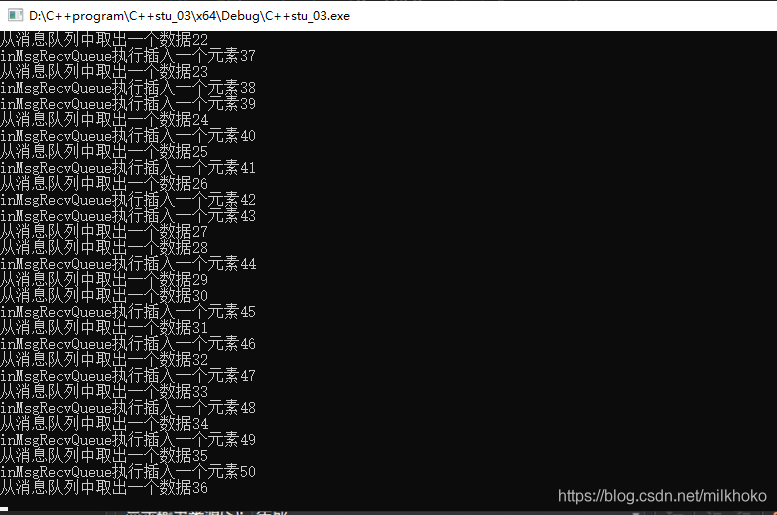
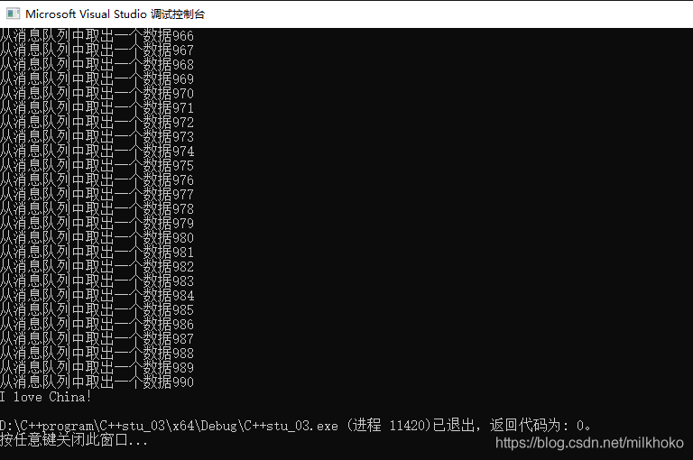
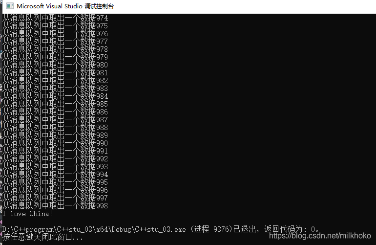

# 死锁的概念

> 死锁是指两个或两个以上的进程在执行过程中，由于竞争资源或者由于彼此通信而造成的一种阻塞的现象，若无外力作用，它们都将无法推进下去。此时称系统处于死锁状态或系统产生了死锁，这些永远在互相等待的进程称为死锁进程。

解释起来就是：  
两个线程两把锁，其中一个线程先锁锁头1，再锁锁头2，另外一个线程先锁锁头2，再锁锁头1

当第一个线程锁住锁头1时，第二个线程锁住锁头2，此时两个线程都要继续上锁，但是第一个线程无法上锁锁头2，第二个线程无法上锁锁头1，那么就会卡在这里，这时就产生了死锁。

或者说多个线程进行环路等待，就会出现死锁：

> 发生死锁时，必然存在一个进程——资源的环形链，即进程集合{P0，P1，P2，···，Pn}中的P0正在等待一个P1占用的资源；P1正在等待P2占用的资源，……，Pn正在等待已被P0占用的资源。

# 死锁的演示

示例代码：

```cpp
// C++stu_03.cpp : 此文件包含 "main" 函数。程序执行将在此处开始并结束。
//本例程用于学习创建多线程以及数据共享问题

#include <iostream>
#include <windows.h>
#include <thread>
#include <vector>
#include <list>
#include <mutex>

using namespace std;

vector<int>g_vaul = { 1,2,3,4 };//共享数据，只读

class A {
public:
	//把玩家命令输入到list中
	void inMsgRecvQueue()
	{
		for (int i=0;i<1000;++i)
		{
			my_mutex1.lock();//先锁1，再锁2
			my_mutex2.lock();
			cout << "inMsgRecvQueue执行插入一个元素" << i << endl;
			msgRecvQueue.push_back(i);
			my_mutex1.unlock();
			my_mutex2.unlock();
		}
	}

	//从list中取出玩家命令
	void outMsgRecvQueue()
	{
		for (int i = 0; i < 1000; ++i)
		{
			my_mutex2.lock();//先锁2，再锁1
			my_mutex1.lock();
			if (!msgRecvQueue.empty())
			{
				//消息不为空
				int command = msgRecvQueue.front();//返回第一个元素
				msgRecvQueue.pop_front();//移除第一个元素但不返回
				cout << "从消息队列中取出一个数据"<< command << endl;
				my_mutex1.unlock();
				my_mutex2.unlock();
			}
			else
			{
				my_mutex1.unlock();
				my_mutex2.unlock();
				cout << "outMsgRecvQueue执行，但是消息队列为空" << i << endl;
			}
		
		}
	}

private:
	list<int>msgRecvQueue;
	mutex my_mutex1;
	mutex my_mutex2;
};

int main()
{
    std::cout << "Hello World!\n";
	A myobja;
	thread myOutMsgObj(&A::outMsgRecvQueue, &myobja);//要注意第二个参数是引用才能保证线程中使用的是同一个对象
	thread myInnMsgObj(&A::inMsgRecvQueue, &myobja);	
	myOutMsgObj.join();
	myInnMsgObj.join();

	cout << "I love China！" << endl;
	return 0;
}

```

主要观察两个线程函数中锁的顺序  
演示结果：  


# 死锁的解决方法

在多个线程上锁时，要注意上锁的顺序要一致，即每个线程都是先上锁锁头1，再上锁锁头2。  
修改之后运行不会再出现卡住的情况：  


# std::lock()函数模板

功能：

*   一次锁住两个或两个以上的互斥量（至少两个，多了不限，1个不行）
*   使用该函数模板不存在因多个线程上锁顺序问题而导致的死锁情况的发生。
*   如果互斥量中有一个没锁住，那么就会一直等待互斥量都锁住才会继续向下执行。

特点：

*   要么多个互斥量都锁住，要么多个互斥量都没锁住。如果只锁了一个，另外一个没有锁成功，那么它会立即把已经锁住的解锁，避免死锁的发生。
*   解锁时要按常规方式挨个解锁（可以使用lock\_guard的adopt\_lock参数进行解决：adopt\_lock是一个结构体对象，作用就是表示这个互斥量已经lock过了，不需要在lock\_guard中再次lock）

```cpp
// C++stu_03.cpp : 此文件包含 "main" 函数。程序执行将在此处开始并结束。
//本例程用于学习创建多线程以及数据共享问题

#include <iostream>
#include <windows.h>
#include <thread>
#include <vector>
#include <list>
#include <mutex>

using namespace std;

vector<int>g_vaul = { 1,2,3,4 };//共享数据，只读

class A {
public:
	//把玩家命令输入到list中
	void inMsgRecvQueue()
	{
		for (int i=0;i<1000;++i)
		{
			//my_mutex1.lock();//先锁1，再锁2
			//my_mutex2.lock();
			std::lock(my_mutex1, my_mutex2);//用来代替上面两句
			cout << "inMsgRecvQueue执行插入一个元素" << i << endl;
			msgRecvQueue.push_back(i);
			my_mutex1.unlock();
			my_mutex2.unlock();
		}
	}

	//从list中取出玩家命令
	void outMsgRecvQueue()
	{
		for (int i = 0; i < 1000; ++i)
		{
			//my_mutex1.lock();//先锁1，再锁2
			//my_mutex2.lock();
			std:lock(my_mutex2, my_mutex1);//用来代替上面两句
			if (!msgRecvQueue.empty())
			{
				//消息不为空
				int command = msgRecvQueue.front();//返回第一个元素
				msgRecvQueue.pop_front();//移除第一个元素但不返回
				cout << "从消息队列中取出一个数据"<< command << endl;
				my_mutex1.unlock();
				my_mutex2.unlock();
			}
			else
			{
				my_mutex1.unlock();
				my_mutex2.unlock();
				cout << "outMsgRecvQueue执行，但是消息队列为空" << i << endl;
			}
		
		}
	}

private:
	list<int>msgRecvQueue;
	mutex my_mutex1;
	mutex my_mutex2;
};

int main()
{
    std::cout << "Hello World!\n";
	A myobja;
	thread myOutMsgObj(&A::outMsgRecvQueue, &myobja);//要注意第二个参数是引用才能保证线程中使用的是同一个对象
	thread myInnMsgObj(&A::inMsgRecvQueue, &myobja);	
	myOutMsgObj.join();
	myInnMsgObj.join();

	cout << "I love China！" << endl;
	return 0;
}

```

运行结果没有出现问题：  
