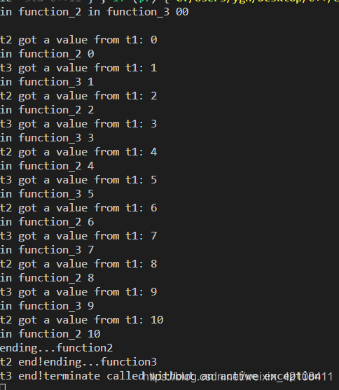

# 项目场景：

上位机上需要实现一个存文件的操作，本来可以很简单的做实现，想着之前看过一个条件变量的例子，所以胆子肥了写来试试。

大概实现思路如下：
1. 有一个数据线程接收数据，通过按钮操作，来置标志位，从而开始写数入队列，入队操作完成后，通过notify函数调用取数线程，
2. 取数线程从队列里拿数。然后通过按钮操作置标志位，退出写数线程，
3. 好像线程析构这种操作很不稳定，网上大家还是建议利用标志位，也正是因为标志位的问题，导致了函数一直阻塞在wait函数处，线程无法退出，无法实现关闭文件操作，因此无法完成正常写数。


# 问题描述：

在具体测试中发现：只有程序关闭时，文件才会写入，这是因为file.close()函数未被执行的原因，而这句函数之所以不被调用就是因为条件变量的wait函数阻塞的问题，标志位置位后，入队操作先结束，队列为空，所以代码一直阻塞至wait函数处，导致我设置的全部变量无法通过条件判断来正常退出循环，从而无法正常调用file.close()函数。

```
TARGET_TXT:while(DataProcessRadar::STORE_READY_FLAG.TARGET_READY_FLAG)//通过标志位判断循环是否结束，该标志位受控件影响
{
    std::unique_lock<std::mutex> locker(mutex_txt);
    while(q_local_data_txt.empty())
    {
        //if(!DataProcessRadar::STORE_READY_FLAG.TARGET_READY_FLAG)
        //{
            //goto TARGET_TXT;
        //}
        cond_txt.wait(locker);
    }

    StoreData sd = q_local_data_txt.front();
    if(sd.type == Target)//队列中会存在两种数据类型，因此在此处会做判断，效率有点损失
    {
        q_local_data_txt.pop();
        locker.unlock();
    }
}
file.close();
```


# 背景介绍：

第一次学习条件变量，是从一个互斥锁的例子开始的，经典模型就是生产者-消费者，生产者线程向队列里push数据，消费者线程从队列里pop数据。因为存在多线程内存共享的问题，因此必须考虑到要做保护，而简单操作就是加互斥锁，然而加了互斥锁，在实际运行代码时会发现CPU占用率高的问题，原因就在于，消费者线程（不止一个）会频繁判断队列是否为空，导致CPU做无用功。下面给一个博主的例子以及用条件变量优化解决后的CPU下降的对比结果。

> 参考[互斥锁和条件变量的性能](https://blog.csdn.net/zimajim/article/details/108619844%C2%A0)
> 
> 利用互斥锁实现，使用纯互斥锁cpu的开销是很大的，**`main`进程的cpu使用率达到了`357.5%CPU`，系统开销的cpu为`54.5%sy`，用户开销的cpu为`18.2%us。`**
> 
> 改用条件变量实现其**CPU占用率几乎到了0%**，虽然文中也给出了在互斥锁中加休眠来降低使用率，但是对于睡眠时间有要求。
> 
> ```
> [root@lincoding ~]# ps aux | grep -v grep  |grep main
> USER        PID %CPU %MEM    VSZ   RSS TTY      STAT START   TIME COMMAND
> root      73838  0.0  0.1 141068  1256 pts/1    Sl+  19:54   0:00 ./main
> ```

 最开始，我对于条件变量的理解只停留到了这个位置，可以应用到消费生产者模型，且能降低CPU高占用的问题，在正式开篇之前，我有必要介绍一下条件变量各个函数使用需要注意的地方。

# 条件变量

条件变量（condition_variable）实现多个线程间的同步操作；当条件不满足时，相关线程被一直阻塞，直到某种条件出现，这些线程才会被唤醒。

这种同步机制需要两个操作来配合同步实现：

*   线程因为不满足条件变量的等待条件从而挂起  【condition_variable 对应的实现函数wait()、wait_for()、wait_until()】
*   条件变量条件成立后，发出信号，被挂起线程被唤醒 【condition_variable 对应的实现函数notify_one()、notify_all()】

##  wait/wait_for

wait()函数可使得当前线程阻塞，直至**条件变量唤醒**、或是**虚假唤醒。**一般代码里为了避免虚假唤醒，会采用while()循环遍历条件的方式。

阻塞该线程时，该函数会自动解锁，允许其他线程执行。一旦被notify唤醒，该函数取消阻塞并获取锁，然后函数返回，一般为了避免虚假唤醒，会用wile循环判断条件，若为虚假唤醒，则函数重新返回至whie循环条件处。

```
void wait( std::unique_lock<std::mutex>& lock );

//Predicate 谓词函数，可以是普通函数或者lambda表达式
template< class Predicate >
void wait( std::unique_lock<std::mutex>& lock, Predicate pred );//此处可调用lambda表达式返回false或者true值，若返回false则阻塞，返回true则取消阻塞


//while(condition) wait(lock);  
//wait(lock,[](){return !condition;})
//两者效果一致
```

wait_for()函数导致当前线程阻塞直至**条件变量被通知**、或者**虚假唤醒发生**，或者**超时返回**。相比于wait函数，此函数多了一个超时判断。

> **参考[虚假唤醒](https://blog.csdn.net/c_base_jin/article/details/89741247?utm_medium=distribute.pc_relevant.none-task-blog-BlogCommendFromMachineLearnPai2-2.control&depth_1-utm_source=distribute.pc_relevant.none-task-blog-BlogCommendFromMachineLearnPai2-2.control)**
> 
> 1.  虚假唤醒（spurious wakeup）是一个表象，即在多处理器的系统下，发出wait的程序有可能在没有notify唤醒的情形下苏醒继续执行。以运行在linux的hotspot虚拟机上的java程序为例，wait方法在jvm执行时，实质是调用了底层pthread_cond_wait/pthread_cond_timedwait函数，挂起等待条件变量来达到线程间同步通信的效果，**而底层wait函数在设计之初为了不减慢条件变量操作的效率并没有去保证每次唤醒都是由notify触发，而是把这个任务交由上层应用去实现**，即使用者需要定义一个循环去判断是否条件真能满足程序继续运行的需求，当然这样的实现也可以避免因为设计缺陷导致程序异常唤醒的问题。参考链接：https://www.zhihu.com/question/50892224/answer/280667072
>     
> 2.  此外在生产者消费者模型中，若是存在多个消费者线程，若一个线程获取到锁执行流程，另一个线程在wait函数处阻塞，若是阻塞线程获取到锁，若是采用if条件判断，则阻塞线程会向下执行。假设上一个线程已经将数据去完，队列为空 ，那么这种情况就会出错。
>     
> 
> ```
> if (不满足xxx条件)
> {
>     //没有虚假唤醒，wait函数可以一直等待，直到被唤醒或者超时，没有问题。
>     //但实际中却存在虚假唤醒，导致假设不成立，wait不会继续等待，跳出if语句，
>     //提前执行其他代码，流程异常
>     wait();  
> }
> 
> //其他代码
> ...
> 
> while (!(xxx条件) )
> {
>     //虚假唤醒发生，由于while循环，再次检查条件是否满足，
>     //否则继续等待，解决虚假唤醒
>     wait();  
> }
> //其他代码
> ....
> ```

## notify_one/notify_all

notify_one函数，唤醒阻塞的线程之一。若无线程在等待，则该函数不执行任何操作，若线程超过一个，无法指定选择具体唤醒哪个线程。这里线程唤醒的先后顺序，个人怀疑与线程阻塞的先后顺序有关，若某线程先阻塞，则该线程先被唤醒。

notify_all函数，唤醒所有阻塞线程，若无线程等待，则该函数不执行任何操作。虽然所有线程都会被唤醒，但是只有一个线程可以抢占到锁，拿到锁的线程先执行，其他线程谁拿到锁，谁依次执行，直到全部执行完毕。

> **参考[notify_all函数具体使用细节](https://blog.csdn.net/runyon1982/article/details/49018623)**
> 
> 如果将notify_all改成notify()，则在有些情况下会导致并发不充分：假设在队列为空的情况下连续put几次，则只有第一次put唤醒了一个take线程。如果之后队列一直维持非空，则take线程们始终只有一个是活跃的。事情还可能更糟，如果掉进陷阱的线程非常关键，则系统可能陷入活锁状态。  
> 周末的时候看了一篇不错的文章： [《Real-World Concurrency》](http://queue.acm.org/detail.cfm?id=1454462)，文中提到了问题的另一面：notify_all()容易导致惊群现象。这会导致系统性能的下降：假设某一时间段，take频率高于put，则队列始终趋近于空，但每次put都会唤醒所有阻塞在take的线程，但只有一个线程能继续运行。反之亦然。
> 
> 总之： notify_all比较安全，较无心智负担，但可能带来明显的效率下降。  
> 所以对于系统大部分模块来说，notify_all也够了，如果是基础设施模块，可以考虑用notify进行优化，但要小心。

**细节理解**

*   [为什么pthread_cond_wait需要加锁？？###](https://www.cnblogs.com/harlanc/p/8596211.html#_label2_0)
*   [在生产者线程中修改条件时为什么要加mutex？？###](https://www.cnblogs.com/harlanc/p/8596211.html#_label2_1)
*   [消费者线程中判断条件为什么要放在while中？？###](https://www.cnblogs.com/harlanc/p/8596211.html#_label2_2)
*   [signal到底是放在unlock之前还是之后？？###](https://www.cnblogs.com/harlanc/p/8596211.html#_label2_3)

# 解决方案：

到此知识储备够了之后，离我解决bug也不远了。其实关键的地方可以再讲讲：

*   wait函数阻塞后，被其他线程唤醒后，该函数会返回，而为了避免虚假唤醒，利用while语句判断条件，该函数只返回至内层while循环处，无法返回至外层线程结束标志位循环处。
*   notify函数唤醒全部线程后，<font color=red>我之前误解以为，线程需要抢占锁，谁拿到锁，谁就执行一次，那么这次唤醒就相当于只唤醒了一次，而实际上的唤醒是将全部线程唤醒，线程按照通过锁竞争的方式依次执行完毕</font>

针对以上，在控件响应标志位后，我把线程标志位置位后，这里由于我的存数线程处于阻塞状态，无法判断线程标志位，所以我将调用一次notify_all函数并在内层的循环做条件判断，并利用goto语句跳转至外层循环做线程结束标志位判断，则线程无法结束的问题就解决了。

```
//存数线程执行内容也可以理解为消费者线程
TARGET_TXT:while(DataProcessRadar::STORE_READY_FLAG.TARGET_READY_FLAG)//通过标志位判断循环是否结束，该标志位受控件影响
{
    std::unique_lock<std::mutex> locker(mutex_txt);
    while(q_local_data_txt.empty())//线程唤醒后返回至此处
    {
        if(!DataProcessRadar::STORE_READY_FLAG.TARGET_READY_FLAG)//做判断goto至外层循环
        {
            goto TARGET_TXT;
        }
        cond_txt.wait(locker);
    }

    StoreData sd = q_local_data_txt.front();
    if(sd.type == Target)//队列中会存在两种数据类型，因此在此处会做判断，效率有点损失
    {
        q_local_data_txt.pop();
        locker.unlock();
    }
}
file.close();
```

 为了模拟我的代码逻辑，我写了个简单测试demo。

首先我往队列里放入十个数，再启动两个消费者线程拿数，再启动一个线程延时一定时长后，置标志位，notify_all所有线程，正常退出线程。

```
#include <iostream>
#include <deque>
#include <thread>
#include <mutex>
#include <condition_variable>
#include <Windows.h>


std::deque<int> q;
std::mutex mu;
std::condition_variable cond;

bool flag = true;
void function_1(int count) {
    // int count = 10;
    // while (count > 0) {
        std::unique_lock<std::mutex> locker(mu);
        q.push_front(count);
        locker.unlock();
        // cond.notify_one();
        // std::this_thread::sleep_for(std::chrono::seconds(1));
        // count--;
    // }
}
 
void function_2() {
    int data = 0;
    label:while (flag) 
    {
        std::cout << "in function_2 " << data << std::endl;
        std::unique_lock<std::mutex> locker(mu);
        while(q.empty()) 
        {
            if(!flag) {std::cout<< "ending...function2"<< std::endl; goto label;}
            cond.wait(locker);
        }
            
        data = q.back();
        q.pop_back();
        // Sleep(1000);
        std::cout << "t2 got a value from t1: " << data << std::endl;
        locker.unlock();
        
    }

    std::cout << "t2 end!";
}


void function_3() {
    int data = 0;
    label:while (flag) 
    {
        std::cout << "in function_3 " << data << std::endl;
        std::unique_lock<std::mutex> locker(mu);
        while(q.empty()) 
        {
            if(!flag) {std::cout<< "ending...function3"<< std::endl; goto label;}
            cond.wait(locker);
        }
            
        data = q.back();
        q.pop_back();
        // Sleep(1000);
        std::cout << "t3 got a value from t1: " << data << std::endl;
        locker.unlock();
        
    }

    std::cout << "t3 end!";
}

void function_4() 
{
    Sleep(5000);//延时
    flag = false;
    cond.notify_all();
}


int main() {
    for(int i=0; i <= 10; i++)
    {
        function_1(i);//往队列里放数
    }
    std::thread t2(function_2);//拿数
    std::thread t3(function_3);//拿数
    std::thread t4(function_4);

    t2.join();
    t3.join();

        
  
    return 0;
}


```

