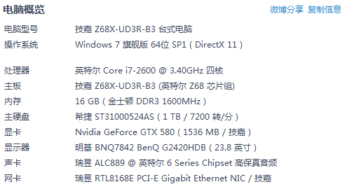
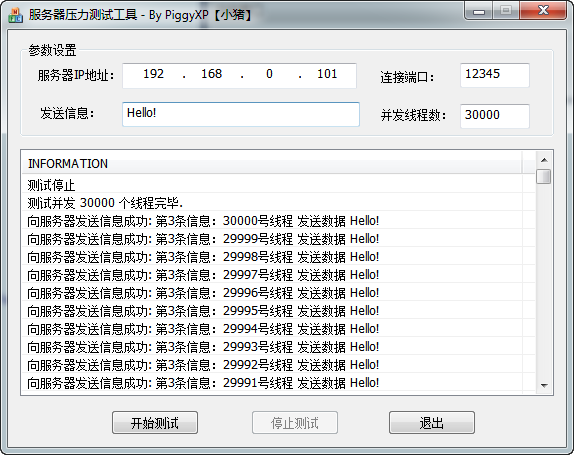
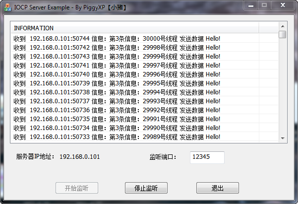
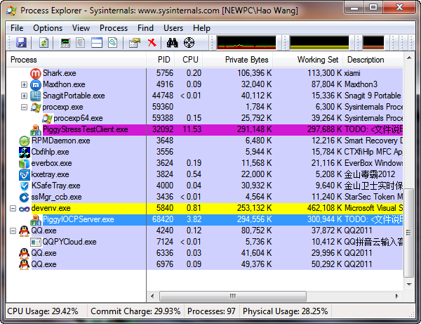
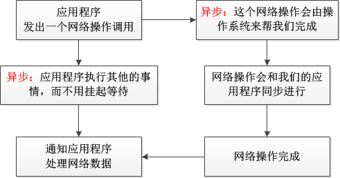
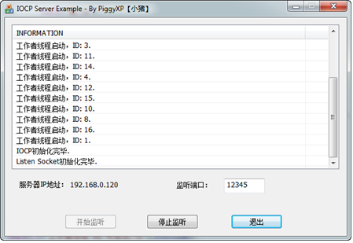

<h1>完成端口(CompletionPort)详解 - 手把手教你玩转网络编程系列之三</h1>
 手把手叫你玩转网络编程系列之三

 **完成端口(Completion Port)详解**

 **\----- By PiggyXP(小猪)**

**前 言**

 本系列里完成端口的代码在两年前就已经写好了，但是由于许久没有写东西了，不知该如何提笔，所以这篇文档总是在酝酿之中……酝酿了两年之后，终于决定开始动笔了，但愿还不算晚…..

 这篇文档我非常详细并且图文并茂的介绍了关于网络编程模型中完成端口的方方面面的信息，从API的用法到使用的步骤，从完成端口的实现机理到实际使用的注意事项，都有所涉及，并且为了让朋友们更直观的体会完成端口的用法，本文附带了有详尽注释的使用MFC编写的图形界面的示例代码。

 我的初衷是希望写一份互联网上能找到的最详尽的关于完成端口的教学文档，而且让对Socket编程略有了解的人都能够看得懂，都能学会如何来使用完成端口这么优异的网络编程模型，但是由于本人水平所限，不知道我的初衷是否实现了，但还是希望各位需要的朋友能够喜欢。

 由于篇幅原因，本文假设你已经熟悉了利用Socket进行TCP/IP编程的基本原理，并且也熟练的掌握了多线程编程技术，太基本的概念我这里就略过不提了，网上的资料应该遍地都是。

 本文档凝聚着笔者心血，如要转载，请指明原作者及出处，谢谢！不过代码没有版权，可以随便散播使用，欢迎改进，特别是非常欢迎能够帮助我发现Bug的朋友，以更好的造福大家。^_^

 本文配套的示例源码下载地址（在我的下载空间里，已经补充上了客户端的代码）

 [http://piggyxp.download.csdn.net/](http://piggyxp.download.csdn.net/)

 (里面的代码包括VC++2008/VC++2010编写的完成端口服务器端和客户端的代码，还包括一个对服务器端进行压力测试的客户端，都是经过我精心调试过，并且带有非常详尽的代码注释的。当然，作为教学代码，为了能够使得代码结构清晰明了，我还是对代码有所简化，如果想要用于产品开发，最好还是需要自己再完善一下，另外我的工程是用2010编写的，附带的2008工程不知道有没有问题，但是其中代码都是一样的，暂未测试)

 忘了嘱咐一下了，文章篇幅很长很长，基本涉及到了与完成端口有关的方方面面，一次看不完可以分好几次，中间注意休息，好身体才是咱们程序员最大的本钱！

 对了，还忘了嘱咐一下，因为本人的水平有限，虽然我反复修正了数遍，但文章和示例代码里肯定还有我没发现的错误和纰漏，希望各位一定要指出来，拍砖、喷我，我都能Hold住，但是一定要指出来，我会及时修正，因为我不想让文中的错误传遍互联网，祸害大家。

 OK, Let’s go ! Have fun !

> **目录：**
> 
> **1． 完成端口的优点**
> 
> **2． 完成端口程序的运行演示**
> 
> **3． 完成端口的相关概念**
> 
> **4． 完成端口的基本流程**
> 
> **5． 完成端口的使用详解**
> 
> **6． 实际应用中应该要注意的地方**

**一． 完成端口的优点**

 1. 我想只要是写过或者想要写C/S模式网络服务器端的朋友，都应该或多或少的听过完成端口的大名吧，完成端口会充分利用Windows内核来进行I/O的调度，是用于C/S通信模式中性能最好的网络通信模型，没有之一；甚至连和它性能接近的通信模型都没有。

 2. 完成端口和其他网络通信方式最大的区别在哪里呢？

 (1) 首先，如果使用“同步”的方式来通信的话，这里说的同步的方式就是说所有的操作都在一个线程内顺序执行完成，这么做缺点是很明显的：因为同步的通信操作会阻塞住来自同一个线程的任何其他操作，只有这个操作完成了之后，后续的操作才可以完成；一个最明显的例子就是咱们在MFC的界面代码中，直接使用阻塞Socket调用的代码，整个界面都会因此而阻塞住没有响应！所以我们不得不为每一个通信的Socket都要建立一个线程，多麻烦？这不坑爹呢么？所以要写高性能的服务器程序，要求通信一定要是异步的。

 (2) 各位读者肯定知道，可以使用使用“同步通信(阻塞通信)+多线程”的方式来改善(1)的情况，那么好，想一下，我们好不容易实现了让服务器端在每一个客户端连入之后，都要启动一个新的Thread和客户端进行通信，有多少个客户端，就需要启动多少个线程，对吧；但是由于这些线程都是处于运行状态，所以系统不得不在所有可运行的线程之间进行上下文的切换，我们自己是没啥感觉，但是CPU却痛苦不堪了，因为线程切换是相当浪费CPU时间的，如果客户端的连入线程过多，这就会弄得CPU都忙着去切换线程了，根本没有多少时间去执行线程体了，所以效率是非常低下的，承认坑爹了不？

 (3) 而微软提出完成端口模型的初衷，就是为了解决这种"one-thread-per-client"的缺点的，它充分利用内核对象的调度，只使用少量的几个线程来处理和客户端的所有通信，消除了无谓的线程上下文切换，最大限度的提高了网络通信的性能，这种神奇的效果具体是如何实现的请看下文。

 3. 完成端口被广泛的应用于各个高性能服务器程序上，例如著名的Apache….如果你想要编写的服务器端需要同时处理的并发客户端连接数量有数百上千个的话，那不用纠结了，就是它了。

**二． 完成端口程序的运行演示**

 首先，我们先来看一下完成端口在笔者的PC机上的运行表现，笔者的PC配置如下：



 大体就是i7 2600 + 16GB内存，我以这台PC作为服务器，简单的进行了如下的测试，通过Client生成3万个并发线程同时连接至Server，然后每个线程每隔3秒钟发送一次数据，一共发送3次，然后观察服务器端的CPU和内存的占用情况。

 如图2所示，是客户端3万个并发线程发送共发送9万条数据的log截图




 图3是服务器端接收完毕3万个并发线程和每个线程的3份数据后的log截图




 最关键是图4，图4是服务器端在接收到28000个并发线程的时候，CPU占用率的截图，使用的软件是大名鼎鼎的Process Explorer，因为相对来讲这个比自带的任务管理器要准确和精确一些。



 我们可以发现一个令人惊讶的结果，采用了完成端口的Server程序(蓝色横线所示)所占用的CPU才为 3.82%，整个运行过程中的峰值也没有超过4%，是相当气定神闲的……哦，对了，这还是在Debug环境下运行的情况，如果采用Release方式执行，性能肯定还会更高一些，除此以外，在UI上显示信息也很大成都上影响了性能。

 相反采用了多个并发线程的Client程序(紫色横线所示)居然占用的CPU高达11.53%，甚至超过了Server程序的数倍……

 其实无论是哪种网络操模型，对于内存占用都是差不多的，真正的差别就在于CPU的占用，其他的网络模型都需要更多的CPU动力来支撑同样的连接数据。

 虽然这远远算不上服务器极限压力测试，但是从中也可以看出来完成端口的实力，而且这种方式比纯粹靠多线程的方式实现并发资源占用率要低得多。

**三． 完成端口的相关概念**

 在开始编码之前，我们先来讨论一下和完成端口相关的一些概念，如果你没有耐心看完这段大段的文字的话，也可以跳过这一节直接去看下下一节的具体实现部分，但是这一节中涉及到的基本概念你还是有必要了解一下的，而且你也更能知道为什么有那么多的网络编程模式不用，非得要用这么又复杂又难以理解的完成端口呢？？也会坚定你继续学习下去的信心^_^

 **3.1 异步通信机制及其几种实现方式的比较**

 我们从前面的文字中了解到，高性能服务器程序使用异步通信机制是必须的。

 而对于异步的概念，为了方便后面文字的理解，这里还是再次简单的描述一下：

 **异步通信**就是在咱们与外部的I/O设备进行打交道的时候，我们都知道外部设备的I/O和CPU比起来简直是龟速，比如硬盘读写、网络通信等等，我们没有必要在咱们自己的线程里面等待着I/O操作完成再执行后续的代码，而是将这个请求交给设备的驱动程序自己去处理，我们的线程可以继续做其他更重要的事情，大体的流程如下图所示:



 我可以从图中看到一个很明显的并行操作的过程，而“同步”的通信方式是在进行网络操作的时候，主线程就挂起了，主线程要等待网络操作完成之后，才能继续执行后续的代码，就是说要末执行主线程，要末执行网络操作，是没法这样并行的；

 “异步”方式无疑比 “阻塞模式+多线程”的方式效率要高的多，这也是前者为什么叫“异步”，后者为什么叫“同步”的原因了，因为不需要等待网络操作完成再执行别的操作。

 而在Windows中实现异步的机制同样有好几种，而这其中的区别，关键就在于图1中的最后一步**“通知应用程序处理网络数据”**上了，因为实现操作系统调用设备驱动程序去接收数据的操作都是一样的，关键就是在于如何去通知应用程序来拿数据。它们之间的具体区别我这里多讲几点，文字有点多，如果没兴趣深入研究的朋友可以跳过下一面的这一段，不影响的:)

 (1) **设备内核对象**，使用设备内核对象来协调数据的发送请求和接收数据协调，也就是说通过设置设备内核对象的状态，在设备接收数据完成后，马上触发这个内核对象，然后让接收数据的线程收到通知，但是这种方式太原始了，接收数据的线程为了能够知道内核对象是否被触发了，还是得不停的挂起等待，这简直是根本就没有用嘛，太低级了，有木有？所以在这里就略过不提了，各位读者要是没明白是怎么回事也不用深究了，总之没有什么用。

 (2) **事件内核对象**，利用事件内核对象来实现I/O操作完成的通知，其实这种方式其实就是我以前写文章的时候提到的《基于事件通知的重叠I/O模型》，[链接在这里](http://blog.csdn.net/piggyxp/article/details/114883)，这种机制就先进得多，可以同时等待多个I/O操作的完成，实现真正的异步，但是缺点也是很明显的，既然用WaitForMultipleObjects()来等待Event的话，就会受到64个Event等待上限的限制，但是这可不是说我们只能处理来自于64个客户端的Socket，而是这是属于在一个设备内核对象上等待的64个事件内核对象，也就是说，我们在一个线程内，可以同时监控64个重叠I/O操作的完成状态，当然我们同样可以使用多个线程的方式来满足无限多个重叠I/O的需求，比如如果想要支持3万个连接，就得需要500多个线程…用起来太麻烦让人感觉不爽；

 (3) 使用**APC( Asynchronous Procedure Call，异步过程调用)**来完成，这个也就是我以前在文章里提到的《基于完成例程的重叠I/O模型》，[链接在这里](http://blog.csdn.net/piggyxp/article/details/3910726)，这种方式的好处就是在于摆脱了基于事件通知方式的64个事件上限的限制，但是缺点也是有的，就是发出请求的线程必须得要自己去处理接收请求，哪怕是这个线程发出了很多发送或者接收数据的请求，但是其他的线程都闲着…，这个线程也还是得自己来处理自己发出去的这些请求，没有人来帮忙…这就有一个负载均衡问题，显然性能没有达到最优化。

 (4) **完成端口**，不用说大家也知道了，最后的压轴戏就是使用完成端口，对比上面几种机制，完成端口的做法是这样的：事先开好几个线程，你有几个CPU我就开几个，首先是避免了线程的上下文切换，因为线程想要执行的时候，总有CPU资源可用，然后让这几个线程等着，等到有用户请求来到的时候，就把这些请求都加入到一个公共消息队列中去，然后这几个开好的线程就排队逐一去从消息队列中取出消息并加以处理，这种方式就很优雅的实现了异步通信和负载均衡的问题，因为它提供了一种机制来使用几个线程“公平的”处理来自于多个客户端的输入/输出，并且线程如果没事干的时候也会被系统挂起，不会占用CPU周期，挺完美的一个解决方案，不是吗？哦，对了，这个关键的作为交换的消息队列，就是完成端口。

 比较完毕之后，熟悉网络编程的朋友可能会问到，为什么没有提到WSAAsyncSelect或者是WSAEventSelect这两个异步模型呢，对于这两个模型，我不知道其内部是如何实现的，但是这其中一定没有用到Overlapped机制，就不能算作是真正的异步，可能是其内部自己在维护一个消息队列吧，总之这两个模式虽然实现了异步的接收，但是却不能进行异步的发送，这就很明显说明问题了，我想其内部的实现一定和完成端口是迥异的，并且，完成端口非常厚道，因为它是先把用户数据接收回来之后再通知用户直接来取就好了，而WSAAsyncSelect和WSAEventSelect之流只是会接收到数据到达的通知，而只能由应用程序自己再另外去recv数据，性能上的差距就更明显了。

 最后，我的建议是，想要使用 基于事件通知的重叠I/O和基于完成例程的重叠I/O的朋友，如果不是特别必要，就不要去使用了，因为这两种方式不仅使用和理解起来也不算简单，而且还有性能上的明显瓶颈，何不就再努力一下使用完成端口呢？

 **3.2 重叠结构(OVERLAPPED)**

 我们从上一小节中得知，要实现异步通信，必须要用到一个很风骚的I/O数据结构，叫重叠结构“Overlapped”，Windows里所有的异步通信都是基于它的，完成端口也不例外。

 至于为什么叫Overlapped？Jeffrey Richter的解释是因为“执行I/O请求的时间与线程执行其他任务的时间是重叠(overlapped)的”，从这个名字我们也可能看得出来重叠结构发明的初衷了，对于重叠结构的内部细节我这里就不过多的解释了，就把它当成和其他内核对象一样，不需要深究其实现机制，只要会使用就可以了，想要了解更多重叠结构内部的朋友，请去翻阅Jeffrey Richter的《Windows via C/C++》 5th 的292页，如果没有机会的话，也可以随便翻翻我以前写的Overlapped的东西，不过写得比较浅显……

 这里我想要解释的是，这个重叠结构是异步通信机制实现的一个核心数据结构，因为你看到后面的代码你会发现，几乎所有的网络操作例如发送/接收之类的，都会用WSASend()和WSARecv()代替，参数里面都会附带一个重叠结构，这是为什么呢？因为重叠结构我们就可以理解成为是一个网络操作的ID号，也就是说我们要利用重叠I/O提供的异步机制的话，每一个网络操作都要有一个唯一的ID号，因为进了系统内核，里面黑灯瞎火的，也不了解上面出了什么状况，一看到有重叠I/O的调用进来了，就会使用其异步机制，并且操作系统就只能靠这个重叠结构带有的ID号来区分是哪一个网络操作了，然后内核里面处理完毕之后，根据这个ID号，把对应的数据传上去。

 你要是实在不理解这是个什么玩意，那就直接看后面的代码吧，慢慢就明白了……

 3**.3 完成端口(CompletionPort)**

 对于完成端口这个概念，我一直不知道为什么它的名字是叫“完成端口”，我个人的感觉应该叫它“完成队列”似乎更合适一些，总之这个“端口”和我们平常所说的用于网络通信的“端口”完全不是一个东西，我们不要混淆了。

 首先，它之所以叫“完成”端口，就是说系统会在网络I/O操作“完成”之后才会通知我们，也就是说，我们在接到系统的通知的时候，其实网络操作已经完成了，就是比如说在系统通知我们的时候，并非是有数据从网络上到来，而是来自于网络上的数据已经接收完毕了；或者是客户端的连入请求已经被系统接入完毕了等等，我们只需要处理后面的事情就好了。

 各位朋友可能会很开心，什么？已经处理完毕了才通知我们，那岂不是很爽？其实也没什么爽的，那是因为我们在之前给系统分派工作的时候，都嘱咐好了，我们会通过代码告诉系统“你给我做这个做那个，等待做完了再通知我”，只是这些工作是做在之前还是之后的区别而已。

 其次，我们需要知道，所谓的完成端口，其实和HANDLE一样，也是一个内核对象，虽然Jeff Richter吓唬我们说：“完成端口可能是最为复杂的内核对象了”，但是我们也不用去管他，因为它具体的内部如何实现的和我们无关，只要我们能够学会用它相关的API把这个完成端口的框架搭建起来就可以了。我们暂时只用把它大体理解为一个容纳网络通信操作的队列就好了，它会把网络操作完成的通知，都放在这个队列里面，咱们只用从这个队列里面取就行了，取走一个就少一个…。

 关于完成端口内核对象的具体更多内部细节我会在后面的“完成端口的基本原理”一节更详细的和朋友们一起来研究，当然，要是你们在文章中没有看到这一节的话，就是说明我又犯懒了没写…在后续的文章里我会补上。这里就暂时说这么多了，到时候我们也可以看到它的机制也并非有那么的复杂，可能只是因为操作系统其他的内核对象相比较而言实现起来太容易了吧^_^

**四． 使用完成端口的基本流程**

 说了这么多的废话，大家都等不及了吧，我们终于到了具体编码的时候了。

 使用完成端口，说难也难，但是说简单，其实也简单 ---- 又说了一句废话=。=

 大体上来讲，使用完成端口只用遵循如下几个步骤：

 (1) 调用 CreateIoCompletionPort() 函数创建一个完成端口，而且在一般情况下，我们需要且只需要建立这一个完成端口，把它的句柄保存好，我们今后会经常用到它……

 (2) 根据系统中有多少个处理器，就建立多少个工作者(为了醒目起见，下面直接说Worker)线程，这几个线程是专门用来和客户端进行通信的，目前暂时没什么工作；

 (3) 下面就是接收连入的Socket连接了，这里有两种实现方式：一是和别的编程模型一样，还需要启动一个独立的线程，专门用来accept客户端的连接请求；二是用性能更高更好的异步AcceptEx()请求，因为各位对accept用法应该非常熟悉了，而且网上资料也会很多，所以为了更全面起见，本文采用的是性能更好的AcceptEx，至于两者代码编写上的区别，我接下来会详细的讲。

 (4) 每当有客户端连入的时候，我们就还是得调用CreateIoCompletionPort()函数，这里却不是新建立完成端口了，而是把新连入的Socket(也就是前面所谓的设备句柄)，与目前的完成端口绑定在一起。

 至此，我们其实就已经完成了完成端口的相关部署工作了，嗯，是的，完事了，后面的代码里我们就可以充分享受完成端口带给我们的巨大优势，坐享其成了，是不是很简单呢？

 (5) 例如，客户端连入之后，我们可以在这个Socket上提交一个网络请求，例如WSARecv()，然后系统就会帮咱们乖乖的去执行接收数据的操作，我们大可以放心的去干别的事情了；

 (6) 而此时，我们预先准备的那几个Worker线程就不能闲着了， 我们在前面建立的几个Worker就要忙活起来了，都需要分别调用GetQueuedCompletionStatus() 函数在扫描完成端口的队列里是否有网络通信的请求存在(例如读取数据，发送数据等)，一旦有的话，就将这个请求从完成端口的队列中取回来，继续执行本线程中后面的处理代码，处理完毕之后，我们再继续投递下一个网络通信的请求就OK了，如此循环。

 关于完成端口的使用步骤，用文字来表述就是这么多了，很简单吧？如果你还是不理解，我再配合一个流程图来表示一下：

 当然，我这里假设你已经对网络编程的基本套路有了解了，所以略去了很多基本的细节，并且为了配合朋友们更好的理解我的代码，在流程图我标出了一些函数的名字，并且画得非常详细。

 另外需要注意的是由于对于客户端的连入有两种方式，一种是普通阻塞的accept，另外一种是性能更好的AcceptEx，为了能够方面朋友们从别的网络编程的方式中过渡，我这里画了两种方式的流程图，方便朋友们对比学习，图a是使用accept的方式，当然配套的源代码我默认就不提供了，如果需要的话，我倒是也可以发上来；图b是使用AcceptEx的，并配有配套的源码。

 采用accept方式的流程示意图如下：


 采用AcceptEx方式的流程示意图如下：


 两个图中最大的相同点是什么？是的，最大的相同点就是主线程无所事事，闲得蛋疼……

 为什么呢？因为我们使用了异步的通信机制，这些琐碎重复的事情完全没有必要交给主线程自己来做了，只用在初始化的时候和Worker线程交待好就可以了，用一句话来形容就是，主线程永远也体会不到Worker线程有多忙，而Worker线程也永远体会不到主线程在初始化建立起这个通信框架的时候操了多少的心……

 图a中是由 _AcceptThread()负责接入连接，并把连入的Socket和完成端口绑定，另外的多个_WorkerThread()就负责监控完成端口上的情况，一旦有情况了，就取出来处理，如果CPU有多核的话，就可以多个线程轮着来处理完成端口上的信息，很明显效率就提高了。

 图b中最明显的区别，也就是AcceptEx和传统的accept之间最大的区别，就是取消了阻塞方式的accept调用，也就是说，AcceptEx也是通过完成端口来异步完成的，所以就取消了专门用于accept连接的线程，用了完成端口来进行异步的AcceptEx调用；然后在检索完成端口队列的Worker函数中，根据用户投递的完成操作的类型，再来找出其中的投递的Accept请求，加以对应的处理。

 读者一定会问，这样做的好处在哪里？为什么还要异步的投递AcceptEx连接的操作呢？

 首先，我可以很明确的告诉各位，如果短时间内客户端的并发连接请求不是特别多的话，用accept和AcceptEx在性能上来讲是没什么区别的。

 按照我们目前主流的PC来讲，如果客户端只进行连接请求，而什么都不做的话，我们的Server只能接收大约3万-4万个左右的并发连接，然后客户端其余的连入请求就只能收到WSAENOBUFS (10055)了，因为系统来不及为新连入的客户端准备资源了。

 需要准备什么资源？当然是准备Socket了……虽然我们创建Socket只用一行SOCKET s= socket(…) 这么一行的代码就OK了，但是系统内部建立一个Socket是相当耗费资源的，因为Winsock2是分层的机构体系，创建一个Socket需要到多个Provider之间进行处理，最终形成一个可用的套接字。总之，系统创建一个Socket的开销是相当高的，所以用accept的话，系统可能来不及为更多的并发客户端现场准备Socket了。

 而AcceptEx比Accept又强大在哪里呢？是有三点：

 (1) 这个好处是最关键的，是因为AcceptEx是在客户端连入之前，就把客户端的Socket建立好了，也就是说，AcceptEx是先建立的Socket，然后才发出的AcceptEx调用，也就是说，在进行客户端的通信之前，无论是否有客户端连入，Socket都是提前建立好了；而不需要像accept是在客户端连入了之后，再现场去花费时间建立Socket。如果各位不清楚是如何实现的，请看后面的实现部分。

 (2) 相比accept只能阻塞方式建立一个连入的入口，对于大量的并发客户端来讲，入口实在是有点挤；而AcceptEx可以同时在完成端口上投递多个请求，这样有客户端连入的时候，就非常优雅而且从容不迫的边喝茶边处理连入请求了。

 (3) AcceptEx还有一个非常体贴的优点，就是在投递AcceptEx的时候，我们还可以顺便在AcceptEx的同时，收取客户端发来的第一组数据，这个是同时进行的，也就是说，在我们收到AcceptEx完成的通知的时候，我们就已经把这第一组数据接完毕了；但是这也意味着，如果客户端只是连入但是不发送数据的话，我们就不会收到这个AcceptEx完成的通知……这个我们在后面的实现部分，也可以详细看到。

 最后，各位要有一个心里准备，相比accept，异步的AcceptEx使用起来要麻烦得多……

**五． 完成端口的实现详解**

 又说了一节的废话，终于到了该动手实现的时候了……

 这里我把完成端口的详细实现步骤以及会涉及到的函数，按照出现的先后步骤，都和大家详细的说明解释一下，当然，文档中为了让大家便于阅读，这里去掉了其中的错误处理的内容，当然，这些内容在示例代码中是会有的。

 **【第一步】创建一个完成端口**

 首先，我们先把完成端口建好再说。

 我们正常情况下，我们需要且只需要建立这一个完成端口，代码很简单:

```cpp
    HANDLE m_hIOCompletionPort = CreateIoCompletionPort(INVALID_HANDLE_VALUE, NULL, 0, 0 );
```

 呵呵，看到CreateIoCompletionPort()的参数不要奇怪，参数就是一个INVALID，一个NULL，两个0…，说白了就是一个-1，三个0……简直就和什么都没传一样，但是Windows系统内部却是好一顿忙活，把完成端口相关的资源和数据结构都已经定义好了(在后面的原理部分我们会看到，完成端口相关的数据结构大部分都是一些用来协调各种网络I/O的队列)，然后系统会给我们返回一个有意义的HANDLE，只要返回值不是NULL，就说明建立完成端口成功了，就这么简单，不是吗？

 有的时候我真的很赞叹Windows API的封装，把很多其实是很复杂的事整得这么简单……

 至于里面各个参数的具体含义，我会放到后面的步骤中去讲，反正这里只要知道创建我们唯一的这个完成端口，就只是需要这么几个参数。

 但是对于最后一个参数 0，我这里要简单的说两句，这个0可不是一个普通的0，它代表的是NumberOfConcurrentThreads，也就是说，允许应用程序同时执行的线程数量。当然，我们这里为了避免上下文切换，最理想的状态就是每个处理器上只运行一个线程了，所以我们设置为0，就是说有多少个处理器，就允许同时多少个线程运行。

 因为比如一台机器只有两个CPU（或者两个核心），如果让系统同时运行的线程多于本机的CPU数量的话，那其实是没有什么意义的事情，因为这样CPU就不得不在多个线程之间执行上下文切换，这会浪费宝贵的CPU周期，反而降低的效率，我们要牢记这个原则。

 **【第二步】根据系统中CPU核心的数量建立对应的Worker线程**

 我们前面已经提到，这个Worker线程很重要，是用来具体处理网络请求、具体和客户端通信的线程，而且对于线程数量的设置很有意思，要等于系统中CPU的数量，那么我们就要首先获取系统中CPU的数量，这个是基本功，我就不多说了，代码如下：

```cpp
       SYSTEM_INFO si;
       GetSystemInfo(&si);

       int m_nProcessors = si.dwNumberOfProcessors;

```

&nbsp;&nbsp;&nbsp;&nbsp;&nbsp;&nbsp;

 这样我们根据系统中CPU的核心数量来建立对应的线程就好了，下图是在我的 i7 2600k CPU上初始化的情况，因为我的CPU是8核，一共启动了16个Worker线程，如下图所示



 啊，等等！各位没发现什么问题么？为什么我8核的CPU却启动了16个线程？这个不是和我们第二步中说的原则自相矛盾了么？

 哈哈，有个小秘密忘了告诉各位了，江湖上都流传着这么一个公式，就是：

 我们最好是建立**CPU核心数量\*2**那么多的线程，这样更可以充分利用CPU资源，因为完成端口的调度是非常智能的，比如我们的Worker线程有的时候可能会有Sleep()或者WaitForSingleObject()之类的情况，这样同一个CPU核心上的另一个线程就可以代替这个Sleep的线程执行了；因为完成端口的目标是要使得CPU满负荷的工作。

 这里也有人说是建立 CPU**“核心数量 \* 2 +2”**个线程，我想这个应该没有什么太大的区别，我就是按照我自己的习惯来了。

 然后按照这个数量，来启动这么多个Worker线程就好可以了，接下来我们开始下一个步骤。

 什么？Worker线程不会建？

 …囧…

 Worker线程和普通线程是一样一样一样的啊~~~，代码大致上如下：

```cpp
  // 根据CPU数量，建立*2的线程
    m_nThreads = 2 * m_nProcessors;
   HANDLE* m_phWorkerThreads = new HANDLE[m_nThreads];

   for (int i = 0; i < m_nThreads; i++)
   {
       m_phWorkerThreads[i] = ::CreateThread(0, 0, _WorkerThread, …);
   }
```

  

 其中，_WorkerThread是Worker线程的线程函数，线程函数的具体内容我们后面再讲。

 **【第三步】创建一个用于监听的Socket，绑定到完成端口上，然后开始在指定的端口上监听连接请求**

 最重要的完成端口建立完毕了，我们就可以利用这个完成端口来进行网络通信了。

 首先，我们需要初始化Socket，这里和通常情况下使用Socket初始化的步骤都是一样的，大约就是如下的这么几个过程(详情参照我代码中的LoadSocketLib()和InitializeListenSocket()，这里只是挑出关键部分)：

```cpp
   // 初始化Socket库
   WSADATA wsaData;
   WSAStartup(MAKEWORD(2,2), &wsaData);
   //初始化Socket
   struct sockaddr_in ServerAddress;
   // 这里需要特别注意，如果要使用重叠I/O的话，这里必须要使用WSASocket来初始化Socket
   // 注意里面有个WSA_FLAG_OVERLAPPED参数
   SOCKET m_sockListen = WSASocket(AF_INET, SOCK_STREAM, 0, NULL, 0, WSA_FLAG_OVERLAPPED);
   // 填充地址结构信息
   ZeroMemory((char *)&ServerAddress, sizeof(ServerAddress));
   ServerAddress.sin_family = AF_INET;
   // 这里可以选择绑定任何一个可用的地址，或者是自己指定的一个IP地址	
   //ServerAddress.sin_addr.s_addr = htonl(INADDR_ANY);                      
   ServerAddress.sin_addr.s_addr = inet_addr(“你的IP”);         
   ServerAddress.sin_port = htons(11111);                          
   // 绑定端口
   if (SOCKET_ERROR == bind(m_sockListen, (struct sockaddr *) &ServerAddress, sizeof(ServerAddress))) 
   // 开始监听
   listen(m_sockListen,SOMAXCONN))

```

  

 需要注意的地方有两点：

 (1) 想要使用重叠I/O的话，初始化Socket的时候一定要使用WSASocket并带上WSA_FLAG_OVERLAPPED参数才可以(只有在服务器端需要这么做，在客户端是不需要的)；

 (2) 注意到listen函数后面用的那个常量SOMAXCONN了吗？这个是在微软在WinSock2.h中定义的，并且还附赠了一条注释，Maximum queue length specifiable by listen.，所以说，不用白不用咯^_^

 接下来有一个非常重要的动作：既然我们要使用完成端口来帮我们进行监听工作，那么我们一定要把这个监听Socket和完成端口绑定才可以的吧：

 如何绑定呢？同样很简单，用 **CreateIoCompletionPort()**函数。

 等等！大家没觉得这个函数很眼熟么？是的，这个和前面那个创建完成端口用的居然是同一个API！但是这里这个API可不是用来建立完成端口的，而是用于将Socket和以前创建的那个完成端口绑定的，大家可要看准了，不要被迷惑了，因为他们的参数是明显不一样的，前面那个的参数是一个-1，三个0，太好记了…

 说实话，我感觉微软应该把这两个函数分开，弄个 CreateNewCompletionPort() 多好呢？

 这里在详细讲解一下CreateIoCompletionPort()的几个参数：

```cpp
     HANDLE WINAPI CreateIoCompletionPort(
        __in      HANDLE  FileHandle,             // 这里当然是连入的这个套接字句柄了
         __in_opt  HANDLE  ExistingCompletionPort, // 这个就是前面创建的那个完成端口
         __in      ULONG_PTR CompletionKey,        // 这个参数就是类似于线程参数一样，在
                                                   // 绑定的时候把自己定义的结构体指针传递
                                                   // 这样到了Worker线程中，也可以使用这个
                                                   // 结构体的数据了，相当于参数的传递
         __in      DWORD NumberOfConcurrentThreads // 这里同样置0
    );
```

 这些参数也没什么好讲的吧，用处一目了然了。而对于其中的那个CompletionKey，我们后面会详细提到。

 到此才算是Socket全部初始化完毕了。

 初始化Socket完毕之后，就可以在这个Socket上投递AcceptEx请求了。

 **【第四步】在这个监听Socket上投递AcceptEx请求**

 这里的处理比较复杂。

 这个AcceptEx比较特别，而且这个是微软专门在Windows操作系统里面提供的扩展函数，也就是说这个不是Winsock2标准里面提供的，是微软为了方便咱们使用重叠I/O机制，额外提供的一些函数，所以在使用之前也还是需要进行些准备工作。

 微软的实现是通过mswsock.dll中提供的，所以我们可以通过静态链接mswsock.lib来使用AcceptEx。但是这是一个不推荐的方式，我们应该用WSAIoctl 配合SIO_GET_EXTENSION_FUNCTION_POINTER参数来获取函数的指针，然后再调用AcceptEx。

 这是为什么呢？因为我们在未取得函数指针的情况下就调用AcceptEx的开销是很大的，因为AcceptEx 实际上是存在于Winsock2结构体系之外的(因为是微软另外提供的)，所以如果我们直接调用AcceptEx的话，首先我们的代码就只能在微软的平台上用了，没有办法在其他平台上调用到该平台提供的AcceptEx的版本(如果有的话)， 而且更糟糕的是，我们每次调用AcceptEx时，Service Provider都得要通过WSAIoctl()获取一次该函数指针，效率太低了，所以还不如我们自己直接在代码中直接去这么获取一下指针好了。

 获取AcceptEx函数指针的代码大致如下：

```cpp
       
        LPFN_ACCEPTEX     m_lpfnAcceptEx;         // AcceptEx函数指针
         GUID GuidAcceptEx = WSAID_ACCEPTEX;        // GUID，这个是识别AcceptEx函数必须的
	DWORD dwBytes = 0;  

	WSAIoctl(
		m_pListenContext->m_Socket, 
		SIO_GET_EXTENSION_FUNCTION_POINTER, 
		&GuidAcceptEx, 
		sizeof(GuidAcceptEx), 
		&m_lpfnAcceptEx, 
		sizeof(m_lpfnAcceptEx), 
		&dwBytes, 
		NULL, 
		NULL);
```

&nbsp;&nbsp;&nbsp;&nbsp;&nbsp;&nbsp;

 具体实现就没什么可说的了，因为都是固定的套路，那个GUID是微软给定义好的，直接拿过来用就行了，WSAIoctl()就是通过这个找到AcceptEx的地址的，另外需要注意的是，通过WSAIoctl获取AcceptEx函数指针时，只需要随便传递给WSAIoctl()一个有效的SOCKET即可，该Socket的类型不会影响获取的AcceptEx函数指针。

 然后，我们就可以通过其中的指针m_lpfnAcceptEx调用AcceptEx函数了。

 AcceptEx函数的定义如下：

```cpp
   BOOL AcceptEx ( 	
                  SOCKET sListenSocket, 
                  SOCKET sAcceptSocket, 
                  PVOID lpOutputBuffer, 
                  DWORD dwReceiveDataLength, 
                  DWORD dwLocalAddressLength, 
                  DWORD dwRemoteAddressLength, 
                  LPDWORD lpdwBytesReceived, 
                  LPOVERLAPPED lpOverlapped 
   );
```

 乍一看起来参数很多，但是实际用起来也很简单：

*   参数1--sListenSocket, 这个就是那个唯一的用来监听的Socket了，没什么说的；
    
*   参数2--sAcceptSocket, 用于接受连接的socket，这个就是那个需要我们事先建好的，等有客户端连接进来直接把这个Socket拿给它用的那个，是AcceptEx高性能的关键所在。
    
*   参数3--lpOutputBuffer,接收缓冲区， 这也是AcceptEx比较有特色的地方，既然AcceptEx不是普通的accpet函数，那么这个缓冲区也不是普通的缓冲区，这个缓冲区包含了三个信息：一是客户端发来的第一组数据，二是server的地址，三是client地址，都是精华啊…但是读取起来就会很麻烦，不过后面有一个更好的解决方案。
    
*   参数4--dwReceiveDataLength，前面那个参数lpOutputBuffer中用于存放数据的空间大小。如果此参数=0，则Accept时将不会待数据到来，而直接返回，如果此参数不为0，那么一定得等接收到数据了才会返回…… 所以通常当需要Accept接收数据时，就需要将该参数设成为：sizeof(lpOutputBuffer) - 2\*(sizeof sockaddr_in +16)，也就是说总长度减去两个地址空间的长度就是了，看起来复杂，其实想明白了也没啥……
    
*   参数5--dwLocalAddressLength，存放本地址地址信息的空间大小；
    
*   参数6--dwRemoteAddressLength，存放本远端地址信息的空间大小；
    
*   参数7--lpdwBytesReceived，out参数，对我们来说没用，不用管；
    
*   参数8--lpOverlapped，本次重叠I/O所要用到的重叠结构。
    

 这里面的参数倒是没什么，看起来复杂，但是咱们依旧可以一个一个传进去，然后在对应的IO操作完成之后，这些参数Windows内核自然就会帮咱们填满了。

 但是非常悲催的是，我们这个是异步操作，我们是在线程启动的地方投递的这个操作， 等我们再次见到这些个变量的时候，就已经是在Worker线程内部了，因为Windows会直接把操作完成的结果传递到Worker线程里，这样咱们在启动的时候投递了那么多的IO请求，这从Worker线程传回来的这些结果，到底是对应着哪个IO请求的呢？。。。。

 聪明的你肯定想到了，是的，Windows内核也帮我们想到了：用一个标志来绑定每一个IO操作，这样到了Worker线程内部的时候，收到网络操作完成的通知之后，再通过这个标志来找出这组返回的数据到底对应的是哪个Io操作的。

 这里的标志就是如下这样的结构体：

```cpp
    
   typedef struct _PER_IO_CONTEXT{
     OVERLAPPED   m_Overlapped;          // 每一个重叠I/O网络操作都要有一个              
      SOCKET       m_sockAccept;          // 这个I/O操作所使用的Socket，每个连接的都是一样的
      WSABUF       m_wsaBuf;              // 存储数据的缓冲区，用来给重叠操作传递参数的，关于WSABUF后面还会讲
      char         m_szBuffer[MAX_BUFFER_LEN]; // 对应WSABUF里的缓冲区
      OPERATION_TYPE  m_OpType;               // 标志这个重叠I/O操作是做什么的，例如Accept/Recv等

    } PER_IO_CONTEXT, *PPER_IO_CONTEXT;
```

  

 这个结构体的成员当然是我们随便定义的，里面的成员你可以随意修改(除了OVERLAPPED那个之外……)。

 但是AcceptEx不是普通的accept，buffer不是普通的buffer，那么这个结构体当然也不能是普通的结构体了……

 在完成端口的世界里，这个结构体有个专属的名字“单IO数据”，是什么意思呢？也就是说每一个重叠I/O都要对应的这么一组参数，至于这个结构体怎么定义无所谓，而且这个结构体也不是必须要定义的，但是没它……还真是不行，我们可以把它理解为线程参数，就好比你使用线程的时候，线程参数也不是必须的，但是不传还真是不行……

 除此以外，我们也还会想到，既然每一个I/O操作都有对应的PER_IO_CONTEXT结构体，而在每一个Socket上，我们会投递多个I/O请求的，例如我们就可以在监听Socket上投递多个AcceptEx请求，所以同样的，我们也还需要一个“单句柄数据”来管理这个句柄上所有的I/O请求，这里的“句柄”当然就是指的Socket了，我在代码中是这样定义的：

```cpp
   
typedef struct _PER_SOCKET_CONTEXT
{  
  SOCKET                   m_Socket;              // 每一个客户端连接的Socket
  SOCKADDR_IN              m_ClientAddr;          // 这个客户端的地址
  CArray<_PER_IO_CONTEXT*>  m_arrayIoContext;   // 数组，所有客户端IO操作的参数，
	                                                    // 也就是说对于每一个客户端Socket
                                                      // 是可以在上面同时投递多个IO请求的
} PER_SOCKET_CONTEXT, *PPER_SOCKET_CONTEXT;
```

 这也是比较好理解的，也就是说我们需要在一个Socket句柄上，管理在这个Socket上投递的每一个IO请求的_PER_IO_CONTEXT。

 当然，同样的，各位对于这些也可以按照自己的想法来随便定义，只要能起到管理每一个IO请求上需要传递的网络参数的目的就好了，关键就是需要跟踪这些参数的状态，在必要的时候释放这些资源，不要造成内存泄漏，因为作为Server总是需要长时间运行的，所以如果有内存泄露的情况那是非常可怕的，一定要杜绝一丝一毫的内存泄漏。

 至于具体这两个结构体参数是如何在Worker线程里大发神威的，我们后面再看。

 以上就是我们全部的准备工作了，具体的实现各位可以配合我的流程图再看一下示例代码，相信应该会理解得比较快。

 完成端口初始化的工作比起其他的模型来讲是要更复杂一些，所以说对于主线程来讲，它总觉得自己付出了很多，总觉得Worker线程是坐享其成，但是Worker自己的苦只有自己明白，Worker线程的工作一点也不比主线程少，相反还要更复杂一些，并且具体的通信工作全部都是Worker线程来完成的，Worker线程反而还觉得主线程是在旁边看热闹，只知道发号施令而已，但是大家终究还是谁也离不开谁，这也就和公司里老板和员工的微妙关系是一样的吧……

&nbsp;&nbsp;&nbsp;&nbsp;**【第五步】我们再来看看Worker线程都做了些什么**

 _Worker线程的工作都是涉及到具体的通信事务问题，主要完成了如下的几个工作，让我们一步一步的来看。

 (1) 使用 GetQueuedCompletionStatus() 监控完成端口

 首先这个工作所要做的工作大家也能猜到，无非就是几个Worker线程哥几个一起排好队队来监视完成端口的队列中是否有完成的网络操作就好了，代码大体如下：

```cpp
    
void *lpContext = NULL;
OVERLAPPED        *pOverlapped = NULL;
DWORD            dwBytesTransfered = 0;

BOOL bReturn  =  GetQueuedCompletionStatus(
	                      	         pIOCPModel->m_hIOCompletionPort,
                                         &dwBytesTransfered,
			                 (LPDWORD)&lpContext,
			                 &pOverlapped,
			                 INFINITE );

```

&nbsp;&nbsp;&nbsp;&nbsp;&nbsp;&nbsp;&nbsp;&nbsp;&nbsp;

 各位留意到其中的GetQueuedCompletionStatus()函数了吗？这个就是Worker线程里第一件也是最重要的一件事了，这个函数的作用就是我在前面提到的，会让Worker线程进入不占用CPU的睡眠状态，直到完成端口上出现了需要处理的网络操作或者超出了等待的时间限制为止。

 一旦完成端口上出现了已完成的I/O请求，那么等待的线程会被立刻唤醒，然后继续执行后续的代码。

 至于这个神奇的函数，原型是这样的：

```cpp
    
BOOL WINAPI GetQueuedCompletionStatus(
    __in   HANDLE          CompletionPort,    // 这个就是我们建立的那个唯一的完成端口
    __out  LPDWORD         lpNumberOfBytes,   //这个是操作完成后返回的字节数
    __out  PULONG_PTR      lpCompletionKey,   // 这个是我们建立完成端口的时候绑定的那个自定义结构体参数
    __out  LPOVERLAPPED    *lpOverlapped,     // 这个是我们在连入Socket的时候一起建立的那个重叠结构
    __in   DWORD           dwMilliseconds     // 等待完成端口的超时时间，如果线程不需要做其他的事情，那就INFINITE就行了
    );
```

 所以，如果这个函数突然返回了，那就说明有需要处理的网络操作了 --- 当然，在没有出现错误的情况下。

 然后switch()一下，根据需要处理的操作类型，那我们来进行相应的处理。

 但是如何知道操作是什么类型的呢？这就需要用到从外部传递进来的loContext参数，也就是我们封装的那个参数结构体，这个参数结构体里面会带有我们一开始投递这个操作的时候设置的操作类型，然后我们根据这个操作再来进行对应的处理。

 但是还有问题，这个参数究竟是从哪里传进来的呢？传进来的时候内容都有些什么？

 这个问题问得好！

 首先，我们要知道两个关键点：

 (1) 这个参数，是在你绑定Socket到一个完成端口的时候，用的CreateIoCompletionPort()函数，传入的那个CompletionKey参数，要是忘了的话，就翻到文档的“第三步”看看相关的内容；我们在这里传入的是定义的PER_SOCKET_CONTEXT，也就是说“单句柄数据”，因为我们绑定的是一个Socket，这里自然也就需要传入Socket相关的上下文，你是怎么传过去的，这里收到的就会是什么样子，也就是说这个lpCompletionKey就是我们的PER_SOCKET_CONTEXT，直接把里面的数据拿出来用就可以了。

 (2) 另外还有一个很神奇的地方，里面的那个lpOverlapped参数，里面就带有我们的PER_IO_CONTEXT。这个参数是从哪里来的呢？我们去看看前面投递AcceptEx请求的时候，是不是传了一个重叠参数进去？这里就是它了，并且，我们可以使用一个很神奇的宏，把和它存储在一起的其他的变量，全部都读取出来，例如：  

```cpp
    PER_IO_CONTEXT* pIoContext = CONTAINING_RECORD(lpOverlapped, PER_IO_CONTEXT, m_Overlapped);
```

&nbsp;&nbsp;&nbsp;&nbsp;这个宏的含义，就是去传入的lpOverlapped变量里，找到和结构体中PER_IO_CONTEXT中m_Overlapped成员相关的数据。

 你仔细想想，其实真的很神奇……

 但是要做到这种神奇的效果，应该确保我们在结构体PER_IO_CONTEXT定义的时候，把Overlapped变量，定义为结构体中的第一个成员。

 只要各位能弄清楚这个GetQueuedCompletionStatus()中各种奇怪的参数，那我们就离成功不远了。

 既然我们可以获得PER_IO_CONTEXT结构体，那么我们就自然可以根据其中的m_OpType参数，得知这次收到的这个完成通知，是关于哪个Socket上的哪个I/O操作的，这样就分别进行对应处理就好了。

 在我的示例代码里，在有AcceptEx请求完成的时候，我是执行的_DoAccept()函数，在有WSARecv请求完成的时候，执行的是_DoRecv()函数，下面我就分别讲解一下这两个函数的执行流程。

 **【第六步】当收到Accept通知时 _DoAccept()**

 在用户收到AcceptEx的完成通知时，需要后续代码并不多，但却是逻辑最为混乱，最容易出错的地方，这也是很多用户为什么宁愿用效率低下的accept()也不愿意去用AcceptEx的原因吧。

 和普通的Socket通讯方式一样，在有客户端连入的时候，我们需要做三件事情：

 (1) 为这个新连入的连接分配一个Socket；

 (2) 在这个Socket上投递第一个异步的发送/接收请求；

 (3) 继续监听。

 其实都是一些很简单的事情但是由于“单句柄数据”和“单IO数据”的加入，事情就变得比较乱。因为是这样的，让我们一起缕一缕啊，最好是配合代码一起看，否则太抽象了……

 (1) 首先，_Worker线程通过GetQueuedCompletionStatus()里会收到一个lpCompletionKey，这个也就是PER_SOCKET_CONTEXT，里面保存了与这个I/O相关的Socket和Overlapped还有客户端发来的第一组数据等等，对吧？但是这里得注意，这个SOCKET的上下文数据，是关于监听Socket的，而不是新连入的这个客户端Socket的，千万别弄混了……

 (2) 所以，AcceptEx不是给咱们新连入的这个Socket早就建好了一个Socket吗？所以这里，我们需要再用这个新Socket重新为新客户端建立一个PER_SOCKET_CONTEXT，以及下面一系列的新PER_IO_CONTEXT，千万不要去动传入的这个Listen Socket上的PER_SOCKET_CONTEXT，也不要用传入的这个Overlapped信息，因为这个是属于AcceptEx I/O操作的，也不是属于你投递的那个Recv I/O操作的……，要不你下次继续监听的时候就悲剧了……

 (3) 等到新的Socket准备完毕了，我们就赶紧还是用传入的这个Listen Socket上的PER_SOCKET_CONTEXT和PER_IO_CONTEXT去继续投递下一个AcceptEx，循环起来，留在这里太危险了，早晚得被人给改了……

 (4) 而我们新的Socket的上下文数据和I/O操作数据都准备好了之后，我们要做两件事情：一件事情是把这个新的Socket和我们唯一的那个完成端口绑定，这个就不用细说了，和前面绑定监听Socket是一样的；然后就是在这个Socket上投递第一个I/O操作请求，在我的示例代码里投递的是WSARecv()。因为后续的WSARecv，就不是在这里投递的了，这里只负责第一个请求。

 但是，至于WSARecv请求如何来投递的，我们放到下一节中去讲，这一节，我们还有一个很重要的事情，我得给大家提一下，就是在客户端连入的时候，我们如何来获取客户端的连入地址信息。

 这里我们还需要引入另外一个很高端的函数，GetAcceptExSockAddrs()，它和AcceptEx()一样，都是微软提供的扩展函数，所以同样需要通过下面的方式来导入才可以使用……

```cpp
	WSAIoctl(
		m_pListenContext->m_Socket, 
		SIO_GET_EXTENSION_FUNCTION_POINTER, 
		&GuidGetAcceptExSockAddrs,
		sizeof(GuidGetAcceptExSockAddrs), 
		&m_lpfnGetAcceptExSockAddrs, 
		sizeof(m_lpfnGetAcceptExSockAddrs),   
		&dwBytes, 
		NULL, 
		NULL);
```

  

 和导出AcceptEx一样一样的，同样是需要用其GUID来获取对应的函数指针 m_lpfnGetAcceptExSockAddrs 。

 说了这么多，这个函数究竟是干嘛用的呢？它是名副其实的“AcceptEx之友”，为什么这么说呢？因为我前面提起过AcceptEx有个很神奇的功能，就是附带一个神奇的缓冲区，这个缓冲区厉害了，包括了客户端发来的第一组数据、本地的地址信息、客户端的地址信息，三合一啊，你说神奇不神奇？

 这个函数从它字面上的意思也基本可以看得出来，就是用来解码这个缓冲区的，是的，它不提供别的任何功能，就是专门用来解析AcceptEx缓冲区内容的。例如如下代码：

```cpp
         
PER_IO_CONTEXT* pIoContext = 本次通信用的I/O Context

SOCKADDR_IN* ClientAddr = NULL;
SOCKADDR_IN* LocalAddr = NULL;  
int remoteLen = sizeof(SOCKADDR_IN), localLen = sizeof(SOCKADDR_IN);  

m_lpfnGetAcceptExSockAddrs(pIoContext->m_wsaBuf.buf, pIoContext->m_wsaBuf.len - ((sizeof(SOCKADDR_IN)+16)*2),  sizeof(SOCKADDR_IN)+16, sizeof(SOCKADDR_IN)+16, (LPSOCKADDR*)&LocalAddr, &localLen, (LPSOCKADDR*)&ClientAddr, &remoteLen);

```

&nbsp;&nbsp;&nbsp;&nbsp;&nbsp;&nbsp;

 解码完毕之后，于是，我们就可以从如下的结构体指针中获得很多有趣的地址信息了：

> inet_ntoa(ClientAddr->sin_addr) 是客户端IP地址
> 
> ntohs(ClientAddr->sin_port) 是客户端连入的端口
> 
> inet_ntoa(LocalAddr ->sin_addr) 是本地IP地址
> 
> ntohs(LocalAddr ->sin_port) 是本地通讯的端口
> 
> pIoContext->m_wsaBuf.buf 是存储客户端发来第一组数据的缓冲区
> 
> 自从用了“AcceptEx之友”，一切都清净了….

 **【第七步】当收到Recv通知时, _DoRecv()**

 在讲解如何处理Recv请求之前，我们还是先讲一下如何投递WSARecv请求的。

 WSARecv大体的代码如下，其实就一行，在代码中我们可以很清楚的看到我们用到了很多新建的PerIoContext的参数，这里再强调一下，注意一定要是自己另外新建的啊，一定不能是Worker线程里传入的那个PerIoContext，因为那个是监听Socket的，别给人弄坏了……：

```cpp
     int nBytesRecv = WSARecv(pIoContext->m_Socket, pIoContext ->p_wbuf, 1, &dwBytes, 0, pIoContext->p_ol, NULL);
```

  

 这里，我再把WSARev函数的原型再给各位讲一下

```cpp
    
int WSARecv(
    SOCKET s,                      // 当然是投递这个操作的套接字
     LPWSABUF lpBuffers,            // 接收缓冲区 
                                        // 这里需要一个由WSABUF结构构成的数组
     DWORD dwBufferCount,           // 数组中WSABUF结构的数量，设置为1即可
     LPDWORD lpNumberOfBytesRecvd,  // 如果接收操作立即完成，这里会返回函数调用所接收到的字节数
     LPDWORD lpFlags,               // 说来话长了，我们这里设置为0 即可
     LPWSAOVERLAPPED lpOverlapped,  // 这个Socket对应的重叠结构
     NULL                           // 这个参数只有完成例程模式才会用到，
                                        // 完成端口中我们设置为NULL即可
);
```

  

 其实里面的参数，如果你们熟悉或者看过我以前的重叠I/O的文章，应该都比较熟悉，只需要注意其中的两个参数：

*   **LPWSABUF *lpBuffers;***
    

 这里是需要我们自己new 一个 WSABUF 的结构体传进去的；

 如果你们非要追问 WSABUF 结构体是个什么东东？我就给各位多说两句，就是在ws2def.h中有定义的，定义如下：

```cpp
       
typedef struct _WSABUF {
               ULONG len; /* the length of the buffer */
               __field_bcount(len) CHAR FAR *buf; /* the pointer to the buffer */

        } WSABUF, FAR * LPWSABUF;
```

  

 而且好心的微软还附赠了注释，真不容易….

 看到了吗？如果对于里面的一些奇怪符号你们看不懂的话，也不用管他，只用看到一个ULONG和一个CHAR\*就可以了，这不就是一个是缓冲区长度，一个是缓冲区指针么？至于那个什么 FAR…..让他见鬼去吧，现在已经是32位和64位时代了……

 这里需要注意的，我们的应用程序接到数据到达的通知的时候，其实数据已经被咱们的主机接收下来了，我们直接通过这个WSABUF指针去系统缓冲区拿数据就好了，而不像那些没用重叠I/O的模型，接收到有数据到达的通知的时候还得自己去另外recv，太低端了……这也是为什么重叠I/O比其他的I/O性能要好的原因之一。

*   **LPWSAOVERLAPPED *lpOverlapped***
    

 这个参数就是我们所谓的重叠结构了，就是这样定义，然后在有Socket连接进来的时候，生成并初始化一下，然后在投递第一个完成请求的时候，作为参数传递进去就可以，

```cpp
      OVERLAPPED* m_pol = new OVERLAPPED;

     ZeroMemory(m_pol, sizeof(OVERLAPPED));

```

  

 在第一个重叠请求完毕之后，我们的这个OVERLAPPED 结构体里，就会被分配有效的系统参数了，并且我们是需要每一个Socket上的每一个I/O操作类型，都要有一个唯一的Overlapped结构去标识。

 这样，投递一个WSARecv就讲完了，至于_DoRecv()需要做些什么呢？其实就是做两件事：

 (1) 把WSARecv里这个缓冲区里收到的数据显示出来；

 (2) 发出下一个WSARecv()；

 Over……

 至此，我们终于深深的喘口气了，完成端口的大部分工作我们也完成了，也非常感谢各位耐心的看我这么枯燥的文字一直看到这里，真是一个不容易的事情！！

 **【第八步】如何关闭完成端口**

 休息完毕，我们继续……

 各位看官不要高兴得太早，虽然我们已经让我们的完成端口顺利运作起来了，但是在退出的时候如何释放资源咱们也是要知道的，否则岂不是功亏一篑…..

 从前面的章节中，我们已经了解到，Worker线程一旦进入了GetQueuedCompletionStatus()的阶段，就会进入睡眠状态，INFINITE的等待完成端口中，如果完成端口上一直都没有已经完成的I/O请求，那么这些线程将无法被唤醒，这也意味着线程没法正常退出。

 熟悉或者不熟悉多线程编程的朋友，都应该知道，如果在线程睡眠的时候，简单粗暴的就把线程关闭掉的话，那是会一个很可怕的事情，因为很多线程体内很多资源都来不及释放掉，无论是这些资源最后是否会被操作系统回收，我们作为一个C++程序员来讲，都不应该允许这样的事情出现。

 所以我们必须得有一个很优雅的，让线程自己退出的办法。

 这时会用到我们这次见到的与完成端口有关的最后一个API，叫 PostQueuedCompletionStatus()，从名字上也能看得出来，这个是和 GetQueuedCompletionStatus() 函数相对的，这个函数的用途就是可以让我们手动的添加一个完成端口I/O操作，这样处于睡眠等待的状态的线程就会有一个被唤醒，如果为我们每一个Worker线程都调用一次PostQueuedCompletionStatus()的话，那么所有的线程也就会因此而被唤醒了。

 PostQueuedCompletionStatus()函数的原型是这样定义的：

```cpp
   BOOL WINAPI PostQueuedCompletionStatus(
                      __in      HANDLE CompletionPort,
                      __in      DWORD dwNumberOfBytesTransferred,
                      __in      ULONG_PTR dwCompletionKey,
                      __in_opt  LPOVERLAPPED lpOverlapped
   );
```

  

 我们可以看到，这个函数的参数几乎和GetQueuedCompletionStatus()的一模一样，都是需要把我们建立的完成端口传进去，然后后面的三个参数是 传输字节数、结构体参数、重叠结构的指针.

 注意，这里也有一个很神奇的事情，正常情况下，GetQueuedCompletionStatus()获取回来的参数本来是应该是系统帮我们填充的，或者是在绑定完成端口时就有的，但是我们这里却可以直接使用PostQueuedCompletionStatus()直接将后面三个参数传递给GetQueuedCompletionStatus()，这样就非常方便了。

 例如，我们为了能够实现通知线程退出的效果，可以自己定义一些约定，比如把这后面三个参数设置一个特殊的值，然后Worker线程接收到完成通知之后，通过判断这3个参数中是否出现了特殊的值，来决定是否是应该退出线程了。

 例如我们在调用的时候，就可以这样：

```cpp
    for (int i = 0; i < m_nThreads; i++)
    {
          PostQueuedCompletionStatus(m_hIOCompletionPort, 0, (DWORD) NULL, NULL);
    }

```

&nbsp;&nbsp;&nbsp;&nbsp;&nbsp;&nbsp;

 为每一个线程都发送一个完成端口数据包，有几个线程就发送几遍，把其中的dwCompletionKey参数设置为NULL，这样每一个Worker线程在接收到这个完成通知的时候，再自己判断一下这个参数是否被设置成了NULL，因为正常情况下，这个参数总是会有一个非NULL的指针传入进来的，如果Worker发现这个参数被设置成了NULL，那么Worker线程就会知道，这是应用程序再向Worker线程发送的退出指令，这样Worker线程在内部就可以自己很“优雅”的退出了……

 学会了吗？

 但是这里有一个很明显的问题，聪明的朋友一定想到了，而且只有想到了这个问题的人，才算是真正看明白了这个方法。

 我们只是发送了m_nThreads次，我们如何能确保每一个Worker线程正好就收到一个，然后所有的线程都正好退出呢？是的，我们没有办法保证，所以很有可能一个Worker线程处理完一个完成请求之后，发生了某些事情，结果又再次去循环接收下一个完成请求了，这样就会造成有的Worker线程没有办法接收到我们发出的退出通知。

 所以，我们在退出的时候，一定要确保Worker线程只调用一次GetQueuedCompletionStatus()，这就需要我们自己想办法了，各位请参考我在Worker线程中实现的代码，我搭配了一个退出的Event，在退出的时候SetEvent一下，来确保Worker线程每次就只会调用一轮 GetQueuedCompletionStatus() ，这样就应该比较安全了。

 另外，在Vista/Win7系统中，我们还有一个更简单的方式，我们可以直接CloseHandle关掉完成端口的句柄，这样所有在GetQueuedCompletionStatus()的线程都会被唤醒，并且返回FALSE，这时调用GetLastError()获取错误码时，会返回ERROR_INVALID_HANDLE，这样每一个Worker线程就可以通过这种方式轻松简单的知道自己该退出了。当然，如果我们不能保证我们的应用程序只在Vista/Win7中，那还是老老实实的PostQueuedCompletionStatus()吧。

 最后，在系统释放资源的最后阶段，切记，因为完成端口同样也是一个Handle，所以也得用CloseHandle将这个句柄关闭，当然还要记得用closesocket关闭一系列的socket，还有别的各种指针什么的，这都是作为一个合格的C++程序员的基本功，在这里就不多说了，如果还是有不太清楚的朋友，请参考我的示例代码中的 StopListen() 和DeInitialize() 函数。

**六． 完成端口使用中的注意事项**

 终于到了文章的结尾了，不知道各位朋友是基本学会了完成端口的使用了呢，还是被完成端口以及我这么多口水的文章折磨得不行了……

 最后再补充一些前面没有提到了，实际应用中的一些注意事项吧。

 **1. Socket的通信缓冲区设置成多大合适？**

 在x86的体系中，内存页面是以4KB为单位来锁定的，也就是说，就算是你投递WSARecv()的时候只用了1KB大小的缓冲区，系统还是得给你分4KB的内存。为了避免这种浪费，最好是把发送和接收数据的缓冲区直接设置成4KB的倍数。

 **2.  关于完成端口通知的次序问题**

 这个不用想也能知道，调用GetQueuedCompletionStatus() 获取I/O完成端口请求的时候，肯定是用先入先出的方式来进行的。

 但是，咱们大家可能都想不到的是，唤醒那些调用了GetQueuedCompletionStatus()的线程是以后入先出的方式来进行的。

 比如有4个线程在等待，如果出现了一个已经完成的I/O项，那么是最后一个调用GetQueuedCompletionStatus()的线程会被唤醒。平常这个次序倒是不重要，但是在对数据包顺序有要求的时候，比如传送大块数据的时候，是需要注意下这个先后次序的。

 -- 微软之所以这么做，那当然是有道理的，这样如果反复只有一个I/O操作而不是多个操作完成的话，内核就只需要唤醒同一个线程就可以了，而不需要轮着唤醒多个线程，节约了资源，而且可以把其他长时间睡眠的线程换出内存，提到资源利用率。

 **3.  如果各位想要传输文件…**

 如果各位需要使用完成端口来传送文件的话，这里有个非常需要注意的地方。因为发送文件的做法，按照正常人的思路来讲，都会是先打开一个文件，然后不断的循环调用ReadFile()读取一块之后，然后再调用WSASend ()去发发送。

 但是我们知道，ReadFile()的时候，是需要操作系统通过磁盘的驱动程序，到实际的物理硬盘上去读取文件的，这就会使得操作系统从用户态转换到内核态去调用驱动程序，然后再把读取的结果返回至用户态；同样的道理，WSARecv()也会涉及到从用户态到内核态切换的问题 --- 这样就使得我们不得不频繁的在用户态到内核态之间转换，效率低下……

 而一个非常好的解决方案是使用微软提供的扩展函数TransmitFile()来传输文件，因为只需要传递给TransmitFile()一个文件的句柄和需要传输的字节数，程序就会整个切换至内核态，无论是读取数据还是发送文件，都是直接在内核态中执行的，直到文件传输完毕才会返回至用户态给主进程发送通知。这样效率就高多了。

 **4. 关于重叠结构数据释放的问题**

 我们既然使用的是异步通讯的方式，就得要习惯一点，就是我们投递出去的完成请求，不知道什么时候我们才能收到操作完成的通知，而在这段等待通知的时间，我们就得要千万注意得保证我们投递请求的时候所使用的变量在此期间都得是有效的。

 例如我们发送WSARecv请求时候所使用的Overlapped变量，因为在操作完成的时候，这个结构里面会保存很多很重要的数据，对于设备驱动程序来讲，指示保存着我们这个Overlapped变量的指针，而在操作完成之后，驱动程序会将Buffer的指针、已经传输的字节数、错误码等等信息都写入到我们传递给它的那个Overlapped指针中去。如果我们已经不小心把Overlapped释放了，或者是又交给别的操作使用了的话，谁知道驱动程序会把这些东西写到哪里去呢？岂不是很崩溃……

 暂时我想到的问题就是这么多吧，如果各位真的是要正儿八经写一个承受很大访问压力的Server的话，你慢慢就会发现，只用我附带的这个示例代码是不够的，还得需要在很多细节之处进行改进，例如用更好的数据结构来管理上下文数据，并且需要非常完善的异常处理机制等等，总之，非常期待大家的批评和指正。

 谢谢大家看到这里！！！

 ------ Finished in DLUT

 ------ 2011-9-31