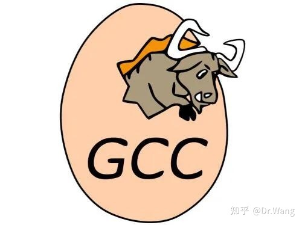
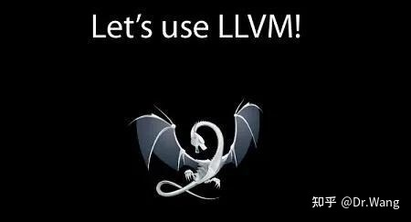
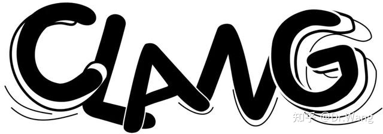
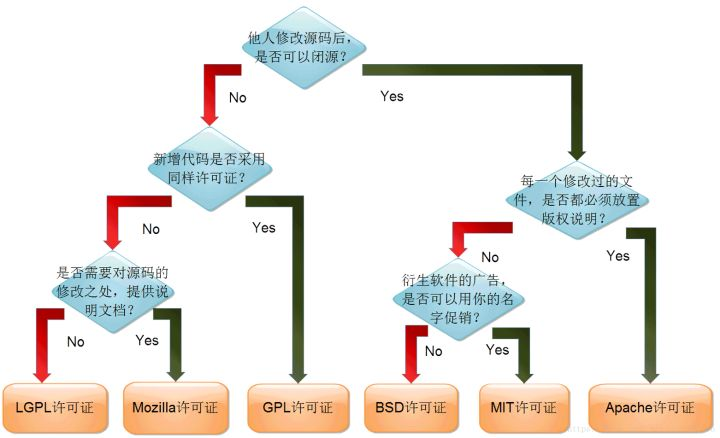

## 编译器一般构成

传统的编译器通常分为三个部分，前端（frontEnd），优化器（Optimizer）和后端（backEnd）. 在编译过程中，前端主要负责词法和语法分析，将源代码转化为抽象语法树；优化器则是在前端的基础上，对得到的中间代码进行优化，使代码更加高效；后端则是将已经优化的中间代码转化为针对各自平台的机器代码。

## GCC

GCC（GNU Compiler Collection，GNU 编译器套装），是一套由 GNU 开发的编程语言编译器。GCC 原名为 GNU C 语言编译器，因为它原本只能处理 C语言。GCC 快速演进，变得可处理 C++、Fortran、Pascal、Objective-C、Java 以及 Ada 等他语言。

## LLVM

LLVM （Low Level Virtual Machine，底层虚拟机)）提供了与编译器相关的支持，能够进行程序语言的编译期优化、链接优化、在线编译优化、代码生成。简而言之，可以作为多种编译器的后台来使用。

**苹果公司一直使用 GCC 作为官方的编译器。GCC 作为一款开源的编译器，一直做得不错，但 Apple 对编译工具会提出更高的要求。原因主要有以下两点：**

其一，是 Apple 对 Objective-C 语言（包括后来对 C 语言）新增很多特性，但 GCC 开发者并不买 Apple 的账——不给实现，因此索性后来两者分成两条分支分别开发，这也造成 Apple 的编译器版本远落后于 GCC 的官方版本。

其二，GCC 的代码耦合度太高，很难独立，而且越是后期的版本，代码质量越差，但 Apple 想做的很多功能（比如更好的 IDE 支持），需要模块化的方式来调用 GCC，但 GCC一直不给做。

## 编译器大神 Chris Lattner 横空出世

2000 年，本科毕业的 Chris Lattner 像中国多数大学生一样，按部就班地考了 GRE，最终前往 UIUC（伊利诺伊大学厄巴纳香槟分校），开始了艰苦读计算机硕士和博士的生涯。在这阶段，他不仅周游美国各大景点，更是翻烂了《Compilers: Principles, Techniques, and Tools》，成了 GPA 满分（4.0） 牛人，并不断地研究探索关于编译器的未知领域，发表了一篇又一篇的论文。他在硕士毕业论文里提出了一套完整的在编译时、链接时、运行时甚至是在闲置时优化程序的编译思想，直接奠定了 LLVM 的基础。LLVM 在他念博士时更加成熟，使用 GCC 作为前端来对用户程序进行语义分析产生 IF（Intermidiate Format），然后 LLVM 使用分析结果完成代码优化和生成。这项研究让他在 2005 年毕业时就成为了业界小有名气的编译器专家，他也因此早早地被 Apple 盯上，最终成为其编译器项目的骨干。

刚进入 Apple，Chris Lattner 就大展身手：首先在 OpenGL 小组做代码优化，把 LLVM 运行时的编译架在 OpenGL 栈上，这样 OpenGL 栈能够产出更高效率的图形代码。如果显卡足够高级，这些代码会直接扔入 GPU 执行。但对于一些不支持全部 OpenGL 特性的显卡（比如当时的 Intel GMA卡），LLVM 则能够把这些指令优化成高效的 CPU 指令，使程序依然能够正常运行。这个强大的 OpenGL 实现被用在了后来发布的 Mac OS X 10.5 上。同时，LLVM 的链接优化被直接加入到 Apple 的代码链接器上，而 LLVM-GCC 也被同步到使用 GCC4.0 代码。

## LLVM2.0 - Clang

Apple 吸收 Chris Lattner 的目的要比改进 GCC 代码更具野心 -- Apple 打算从零开始写 C、C++、Objective-C 语言的前端 Clang，完全替代掉 GCC。

Clang 是 LLVM 的前端，可以用来编译 C，C++，ObjectiveC 等语言。Clang 则是以 LLVM 为后端的一款高效易用，并且与IDE 结合很好的编译前端。

Clang 只支持C，C++ 和 Objective-C 三种语言。2007 年开始开发，C 编译器最早完成，而由于 Objective-C 只是 C 语言的一个简单扩展，相对简单，很多情况下甚至可以等价地改写为 C 语言对 Objective-C 运行库的函数调用，因此在 2009 年时，已经完全可以用于生产环境。C++ 在后来也得到了支持。

## GCC 和 Clang 对比

*   Clang 特性

速度快：通过编译 OS X 上几乎包含了所有 C 头文件的 carbon.h 的测试，包括预处理 (Preprocess)，语法 (lex)，解析 (parse)，语义分析 (Semantic Analysis)，抽象语法树生成 (Abstract Syntax Tree) 的时间，Clang 比 GCC 快2倍多。

内存占用小：Clang 内存占用是源码的 130%，Apple GCC 则超过 10 倍。

诊断信息可读性强：其中错误的语法不但有源码提示，还会在错误的调用和相关上下文的下方有~~~~~和^的提示，相比之下 GCC 的提示很天书。

兼容性好：Clang 从一开始就被设计为一个 API，允许它被源代码分析工具和 IDE 集成。GCC 被构建成一个单一的静态编译器，这使得它非常难以被作为 API 并集成到其他工具中。

Clang 有静态分析，GCC 没有。

Clang 使用 BSD 许可证，GCC 使用 GPL 许可证。

*   GCC 优势

支持 JAVA/ADA/FORTRAN

GCC 支持更多平台

GCC 更流行，广泛使用，支持完备

GCC 基于 C，不需要 C++ 编译器即可编译

## GCC、LLVM 和 Clang 如何选择？

目前不推荐使用老的 GCC 4.2，因为苹果不会维持它了，而且 LLVM-GCC 看起来会更好。在项目中途改编译选项可是一个大变动，需要慎重。

对新的项目而言，LLVM-GCC 看起來应该是个安全的选择，苹果公司认为它够稳定够成熟，所以才把它当做 Xcode 4 的预设选项。而且，既然选项使用的是 GCC parser，向后兼容性应该没问题。

LLVM-GCC 是个安全的选项，但并不是指 Clang/LLVM 比较不安全，只是成熟度还沒那么高效了。

## 总结 - 再探 LLVM

回顾 GCC 的历史，虽然它取得了巨大的成功，但开发 GCC 的初衷是提供一款免费的开源编译器，仅此而已。可后来随着 GCC 支持了越来越多的语言，GCC 架构的问题也逐渐暴露出来。**但 GCC 到底有什么问题呢？**

LLVM 的优点也正是 GCC 的缺点。传统编译器工作的时候前端负责解析源代码，检查语法错误，并将其翻译为抽象的语法树（Abstract Syntax Tree）。优化器对这一中间代码进行优化，试图使代码更高效。后端则负责将优化器优化后的中间代码转换为目标机器的代码，这一过程后端会最大化的利用目标机器的特殊指令，以提高代码的性能。事实上，不光静态语言如此，动态语言也符合上面这个模型，例如 Java。JVM 也利用上面这个模型，将 Java 代码翻译为Java bytecode。这一模型的好处是，当我们要支持多种语言时，只需要添加多个前端就可以了。当需要支持多种目标机器时，只需要添加多个后端就可以了。对于中间的优化器，我们可以使用通用的中间代码。**这种三段式的结构还有一个好处，开发前端的人只需要知道如何将源代码转换为优化器能够理解的中间代码就可以了，他不需要知道优化器的工作原理，也不需要了解目标机器的知识**。这大大降低了编译器的开发难度，使更多的开发人员可以参与进来。虽然这种三段式的编译器有很多优点，并且被写到了教科书上，但是在实际中这一结构却从来没有被完美实现过。做的比较好的应该属 Java 和 .NET 虚拟机。虚拟机可以将目标语言翻译为 bytecode，所以理论上讲我们可以将任何语言翻译为 bytecode，然后输入虚拟机中运行。但是这一动态语言的模型并不太适合 C 语言，所以硬将 C 语言翻译为 bytecode 并实现垃圾回收机制的效率是非常低的。GCC 也将三段式做的比较好，并且实现了很多前端，支持了很多语言。但是上述这些编译器的致命缺陷是，他们是一个完整的可执行文件，没有给其它语言的开发者提供代码重用的接口。即使 GCC 是开源的，但是源代码重用的难度也比较大。

LLVM 最初的定位是比较底层的虚拟机。它的出现正是为了解决编译器代码重用的问题，LLVM 一上来就站在比较高的角度，制定了 LLVM IR 这一中间代码表示语言。LLVM IR 充分考虑了各种应用场景，例如在 IDE 中调用 LLVM 进行实时的代码语法检查，对静态语言、动态语言的编译、优化等。从上面这个图中我们发现 LLVM 与 GCC 在三段式架构上并没有本质区别。LLVM 与其它编译器最大的差别是，它不仅仅是 Compiler Collection，也是Libraries Collection。举个例子，假如说我要写一个 X 语言的优化器，我自己实现了 PassX算法，用以处理 X 语言与其它语言差别最大的地方。而 LLVM 优化器提供的 PassA 和 PassB算法则提供了 X 语言与其它语言共性的优化算法。那么我可以选择 X 优化器在链接的时候把LLVM 提供的算法链接进来。LLVM 不仅仅是编译器，也是一个 SDK。Apple LLVM compiler 4.2 是一个真正的 LLVM 编译器，前端使用的是 Clang，基于最新的 LLVM 3.2 编译的。LLVM GCC 4.2 编译器的核心仍然是 LLVM，但是前端使用的是 GCC 4.2 编译器。从 LLVM的下载页面可以看出，LLVM 从 1.0 到 2.5 使用的都是 GCC 作为前端，直到 2.6 开始才提供了 Clang 前端。

如果你下载 LLVM 的代码，那么它就是一个 IR 到 ARM/机器码的编译器。比如 bin/opt 就是对 IR 的优化器，bin/llc 就是 IR->ASM 的翻译，bin/llvm-mc 就是汇编器。如果你再从[http://llvm.org](https://link.zhihu.com/?target=http%3A//llvm.org) 下载 Clang，那么就有了 C->IR 的翻译以及完整的编译器 Driver。GDB 是 GNU 的调试器。只要编译器支持 DWARF 格式，就可以用 GDB 调试。