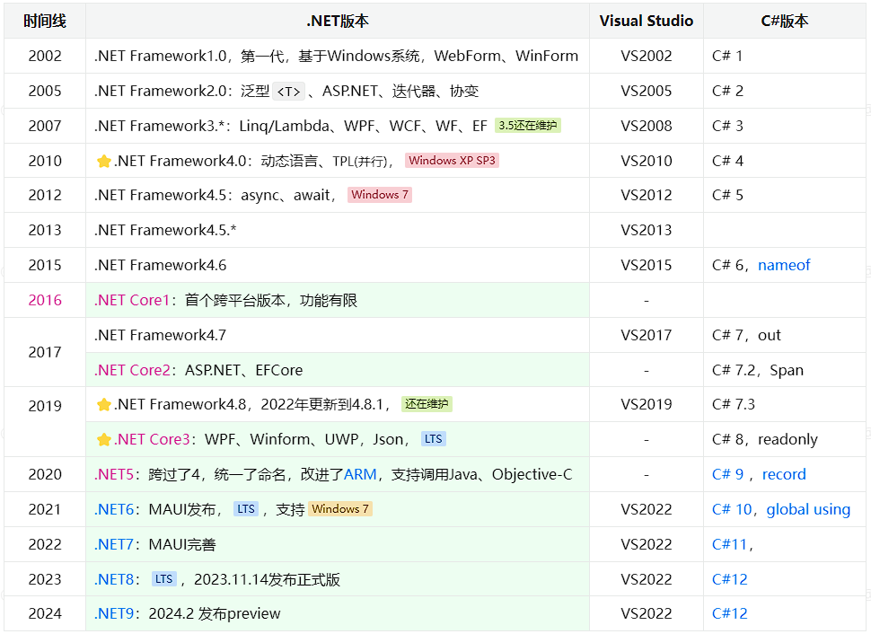
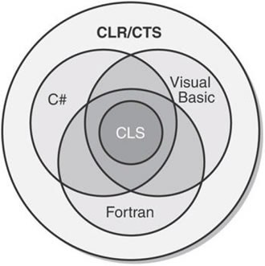
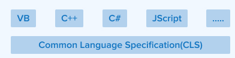
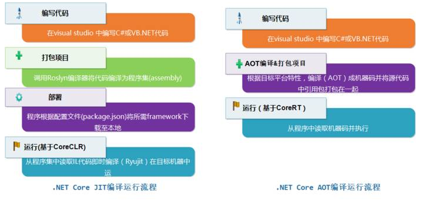

# C#.NET体系图文概述—2024最全总结
`C#` 是一种简单、现代、面向对象和类型安全的编程语言。。

`.NET` 是由 Microsoft 创建的开发平台，平台包含了语言规范、工具、运行，支持开发各种应用，如Web、移动、桌面等。.NET框架有多个实现，如`.NET Framework`、`.NET Core`（及后续的.NET 5+版本），以及社区版本`Mono`。除此以外，C#.NET体系还有很多概念，本文就来简单了解下C#、.NET Framework、CLR、.NETCore、CTS、JIT等概念。

# 01、.NET发展历史: Framework ⇒ Core


简单梳理一下.NET框架的发展：`.NET Framework` ⇒`.NET (Core)`。表格原文[原文连接](https://www.yuque.com/kanding/ktech/csharp.net "原文连接")。



> *   **LTS**：long time support，长期支持版本（3年左右），非LTS版本支持周期18个月左右。
> *   **RC**：Release Candidate，候选正式版本，可作为正式版本使用。


> 推荐一个在线的版本，做的非常漂亮：[Microsoft .NET History](https://time.graphics/embed?v=1&id=593132)


**🔸.NET Framework**（1.0 —— 4.8.1）：`.NET Framework`是基于Windows系统的`.NET`框架，从2002年发布，到最新的4.8.\*版本，已经停止发展。

*   最后的`4.8.*`版本依然还在维护，还是可以使用的，支持的最低操作系统是Windows 7。
*   如果要运行在XP系统上，则只能使用`.NET Framework4`版本，支持最低Windows XP SP3。
*   `.NET Framework`是基于Windows系统的，因此也只能在Windows系统上运行。

**🔸.NET** **Core**(Core1/2/3，5/6/7/8/9)：从2016年发布首个`.NET Core1`，和后面的.NET Core2/3、.NET 5/6/7/\*是一个体系的，只是从`.NET5`开始更改了命名。这是微软推出的新一代.NET框架，用来代替原有的`.NET Framework`，核心特点就是开源、跨平台，这也是.NET未来重点发展、投资的地方。

*   **开源**，采用MIT和Apache协议作为开源协议，对商业十分友好。
*   **跨平台**，支持Windows、MacOS、Linux，支持x64,、x86、ARM架构。

***

# 02、.NET Framework框架

.NET Framework 是运行在 Windows 系列操作系统上的一个系统应用程序。它是 .NET 的核心部分，提供了建立和运行 .NET 应用程序所需要的编辑、 编译等核心服务。它包括2个重要组成部分：公共语言运行时 (Common Language Runtime，**CLR**) 和 .NET Framework 类库（Framework Class Library，**FCL**）。


**🚩对于Framework**：

*   `.NET Framework`设计之初就是基于Windows系统的，其API与Windows底层接口紧密关联，所以DotNET应用也只能运行在Windows系统上了。同时，`.NET Framework`也作为Windows操作系统的组件内置在操作系统中。
*   同一台电脑上可以同时安装多个版本的 .NET Framework 版本。
*   **.NET Framework = 运行时CLR + 类库FCL**。

> 📢为了解决跨平台的问题，早期是社区开源的`Mono`，后来就是`Mono`被微软收购后，统一实现并开源了全新的`.NET Core`框架。不过两者很多技术、概念是一样的。

## 2.1、运行时（CLR）

公共语言运行时 (Common Language Runtime，CLR)， CLR 本质上就是.NET 虚拟机（类似Java的虚拟机JVM），算是.NET的引擎，用来执行托管.NET代码，确切的说是编译后的IL代码。提供管理内存、线程执行、代码执行、代码安全验证、异常处理、编译、垃圾回收等运行时服务。


> 图来源：[clr-full-form](https://www.tutorialandexample.com/clr-full-form)

*   **类加载器（Class Loader）**：加载程序集的类（包括方法）、元数据，及其他程序所需组件。
*   **即时编译器JIT**（Just-In-Time，简称JIT ）：负责将中间代码MSIL翻译成本机执行代码（MSIL to Native Code）。
*   **代码管理器**（Code Manager）：管理代码的执行。
*   **垃圾回收器GC**（Garbage Collector）：负责整个.NET运行时托管代码的内存分配与释放任务，它通过一定的优化算法选择收集对象和时间，并进行自动的垃圾收集。
*   安全引擎（Security Engine）：提供基于认证的安全机制，如用户身份。
*   调试引擎（Debug Engine）：使开发者能调试和跟踪应用程序代码。
*   类型检查器（Type Checker）：检查并禁止非安全的类型转换以及未初始化的变量的使用。
*   异常管理器（Exception Manager）：提供结构化的异常处理，与Windows结构化异常处理机制（SHE）集成，改进了错误报告。
*   线程支持（Thread Support）：提供了多线程编程的类和接口。


> CLR是`.NET`的核心，当我们学习了基本C#语法后，想要进一步进阶，就必须了解CLR的机制了。

## 2.2、CTS（通用类型系统）与CLS（通用语言规范）

.NET CLR是支持多种语言的，如C#、F#、VB等，这些语言编译后都可以在CLR上执行，还支持不同语言的互操作，比如在C#类继承一个VB写的类，在C#中调用F#写的一个方法等。



实现这种不同语言之间交互的基础就是这些语言都遵循统一的规范和要求 —— CTS（通用类型系统），CTS定义了一套通用的数据类型系统，包括值类型、引用类型的结构。比如C#中int、VB中的Interger都是整形，对应CTS中的Int32。

CLS是CTS的子集，规定了语言编译器必须遵循的一组规则，以便创建在 CLR 中运行的 .NET 应用程序。可以把CTS看做是规范，CLR是对CTS的具体实现。


> 图来源：[.NET的分层与概念](http://kyfxbl.com/2021/11/16/concept-of-dotnet/)


### 🔸CTS（Common Type System）通用类型系统

微软制定了一个正式的规范来描述类型的定义和行为，这就是“[通用类型系统](https://learn.microsoft.com/zh-cn/dotnet/standard/base-types/common-type-system)”（Common Type System，[CTS](https://learn.microsoft.com/zh-cn/dotnet/standard/base-types/common-type-system)）。所有.NET语言共享这一类型系统，实现它们之间无缝的互操作，比如可以在VB.NET中派生一个由C#编写的类。

*   CTS 提供了2种类型：引用类型、值类型。
*   CTS 规范规定，一个类型可以包含零个或多个成员。这些成员包括：字段(Field)、属性(Property)、方法(Method)、事件(Event)。
*   CTS 指定了类型可见性规则以及类型成员的访问规则，private、public 等。
*   CTS 还为类型继承、虚方法、对象生存期等定义了相应的规则。
*   CTS 规定：所有类型最终必须从预定义的 System.Object 类型继承，这里包括值类型也是从Object继承而来的。


### 🔸CLS（Common Language Specifition）公共语言规范

[公共语言规范](https://learn.microsoft.com/zh-cn/dotnet/standard/language-independence)(Common Language Specifition，CLS）是CTS的一个子集，从类型、命名、事件、属性等方面对语言进行了共性的定义及规范。CLS制定了一种以.NET平台为目标的语言所必须支持的最小特征，以及该语言与其他.NET语言之间实现互操作性所需要的完备特征。例如，CLS并不去关心一种语言用什么关键字实现继承，只是关心该语言如何支持继承。



> 📢CLS 遵从性的规则仅适用于组件的公共接口，而非其私有实现。CLS规范是提交给ECMA组织管理的， 有关规则的完整列表，请参阅 [ECMA-335 标准：公共语言基础结构](https://www.ecma-international.org/publications-and-standards/standards/ecma-335/)。

| 符合 CLS 的类型 | 描述 |
| --- | --- |
| [Byte](https://learn.microsoft.com/zh-cn/dotnet/api/system.byte) | 8 位无符号整数 |
| [Int16](https://learn.microsoft.com/zh-cn/dotnet/api/system.int16) | 16 位带符号整数 |
| [Int32](https://learn.microsoft.com/zh-cn/dotnet/api/system.int32) | 32 位带符号整数 |
| [Int64](https://learn.microsoft.com/zh-cn/dotnet/api/system.int64) | 64 位带符号整数 |
| [Half](https://learn.microsoft.com/zh-cn/dotnet/api/system.half) | 半精度浮点值 |
| [单精度](https://learn.microsoft.com/zh-cn/dotnet/api/system.single) | 单精度浮点值 |
| [双精度](https://learn.microsoft.com/zh-cn/dotnet/api/system.double) | 双精度浮点值 |
| [布尔值](https://learn.microsoft.com/zh-cn/dotnet/api/system.boolean) | true 或 false 值类型 |
| [Char](https://learn.microsoft.com/zh-cn/dotnet/api/system.char) | UTF 16 编码单元 |
| [小数](https://learn.microsoft.com/zh-cn/dotnet/api/system.decimal) | 非浮点十进制数字 |
| [IntPtr](https://learn.microsoft.com/zh-cn/dotnet/api/system.intptr) | 平台定义的大小的指针或句柄 |
| [字符串](https://learn.microsoft.com/zh-cn/dotnet/api/system.string) | 零个、一个或多个 Char 对象的集合 |

## 2.3、DotNET Framework 类库（FCL/BCL）

类库（Framework Class Library，**FCL**）就是`.NET Framework`内置的各种组件服务，如ASP.NET、MVC、WCF和WPF等组件，满足不同编程应用场景的需求。

基础类库**BCL**（Base Class Library）是FCL的一个子集，顾名思义就是一些比较基础、通用的类库，如基本数据类型、集合、线程、安全、字符串操作、网络操作、IO、XML操作等等，大多都包含在System命名空间下，如`System.Text`、`System.IO`。其他一些常用的名词，如核心 .NET 库、框架库、运行时库、共享框架，大多都指的是BCL。

```csharp
// 这些都是DotNET内置的类库using System;using System.Collections.Generic;using System.Linq;using System.Text;using System.IO;using System.Threading.Tasks;
```

BCL作为FCL的基础，使用了CTS 数据类型和标准的应用程序格式编制，能被任何一种 .NET 编程语言的应用程序所使用。


## 2.4、语言&运行机制

.NET是为了支持多种语言而设计的，如Microsoft自己发布的VB.NET、Managed C++、C#、J#和JScript.NET，还有其他厂商开发的语言，如Cobol、Smalltalk、Perl和 Eiffel等几十种编程语言。

无论使用哪种语言来编写源代码，都会通过编译器编译成中间代码**MSIL**（Microsoft Intermediate Language）。语言的集成性主要是公共语言规范（CLS）和通用类型系统（CTS）一起确保了语言的相互操作性。CLS是一个最低标准集，所有面向.NET的编译器都必须支持它，每个语言都符合这个规范，从而满足了语言的互相调用和互操作。

.NET语言程序运行的逻辑如下图：


每种语言都有自己的编译器，将源代码编译成中间语言（MSIL，或IL），然后在CLR上运行，主要分为两个阶段：

*   编译阶段：由[MSBuild](https://learn.microsoft.com/zh-cn/visualstudio/msbuild/msbuild?view=vs-2022)把源代码编译为中间语言IL代码，编译后就是EXE、DLL格式的文件。
*   运行阶段：CLR把中间语言CIL代码编译为平台专用的机器代码，最终在CPU上运行的就是机器码（汇编代码）。

> 🚩Microsoft中间语言（MSIL），也称为通用中间语言（CIL/IL：Common Intermediate Language），是一组与平台无关的指令，在CLR中运行时由JIT按需编译为机器码执行。

下图为一个打印`hello world`的IL代码，通过内置工具`ildasm`可以查看。  


***

# 03、.NET Core 框架

.NET Core是一个免费、跨平台、开源的开发平台，用于一站式构建不同类型的应用程序。.NET Core 是以.NET Framework 为基础，但是经过重新设计、实现的的新一代框架，实现了原.NET Framework 中的几乎所有功能，核心特点就是**开源、跨平台**。


*   **开源**，采用MIT和Apache协议作为开源协议，对商业十分友好。
*   **跨平台**，支持Windows、MacOS、Linux，支持x64,、x86、ARM架构。
*   **友好通用**，除了跨平台，.NET Core通过.NET Standard与.NET Framework、Xamarin和Mono兼容，支持WEB、移动、桌面、微服务容器、云端Azure、物联网IOT、机器学习、游戏Unity等多种应用开发模型。
*   **支持多种语言**，C#、VB、F#，基于一致的API标准模型——.NETStandard，使得不同语言的程序集和库可共享通用。
*   **现代高效**：结合C#8+、VS2019+，提供现代化的语言框架、高效的开发体验。
*   **高性能**，根据 [TechEmpowers](https://www.techempower.com/benchmarks/) 发布的一份报告，.NET Core比其他同类框架都要快得多。
*   **轻量**，.NET Core可以打包在应用程序中，也可以安装在并行用户、机器范围内或服务器上，可以部署在Docker容器中。

> **📢.NET Core** 从2016年发布首个`.NET Core1`，后面陆续发布了.NET Core2、.NET Core3，及后续的.NET6、.NET7、.NET8、.NET9。
> 
> *   跳过了版本号4.x，以避免与 .NET Framework 4.x 混淆。
> *   从.NET5开始，名称中删除了“ Core”，以强调这是.NET未来的主要实现。
> *   ASP.NET Core 5.0 基于 .NET 5.0，但保留名称“ Core”以避免将其与 ASP.NET MVC 5 混淆。同样，Entity Framework Core 5.0保留名称“ Core”以避免将其与 Entity Framework5、Entity Framework6 混淆。

## **3.1、统一的.NET框架**

.NET框架体系经过多年发展，衍生了多个版本 —— 使用 .NET Framework 来构建 Windows 桌面应用程序，使用 Xamarin 来构建 iOS 或 Android 应用程序，使用 .NET Core 来构建跨平台的 Web 应用程序。每一个框架都有自己的BCL、运行时CLR，长此以往，这也是造成如今.NET市场越来越差的原因之一。

so，为解决这个问题，.NET Core就肩负了这个一统江湖的使命！


*   .NET 3 添加了对WinForm、WPF、EF的支持。
*   .NET 5统一了Mono和.NET Core BCL的代码库。
*   在.NET 6中，运行时和工具也统一了，完成了One .NET愿景。
*   .NET 7 统一了所有不同的 .NET 开发工具组件，使开发人员能够在相同的基础类库 （BCL）、运行时和编译器上构建所有类型的应用（桌面、移动、Web 等）。


从.NET5，到.NET7，统一的愿景基本已达成，一站式构建 Web、桌面和移动等应用，支持传统的WPF、Winfrom（当然这两者只限于Windows系统），还引入了.NET Multi-platform App UI （.NET MAUI）作为Xamarin Forms的继任者。


## 3.2、.NET Core体系结构


*   **运行时**[.NET Runtime](https://github.com/dotnet/runtime) 有两种，CoreCLR，功能和.NET Framework的CLR差不多；`.NET Native RunTime`（CoreRT/NativeAOT）是直接将C#代码编译为机器码的运行时，还只是一个实验性的运行时。

> 🚩Core CLR 是一个跨平台的运行时，移植了 .NET Framework 的 CLR 的功能，包含核心程序库 mscorlib、JIT 编译器、垃圾收集器 (GC) 以及其他运行 MSIL 所需要的运行期环境。

*   **BCL/CoreFX**，类库，即 Base Classlibrary 基础类，包含 File、System、Console、XML、ADO.NET、日期时间等类库。Core FX就是.NET Core的BCL。
*   App Model，一站式构建 Web、桌面和移动等应用的模型。

## 3.3、JIT、AOT编译

📢通常情况下，我们写的C#代码被编译为中间代码IL，在运行期间由CLR的JIT编译器编译为机器码执行。这样势必造成运行的一些延迟，如果知道目标平台，则可以为该目标平台提前编译为机器码，这就是所谓的提前编译（AOT），它的优点是启动时间更快。

*   **JIT**（Just In Time Compiler，即时编译），顾名思义，在需要（运行代码）的时候才会被编译为机器码。当然编译好后会被缓存，以便于后续执行，这也是为什么.NET程序预热后执行更快的原因，不过程序关闭就没了。
*   **AOT**编译（Ahead of Time Compilation，预先编译或静态编译），在构建（发布）时将高级语言编译为本地机器码，让程序更快的启动、运行。可以将.NET Core程序编译成原生（机器）代码，不依赖 .NET 运行时而运行在宿主机器上。


[CoreRT](https://github.com/dotnet/corert) 是应用了AOT编译的.NET本地运行时，是微软2014年推出的一项实验性技术，现在被库[runtimelab](https://github.com/dotnet/runtimelab)取代，是一个NativeAOT的实验性运行时。

不同于CoreCLR，CoreRT不是虚拟机，也没有生成和动态运行代码的能力，因为它不包括JIT。它具有RTTI（运行时类型标识）和反射的能力，同时还具备垃圾回收（Garbage Collector）功能。Core RT 会在不同的平台使用不同的 AOT 技术：

*   Windows 上使用的是 .NET Native。
*   macOS 与 Linux 上使用的是 LLILC (同时支持 JIT 和 AOT)。



***

# 04、.NET Framework vs .NET Core


## 4.1、对比vs

| **比较** | **.NET Core** | **.NET Framework** |
| --- | --- | --- |
| 历史 | 2016年，.NET Core 是 .NET 的最新实现。 | 2002年，.NET Framework 是 .NET 的第一个实现 |
| 开源 | 完全开源 | 部分组件是开源的 |
| 维护团队 | [.NET基金会（.NET Foundation）](https://dotnetfoundation.org/) | 微软.NET团队 |
| 跨平台 | 支持跨平台，Windows，Linux和macOS | 仅Windows平台 |
| 第三方支持 | 有大量的第三方包，但少于.NET Framework | 历史悠久，有许多第三方软件包、库可用 |
| 应用内部署 | 支持**In-app**模式部署 | 需要单独安装SDK，不支持打包到应用内 |
| 移动开发 | 支持，Xamarin、MAUI | 不支持 |
| 性能和可扩展性 | 更高性能和可伸缩性 | 一般，性能和可伸缩性方面效率较低 |
| 微服务实施 | .NET Core 支持微服务的实现 | 不支持 |
| REST 服务实现 | 可以使用 .NET Core 创建一个 REST API。 | 它支持 REST API 服务实现 |
| 何时使用 | 🔸 创建跨平台应用程序。- 要创建微服务，一定要使用 .NET Core。  🔸 将应用程序部署到 Dockers 容器。  🔸 创建高性能且可扩展的应用程序。  🔸 并行运行多个 .NET 版本，请选择 .NET Core。  🔸 如果你想要一个命令行界面（CLI）控制，那么.NET core是最好的选择。 | 🔸 ~仅在Windows平台上运行~。好像不算理由。  🔸 ~基于 WinForms 或 WPF 应用程序~。.NET7已支持- ~WebForm、WCF~。新项目没必要了，过时了  🔸 .NET Core 不支持的第三方包。  🔸 不适用于 .NET Core 的 .NET 技术。  🔸 ~要访问特定于 Windows 的 API，如注册表、WMI~，`Core`有NUGET 包可用 |
|  |  |  |

参考原文：

*   [.NET Framework Vs .NET Core Vs .NET Standard](https://www.c-sharpcorner.com/article/net-framework-vs-net-core-vs-net-standard2/)，2021年9月的文章，那时.NET5还没发布的。
*   [.NET Core vs .NET Framework](https://www.interviewbit.com/blog/net-core-vs-net-framework/)

## 4.2、被遗弃的功能

.NET Framework 中有一些技术在 .NET 中已经废弃或调整了：

*   **🟠 Windows相关API不支持**：`.NET Framework`是深度集成Windows系统的，而`.NET Core`是跨平台的，因此就有大量的系统相关的API不支持。
    *   [Windows 兼容性包](https://learn.microsoft.com/zh-cn/dotnet/core/porting/windows-compat-pack) 的 Nuget包“[Microsoft.Windows.Compatibility](https://www.nuget.org/packages/Microsoft.Windows.Compatibility)”提供了约 20,000 个 API，包括WCF、ACL、Windows加密、WMI、EventLog、注册表、Windows服务等，及一些跨平台 API。
    *   Windows 注册表可通过Nuget查找“Microsoft.Win32.Registry”代替，其他如果在项目中发现缺少引用，请搜索 NuGet。
*   **🟠 Web 浏览器控件**：桌面开发中的浏览器控件，之前是基于IE内核的，已经过时。新提供的 [Microsoft.Web.WebView2](https://www.nuget.org/packages/Microsoft.Web.WebView2) 可以通过Nuget获得。
*   **🟠 应用配置** App.config 升级为 appsettings.json，如果还想要用，则可添加`System.Configuration.ConfigurationManager` NuGet 包。
*   **🟠 应用程序域** (AppDomain) ，不支持创建其他应用域，也尚未计划在将来添加此功能。 对于代码隔离，将流程或容器用作备用。 若要动态加载程序集，请使用 [AssemblyLoadContext](https://learn.microsoft.com/zh-cn/dotnet/api/system.runtime.loader.assemblyloadcontext) 类。
*   **🟠 .NET Remoting**，.NET 6 及更高版本不支持 .NET 远程处理。对于简单的跨进程通信，可将进程间通信 (IPC) 机制视为远程处理的备用方案。对于跨计算机的通信，可将基于网络的解决方案用作备用方案。
*   🟠 不支持 [System.EnterpriseServices](https://docs.microsoft.com/zh-cn/dotnet/api/system.enterpriseservices) (COM+)。
*   🟠 代码访问安全性，WPF for .NET 删除与 CAS 相关的代码，公开定义的 CAS 相关类型被移出 WPF 程序集，并移入了 Core .NET 库程序集中。
*   🟠 Windows Workflow Foundation (WF) 和 Windows Communication Foundation (WCF)，在.NET 5 及更高版本不支持 WF 和 WCF， 有关替代方法，请参阅 [CoreWF](https://github.com/UiPath/corewf) 和 [CoreWCF](https://github.com/CoreWCF/CoreWCF)。
*   🟠 保存反射生成的程序集，.NET 6 及更高版本不支持保存由 [System.Reflection.Emit](https://learn.microsoft.com/zh-cn/dotnet/api/system.reflection.emit) API 生成的程序集，作为替代方法，请考虑 [ILPack](https://github.com/Lokad/ILPack) 库。

更多请参考：

*   [从 .NET Framework 升级到 .NET 后进行现代化](https://learn.microsoft.com/zh-cn/dotnet/core/porting/modernize)
*   [.NET Framework 技术在 .NET 上不可用](https://docs.microsoft.com/zh-cn/dotnet/core/porting/net-framework-tech-unavailable)
*   [WPF .NET 的差异](https://learn.microsoft.com/zh-cn/dotnet/desktop/wpf/migration/differences-from-net-framework?view=netdesktop-7.0)

> 📢 为了保障兼容性，.Net Core 依然是可以调用 .NET Framework 的库，只是如有有不支持的API或依赖会抛出异常。

## 4.3、桌面开发能用.NET Core吗？

开发服务端后台服务肯定是首选.NET Core的，那传统的的Windows桌面程序（WinForm、WPF）呢？能不能用最新的.NET Core呢？—— 答案当然是可以的！

**🟢优点**：

*   可以使用更新的C#语法、.NET特性，提升开发效率。
*   性能提升明显。
*   可以打包运行库的依赖，不用单独安装运行库了。
*   WebView2，基于Edge的现代浏览器内核。

**🟠缺点**：

*   .NET Framework配套的第三方库比较丰富，可能没有.NETCore版本的。
*   对操作系统的兼容，.NETFramework4支持XP系统，Core最低支持Win7。

> 📢尽管 .NET Core 是跨平台的，但其 WPF、Wiform 仅在 Windows 上运行！

从 .NET Framework 升级到 .NET Core VS2022内置的升级工具，相关参考：

*   [如何将 WPF 桌面应用升级到 .NET 7](https://learn.microsoft.com/zh-cn/dotnet/desktop/wpf/migration/?view=netdesktop-7.0)
*   [如何将 Windows 窗体 桌面应用升级到 .NET 7](https://learn.microsoft.com/zh-cn/dotnet/desktop/winforms/migration/?view=netdesktop-7.0)
*   [从 .NET Framework 移植到 .NET](https://learn.microsoft.com/zh-cn/dotnet/core/porting/)，基本都可以兼容，99%的API都是一样的
*   [桌面指南 (WPF .NET)](https://learn.microsoft.com/zh-cn/dotnet/desktop/wpf/overview/?view=netdesktop-7.0)

> 🚩不要升级 Visual Basic Windows 窗体项目。 扩展似乎存在 bug！

***

# 05、还有一些概念了解一下？

*   **🔸.NET应用**：就是使用了.NET框架开发的应用程序，基于CLR运行。
*   **🔸Assembly**： 程序集，源代码编译的产出，一般表现为`.DLL`或者`.EXE`格式，必须依靠CLR才能顺利执行。它们都是标准的PE格式的文件，主要包括PE（Portable Executable）头、CLR头（托管代码的一些信息，如类型元数据）、IL代码、其他资源数据。


*   **🔸**DLL：Dynamic Link Library，动态链接库，包含了已编译的C#代码、元数据和资源，可以在多个应用程序之间共享和重用。
*   **🔸**命令行 ([CLI](https://learn.microsoft.com/zh-cn/dotnet/core/tools/)：Command-Line Interface) 是一种跨平台工具，用于开发、构建、执行发布 .NET 应用程序。是.NET Core SDK的一部分，可以用“dotnet”指令来检查是否正确安装。
*   **🔸MSBuild** Microsoft Build Engine）是由Microsoft开发的构建工具和构建系统。它用于自动化软件项目的构建过程，包括编译源代码、打包、运行测试、部署和生成文档等。使用 MSBuild，我们可以构建Visual Studio项目和解决方案，而无需安装Visual Studio IDE。

## 5.1、托管代码和非托管代码

**托管代码**（Managed Code）是指在受管理环境中运行的代码，通常指的是.NET语言（C#、VB）开发的代码，在CLR运行时环境中运行。由CLR来负责内存管理、垃圾回收、类型安全性和异常处理等任务，所以我们写（C#）托管代码时，就可以随意申明变量、创建对象，而不用去管内存的分配、管理和回收，使得代码更容易编写、维护和调试。

> 🚩Java也算一种托管代码

相对而言，**非托管代码**（Unmanaged Code）就是没有专门的执行管理环境，通常使用低级编程语言（如C、C++）编写，开发人员需要手动处理内存管理、异常和资源释放等问题。

> 📢在实际的C#的开发中，我们也会经常用到非托管资源，如IO、文件流操作，就需要注意要手动释放（非托管）资源，避免内存溢出。

## 5.2、.NET Standard

[.NET Standard](https://learn.microsoft.com/zh-cn/dotnet/standard/net-standard?tabs=net-standard-1-0) 是针对多个`.NET`框架 实现推出的一套正式的 .NET API 规范，目的是在多个`.NET` 框架间共享代码，如在.NET Framework 、 .NET、Mono间共享代码，提高 .NET 生态系统中的一致性。


> 🚩.NET Standard 是一组标准化的 **API规范**，“.NET Standard Library”指的也是这个API标准库，注意只是一组规范，具体实现就是 .NET Framework、NET Core 和 Mono了，看看其[源码](https://github.com/dotnet/standard/blob/v2.1.0/src/netstandard/ref/System.cs)就知道了。

所以：

*   `.NET Standard`是针对跨平台框架的一种规范，在跨平台框架开发是才会涉及。
*   从 .NET 5 和 .NET 6 开始，微软就统一了所有平台、应用终端，不再需要`.NET Standard`了，[它以后不会更新了](https://devblogs.microsoft.com/dotnet/the-future-of-net-standard/)。
*   对于`.NET Framework`，在4.5版本才正式支持`.NET Standard`的规范，`.NET Core`天生就支持了。


## 5.3、.NET的ECMA标准

**ECMA**（European Computer Manufacturers Association，欧洲计算机制造商协会）是一个国际性的标准化组织，致力于制定和推广信息和通信技术的标准。

.NET体系中的C#语言、公共语言基础（CLI）也是有标准规范的，参考[Ecma 标准](https://learn.microsoft.com/ZH-CN/dotnet/fundamentals/standards)。.NET主要的的规范标准包括：

*   C# 语言标准（版本 6.0）：[ECMA-334.pdf](https://www.ecma-international.org/wp-content/uploads/ECMA-334_6th_edition_june_2022.pdf)
*   公共语言基础结构：[ECMA-335.pdf](https://www.ecma-international.org/wp-content/uploads/ECMA-335_6th_edition_june_2012.pdf)，这也是CLR的标准。

> **🔸CLI**（Common Language Infrastructure）公共语言基础结构：是一系列规范标准的总称，包括CTS、CLS、CIL、元数据、执行系统等多种规范，.NET、Mono就是他的实现，由国际标准组织ECMA维护。

> 📢学习C#、CLR不需要去看上述规范，这个不适合，如果你是要自己实现一门高级语言，或写一个C#编译器则可以去看看。

## 5.4、Mono/Xamarin

Mono 是另一个 .NET Framework 的跨平台开源版本，并不属于微软，而是由社区的力量所主导。Mono 项目始于 2001 年，由Xamarin牵头维护 [mono/mono](https://github.com/mono/mono) ，2016年Xamarin被微软收购，之后逐步成为.NETCore的一部分。

> Mono就像流落民间的王子，靠着乡亲们的力量慢慢成长，最后被国王召回，继承大统。


Mono 基于C#的ECMA标准和公共语言运行时（CLR），包括Mono运行时、C#编译器、类库和一些附加工具。Mono兼容.NET标准，并支持跨平台开发。可以在多个操作系统上运行，包括Linux、macOS和Windows。Mono比较流行的应用场景就是Unity游戏开发和移动端应用开发。

*   Unity游戏引擎使用Mono作为其脚本引擎的一部分，所以Unity游戏开发的主要语言就是C#。
*   Xamarin（杂么瑞）：就是基于Mono，专门用来开发移动端App应用程序，实现一次开发多端应用。其继任者是微软在.NET7中推出的MAUI（maui /ˈmaʊɪ/ n.毛伊岛）。