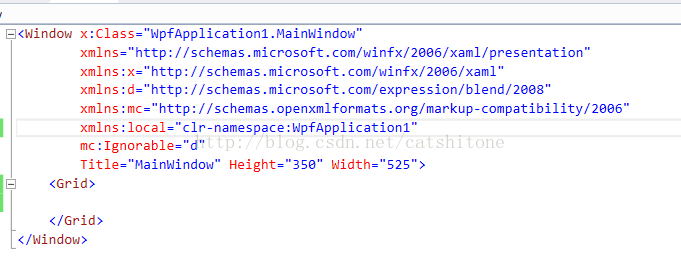
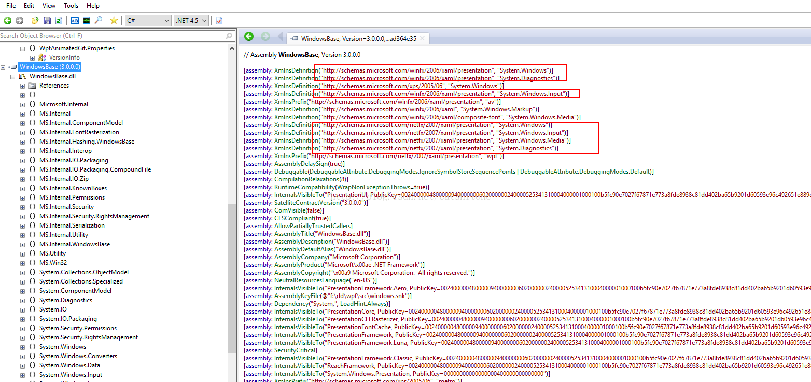
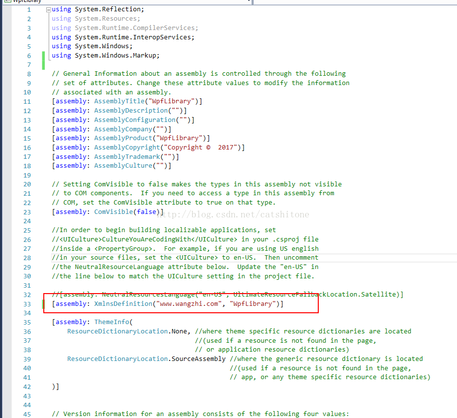
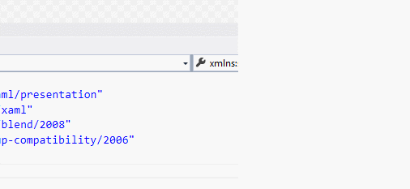
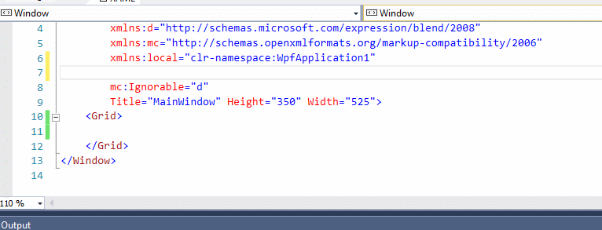

# wpf中的xmlns命名空间为什么是一个网址
新建一个wpf的项目，我们先来看下它默认的命名空间都是哪些？



可以看到xmlns有的是网址，有的是clr-namespace开头的一串字母。clr开头的比较好理解，就是运行时的命名空间，就像C#代码中的using xxxx之类的一样。

但是对于网址开头的命名空间有可能就有点疑惑了，它究竟代表的是什么？

xaml文件被解析的时候会访问这个网址吗？

如果这个网址那天不能get了，那我们的程序是不是就不能正常运行了？

在这里我先把结论告诉大家，然后在一步步分析是为什么。

## 结论：

以xmlns="http://schemas.microsoft.com/winfx/2006/xaml/presentation这个为例，其实它代表的是

1.  System.Windows
2.  System.Windows.Automation
3.  System.Winjdows.Controls
4.  等等....

这一系列命名空间的集合，是这个命名空间集合的【别名】。在浏览器输入这个网址有时候是不可访问的。如果自己定义类库的话，我把这个【别名】叫做张三也是可以的。但是微软建议我们一般把这个定义为公司网址，或者个人网址。

## 分析：

我们一步步来看看，为什么我们添加一个引用后，xmlns那里能够自动进行提示相应的网址。

### 1.用.NetReflector反编译WindowsBase.dll,可以看到：



那个http开头的命名空间，与N个传统的命名空间做了映射。

### 2.自定义一个类库也采用网址命名空间的这种方式。

新建一个wpf类库项目，名为WpfLibrary。更改其AssemblyInfo.cs文件，增加这么一行：

```csharp
[assembly: XmlnsDefinition("www.wangzhi.com", "WpfLibrary")]
```

注意添加using System.Windows.Markup;

添加后的就是这样子：

  
 

### 3.新建一个Wpf Application项目，在引用里添加第二步中生成的dll文件。

在添加命名空间的时候，我们可以看到自动提示：



### 4.再尝试另一种方式的命名空间

我们将添加的那句assemlby:xmlnsdefinition(.......)去掉，然后重新生成类库，在重新添加引用。那么这次智能提示里肯定没有www.wangzhi.com这个命名空间了。有的是这个：



### 5.由此可见，网址形式的命名空间等价于传统形式的命名空间，而且还可以是1对N的关系。网址形式的写一行，抵得上传统形式的N多行，节约手工代码量。