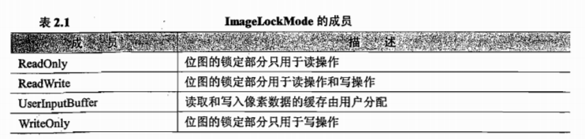
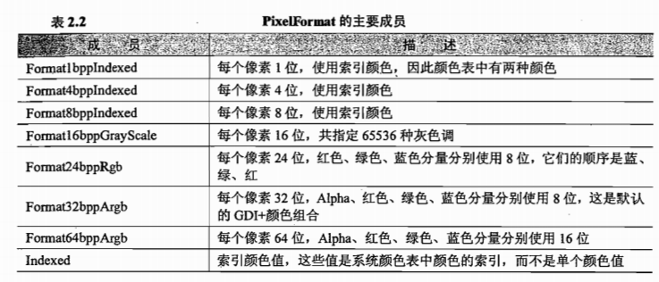
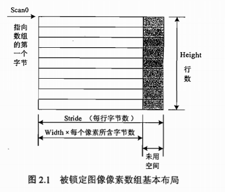

# c#数字图像处理（一）Bitmap类、 Bitmapdata类和 Graphics类
Bitmap类、 Bitmapdata类和 Graphics类是C#图像处理中最重要的3个类,如果要用C#  
进行图像处理,就一定要掌握它们。

  
1.1 Bitmap类  
Bitmap对象封装了GDI+中的一个位图,此位图由图形图像及其属性的像素数据组成。

因此 Bitmap是用于处理由像素数据定义的图像的对象。

Bitmap类类的主要方法和属性如下：

Get Pixel方法和 Setpiⅸel方法:获取和设置一个图像的指定像素的颜色  
Pixelformat属性:返回图像的像素格式。  
Palette属性:获取或设置图像所使用的颜色调色板。  
Height属性和 Width属性:返回图像的高度和宽度

  
Lockbits方法和 Unlockbits方法:分别锁定和解锁系统内存中的位图像素。在基于  
像素点的图像处理方法中使用 Lockbits和 Unlockbits是一个很好的方式,这两种方法可以使  
我们通过指定像素的范围来控制位图的任意一部分,从而消除了通过循环对位图的像素逐个  
进行处理的需要。每次调用 Lockbits之后都应该调用一次 Unlockbits

Lockbits方法的定义如下:

public BitmapData LockBits(rectangle rect,ImageLockMode flag,PixelFormat format);

Lockbits矩形参数Rectangle定义了要在系统内存中锁定的位图的一部分;

Image Lockmode枚举提供了对数据的访问方式,表2.1所示是它的成员;

Pixelformat枚举表示像素的格式,表2.2所示是它的主要成员。

**

Unlockbits方法使用一个由Lockbits返回的类型为BitmapData的参数，它定义为：

public void Unlockbits(BitmapData bitmapdata);

1.2 Bitmapdata类  
Bitmapdata对象指定了位图的属性,如下所示。  
Height属性:被锁定位图的高度  
Width属性:被锁定位图的宽度  
PixelFormat属性:数据的实际像素格式

Scan0属性:被锁定数组的首字节地数组的地址。如果整个图像被锁定,则是图像Height的第一个字节地址。

Stride属性:步幅,也称为扫描宽度

如图所示，数组的宽度并不一定等于图像像素数组的宽度,还有一部分未用区域。这是为了提高效率,系统要确定每行的字节数必须为4的倍数。例如一幅24位、宽为17个像素的图像,它需要每行占有的空间为51(3×17)个字节,但51不是4的倍数,因此还需要补充1个字节,从而使每行的字节数扩展为52(4x13,即 Stride=52),这样就满足了每行字节数是4的倍数的条件。需要扩展多少个字节不仅是由图像的宽度决定,而且还由图像像素的格式决定。由于本书所选择的图像大小都为512×512,因此无论是24位彩色图像,还是8位的灰度图像,都满足是4的倍数的条件,无需再扩展。如果处理的是任意宽度的图像,那么在进行行扫描的时候,就需要把扩展字节去除掉。

1.3 Graphics类  
raphics对象是GDH+的关键所在。许多对象都是由 Graphics类表示的,该类定义了绘  
制和填充图形对象的方法和属性。一个应用程序只要需要进行绘制或着色,它就必须使用  
Graphics对象。

1.4  Image类

　　这个类提供了位图和元文件操作的函数.Image类被声明为abstract,也就是说Image类不能实例化对象,而只能做为一个基类
~~~ CSharp
1.FromFile方法：它根据输入的文件名产生一个Image对象,它有两种函数形式:

public static Image FromFile(string filename);

public static Image FromFile(string filename, bool useEmbeddedColorManagement);

2.FromHBitmap方法：它从一个windows句柄处创建一个bitmap对象,它也包括两种函数形式:

public static bitmap fromhbitmap(intptr hbitmap);

public static bitmap fromhbitmap(intptr hbitmap, intptr hpalette);

3. FromStream方法：从一个数据流中创建一个image对象,它包含三种函数形式:

public static image fromstream(stream stream);

public static image fromstream(stream stream, bool useembeddedcolormanagement);

fromstream(stream stream, bool useembeddedcolormanagement, bool validateimagedata);
~~~

基础代码框架：

打开、保存、显示图像
~~~CSharp
        //文件名
        private string curFileName; //图像对象
        private Bitmap curBitmap; /// 

        /// 打开图像文件 /// 

        private void open_Click(object sender, EventArgs e)
        { //创建OpenFileDialog
            OpenFileDialog opnDlg = new OpenFileDialog(); //为图像选择一个筛选器
            opnDlg.Filter = "所有图像文件|*.bmp;*.pcx;*.png;*.jpg;*.gif;" +
                "*.tif;*.ico;*.dxf;*.cgm;*.cdr;*.wmf;*.eps;*.emf|" +
                "位图(*.bmp;*.jpg;*.png;...)|*.bmp;*.pcx;*.png;*.jpg;*.gif;*.tif;*.ico|" +
                "矢量图(*.wmf;*.eps;*.emf;...)|*.dxf;*.cgm;*.cdr;*.wmf;*.eps;*.emf"; //设置对话框标题
            opnDlg.Title = "打开图像文件"; //启用“帮助”按钮
            opnDlg.ShowHelp = true; //如果结果为“打开”，选定文件
            if (opnDlg.ShowDialog() == DialogResult.OK)
            { //读取当前选中的文件名
                curFileName = opnDlg.FileName; //使用Image.FromFile创建图像对象
                try {
                    curBitmap = (Bitmap)Image.FromFile(curFileName);
                } catch (Exception exp)
                {
                    MessageBox.Show(exp.Message);
                }
            } //对窗体进行重新绘制，这将强制执行paint事件处理程序
 Invalidate();
        } //在控件需要重新绘制时发生（窗体事件）
        private void Form1_Paint(object sender, PaintEventArgs e)
        { //获取Graphics对象
            Graphics g = e.Graphics; if (curBitmap != null)
            { //使用DrawImage方法绘制图像 //180,20：显示在主窗体内，图像左上角的坐标 //curBitmap.Width, curBitmap.Height图像的宽度和高度
                g.DrawImage(curBitmap, 180, 20, curBitmap.Width, curBitmap.Height);
            }
        } /// 

        /// 保存图像文件 /// 

        private void save_Click(object sender, EventArgs e)
        { //如果没有创建图像，则退出
            if (curBitmap == null) return; //调用SaveFileDialog
            SaveFileDialog saveDlg = new SaveFileDialog(); //设置对话框标题
            saveDlg.Title = "保存为"; //改写已存在文件时提示用户
            saveDlg.OverwritePrompt = true; //为图像选择一个筛选器
            saveDlg.Filter = "BMP文件(*.bmp)|*.bmp|" \+ "Gif文件(*.gif)|*.gif|" \+ "JPEG文件(*.jpg)|*.jpg|" \+ "PNG文件(*.png)|*.png"; //启用“帮助”按钮
            saveDlg.ShowHelp = true; //如果选择了格式，则保存图像
            if (saveDlg.ShowDialog() == DialogResult.OK)
            { //获取用户选择的文件名
                string filename = saveDlg.FileName; string strFilExtn = filename.Remove(0, filename.Length - 3); //保存文件
                switch (strFilExtn)
                { //以指定格式保存
                    case "bmp":
                        curBitmap.Save(filename, ImageFormat.Bmp); break; case "jpg":
                        curBitmap.Save(filename, ImageFormat.Jpeg); break; case "gif":
                        curBitmap.Save(filename, ImageFormat.Gif); break; case "tif":
                        curBitmap.Save(filename, ImageFormat.Tiff); break; case "png":
                        curBitmap.Save(filename, ImageFormat.Png); break; default: break;
                }
            }
        }
~~~