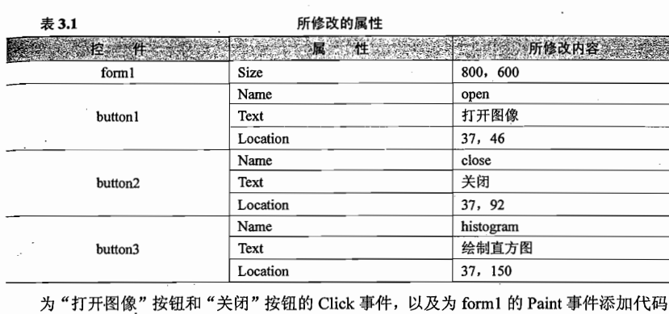

# c#数字图像处理（三）灰度直方图
灰度直方图是灰度的函数,描述的是图像中具有该灰度级的像素的个数。如果用直角坐标系来表示,则它的横坐标是灰度级,纵坐标是该灰度出现的概率(像素的个数)。

~~~csharp
using System;
using System.Collections.Generic;
using System.ComponentModel;
using System.Data;
using System.Drawing;
using System.Linq;
using System.Text;
using System.Threading.Tasks;
using System.Windows.Forms;

namespace histogram
{
    public partial class histForm : Form
    {
        //利用构造函数实现窗体之间的数据传递
        public histForm(Bitmap bmp)
        {
            InitializeComponent();

            //把主窗体的图像数据传递给从窗体
            bmpHist = bmp;
            //灰度级计数
            countPixel = new int[256];  //8位可表示256个灰度级
        }

        private void close_Click(object sender, EventArgs e)
        {
            this.Close();
        }

        //图像数据
        private System.Drawing.Bitmap bmpHist;
        //灰度等级
        private int[] countPixel;
        //记录最大的灰度级个数
        private int maxPixel;

        /// 

        /// 计算各个灰度级所具有的像素个数
        /// 

        private void histForm_Load(object sender, EventArgs e)
        {
            //锁定8位灰度位图
            Rectangle rect = new Rectangle(0, 0, bmpHist.Width, bmpHist.Height);
            System.Drawing.Imaging.BitmapData bmpData = bmpHist.LockBits(rect,
                System.Drawing.Imaging.ImageLockMode.ReadWrite, bmpHist.PixelFormat);
            IntPtr ptr = bmpData.Scan0;
            int bytes = bmpHist.Width * bmpHist.Height;
            byte[] grayValues = new byte[bytes];
            System.Runtime.InteropServices.Marshal.Copy(ptr, grayValues, 0, bytes);//灰度值数据存入grayValues中

            byte temp = 0;
            maxPixel = 0;
            //灰度等级数组清零
            Array.Clear(countPixel, 0, 256);
            //计算各个灰度级的像素个数
            for (int i = 0; i < bytes; i++)
            {
                //灰度级
                temp = grayValues[i];
                //计数加1
                countPixel[temp]++;
                if (countPixel[temp] > maxPixel)
                {
                    //找到灰度频率最大的像素数，用于绘制直方图
                    maxPixel = countPixel[temp];
                }
            }

            //解锁
            System.Runtime.InteropServices.Marshal.Copy(grayValues, 0, ptr, bytes);
            bmpHist.UnlockBits(bmpData);
        }

        /// 

        /// 绘制直方图
        /// 

        private void histForm_Paint(object sender, PaintEventArgs e)
        {
            //获取Graphics对象
            Graphics g = e.Graphics;

            //创建一个宽度为1的黑色钢笔
            Pen curPen = new Pen(Brushes.Black, 1);

            //绘制坐标轴
            g.DrawLine(curPen, 50, 240, 320, 240);//横坐标
            g.DrawLine(curPen, 50, 240, 50, 30);//纵坐标

            //绘制并标识坐标刻度
            g.DrawLine(curPen, 100, 240, 100, 242);
            g.DrawLine(curPen, 150, 240, 150, 242);
            g.DrawLine(curPen, 200, 240, 200, 242);
            g.DrawLine(curPen, 250, 240, 250, 242);
            g.DrawLine(curPen, 300, 240, 300, 242);
            g.DrawString("0", new Font("New Timer", 8), Brushes.Black, new PointF(46, 242));
            g.DrawString("50", new Font("New Timer", 8), Brushes.Black, new PointF(92,242));
            g.DrawString("100", new Font("New Timer", 8), Brushes.Black, new PointF(139, 242));
            g.DrawString("150", new Font("New Timer", 8), Brushes.Black, new PointF(189, 242));
            g.DrawString("200", new Font("New Timer", 8), Brushes.Black, new PointF(239, 242));
            g.DrawString("250", new Font("New Timer", 8), Brushes.Black, new PointF(289, 242));
            g.DrawLine(curPen, 48, 40, 50, 40);
            g.DrawString("0", new Font("New Timer", 8), Brushes.Black, new PointF(34, 234));
            g.DrawString(maxPixel.ToString(), new Font("New Timer", 8), Brushes.Black, new PointF(18, 34));

            //绘制直方图
            double temp = 0;
            for (int i = 0; i < 256; i++)
            {
                //纵坐标长度
                temp = 200.0 * countPixel[i] / maxPixel;
                g.DrawLine(curPen, 50 + i, 240, 50 + i, 240 - (int)temp);
            }
            //释放对象
            curPen.Dispose();
        }
    }
}
~~~

