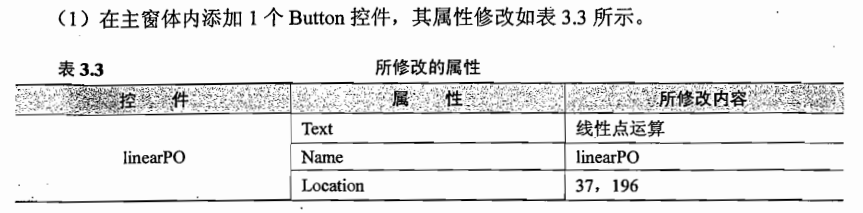
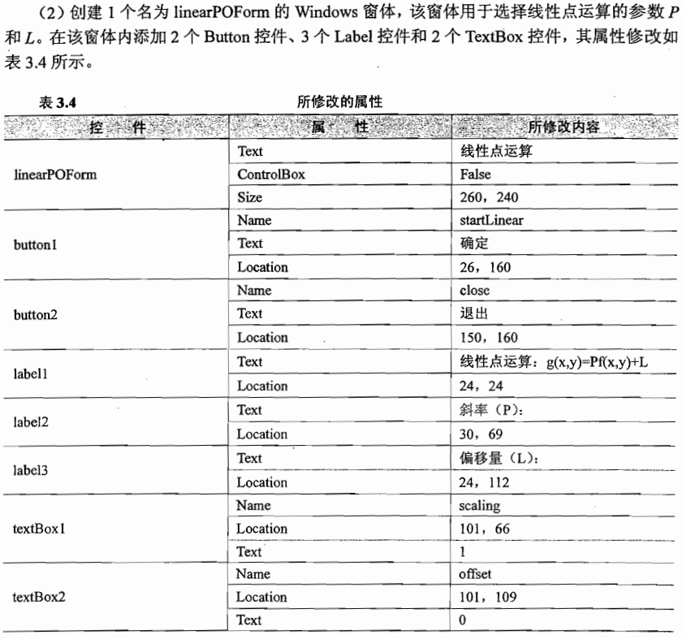
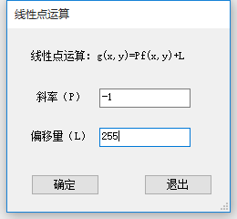
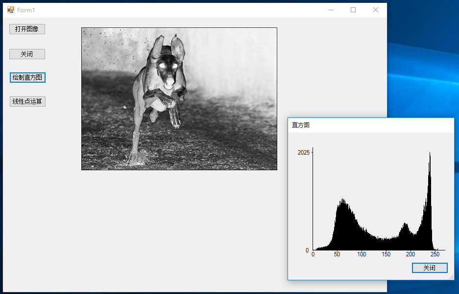
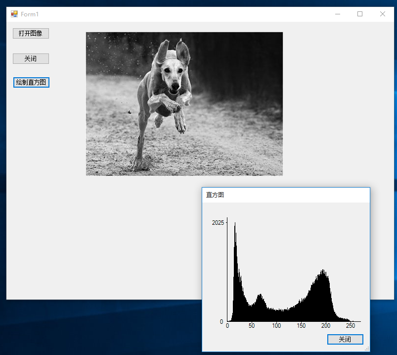
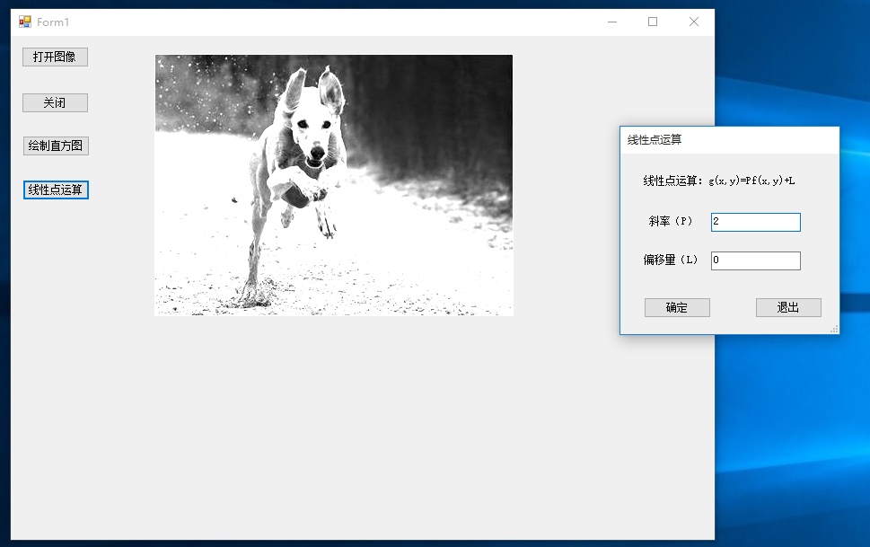

# c#数字图像处理（四）线性点运算
灰度图像的点运算可分为线性点运算和非线性点运算两种。  
4.1线性点运算定义  
线性点运算就是输出灰度级与输入灰度级呈线性关系的点运算。在这种情况下,灰度变换函数的形式为:

g(x, y)=pf(x,y)+L

其中 f(x,y) 为输入图像在点 (x,y) 的灰度值, g(x,y) 为相应的输出点的灰度值。显然,如果P=1和L=0,g(x,y)就是f(x,y)的复制;如果P<1,输出图像的对比度将增大;如果P>1,则对比度将减少;如果P=1而L≠0,该操作仅使所有像素的灰度值上移或下移,其效果是使整个图像在显示时更暗或更亮;如果P为负值,暗区域将变亮,亮区域将变暗,该操作完成了图像求补。

 

linearPOForm.cs
~~~csharp
using System;
using System.Collections.Generic;
using System.ComponentModel;
using System.Data;
using System.Drawing;
using System.Linq;
using System.Text;
using System.Threading.Tasks;
using System.Windows.Forms;

namespace histogram
{
    public partial class linearPOForm : Form
    {
        public linearPOForm()
        {
            InitializeComponent();
        }

        private void startLinear_Click(object sender, EventArgs e)
        {
            //设置DialogResult属性
            this.DialogResult = DialogResult.OK;
        }

        private void close_Click(object sender, EventArgs e)
        {
            this.Close();
        }

        //设置两个get访问器
        public string GetScaling
        {
            get
            {
                //得到斜率
                return scaling.Text;
            }
        }
        public string GetOffset
        {
            get
            {
                //得到偏移量
                return offset.Text;
            }
        }
    }
}
~~~

  
Form1.cs
~~~csharp
using System;
using System.Collections.Generic;
using System.ComponentModel;
using System.Data;
using System.Drawing;
using System.Linq;
using System.Text;
using System.Threading.Tasks;
using System.Windows.Forms;

namespace histogram
{
    public partial class Form1 : Form
    {
        public Form1()
        {
            InitializeComponent();
        }

        //文件名
        private string curFileName;
        //图像对象
        private System.Drawing.Bitmap curBitmpap;

        /// 

        /// 打开图像文件
        /// 

        private void open_Click(object sender, EventArgs e)
        {
            //创建OpenFileDialog
            OpenFileDialog opnDlg = new OpenFileDialog();
            //为图像选择一个筛选器
            opnDlg.Filter = "所有图像文件|*.bmp;*.pcx;*.png;*.jpg;*.gif;" +
                "*.tif;*.ico;*.dxf;*.cgm;*.cdr;*.wmf;*.eps;*.emf|" +
                "位图(*.bmp;*.jpg;*.png;...)|*.bmp;*.pcx;*.png;*.jpg;*.gif;*.tif;*.ico|" +
                "矢量图(*.wmf;*.eps;*.emf;...)|*.dxf;*.cgm;*.cdr;*.wmf;*.eps;*.emf";
            //设置对话框标题
            opnDlg.Title = "打开图像文件";
            //启用“帮助”按钮
            opnDlg.ShowHelp = true;

            //如果结果为“打开”，选定文件
            if (opnDlg.ShowDialog() == DialogResult.OK)
            {
                //读取当前选中的文件名
                curFileName = opnDlg.FileName;
                //使用Image.FromFile创建图像对象
                try
                {
                    curBitmpap = (Bitmap)Image.FromFile(curFileName);
                }
                catch (Exception exp)
                {
                    MessageBox.Show(exp.Message);
                }
            }
            //对窗体进行重新绘制，这将强制执行paint事件处理程序
            Invalidate();
        }

        /// 

        /// 在控件需要重新绘制时发生
        /// 

        private void Form1_Paint(object sender, PaintEventArgs e)
        {
            //获取Graphics对象
            Graphics g = e.Graphics;
            if (curBitmpap != null)
            {
                //使用DrawImage方法绘制图像
                //160,20：显示在主窗体内，图像左上角的坐标
                //curBitmpap.Width, curBitmpap.Height图像的宽度和高度
                g.DrawImage(curBitmpap, 160, 20, curBitmpap.Width, curBitmpap.Height);
            }
        }

        /// 

        /// 关闭窗体 
        /// 

        private void close_Click(object sender, EventArgs e)
        {
            this.Close();
        }

        private void histogram_Click(object sender, EventArgs e)
        {
            if (curBitmpap != null)
            {
                //定义并实例化新窗体，并把图像数据传递给它
                histForm histoGram = new histForm(curBitmpap);
                histoGram.ShowDialog();
            }
        }

        private void linearPO_Click(object sender, EventArgs e)
        {
            if (curBitmpap!=null)
            {
                //实例化linearPOForm窗体
                linearPOForm linearForm = new linearPOForm();

                //点击确定按钮
                if (linearForm.ShowDialog()==DialogResult.OK)
                {
                    Rectangle rect = new Rectangle(0, 0, curBitmpap.Width, curBitmpap.Height);
                    System.Drawing.Imaging.BitmapData bmpData = curBitmpap.LockBits(rect, 
                        System.Drawing.Imaging.ImageLockMode.ReadWrite, curBitmpap.PixelFormat);
                    IntPtr ptr = bmpData.Scan0;
                    int bytes = curBitmpap.Width * curBitmpap.Height;
                    byte[] grayValues = new byte[bytes];
                    System.Runtime.InteropServices.Marshal.Copy(ptr, grayValues, 0, bytes);

                    int temp = 0;
                    //得到斜率
                    double a = Convert.ToDouble(linearForm.GetScaling);
                    //得到偏移量
                    double b = Convert.ToDouble(linearForm.GetOffset);

                    for (int i = 0; i < bytes; i++)
                    {
                        //根据公式计算线性点运算
                        //加0.5表示四舍五入
                        temp = (int)(a * grayValues[i] + b + 0.5);

                        //灰度值限制在0~255之间
                        //大于255，则为255；小于0则为0
                        if (temp>255)
                        {
                            grayValues[i] = 255;
                        }
                        else if (temp<0)
                        {
                            grayValues[i] = 0;
                        }
                        else
                        {
                            grayValues[i] = (byte)temp;
                        }
                    }
                    System.Runtime.InteropServices.Marshal.Copy(grayValues, 0, ptr, bytes);
                    curBitmpap.UnlockBits(bmpData);
                }
                Invalidate();
            }
        }
    }
}
~~~

 