# 优雅地使用C#异步
驱动学习C#异步的原因是这次项目要将异步逻辑做同步处理，很多关于异步的使用方式我都一知半解，导致看代码有疑惑，做代码设计出现问题，所以趁现在刚做完这个项目抓紧时间学习一番。

有参考：[https://www.cnblogs.com/feipeng8848/p/10188871.html](https://www.cnblogs.com/feipeng8848/p/10188871.html "https://www.cnblogs.com/feipeng8848/p/10188871.html")

简单的脑图，待补充。

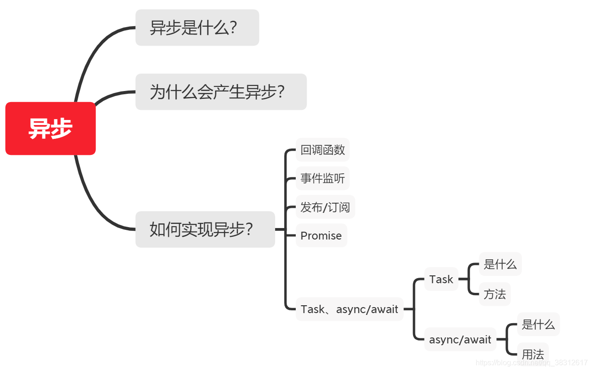

关于Task相关的概念就不说了，直接来实践。

①先来看一下利用Task(无返回值),async/await写的一个程序：

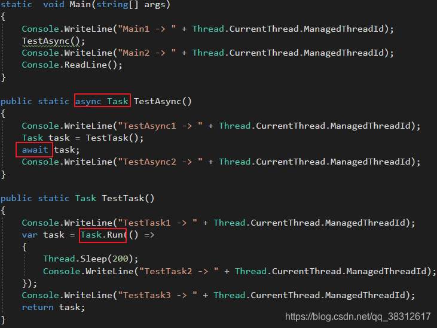

会****产生什么****样的结果：

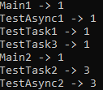

从结果看程序的执行顺序就是这样的：

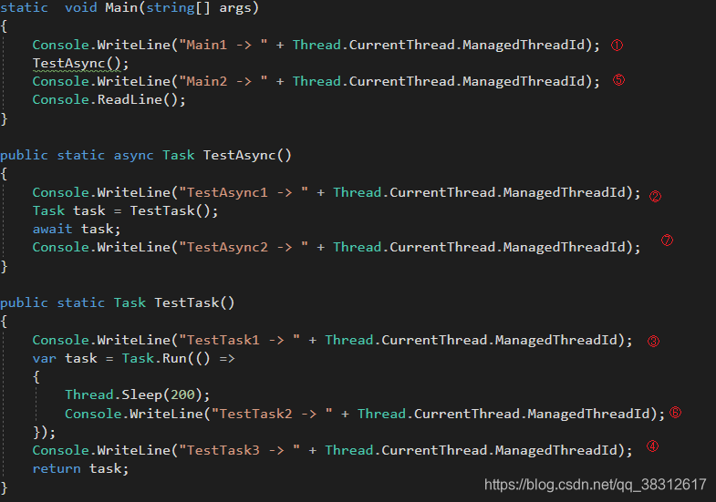

那么用图来说明****为什么****会产生这样的结果：

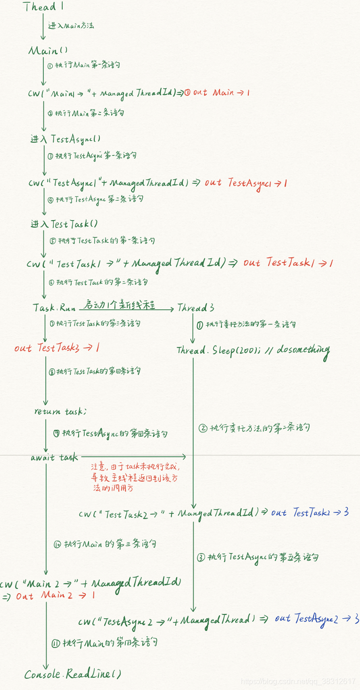

通过上述程序大概是了解了Task以及async/await的用法，那么下面我们来仔细琢磨一下他们：

1.async/await

①先看一个不使用async/await的task程序：

  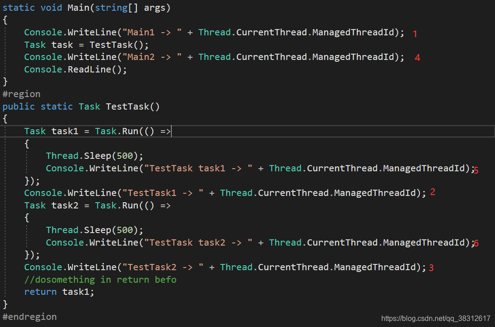

 执行结果：

 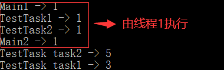

继续看流程图：

 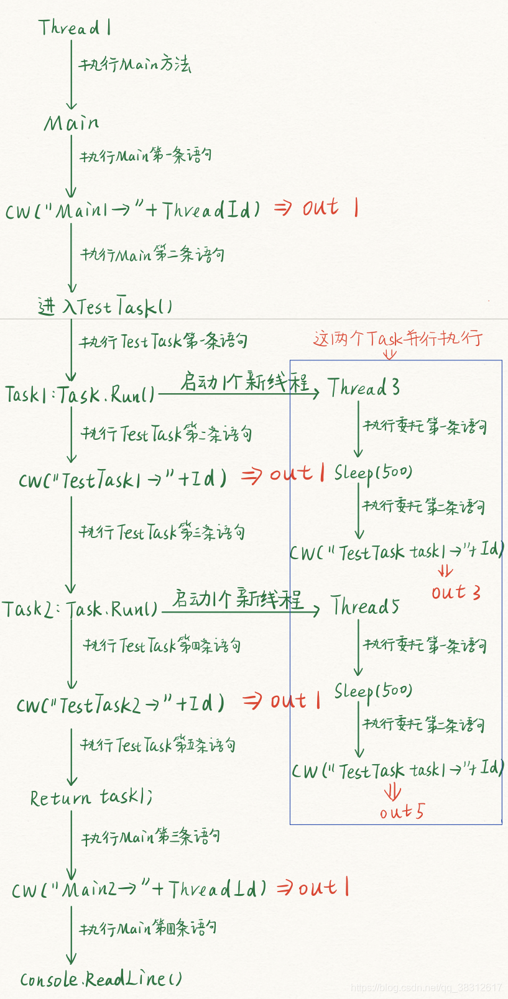

可以看到，当调用方线程执行到return语句才返回Main方法继续执行Main方法中接下来的语句。那么可以得出一个结论：**如果仅仅是由Task声明的异步方法，调用方线程总是会执行到最后一条语句才退出当前方法回到调用处。**

现在再来看看配合async/await一起使用的task是什么样子的：

其中，await有两种场景：

1.等待的task已执行完毕，也就是说当程序执行到await task这一步时，TestTask方法中的Task已执行完成：

对TestAsync()方法增加一行代码Thread.Sleep(1000),在等待task执行完成之前，先做一点自己的事。

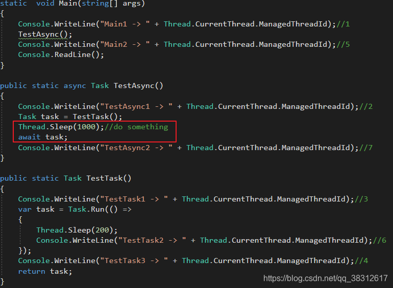

结果：

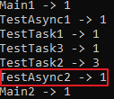

可以看到，TestAsync2语句被线程1所执行且Main方法的Main2语句在TestAsync2语句之后被执行，那么就可以得出一个结论：****如果调用方线程执行到********await task********语句，且********task********已执行完毕，线程会接着执行该方法接下来的语句。****

再来一看个有多个task被await，且被每次执行到await时，task都已执行完毕的例子：

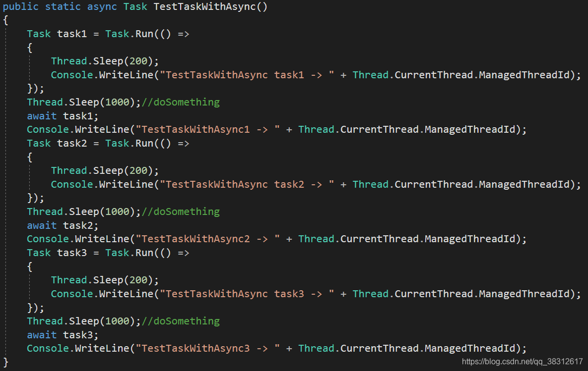

执行结果：

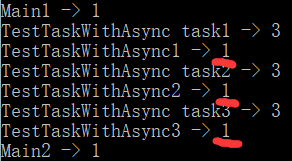

能够看到主线程执行完了当前方法中所有的非异步语句，这是不是和不使用async/await的Task有异曲同工之妙？

2.等待的task未执行完毕，这意味着当程序执行到await task这一步时，TestTask方法中的Task还正在执行：

再看一下下面这个例子： 

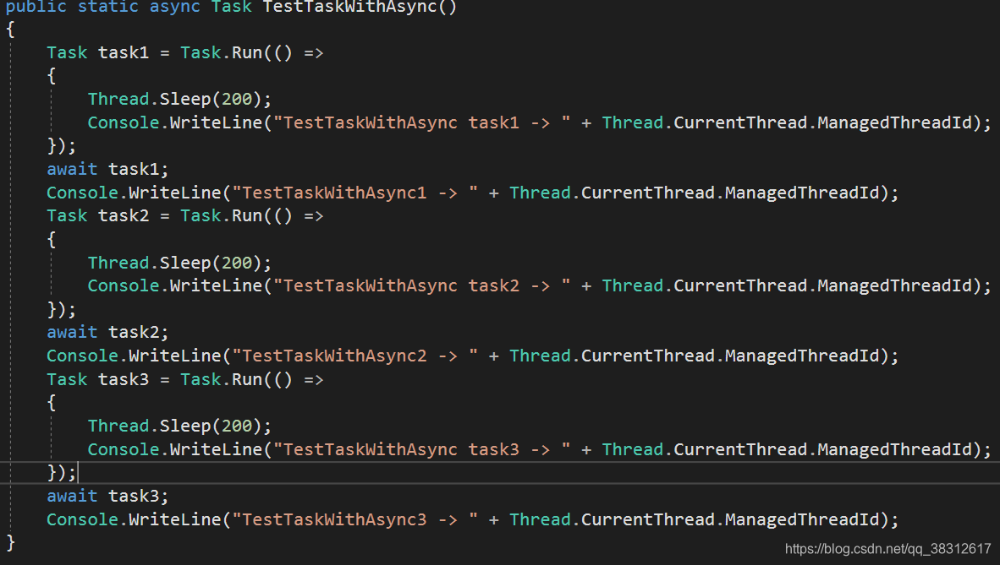

结果：


与第一种场景结果不同的是，主线程不再执行await task之后的语句，后面的语句由执行task的线程执行。这可以说明：****如果调用方线程执行到********await task;********语句，且********task********未执行完毕，那么调用方线程从此处返回继续执行原方法语句。而********await task;********接下来的语句由执行********task********的线程********所执行****(非窗体应用)****。****

上述情况更为复杂，当主线程执行到await task1时，发现task1并没有执行完，所以主线程退出该方法，接下来的语句由执行task1的线程3执行，所以是TestTaskWithAsync2 -> 3；当线程3执行到await.task2时，由于task2没有执行完，所以线程3退出该方法，接下来的语句由执行task2的线程4执行，所以是TestTaskAsync3 -> 3;最后，当线程4执行到await task3时，也因为task3没执行完，所以线程4退出该方法，接下来的语句又由执行task3的线程3执行，所以就产生了上面的结果。

面的执行结果有一个地方会产生歧义，那就是为什么task、TestTaskWithAsync1、task3和TestTaskWithAsync3都是被线程3执行，看上起就像同步执行一样？这是因为最开始线程3执行到await.task2时，task2没执行完所以线程3从该方法退出，又因为线程3已经没有任务可执行，线程3被线程池回收，所以后面有了新任务线程池自然又可以拿出线程3去执行任务。

好了，接下来模拟一个实际场景来看一下使用async/await的Task与使用纯Task两者的差异(非窗体应用程序)

①做一个简单的支付接口，除了有支付核心环节的流程，还有一些积分操作、发送短信的附属流程。

支付接口：

```cs
public static void Pay()
{
     Console.WriteLine("开始支付->" + Thread.CurrentThread.ManagedThreadId);
     //支付的核心流程
     Thread.Sleep(50);
     Console.WriteLine("核心流程已完成");
     //其他流程
     PayRelatedWithAsync();
}
```

非核心流程：

```cs
//使用Task处理
public static void PayRelated()
{
    Task<int> task = Integral();
    task.Wait();
    //发送短信
    Thread.Sleep(1000);
    Console.WriteLine("线程" + Thread.CurrentThread.ManagedThreadId + "发送短信告知用户总积分            
                       为：" + task.Result);
}

//使用async/await处理
public static async void PayRelated()
{
    Task<int> task = Integral();
    await task;
    //发送短信
    Thread.Sleep(1000);
    Console.WriteLine("线程" + Thread.CurrentThread.ManagedThreadId + "发送短信告知用户总积分 
                       为：" + x);
}

//处理积分
public static Task<int> Integral()
{
    Task<int> task = Task.Run(() =>
    {
    //积分操作
    Thread.Sleep(500);
    Console.WriteLine("已完成积分操作 -> " + Thread.CurrentThread.ManagedThreadId);
    //总积分
    return 200;
    });
    return task;
}
```

好了，当我使用两种方式进行了分别支付之后，它们的结果是：

```bash
Task:
开始支付->1
核心流程已完成
已完成积分操作 -> 3
线程1发送短信告知用户总积分为：200
支付环节已完成,支付接口总花费时间: 1.6s

async/await、Task:
开始支付->1
核心流程已完成
支付环节已完成,支付接口总花费时间: 0.09s
已完成积分操作 -> 3
线程3发送短信告知用户总积分为：200
```

从结果可以看出，两者花费时间的差距足有1.5s!而据了解，一般主流电商对支付接口的RT(Response Time 响应)接口需控制在200ms内，甚至某些电商要在50ms内，显然1.6s是不合格的。

那么我们来分析一下两种方式的差异点。

来看一下两者调用PayRelated()方法执行积分、短信操作的不同：

**Task:**

使用task的方式，在执行了Integral()之后，必须使用task.Wait，因为发送短信会依赖积分操作的处理结果，所以必须等待task处理完成。这里就有了**耗时点1**：使用Task.Wait，注意，根据前面我们对Task的结论，方法中的语句总是会被调用方线程执行，所以调用方线程会被阻塞直到task执行完成。然后继续执行发送短信的操作，这也是由调用方执行，这是**耗时点2**.

然而，使用**async/await**不同的是：

在走到await task之后，通过我们上面的结论，因为task没有执行完成，所以调用方直接从这里退出继续执行原函数代码，而这里剩下的一切将由执行task的线程来处理。

**两者的差异在于：**

在async/await、Task这样的PayRelated()写法中，调用方线程做了它应该做的，呼唤线程，发放任务，走人，干净利落。

而Task这样的PayRelated()写法是怎么做的呢？调用方线程呼唤线程、发放任务，**等待线程处理任务结果，然后帮忙做一些与自己不相干的事情**，再走人。

然而，有些人可能发现了，其实PayRelated()方法使用Task还可以这样写：

```
public static void PayRelated()
{
     Task<int> task = Integral();
     int integral = task.Result;
     //发送短信
     Task task1 = Task.Run(() => 
     {
          task.Wait();
          Console.WriteLine("线程" + Thread.CurrentThread.ManagedThreadId + "发送短信告知用 
                             户总积分为：" + integral);
     });
}
```

就是发送短信我也可以不让调用方线程执行呀，再叫个线程帮忙不就行了,来看看执行结果吧：

```bash
开始支付->1
核心流程已完成
已完成积分操作 -> 3
支付环节已完成,支付接口总花费时间: 0.6s
线程3发送短信告知用户总积分为：200
```

嗯，确实快了不少，但是终究还是比使用async/await做辅助要花费更多时间，面对更复杂的场景可能就力不从心了。

并且这样的写法还会衍生更多弊端：

①代码不够优雅，难以维护。

②增加线程池开销。

总之，使用async/await配合Task，让代码更优雅、性能更好吧！