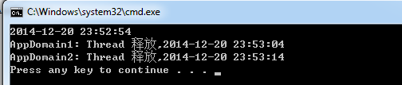

# (一)-基础用法

平常在多线程开发中，总避免不了线程同步。本篇对net多线程中的锁系统做个简单描述。

## lock、Monitor

Lock是Monitor语法糖简化写法，Lock在IL会生成Monitor。


```csharp
//======Example 1=====
string obj = "helloworld";
lock (obj)
{
    Console.WriteLine(obj);
}
//lock  IL会编译成如下写法
bool isGetLock = false;
Monitor.Enter(obj, ref isGetLock);
try
{
    Console.WriteLine(obj);
}
finally
{
    if (isGetLock)
    {
        Monitor.Exit(obj);
    }
}
```

isGetLock参数是Framework  4.0后新加的。 为了使程序在所有情况下都能够确定，是否有必要释放锁。例: 若Monitor.Enter拿不到锁isGetLock=false，则无需释放锁了

Monitor.Enter 虽然可以锁值类型，但是每次上锁时值类型被装箱成一个新对象，所以无法做到线程同步（两次上锁，锁了不同的对象）。

### 作用域范围

一：Lock是只能在进程内锁（实现线程间同步），不能跨进程，内部走的是混合构造，先自旋再转成内核构造。

二：关于对type类型的锁，如下：

```csharp
//======Example 2=====
Console.WriteLine($"Time:{DateTime.Now.ToString("HH:mm:ss.ffff")} StartThread1");
new Thread(new ThreadStart(() => {
    lock (typeof(int))
    {
        Thread.Sleep(10000);
        Console.WriteLine($"Time:{DateTime.Now.ToString("""HH:mm:ss.ffff""")} Thread1释放");
    }
})).Start();
Console.WriteLine($"Time:{DateTime.Now.ToString("HH:mm:ss.ffff")} Exit Thread1");
Thread.Sleep(1000);
lock (typeof(int))
{
    Console.WriteLine($"Time:{DateTime.Now.ToString("""HH:mm:ss.ffff""")} Thread2释放");
}
```

运行结果如下：


再看个例子:

```csharp
//======Example 3=====
Console.WriteLine(DateTime.Now);
AppDomain appDomain1 = AppDomain.CreateDomain("AppDomain1");
LockTest Worker1 = (LockTest)appDomain1.CreateInstanceAndUnwrap(
    Assembly.GetExecutingAssembly().FullName,
    "ConsoleApplication1.LockTest");
Worker1.Run();

AppDomain appDomain2 = AppDomain.CreateDomain("AppDomain2");
LockTest Worker2 = (LockTest)appDomain2.CreateInstanceAndUnwrap(
Assembly.GetExecutingAssembly().FullName,
"ConsoleApplication1.LockTest");
Worker2.Run();
/// <summary>
/// 跨应用程序域边界或远程访问时需要继承MarshalByRefObject
/// </summary>
public class LockTest : MarshalByRefObject
{
    public void Run()
    {
        lock (typeof(int))
        {
            Thread.Sleep(10000);
            Console.WriteLine(AppDomain.CurrentDomain.FriendlyName + ": Thread 释放," + DateTime.Now);
        }
    }
}
```

运行结果如下：



第一个例子说明，在同进程同域，不同线程下，锁type int，其实锁的是同一个int对象，所以要慎用。

第二个例子，这里就简单说下。

A: CLR启动时，会创建 系统域（System Domain）和共享域（Shared Domain）， 默认程序域（Default AppDomain）。 系统域和共享域是单例的。程序域可以有多个，例子中我们使用AppDomain.CreateDomain方法创建的。

B:  按正常来说，每个程序域的代码都是隔离，互不影响的。但对于一些基础类型来说，每个程序域都重新加载一份，就显得有点浪费，带来额外的损耗压力。聪明的CLR会把一些基本类型Object, ValueType, Array, Enum, String, and Delegate等所在的程序集MSCorLib.dll，在CLR启动过程中都会加载到共享域。  每个程序域都会使用共享域的基础类型实例。  

C: 而每个程序域都有属于自己的托管堆。托管堆中最重要的是GC heap和Loader heap。GC heap用于引用类型实例的存储，生命周期管理和垃圾回收。Loader heap保存类型系统，如MethodTable，数据结构等，Loader heap生命周期不受GC管理，跟程序域卸载有关。

所以共享域中Loader heap MSCorLib.dll中的int实例会一直保留着，直到进程结束。单个程序域卸载也不受影响。作用域很大有没有！！！

这时第二个例子也很容易理解了。 锁int实例是跨程序域的，MSCorLib中的基础类型都是这样， 极容易造成死锁。  而自定义类型则会加载到自己的程序域，不会影响其他。

### 字符串的锁

我们都知道锁的目的，是为了多线程下值不被破坏。也知道string在c#是个特殊对象，值是不变的，每次变动都是一个新对象值，这也是推荐stringbuilder原因。如例：

```csharp
//======Example 4=====
string str1 = "mushroom";
string str2 = "mushroom";
var result1 = object.ReferenceEquals(str1, str2);
var result2 = object.ReferenceEquals(str1, "mushroom");
Console.WriteLine(result1 + "-" + result2);
/* output
* True-True
*/
```

 正是由于c#中字符串的这种特性，所以字符串在多线程下是不会被修改的，是只读的。它存在于SystemDomain域中managed heap中的一个hash table中。其中Key为string本身，Value为string对象的地址。

 当程序域需要一个string的时候，CLR首先在这个Hashtable根据这个string的hash code试着找对应的Item。如果成功找到，则直接把对应的引用返回，否则就在SystemDomain对应的managed heap中创建该 string，并加入到hash table中，再把引用返回。所以说字符串的生命周期是基于整个进程的，也是跨AppDomain。

### Monitor的用法

简单介绍下Wait，Pulse,PulseAll的用法，已加注释。

```csharp
static string str = "mushroom";
static void Main(string[] args)
{
    new Thread(() =>
    {
        bool isGetLock = false;
        Monitor.Enter(str, ref isGetLock);
        try
        {
            Console.WriteLine("Thread1第一次获取锁");
            Thread.Sleep(5000);
            Console.WriteLine("Thread1暂时释放锁，并等待其他线程释放通知信号。");
            Monitor.Wait(str); 
            Console.WriteLine("Thread1接到通知,第二次获取锁。");
            Thread.Sleep(1000);
        } 
        finally
        {
            if (isGetLock)
            {
                Monitor.Exit(str);
                Console.WriteLine("Thread1释放锁");
            }
        }
    }).Start();
    Thread.Sleep(1000);
    new Thread(() =>
    {
        bool isGetLock = false;
        Monitor.Enter(str, ref isGetLock); //一直等待中，直到其他释放。
        try
        {
            Console.WriteLine("Thread2获得锁");
            Thread.Sleep(5000);
            Monitor.Pulse(str); //通知队列里一个线程，改变锁状态。  PulseAll 通知所有的
            Console.WriteLine("Thread2通知其他线程，改变状态。");
            Thread.Sleep(1000);
        }
        finally
        {
            if (isGetLock)
            {
                Monitor.Exit(str);
                Console.WriteLine("Thread2释放锁");
            }
        }

    }).Start();
    Console.ReadLine();
}
```

## Mutex

 lock是不能跨进程锁的。 mutex作用和lock类似，但是它能跨进程锁资源(走的是windows内核构造)，如例子：

```csharp
static bool createNew = false;
//第一个参数 是否应拥有互斥体的初始所属权。即createNew true时，mutex默认获得处理信号
//第二个是名字，第三个是否成功。
public static Mutex mutex = new Mutex(true, "mushroom.mutex", out createNew);

static void Main(string[] args)
{
    //======Example 5=====
    if (createNew)  //第一个创建成功，这时候已经拿到锁了。 无需再WaitOne了。一定要注意。
    {
        try
        {
            Run();
        }
        finally
        {
            mutex.ReleaseMutex(); //释放当前锁。  
        }
    }
    //WaitOne 函数作用是阻止当前线程，直到拿到收到其他实例释放的处理信号。
    //第一个参数是等待超时时间，第二个是否退出上下文同步域。
    else if (mutex.WaitOne(10000,false))//
    {
        try
        {
            Run();
        }
        finally
        {
            mutex.ReleaseMutex();
        }
    }
    else//如果没有发现处理信号
    {
        Console.WriteLine("已经有实例了。");
        Console.ReadLine();
    }
}
static void Run()
{
    Console.WriteLine("实例1");
    Console.ReadLine();
}
```

顺序启动A  B实例测试下。A首先拿到锁，输出 实例1 。B在等待， 如果10秒内A释放，B拿到执行Run()。超时后输出"已经有实例了"。

这里注意的是第一个拿到处理信号 的实例，已经拿到锁了。不需要再WaitOne。  否则报异常。  

## Semaphore

 即信号量，我们可以把它理解为升级版的mutex。mutex对一个资源进行锁，semaphore则是对多个资源进行加锁。
semaphore是由windows内核维持一个int32变量的线程计数器，线程每调用一次、计数器减一、释放后对应加一， 超出的线程则排队等候。
走的是内核构造，所以semaphore也是可以跨进程的。


```csharp
static void Main(string[] args)
{
    Console.WriteLine("准备处理队列");

    bool createNew = false;

    SemaphoreSecurity ss = new SemaphoreSecurity(); //信号量权限控制
    Semaphore semaphore = new Semaphore(2, 2, "mushroom.Semaphore", out createNew,null);
    for (int i = 1; i <= 5; i++)
    {
        new Thread((arg) =>
        {
            semaphore.WaitOne();
            Console.WriteLine(arg + "处理中");
            Thread.Sleep(10000);
            semaphore.Release(); //即semaphore.Release(1)
            //semaphore.Release(5);可以释放多个，但不能超过最大值。如果最后释放的总量超过本身总量，也会报错。 不建议使用

        }).Start(i);
    }
    Console.ReadLine();
}
```

## 总结

mutex、Semaphore  需要先把托管代码转成本地用户模式代码、再转换成本地内核代码。  

当释放后需要重新转换成托管代码，性能会有一定的损耗，所以尽量在需要跨进程的场景再使用。 

参考 http://www.cnblogs.com/artech/archive/2007/06/04/769805.html