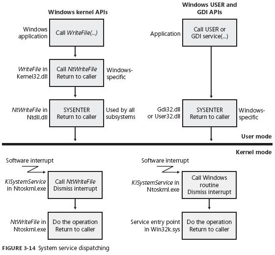

# (三)-WaitHandle、AutoResetEvent、ManualResetEvent
# 理论

Windows的线程同步方式可分为2种，用户模式构造和内核模式构造。

内核模式构造：是由Windows系统本身使用，内核对象进行调度协助的。内核对象是系统地址空间中的一个内存块，由系统创建维护。

内核对象为内核所拥有，而不为进程所拥有，所以不同进程可以访问同一个内核对象, 如进程，线程，作业，事件，文件，信号量，互斥量等都是内核对象。

 而信号量，互斥体，事件是Windows专门用来帮助我们进行线程同步的内核对象。

 对于线程同步操作来说，内核对象只有2个状态， 触发(终止，true)、未触发(非终止，false)。 未触发不可调度，触发可调度。

用户模式构造：是由特殊CPU指令来协调线程，上节讲的volatile实现就是一种，Interlocked也是。  也可称为非阻塞线程同步。

# WaitHandle

在windows编程中，通过API创建一个内核对象后会返回一个句柄，句柄则是每个进程句柄表的索引，依此可以拿到内核对象的指针、掩码、标示等。

 而WaitHandle抽象基类类作用是包装了一个windows内核对象的句柄。我们来看下其中一个WaitOne的函数源码(略精简)。

~~~cs
public virtual bool WaitOne(TimeSpan timeout)
{
    return WaitOne(timeout, false); 
}

[System.Security.SecuritySafeCritical]  // auto-generated
[SuppressMessage("Microsoft.Concurrency", "CA8001", Justification = "Reviewed for thread-safety.")]
private bool WaitOne(long timeout, bool exitContext)
{
    return InternalWaitOne(safeWaitHandle, timeout, hasThreadAffinity, exitContext);
}
[System.Security.SecurityCritical]  
internal static bool InternalWaitOne(SafeHandle waitableSafeHandle, long millisecondsTimeout, bool hasThreadAffinity, bool exitContext)
{
    Contract.EndContractBlock();
    int ret = WaitOneNative(waitableSafeHandle, (uint)millisecondsTimeout, hasThreadAffinity, exitContext);
    
    if (ret == WAIT_ABANDONED)
    {
        ThrowAbandonedMutexException();
    }
    return (ret != WaitTimeout);
}
//调用win32 waitforsingleobjectEx
[System.Security.SecurityCritical] 
[ResourceExposure(ResourceScope.None)]
[MethodImplAttribute(MethodImplOptions.InternalCall)]
private static extern int WaitOneNative(SafeHandle waitableSafeHandle, uint millisecondsTimeout, bool hasThreadAffinity, bool exitContext);
~~~

WaitAll 和WaitAny 调用win32中，WaitforMultipleObjectsEx函数。 

SignalAndWaitOne 调用win32中，SignalAndWait函数。

调用api带ex都是设置超时的。 如果我们在c#中不传，默认是-1 表示无限期等待。

其中SafeWaitHandle字段，包含了一个win32内核对象句柄。

理解了WaitHandle其他都好办了，我们来看下它的派生类型。

WaitHandle  
　　|——EventWaitHandle                  事件构造。  
　　　　|——AutoResetEvent  
　　　　|——ManualResetEvent  
　　|——Semaphore                         信号量构造。  
　　|——Mutex                                 互斥体构造。

其中Semaphore和mutex第一篇已经介绍过了，下面来看看其他的。

# AutoResetEvent

   使用示例如下，有简单注释。   关于描述，尽量贴近系统自身术语。
~~~cs
static void Main(string[] args)
{
    //AutoResetEvent example
    //AutoResetEvent 通知正在等待的线程已发生的事件。
    AutoResetEvent waitHandler = new AutoResetEvent(false);//false 即非终止，未触发。
    new Thread(() =>
    {
        waitHandler.WaitOne();  //阻塞当前线程，等待底层内核对象收到信号。
        Console.WriteLine("接收到信号，开始处理。");

    }).Start();
    new Thread(() =>
    {
        Thread.Sleep(2000);
        Console.WriteLine("发信号");
        waitHandler.Set();    //向内核对象发送信号。设置事件对象为非终止状态、false，解除阻塞。  

    }).Start();
    //waitHandler.Close(); //释放句柄资源。
    //waitHandler.Reset();  //手动设置事件为非终止状态、false，线程阻止。
    Console.ReadLine();
}
~~~

WaitOne 阻塞线程，非自旋。

Set()   发出一个信号后，设置事件状态为false。  这本应该是2步的操作，AutoResetEvent.set()函数，给2步一起自动做了，很方便。

# ManualResetEvent

 这个和上面基本一样，从字面来说需要手动重置状态，我们来看例子。
~~~cs
ManualResetEvent manualWaitHandler = new ManualResetEvent(false);//false 即非终止，未触发。
new Thread(() =>
{
    manualWaitHandler.WaitOne();  //阻塞当前线程对象，等待信号。
    Console.WriteLine("接收到信号，开始处理。");

    manualWaitHandler.Reset();  //手动 设置事件对象状态为非终止状态，false。
    manualWaitHandler.WaitOne();  //这里直接阻塞等待无效，因为事件对象还是true，必须手动调reset。
    Console.WriteLine("第二次接收到信号，开始处理。");

}).Start();
new Thread(() =>
{
    Thread.Sleep(2000);
    Console.WriteLine("发信号");
    manualWaitHandler.Set();    //向事件对象发送ok信号。。

    Thread.Sleep(2000);
    Console.WriteLine("第二次发信号");
    manualWaitHandler.Set();
}).Start();
Console.ReadLine();

~~~

这2者区别很小，其实是系统Api的区分，不是net类库实现的。

在Win32Native类中，我可以看到KERNEL32 api 有这么个参数isManualReset。

~~~cs
 [DllImport(KERNEL32, SetLastError=true, CharSet=CharSet.Auto, BestFitMapping=false)]
        [ResourceExposure(ResourceScope.Machine)] // Machine or none based on the value of "name"
        internal static extern SafeWaitHandle CreateEvent(SECURITY_ATTRIBUTES lpSecurityAttributes, bool isManualReset, bool initialState, String name);
~~~

# 总结

基于内核模式构造的同步步骤是：   托管代码->用户模式代码->内核模式代码。 

用户模式构造， 是利用CPU特殊指令，进行原子操作。

用户模式代码，如图。 是指  托管代码调用 win32代码 这一层，   之后在调内核模式代码。 

参考CLR via c#及Windows核心编程第五版。