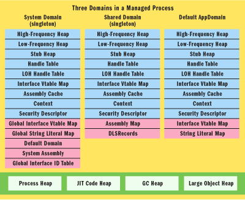
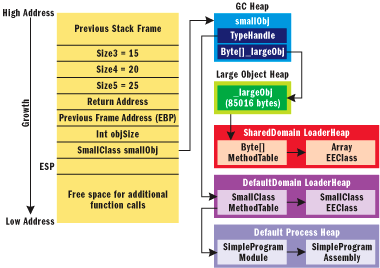

# 深入探索.NET框架内部了解CLR如何创建运行时对象
随着通用语言运行时（ CLR ）即将成为在 Windows® 下开发应用程序的首选架构，对其进行深入理解会帮助你建立有效的工业强度的应用程序。在本文中，我们将探索 CLR 内部，包括：对象实例布局、方法表布局、方法分派、基于接口的分派和不同的数据结构。

我们将使用 C# 编写简单的**代码** 示例，以便任何固有的语言语法含义是 C# 的缺省定义。某些此处讨论的数据结构和算法可能会在 Microsoft® .NET Framework 2.0 中改变，但是主要概念应该保持不变。我们使用 Visual Studio® .NET 2003 调试器和调试器扩展 Son of Strike (SOS) 来查看本文讨论的数据结构。 SOS 理解 CLR 的内部数据结构并输出有用信息。请参考 “Son of Strike” 补充资料，了解如何将 SOS.dll 装入 Visual Studio .NET 2003 调试器的进程空间。本文中，我们将描述在共享**源代码** CLI （ Shared Source CLI ， SSCLI ）中有相应实现的类，在我们开始前，请注意：本文提供的信息只对在 X86 平台上运行的 .NET Framework 1.1 有效（对于 Shared Source CLI 1.0 也大部分适用，只是在某些交互操作的情况下必须注意例外），对于 .NET Framework 2.0 会有改变，所以请不要在构建**软件** 时依赖于这些内部结构的不变性。

**CLR** **启动程序（** **Bootstrap** **）创建的域**

在 CLR 执行托管代码的第一行代码前，会创建三个应用程序域。其中两个对于托管代码甚至 CLR 宿主程序（ CLR hosts ）都是不可见的。它们只能由 CLR 启动进程创建，而提供 CLR 启动进程的是 shim——mscoree.dll 和 mscorwks.dll ( 在多处理器系统下是 mscorsvr.dll) 。正如**图** **2** 所示，这些域是系统域（ System Domain ）和共享域（ Shared Domain ），都是使用了单件（ Singleton ）模式。第三个域是缺省应用程序域（ Default AppDomain ），它是一个 AppDomain 的实例，也是唯一的有命名的域。对于简单的 CLR 宿主程序，比如控制台程序，默认的域名由可执行映象文件的名字组成。其它的域可以在托管代码中使用 AppDomain.CreateDomain 方法创建，或者在非托管的代码中使用 ICORRuntimeHost 接口创建。复杂的宿主程序，比如 ASP.NET ，对于特定的网站会基于应用程序的数目创建多个域。

**图** **2**  由 CLR 启动程序创建的域

**系统域（** **System Domain** **）**

系统域负责创建和初始化共享域和默认应用程序域。它将系统库 mscorlib.dll 载入共享域，并且维护进程范围内部使用的隐含或者显式字符串符号。

字符串驻留（ string interning ）是 .NET Framework 1.1 中的一个优化特性，它的处理方法显得有些笨拙，因为 CLR 没有给程序集机会选择此特性。尽管如此，由于在所有的应用程序域中对一个特定的符号只保存一个对应的字符串，此特性可以节省内存空间。

系统域还负责产生进程范围的接口 ID ，并用来创建每个应用程序域的接口虚表映射图（ InterfaceVtableMaps ）的接口。系统域在进程中保持跟踪所有域，并实现加载和卸载应用程序域的功能。

**共享域（** **Shared Domain** **）**

所有不属于任何特定域的代码被加载到系统库 SharedDomain.Mscorlib ，对于所有应用程序域的用户代码都是必需的。它会被自动加载到共享域中。系统命名空间的基本类型，如 Object, ValueType, Array, Enum, String, and Delegate 等等，在 CLR 启动程序过程中被预先加载到本域中。用户代码也可以被加载到这个域中，方法是在调用 CorBindToRuntimeEx 时使用由 CLR 宿主程序指定的 LoaderOptimization 特性。控制台程序也可以加载代码到共享域中，方法是使用 System.LoaderOptimizationAttribute 特性声明 Main 方法。共享域还**管理** 一个使用基地址作为索引的程序集映射图，此映射图作为管理共享程序集依赖关系的查找表，这些程序集被加载到默认域（ DefaultDomain ）和其它在托管代码中创建的应用程序域。非共享的用户代码被加载到默认域。

**默认域（** **Default Domain** **）**

默认域是应用程序域（ AppDomain ）的一个实例，一般的应用程序代码在其中运行。尽管有些应用程序需要在运行时创建额外的应用程序域（比如有些使用插件， plug-in ，架构或者进行重要的运行时代码生成工作的应用程序），大部分的应用程序在运行期间只创建一个域。所有在此域运行的代码都是在域层次上有上下文限制。如果一个应用程序有多个应用程序域，任何的域间访问会通过 .NET Remoting 代理。额外的域内上下文限制信息可以使用 System.ContextBoundObject 派生的类型创建。每个应用程序域有自己的安全描述符（ SecurityDescriptor ），安全上下文（ SecurityContext ）和默认上下文（ DefaultContext ），还有自己的加载器堆（高频堆，低频堆和代理堆），句柄表，接口虚表管理器和程序集缓存。

**加载器堆（** **Loader Heaps** **）**

加载器堆的作用是加载不同的运行时 CLR 部 件和优化在域的整个生命期内存在的部件。这些堆的增长基于可预测块，这样可以使碎片最小化。加载器堆不同于垃圾回收堆（或者对称多处理器上的多个堆），垃 圾回收堆保存对象实例，而加载器堆同时保存类型系统。经常访问的部件如方法表，方法描述，域描述和接口图，分配在高频堆上，而较少访问的数据结构如 EEClass 和类加载器及其查找表，分配在低频堆。代理堆保存用于代码访问**安全性** （ code access security ， CAS ）的代理部件，如 COM 封装调用和平台调用（ P/Invoke ）。

从高层次了解域后，我们准备看看它们在一个简单的应用程序的上下文中的物理细节，见图 3 。我们在程序运行时停在 mc.Method1() ，然后使用 SOS 调试器扩展命令 DumpDomain 来输出域的信息。。这里是编辑后的输出：

~~~text
!DumpDomain

System Domain: 793e9d58, LowFrequencyHeap: 793e9dbc,

HighFrequencyHeap: 793e9e14, StubHeap: 793e9e6c,

Assembly: 0015aa68 [mscorlib], ClassLoader: 0015ab40

Shared Domain: 793eb278, LowFrequencyHeap: 793eb2dc,

HighFrequencyHeap: 793eb334, StubHeap: 793eb38c,

Assembly: 0015aa68 [mscorlib], ClassLoader: 0015ab40

Domain 1: 149100, LowFrequencyHeap: 00149164,

HighFrequencyHeap: 001491bc, StubHeap: 00149214,

Name: Sample1.exe, Assembly: 00164938 [Sample1],

ClassLoader: 00164a78
~~~

我们的控制台程序， Sample1.exe ，被加载到一个名为 “Sample1.exe” 的应用程序域。 Mscorlib.dll 被加载到共享域，不过因为它是核心系统库，所以也在系统域中列出。每个域会分配一个高频堆，低频堆和代理堆。系统域和共享域使用相同的类加载器，而默认应用程序使用自己的类加载器。

输出没有显示加载器堆的保留尺寸和已提交尺寸。高频堆的初始化大小是 32KB ，每次提交 4KB 。 SOS 的输出也没有显示接口虚表堆（ InterfaceVtableMap ）。每个域有一个接口虚表堆（简称为 IVMap ），由自己的加载器堆在域初始化阶段创建。 IVMap 保留大小是 4KB ，开始时提交 4KB 。我们将会在后续部分研究类型布局时讨论 IVMap 的意义。

**图** **2** 显示默认的进程堆， JIT 代码堆， GC 堆（用于小对象）和大对象堆（用于大小等于或者超过 85000 字节的对象），它说明了这些堆和加载器堆的语义区别。即时（ just-in-time ， JIT ）编译器产生 x86 指令并且保存到 JIT 代码堆中。 GC 堆和大对象堆是用于托管对象实例化的垃圾回收堆。

**类型原理**

类型是 .NET **编程** 中的基本单元。在 C# 中，类型可以使用 class ， struct 和 interface 关键字进行声明。大多数类型由**程序员** 显式创建，但是，在特别的交互操作（ interop) 情形和远程对象调用（ .NET Remoting ）场合中， .NET CLR 会隐式的产生类型，这些产生的类型包含 COM 和运行时可调用封装及传输代理（ Runtime Callable Wrappers and Transparent Proxies ）。

我们通过一个包含对象引用的栈开始研究 .NET 类型原理（典型地，栈是一个对象实例开始生命期的地方）。**图** **4** 中显示的代码包含一个简单的程序，它有一个控制台的入口点，调用了一个静态方法。 Method1 创建一个 SmallClass 的类型实例，该类型包含一个字节数组，用于演示如何在大对象堆创建对象。尽管这是一段无聊的代码，但是可以帮助我们进行讨论。

**图** **5** 显示了停止在 Create 方法 “return smallObj;” 代码行断点时的 fastcall 栈结构（ fastcall 时 .NET 的调用规范，它说明在可能的情况下将函数参数通过寄存器传递，而其它参数按照从右到左的顺序入栈，然后由被调用函数完成出栈操作）。本地值类型变量 objSize 内含在栈结构中。引用类型变量如 smallObj 以固定大小（ 4 字节 DWORD ）保存在栈中，包含了在一般 GC 堆中分配的对象的地址。对于传统 C++ ，这是对象的指针；在托管世界中，它是对象的引用。不管怎样，它包含了一个对象实例的地址，我们将使用术语对象实例（ ObjectInstance ）描述对象引用指向地址位置的数据结构。

  
 图** **5** SimpleProgram 的栈结构和堆

一般 GC 堆上的 smallObj 对象实例包含一个名为 \_largeObj 的字节数组（注意，图中显示的大小为 85016 字节，是实际的存贮大小）。 CLR 对大于或等于 85000 字节的对象的处理和小对象不同。大对象在大对象堆（ LOH ）上分配，而小对象在一般 GC 堆上创建，这样可以优化对象的分配和回收。 LOH 不会压缩，而 GC 堆在 GC 回收时进行压缩。还有， LOH 只会在完全 GC 回收时被回收。

smallObj 的对象实例包含类型句柄（ TypeHandle ），指向对应类型的方法表。每个声明的类型有一个方法表，而同一类型的所有对象实例都指向同一个方法表。它包含了类型的特性信息（接口，抽象类，具体类， COM 封装和代理），实现的接口数目，用于接口分派的接口图，方法表的槽（ slot ）数目，指向相应实现的槽表。

方法表指向一个名为 EEClass 的重要数据结构。在方法表创建前， CLR 类加载器从元数据中创建 EEClass 。图 4 中， SmallClass 的方法表指向它的 EEClass 。这些结构指向它们的模块和程序集。方法表和 EEClass 一般分配在共享域的加载器堆。加载器堆和应用程序域关联，这里提到的数据结构一旦被加载到其中，就直到应用程序域卸载时才会消失。而且，默认的应用程序域不会被卸载，所以这些代码的生存期是直到 CLR 关闭为止。

**对象实例**

正如我们说过的，所有值类型的实例或者包含在线程栈上，或者包含在 GC 堆上。所有的引用类型在 GC 堆或者 LOH 上创建。图 6 显示了一个典型的对象布局。一个对象可以通过以下途径被引用：基于栈的局部变量，在交互操作或者平台调用情况下的句柄表，寄存器（执行方法时的 this 指针和方法参数），拥有终结器（ finalizer ）方法的对象的终结器队列。 OBJECTREF 不是指向对象实例的开始位置，而是有一个 DWORD 的偏移量（ 4 字节）。此 DWORD 称为对象头，保存一个指向 SyncTableEntry 表的索引（从 1 开始计数的 syncblk 编号。因为通过索引进行连接，所以在需要增加表的大小时， CLR 可以在内存中移动这个表。 SyncTableEntry 维护一个反向的弱引用，以便 CLR 可以跟踪 SyncBlock 的所有权。弱引用让 GC 可以在没有其它强引用存在时回收对象。 SyncTableEntry 还保存了一个指向 SyncBlock 的指针，包含了很少需要被一个对象的所有实例使用的有用的信息。这些信息包括对象锁，哈希编码，任何转换层 (thunking) 数据和应用程序域的索引。对于大多数的对象实例，不会为实际的 SyncBlock 分配内存，而且 syncblk 编号为 0 。这一点在执行线程遇到如 lock(obj) 或者 obj.GetHashCode 的语句时会发生变化，如下所示：
~~~cs
SmallClass bj = new SmallClass()

// Do some work here

lock(obj) { /* Do some synchronized work here */ }

obj.GetHashCode();
~~~

在以上代码中， smallObj 会使用 0 作为它的起始的 syncblk 编号。 lock 语句使得 CLR 创建一个 syncblk 入口并使用相应的数值更新对象头。因为 C# 的 lock 关键字会扩展为 try-finally 语句并使用 Monitor 类，一个用作同步的 Monitor 对象在 syncblk 上创建。堆 GetHashCode 的调用会使用对象的哈希编码增加 syncblk 。

在 SyncBlock 中有其它的域，它们在 COM 交互操作和封送委托（ marshaling delegates ）到非托管代码时使用，不过这和典型的对象用处无关。

类型句柄紧跟在对象实例中的 syncblk 编号后。为了保持连续性，我会在说明实例变量后讨论类型句柄。实例域（ Instance field ）的变量列表紧跟在类型句柄后。默认情况下，实例域会以内存最有效使用的方式排列，这样只需要最少的用作对齐的填充字节。图 7 的代码显示了 SimpleClass 包含有一些不同大小的实例变量。

图 8 显示了在 Visual Studio 调试器的内存窗口中的一个 SimpleClass 对象实例。我们在图 7 的 return 语句处设置了断点，然后使用 ECX 寄存器保存的 simpleObj 地址在内存窗口显示对象实例。前 4 个字节是 syncblk 编号。因为我们没有用任何同步代码使用此实例（也没有访问它的哈希编码）， syncblk 编号为 0 。保存在栈变量的对象实例，指向起始位置的 4 个字节的偏移处。字节变量 b1,b2,b3 和 b4 被一个接一个的排列在一起。两个 short 类型变量 s1 和 s2 也被排列在一起。字符串变量 str 是一个 4 字节的 OBJECTREF ，指向 GC 堆中分配的实际的字符串实例。字符串是一个特别的类型，因为所有包含同样文字符号的字符串，会在程序集加载到进程时指向一个全局字符串表的同一实例。这个过程称为字符串驻留（ string interning ），设计目的是优化内存的使用。我们之前已经提过，在 NET Framework 1.1 中，程序集不能选择是否使用这个过程，尽管未来版本的 CLR 可能会提供这样的能力。

所以默认情况下，成员变量在源代码中的词典顺序没有在内存中保持。在交互操作的情况下，词典顺序必须被保存到内存中，这时可以使用 StructLayoutAttribute 特性，它有一个 LayoutKind 的枚举类型作为参数。 LayoutKind.Sequential 可以为被封送（ marshaled ）数据保持词典顺序，尽管在 .NET Framework 1.1 中，它没有影响托管的布局（但是 .NET Framework 2.0 可能会这么做）。在交互操作的情况下，如果你确实需要额外的填充字节和显示的控制域的顺序， LayoutKind.Explicit 可以和域层次的 FieldOffset 特性一起使用。

看完底层的内存内容后，我们使用 SOS 看看对象实例。一个有用的命令是 DumpHeap ，它可以列出所有的堆内容和一个特别类型的所有实例。无需依赖寄存器， DumpHeap 可以显示我们创建的唯一一个实例的地址。
~~~text

!DumpHeap -type SimpleClass

Loaded Son of Strike data table version 5 from

"C:"WINDOWS"Microsoft.NET"Framework"v1.1.4322"mscorwks.dll"

 Address       MT     Size

00a8197c 00955124       36

Last good object: 00a819a0

total 1 objects

Statistics:

      MT    Count TotalSize Class Name

 955124        1        36 SimpleClass
~~~

对象的总大小是 36 字节，不管字符串多大， SimpleClass 的实例只包含一个 DWORD 的对象引用。 SimpleClass 的实例变量只占用 28 字节，其它 8 个字节包括类型句柄（ 4 字节）和 syncblk 编号（ 4 字节）。找到 simpleObj 实例的地址后，我们可以使用 DumpObj 命令输出它的内容，如下所示：

~~~text
!DumpObj 0x00a8197c

Name: SimpleClass

MethodTable 0x00955124

EEClass 0x02ca33b0

Size 36(0x24) bytes

FieldDesc*: 00955064

      MT    Field   Offset                 Type       Attr    Value Name

00955124 400000a        4         System.Int64   instance      31 l1

00955124 400000b        c                CLASS   instance 00a819a0 str

    << some fields omitted from the display for brevity >>

00955124 4000003       1e          System.Byte   instance        3 b3

00955124 4000004       1f          System.Byte   instance        4 b4
~~~

正如之前说过， C# 编译器对于类的默认布局使用 LayoutType.Auto （对于结构使用 LayoutType.Sequential ）；因此类加载器重新排列实例域以最小化填充字节。我们可以使用 ObjSize 来输出包含被 str 实例占用的空间，如下所示：
~~~text

!ObjSize 0x00a8197c

sizeof(00a8197c) =       72 (    0x48) bytes (SimpleClass)
~~~
如果你从对象图的全局大小（ 72 字节）减去 SimpleClass 的大小（ 36 字节），就可以得到 str 的大小，即 36 字节。让我们输出 str 实例来验证这个结果：
~~~text

!DumpObj 0x00a819a0

Name: System.String

MethodTable 0x009742d8

EEClass
~~~