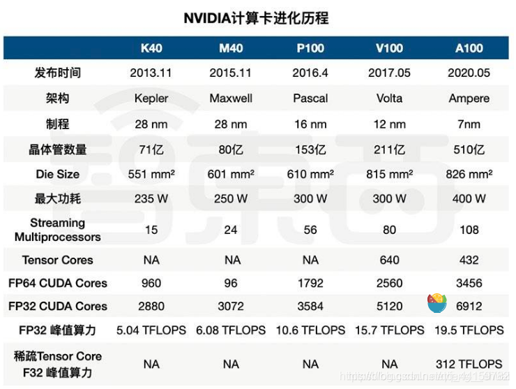
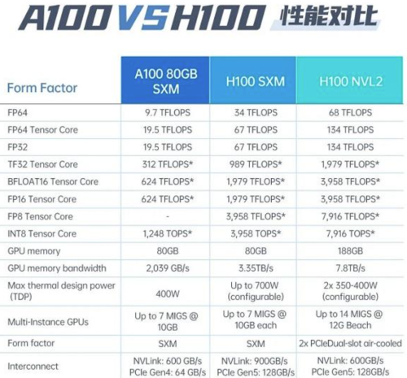
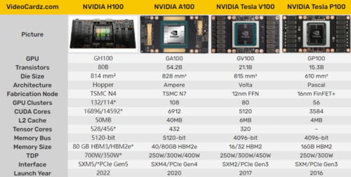
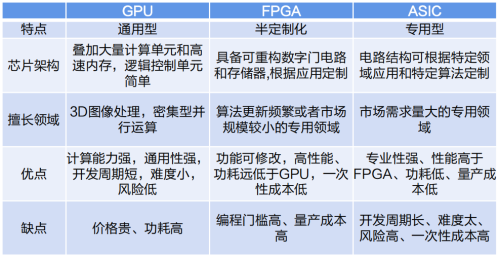

# NVIDIA显卡及架构介绍
# 一、NVIDIA显卡系列：

1.  Tegra: 手机和嵌入式设备用的（了解即可）
2.  GeForce： 显示器用的，比如电脑的显卡
3.  Quadro： 专业绘图
4.  Tesla: 大规模计算，比如深度学习训练

主要关注GeForce和Tesla，GeForce日常用，Tesla计算专用卡。

# 二、架构排序（时间顺序）：

Tesla（特斯拉）: 市面已经没有相关显卡  
Fermi（费米）：GeForce 400, 500, 600, GT-630  
Kepler（开普勒）：Tesla K40/K80, GeForce 700, GT-730  
Maxwell（麦克斯韦尔）: Tesla/Quadro M series GeForce 900, GTX-970  
Pascal（帕斯卡）: Tesla p100,GTX 1080, GTX 1070, GTX 1060  
Votal（伏打）: Tesla V100, GTX 1180  
Turing（图灵）: T4,GTX 1660 Ti, RTX 2060  
Ampere（安培）: A100

| 架构 | Tesla | Fermi | Kepler | Maxcell | Pascall | Volta | Turing |
| --- | --- | --- | --- | --- | --- | --- | --- |
| GPU时代 | 1.0 | 2.0 | 3.0 | 5.0 | 6.0 | 7.0 | 7.5 |
| 时间 | 2008 | 2010 | 2012 | 2014 | 2016 | 2017 | 2018 |

  
描述GPU有两个指标，一个是CUDA的核心数量，第二个是内存大小，在评估时主要考虑峰值计算性能和内存带宽，一般核心数量越多，TFlops越大，效果越好，在选购显卡的时候要首先根据用途选择对应的系列，然后看相应的计算性能和内存。

# 三、 GPU指标
   描述GPU有两个指标，一个是CUDA的核心数量，第二个是内存大小，
   在评估时主要考虑峰值计算性能和内存带宽，一般核心数量越多，TFlops越大，效果越好，
   在选购显卡的时候要首先根据用途选择对应的系列，然后看相应的计算性能和内存。

算力：  
算力包含一个大版本x和一个小版本y, 一块显卡的算力的表示就是x.y, x其实就是代表着显卡的架构, y代表这基于这个架构一些增量优化，比如7.5就是基于volta的架构优化的，最后命名为turing架构。

| x.y |   架构   |
| --- | ------- |
| 1.0 | Tesla   |
| 2.0 | Fermi   |
| 3.0 | Kepler  |
| 4.0 | –       |
| 5.0 | Maxwell |
| 6.0 | Pascal  |
| 7.0 | Volta   |
| 7.5 | Turing  |
| 8.0 | Ampere  |

**三、英伟达大模型训练GPU全系列介绍**

自OpenAI发布ChatGPT以来，生成式人工智能技术一直是备受关注的热门趋势。这项技术需要强大的算力来生成文本、图像、视频等内容。在这个背景下，算力成为人工智能领域的必备条件，而英伟达作为芯片巨头所生产的人工智能芯片在其中扮演着至关重要的角色。英伟达先后推出V100、A100和H100等多款用于AI训练的芯片，并为了符合美国标准，推出了A800和H800这两款带宽缩减版产品，在中国大陆市场销售。

V100是英伟达公司推出的高性能计算和人工智能加速器，属于Volta架构系列。它采用16nm FinFET工艺，拥有5120个CUDA核心和16GB到32GB的HBM2显存。V100还配备Tensor Cores加速器，可提供高达120倍的深度学习性能提升。此外，V100支持NVLink技术，实现高速的GPU到GPU通信，加速大规模模型的训练速度。V100被广泛应用于各种大规模AI训练和推理场景，包括自然语言处理、计算机视觉和语音识别等领域。

A100是英伟达推出的一款强大的数据中心GPU，采用全新的Ampere架构。它拥有高达6,912个CUDA核心和40GB的高速HBM2显存。A100还包括第二代NVLink技术，实现快速的GPU到GPU通信，提升大型模型的训练速度。此外，A100还支持英伟达自主研发的Tensor Cores加速器，可提供高达20倍的深度学习性能提升。A100广泛应用于各种大规模AI训练和推理场景，包括自然语言处理、计算机视觉和语音识别等领域。

在大模型训练中，V100和A100都是非常强大的GPU。以下是它们的主要区别和优势：

**1、架构**

V100和A100在架构上有所不同。V100采用Volta架构，而A100则采用全新的Ampere架构。Ampere架构相对于Volta架构进行一些改进，包括更好的能源效率和全新的Tensor Core加速器设计等，这使得A100在某些场景下可能表现出更出色的性能。

**2、计算能力**

A100配备高达6,912个CUDA核心，比V100的5120个CUDA核心更多。这意味着A100可以提供更高的每秒浮点运算数(FLOPS)和更大的吞吐量，从而在处理大型模型和数据集时提供更快的训练速度。

**3、存储带宽**

V100的内存带宽约为900 GB/s，而A100的内存带宽达到了更高的1555 GB/s。高速内存带宽可以降低数据传输瓶颈，提高训练效率，因此A100在处理大型数据集时可能表现更出色。

**4、存储容量**

V100最高可拥有32GB的HBM2显存，而A100最高可拥有80GB的HBM2显存。由于大模型通常需要更多内存来存储参数和梯度，A100的更大内存容量可以提供更好的性能。

**5、通信性能**

A100支持第三代NVLink技术，实现高速的GPU到GPU通信，加快大模型训练的速度。此外，A100还引入Multi-Instance GPU (MIG)功能，可以将单个GPU划分为多个相互独立的实例，进一步提高资源利用率和性能。

总的来说，A100在处理大型模型和数据集时可能比V100表现更优秀，但是在实际应用中，需要结合具体场景和需求来选择合适的GPU。

据数据显示，2022年我国的AI服务器中，GPU服务器占据89%的份额。目前，GPU是最广泛应用的AI芯片之一。除了GPU，AI芯片还包括现场可编程门阵列（FPGA）、专用集成电路（ASIC）和神经拟态芯片（NPU）等。GPU是一种通用型芯片，而ASIC是一种专用型芯片，而FPGA则处于两者之间，具有半定制化的特点。

