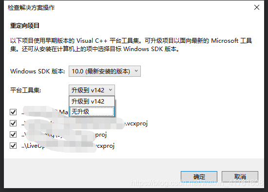

vs平台工具集介绍，vc6~vs2019各IDE对应的工具集版本

[开发工具](https://blog.csdn.net/weixin_41761608/category_9719152.html "开发工具")

4 篇文章0 订阅

订阅专栏

## 一、什么是平台工具集：

1.  平台工具集其实是MSBuild
2.  其目录所在C:\\Program Files (x86)\\MSBuild\\Microsoft.Cpp\\v4.0。
3.  VS从2010之后开始支持使用之前的版本进行编译，可以在工程属性->常规中进行设置。  
    

> VS各版本对应的工具集版本号如下：  
> \-Visual Studio 2019: V142  
> \-Visual Studio 2017: V141  
> \-Visual Studio 2015: V140  
> \-Visual Studio 2013: V120  
> \-Visual Studio 2012: V110  
> \-Visual Studio 2010: V100  
> \-Visual Studio 2008: V90  
> \-Visual Studio 2005: V80  
> \-Visual Studio 2003: V71  
> \-Visual Studio 2002: V70  
> \-Visual Studio 6: V60

## 二、单独安装平台工具集

### 2.1 场景

我现在电脑只安装了vs2019开发环境，也就是我只有v142版本的工具集。如果我想打开vs2017或者vs2015版本的项目，怎么办？第一种方法就是升级平台工具集，然鹅这种方法对项目的改动比较大，如果项目中有很多依赖项，往往会因为主工程和依赖库版本不匹配，导致编译不过，不建议。另一种方法就是保持工具集版本不动。

### 2.2 方法

1.  利用visual studio 2019 installer安装vs2017,2015对应的工具集  
    运行installer，“单个组件”->“编译器、生成器和运行时”，找到`v140-vs2015 C++生成工具`、`v141-vs2017 C++`生成工具，勾选上，点击"修改"。  
    

2.  用vs2019打开15或者17项目时，会提示"重定向项目"，平台工具集选"无升级"，这样就是用老的工具集。项目名称后会有个括号，如下图。  
    

3.  安装好对应的工具集后，在项目属性页可以看到相应的选项。  
    

### 2.3 注意

我电脑上只安装了vs2019，并且2019 installer里面只找到了2017,2015的工具集，如果需要更早的vs2012,2010对应的工具集，除了安装对应的IDE我暂时也不知道有什么办法。

### 2.4 MSBuild

MSBuild 是 Microsoft 和 Visual Studio的生成系统，它**不仅仅是一个构造工具**，应该称之为拥有相当强大扩展能力的自动化平台，MSBuild平台的主要涉及到三部分：执行引擎、构造工程、任务。普通用户用不到是可以删除的。

**扩展资料：**

MSBuild 引入了一种新的基于 XML 的项目文件格式，这种格式容易理解、易于扩展并且完全受 Microsoft 支持。

MSBuild 项目文件的格式使开发人员能够充分描述哪些项需要生成，以及如何利用不同的平台和配置生成这些项。

另外，项目文件的格式还使开发人员能够创作可重用的生成规则，这些规则可以分解到不同的文件中，以便可以在产品内的不同项目之间一致地执行生成。以下各节描述了 MSBuild 项目文件格式的一些基本要素。

MSBuild 编译后生成的是.exe 可执行文件，但却不能生成.msi 安装包文件。如果想要使用MSBuild 生成安装包文件，还需要借助WiX编辑一个wxs类型的工程。