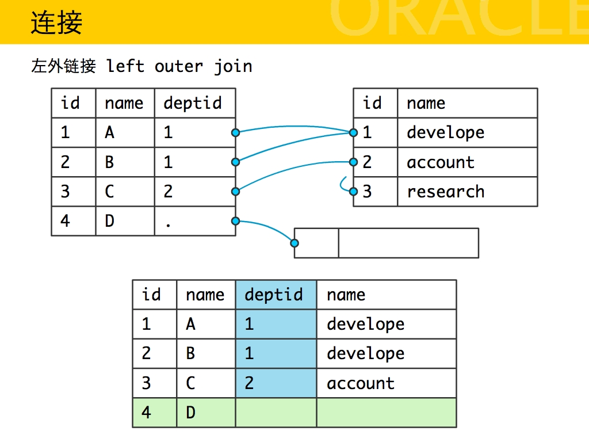
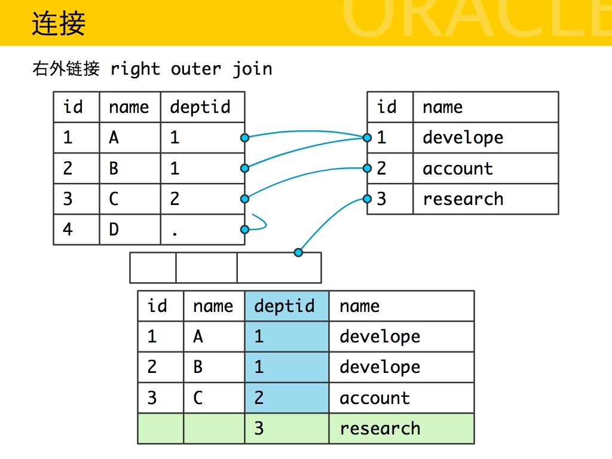
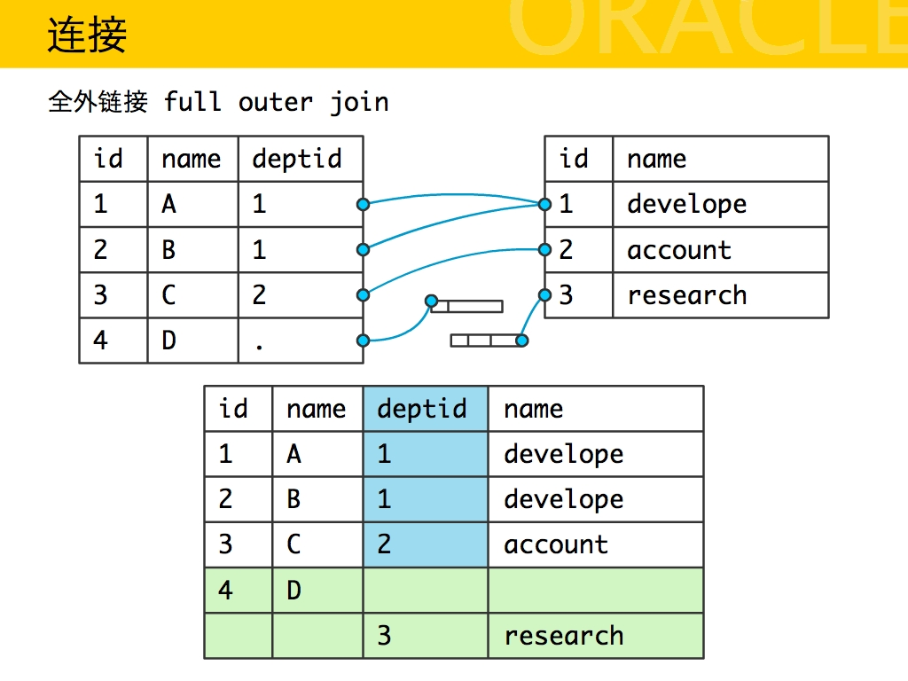
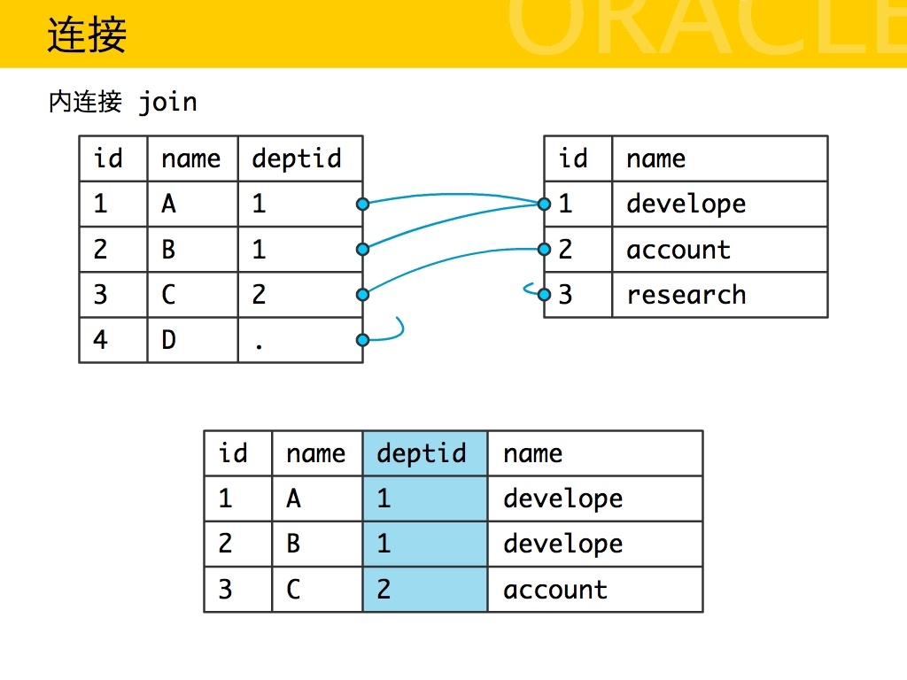

# Power BI
**Power BI**微软基于Excel开发的相关BI插件，包括：Power Query，PowerPrivot,Power View和Power Map等。

**Power BI**是整合了Power Query，PowerPrivot,Power View和Power Map等一系列工具的成果，同时新版本的Excel 2016也提供了Power BI插件
**Power BI特点**
1. Any Data：Power BI已经支持各种数据源，包括文件(如Excel，CSV，XML，Json，文本等，还支持文件夹)，数据库(常见的关系型数据库如Access，MSSQL，Oracle，DB2，Mysql等等)，还有各种微软云数据库，其他外部数据源（如R脚本，Hadoop文件，Web等等）；　　
2. Anywhere：除了Power Desktop（一个桌面版开发环境）可以进行编辑和发布报表，微软还有在线版编辑工具。同时，也有针对手机端的Power BI Mobile，涵盖WP，Android和苹果三大平台。

# 数据库
## 常见功能
| 功能 |  增  |  删  |  改  |  查  | 其他 |
| ---- | --- | --- | --- | --- | ---- |
DDL |create |drop |alter |list|grant database table view index assertion domain schema
DML |insert into |delete |update |select
DCL |||||COMMIT / ROLLBACK GRANT / REVOKE

**grant 语句是DDL和DCL的一部分**
+ 当在create schema 语句中使用时，grant的作用是DDL语句。
+ 当在架构顶以外给与用户（或用户组）额外的权限时，其作用是DCL语句。

SET IDENTITY\_INSERT table\_name ON 可以在IDENTITY 列中添加数据，只要保证NOT NULL UNIQUE既可

## 常见约束constraint
*   Primary Key
*   Unique
*   Foreign Key
*   Not Null
*   check
## TempDB
1. 使用TempDB的好处是用户对TempDB对象（表、视图、索引等）执行的操作都不计入日志，这样就会快一些
2. \# TableName 本地临时表
3. \#\#TableName 全局临时表 
4. @VarName 局部变量（本地变量） 
5. @@Var\_Name 全局变量
6. Null 加减乘除 任何数据 结果均为 NULL
7. MSSQLServer 的 TempDB数据库，在启动时创建。用于存放临时表、临时表数据和临时的用户创建的全局变量等。同时，用户也可以使用此数据库。

Alter Table
add \[column\_definition\]
alter column
drop column\_name

# 连接
## union union all
*  UNION去重且排序
*  UNION ALL不去重不排序
>  对重复结果的处理：UNION在进行表链接后会筛选掉重复的记录，Union All不会去除重复记录。
 对排序的处理：Union将会按照字段的顺序进行排序；UNION ALL只是简单的将两个结果合并后就返回。
* 据上：UNION ALL比UNION快很多

+ **where**  先筛选，再Group By；即对group by 以前的数据筛选
+ **Having** 先group by，再筛选；即对group by 以后的数据进行筛选
> SELECT Customer,SUM(OrderPrice) FROM Orders GROUP BY Customer where Custome = 'zhangsan' and HAVING SUM(OrderPrice)<2000

## 数据库内连接外连接等总结

