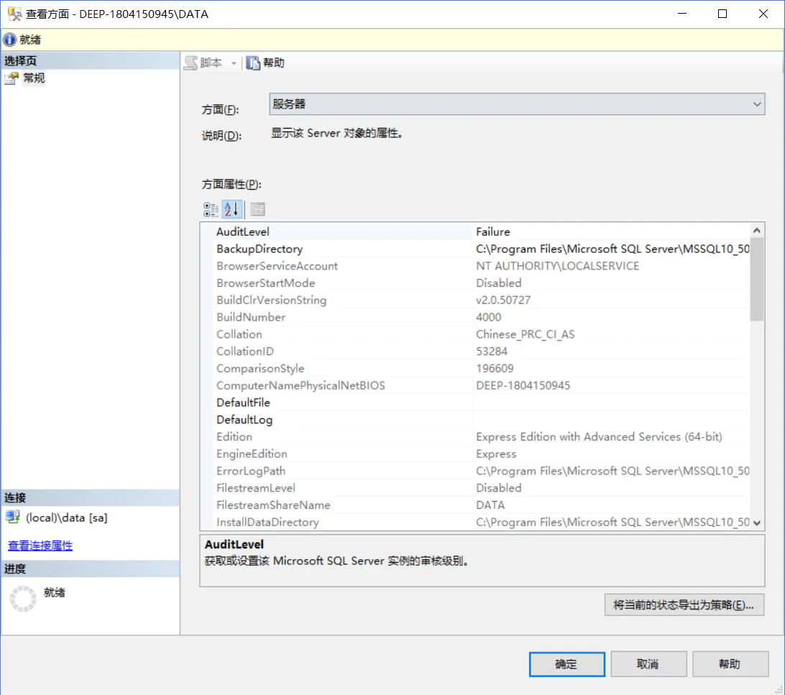
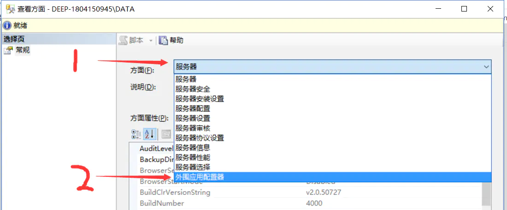
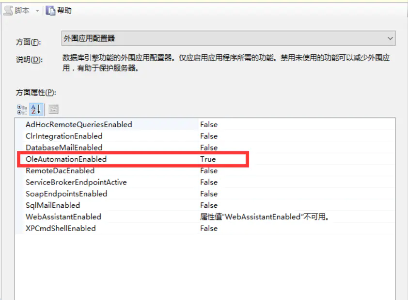
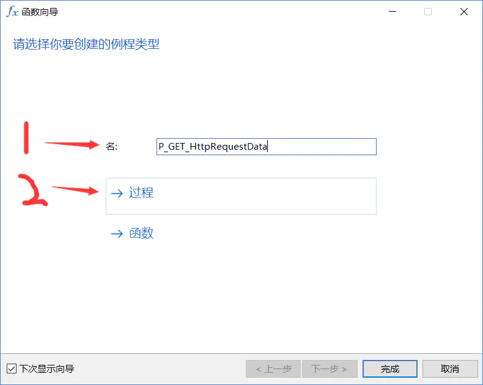
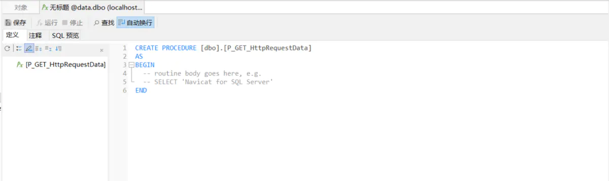
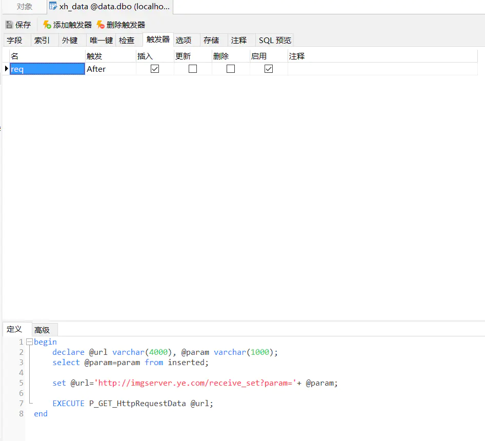

遇到一个业务情况，需要在数据库获得插入数据的时候，将数据转发到指定的url。  
使用的sqlserver为SQL Server2008 R2 x64

**一. 打开sqlserver自带的SQL Server Management管理工具**


SQL Server Management

**二. 右键目标实例，在菜单里选择‘方面’**



查看方面

选择外围应用配置器



常规

将这一行设置为true



外围应用配置器

**三. 利用Navicat for sqlserver 工具连接数据库，选择函数选项->新建函数，然后填入新建函数名称‘P\_GET\_HttpRequestData’，选择过程。**


目标实例



新建函数向导



函数定义界面

在函数定义界面输入以下代码：

```dart

CREATE PROCEDURE [dbo].[P_GET_HttpRequestData](

    @URL varchar(500),

    @status int=0 OUT

)

AS

BEGIN

    DECLARE @object int,

    @errSrc int

    /*初始化对*/

    declare @str nvarchar(200)

    declare @ResponseText nvarchar(200)

    EXEC @status = SP_OACreate 'Msxml2.ServerXMLHTTP.3.0', @object OUT;

    print '===================='

    print @object

    IF @status <> 0

    BEGIN

    EXEC SP_OAGetErrorInfo @object, @errSrc OUT

    RETURN

    END

    /*创建链接*/

    EXEC @status= SP_OAMethod @object,'open',NULL,'GET',@URL

    IF @status <> 0

    BEGIN

    EXEC SP_OAGetErrorInfo @object, @errSrc OUT

    RETURN

    END

    EXEC @status=SP_OAMethod @object,'setRequestHeader','Content-Type','application/x-www-form-urlencoded'

    /*发起请求*/

    EXEC @status= SP_OAMethod @object,'send',null

    print '--------------------------------'

    print @str

    print '--------------------------------'

    print @status

    IF @status <> 0

    BEGIN

    EXEC SP_OAGetErrorInfo @object, @errSrc OUT

    RETURN

    END

    Exec sp_OAMethod @Object, 'responseText', @ResponseText OUTPUT  --@ResponseText为http返回的内容

    Select @ResponseText   

    print @ResponseText

    Exec sp_OADestroy @Object

END;

```

然后Ctrl+S保存即可

**四. 在指定的数据表编写触发器调用刚刚的http请求函数**



定义触发器

```tsx
begin
        declare @url varchar(4000), @param varchar(1000);
        select @param=param from inserted;
        
        set @url='http://imgserver.ye.com/receive_set?param='+ @param;
        
        EXECUTE P_GET_HttpRequestData @url;
end
```

2人点赞

[PHP](/nb/50528266)

  
  
作者：hinsideout  
链接：https://www.jianshu.com/p/244c3cc30123  
来源：简书  
著作权归作者所有。商业转载请联系作者获得授权，非商业转载请注明出处。