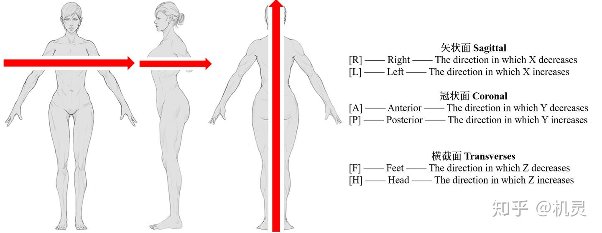
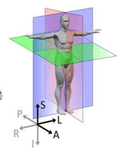
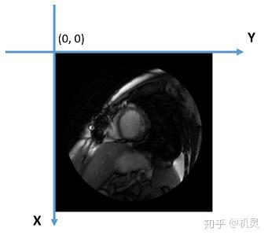
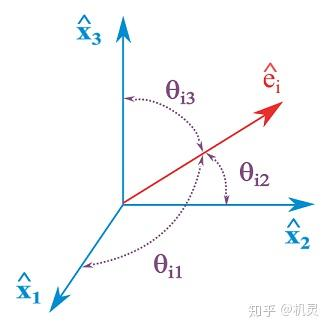
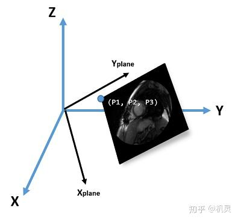
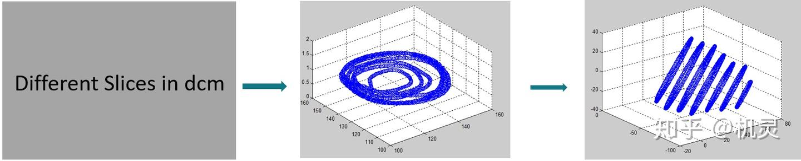

# ###DICOM文件坐标信息整理和转换
## DICOM定义

**医疗数位影像传输协定**（DICOM，**D**igital**I**maging and**Co**mmunications in**M**edicine）是一组通用的标准协定，在对于[医学影像](https://link.zhihu.com/?target=https%3A//zh.wikipedia.org/wiki/%25E9%2586%25AB%25E5%25AD%25B8%25E5%25BD%25B1%25E5%2583%258F)的处理、储存、打印、传输上。它包含了档案格式的定义及网络通信协定。DICOM是以[TCP/IP](https://link.zhihu.com/?target=https%3A//zh.wikipedia.org/wiki/TCP/IP%25E5%258D%258F%25E8%25AE%25AE)为基础的应用协定，并以TCP/IP联系各个系统。两个能接受DICOM格式的医疗仪器间，可借由DICOM格式的档案，来接收与交换影像及病人资料。\[1\]

  

## DICOM坐标系

从当前人体[MRI](https://zhida.zhihu.com/search?content_id=7083281&content_type=Article&match_order=1&q=MRI&zhida_source=entity)图像的头文件中分析发现，文件包含了一些比较有价值的坐标信息。包括**[解剖学坐标体系](https://zhida.zhihu.com/search?content_id=7083281&content_type=Article&match_order=1&q=%E8%A7%A3%E5%89%96%E5%AD%A6%E5%9D%90%E6%A0%87%E4%BD%93%E7%B3%BB&zhida_source=entity)**，**[图像坐标体系](https://zhida.zhihu.com/search?content_id=7083281&content_type=Article&match_order=1&q=%E5%9B%BE%E5%83%8F%E5%9D%90%E6%A0%87%E4%BD%93%E7%B3%BB&zhida_source=entity)**和**[参考坐标体系](https://zhida.zhihu.com/search?content_id=7083281&content_type=Article&match_order=1&q=%E5%8F%82%E8%80%83%E5%9D%90%E6%A0%87%E4%BD%93%E7%B3%BB&zhida_source=entity)**。

  

**解剖学坐标体系**



\[2\]

  

三个面是分别对应以上三个人体，垂直于红色矢量的平面。

**矢状面**：垂直于地面，左右分离人体，下图的红色平面。

**冠状面**：垂直于地面，前后分离人体，下图的紫色平面。

**横截面**：平行于地面，上下分离人体，下图的绿色平面。



\[3\]

**图像坐标体系**



图像坐标体系即通常生活中会用到的平面xy坐标。以左上角为(0, 0)原点，向右为y轴正向，向下为x轴正向。

  

**参考坐标体系**

**参考坐标体系**即**Reference Coordinate System(RCS)**。也是后续在坐标转换时候的目标坐标系，其符合各个对象实例之间的相对空间关系，功能近似于解剖学坐标体系。

  

## 坐标转换

**需求**

已知**磁共振**成像（**Magnetic Resonance Imaging**，简称**MRI**）在同一时刻得到的只有单个切面的一张图。如果在已有当前部位（比如说心脏）各个深度的dicom图像之后，想要构造完整的三维模型，就需要把当前图像都转换到统一的坐标系下之后再进行重建。

  

**输入**

数据前期处理部分略过，轮廓检测部分略过，这里主要整理的是坐标系转换的过程和对应的函数(matlab)。

在这个过程中，DICOM头文件里面包含的有用信息包括：

*   **ImageOrientationPatient**：六元double数组。用来表示，在RCS坐标系下，当前图像平面的xy轴（记为x\_plane和y\_plane）方向单位长度的终点坐标。换句话说，是当前图像平面xy轴在RCS坐标系下的方向余弦。以下图为例，x\_plane的方向余弦分别是θx1, θx2, θx3。y\_plane的方向余弦分别是θy1, θy2, θy3, 则该变量代表的含义即 \[θx1; θx2; θx3; θy1; θy2; θy3\]，维度是6 \* 1。



\[5\]

*   **ImagePositionPatient**：三元double数组。用于表示当前图像坐标的原点（左上角）在参考坐标体系下的坐标。具体见下图，主体XYZ坐标是参考坐标系，ImagePositionPatient即图中(P1, P2, P3)这个坐标，维度是3 \* 1。



*   **SliceThickness**：Double变量。通常称同一个部位，不同深度的MRI图像为不同的slice。SliceThickness用于表示相邻slice之间的距离，这个值在同一个对象的MRI图象中一般是一个定值。
*   **PixelSpacing**：二元Double数组。用来表示当前二维图像坐标上，xy轴的单位长度，在实际坐标系中所占据的长度。同样在同一个对象的MRI图象中一般是一个定值，并且xy方向相同。

  

**转换过程**

首先从当前已有的DICOM文件中提取出轮廓信息，离散化之后保存当前contour所有点的二维坐标。之后对每个slice的contour进行坐标转换。

  

*   转换函数

```matlab
function [pos] = xyz2rlapfh(x,y,z,ImageOrientation,ImagePosition,Resolution,SliceThickness)
%------------------------------------
% Converts from segment coordinate system to reference coordinate system.

% Calculate the z-axis perpendicular to the xy plane
  zdir = cross(...
    ImageOrientation(1:3),...
    ImageOrientation(4:6)); 

% from pixel distance to real distance
  x = (x(:)-1)*Resolution(1);
  y = (y(:)-1)*Resolution(2);
  z = (z(:)-1)*SliceThickness;
  
% position in patient coordinate system
  pos = repmat(ImagePosition,length(x),1)+...
    repmat(ImageOrientation(4:6),length(x),1).*repmat(x,1,3)+...
    repmat(ImageOrientation(1:3),length(x),1).*repmat(y,1,3)-... %minus!
    repmat(zdir,length(x),1).*repmat(z,1,3);    
```

  

*   从已经有的dcm文件中读取要用到的头文件信息。

```matlab
DCM =dicominfo(strcat(dcmPath,dcmName));
% get information from the dcm file
     ImageOrientation        =    DCM.ImageOrientationPatient';
     PixelSpacing            =    DCM.PixelSpacing;
     SliceThickness          =    DCM.SliceThickness;
     ImagePosition           =    DCM.ImagePositionPatient';
```

  

*   调用方式

```matlab
xyz2rlapfh(x,y,z,ImageOrientation,ImagePosition,PixelSpacing,SliceThickness);
```

  

**输出**



  

  

**Reference**

\[1\] [https://zh.wikipedia.org/wiki/DICOM](https://link.zhihu.com/?target=https%3A//zh.wikipedia.org/wiki/DICOM)

\[2\] [DICOM世界观●开篇 - CSDN博客](https://link.zhihu.com/?target=https%3A//blog.csdn.net/zssureqh/article/details/55804292)

\[3\] [Medical Image Process\_医学图像坐标系](https://link.zhihu.com/?target=http%3A//www.mamicode.com/info-detail-1235220.html)

\[4\] Eulerangles.svg，CC BY-SA 3.0，[File:Direction Cosine.svg](https://link.zhihu.com/?target=https%3A//commons.wikimedia.org/w/index.php%3Fcurid%3D17356318)

\[5\] Radau P, Lu Y, Connelly K, Paul G, Dick AJ, Wright GA. “Evaluation Framework for Algorithms Segmenting Short Axis Cardiac MRI.”*The MIDAS Journal*– Cardiac MR Left Ventricle Segmentation Challenge,[http://hdl.handle.net/10380/3070](https://link.zhihu.com/?target=http%3A//hdl.handle.net/10380/3070)

编辑于 2018-05-24 12:16