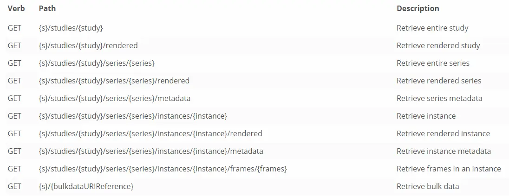

# ##DICOM3.0标准梳理
自1993年DICOM3.0首次发布后，DICOM标准不断的发展，每年都会进行多次扩充和修改。目前，DICOM标准共有22个章节，但是随着网络技术的发展，第9章和第13章节关于点对点连接传输的部分已被淘汰删除。

## 一、DICOM标准范畴：

**Part 1: 引言与概述（Introduction and Overview）:**

定义了文档中使用的属于以及对该标准中其他章节的概述。

**Part 2: 兼容性（Conformance）：**

定义了制造商描述其产品兼容性声明的要求。

**Part 3: 信息对象定义（Information Object Definitions）：**

定义了若干个信息对象类，包括普通型和复杂型，作为医疗现实中实体的抽象定义。

**Part 4: 服务类规范（Service Class Specifications）：**

定义多个服务类，所有DICOM功能都通过服务类的使用来实现。

**Part 5: 数据结构及编码（Data Structures and Encoding）：**

定义了构造DICOM消息中传递的数据集的编码规则。

**Part 6: 数据字典（Data Dictionary）：**

列出了DICOM标准中所有的数据元素定义。

**Part 7: 信息交换（Message Exchange）：**

定义了用于应用实体交换消息的服务和协议。

**Part 8: 消息交换的网络通讯支持（Network Communication Support for Message Exchange）：**

说明了DICOM实体之间在网络环境中通信服务和必要的上层协议的支持。这些服务和协议保证了应用实体之间有效地和正确地通过网络进行通信。DICOM中的网络环境包括OSI和TCP／IP两种参考模型，DICOM只是使用而不是实现这两类协议，因而具有通用性。

**Part 10: 用于介质交换的介质存储和文件格式（Media Storage and File Format for Media Interchange ）：**

详细说明了在可移除介质上存储医学成像信息的通用模型。

**Part 11: 介质存储应用概要（Media Storage Application Profiles）：**

规定了介质存储中应用选择机制和策略。

**Part 12: 用于介质交换的物理介质和介质格式（Media Formats and Physical Media for Media Interchange）：**

介绍存储过程中数据和目录的格式以及管理规范要求。其中较为关键的是DICOMDIR文件，它在图像的目录分类中起着重要作用。

**Part 14: 灰度图像的标准显示功能（Grayscale Standard Display Function）：**

详细规范了胶片打印及各种图像显示器材的显示参数。

**Part 15: 安全和系统管理概要（Security and System Management Profiles）：**

DICOM标准医疗图像中包含了病人非常详细的个人资料，因此为了保障在存储传输过程中数据的安全性，有必要对信 息实施加密传输。

**Part 16: 内容映射资源（Content Mapping Resource）：**

定义了DICOM信息对象的结构化文档模板和信息对象中使用的代码术语集。

**Part 17: 解释信息（Explanatory Information）：**

此部分包含解释信息的附录。

**Part 18: Web服务（Web Services）：**

此部分定义了通过使用HTTP URL／URI请求来访问DICOM对象的方式以及返回结果的格式。

**Part 19: 应用托管（Application Hosting）：**

定义了通过插件化程序的API访问格式。

**Part 20: 使用HL7l临床文档架构的成像报告（Imaging Reports using HL7 Clinical Document Architecture）：**

指定使用HL7的第二版CDA生成成像报告模板。

**Part 21: DICOM与其他格式之间的转换（Transformations between DICOM and other Representations）：**

说明了图像标注格式与NCI注释的转换。

**Part 22: 实时通讯（Real-Time Communication）：**

定义了视频流或音频流关联的DICOM元数据的实时传输服务。

DICOM3.0标准规定了医学影像格式和传输的众多细节，但是整个标准大致可分为两部分：

*   **DICOM文件格式**
    
*   **DICOM网络通讯协议**
    

## 二、DICOM文件格式：

我们在医院拍片检查的大致流程是通过医学设备生成DICOM文件，然后医生使用DICOM阅读器来阅读并对图像中发现的问题进行诊断，所有患者的医学图像信息都是以DICOM文件格式进行存储的，其中包括患者的个人信息、生成图像的设备信息等。在现实世界中，dicom模型可对应为：Patient、Study、Series、Instance。通常一个病人在医院可进行多个检查，每项检查可能会对我们人体多个部位进行扫描，每个部位的扫面会产生多张图像，病人我们可以理解为Patient，检查可以理解为Study，每个部位可以理解为序列Series，每张图像可以是实例Instance，每个Instance实例可以是一个DICOM文件，一般情况下，我们可以理解为一个DICOM文件就是一张包含病人信息的图像，但是一个DICOM文件有时也可包含多帧图像，此时一个DICOM文件就应该是对应多张图像了。具体的实体关系，如下图所示：


image-20220116224332462.png

#### 1\. DICOM文件的主要结构：

DICOM文件主要包括文件头和像素数据两部分，文件头包括文件引言（Meta Information）和数据集（Data set）


8\_爱奇艺.jpg

典型的DICOM文件结构又如下图所示：


9.PNG

**引言**：用于存放文件的有关说明，共128个字节

**前缀：**为DICM，4个字符，共4个字节，说明是DICOM文件

文件头的最开始是引言，紧接着是前缀，然后是文件头，最后才是像素数据，像素数据对应得标签为（7fe0，0010），其他标签对应得信息详情可查询DICOM标准Part 6中得标准数据字典。

#### 2\. 数据元素的组成规则：

**标签（Tag）：** 信息的唯一性编码，两个十六进制的数的组合(Group, Element) ，如（0002 0001）。

**值表示法（VR）：** DICOM定义得的数据类型 。

**数据长度：** 所有的数据元素都应该为偶数长度，若为奇数，需要加空格或空。

**数据值：** 数据值，长度必须是偶数 。

#### 3\. MetaInfo文件引言：

该部分主要用于存放一些常用的信息，在标签为0002的组中：

| （Group | Element） | Tag Description | 中文解释 | VR | VM |  |
| --- | --- | --- | --- | --- | --- | --- |
| **0002** | **0000** | File Meta Information Group Length | Meta Info的长度 | UL | 1 | 180 |
| **0002** | **0001** | File Meta Information Version | Meta Info的版本 | OB | 1 |  |
| **0002** | **0002** | Media Storage SOP Class UID | SOP Class UID 同Data Set里的SOP class UID | UI | 1 |  |
| **0002** | **0003** | Media Storage SOP Instance UID | SOP Instance UID 同Data Set里的SOP Instance UID | UI | 1 | 算出 |
| **0002** | **0010** | Transfer Syntax UID | DataSet的编码方式 | UI | 1 |  |
| **0002** | **0012** | Implementation Class UID | Implementation Class UID | UI | 1 | 实现类库决定 |
| **0002** | **0013** | Implementation Version Name | Implementation版本名 | SH | 1 |  |
| **0002** | **0016** | Source Application Entity Title | 最后一个编辑该文件的实体 | AE | 1 |  |
| **0002** | **0017** | Sending Application Entity Title | 网络上发送该文件的实体 | AE | 1 |  |
| **0002** | **0018** | Receiving Application Entity Title | 网络上接收该文件的实体 | AE | 1 |  |
| **0002** | **0100** | Private Information Creator UID | 私有信息的Creator的UID | UI | 1 |  |
| **0002** | **0102** | Private Information | Meta里面的私有信息 | OB | 1 |  |


10\_爱奇艺.jpg

#### 4\. 数据集DataSet：

该部分用于存储图像相关信息，如病人Patient信息，检查Study信息、序列Series信息、实例Instance信息。


11\_爱奇艺.jpg

在检查信息、序列信息、实例信息中都有对应的一个唯一标识uid，并且形成层级关系：

| UID | 含义 |
| --- | --- |
| **第一级：StudyInstanceUID** | **标识同一患者的一次检查** |
| **第二级：SeriesInstanceUID** | **标识一次检查下的一次序列** |
| **第三级：SOPInstanceUID** | **标识一次序列下的产生的其中一个图像** |

#### 5\. 编码方式

编码方式可以理解为传输语法。

1.  显式（ explicit VR ）和隐式（ implicit VR）编码，区别是当DICOM为显示编码时数据元素会给出值表示法（VR），而隐式编码则不会给出。
    
    显式编码：
    
    
    
    12.PNG
    

```undefined
隐式编码：
```


13.PNG

2.  大端（big endian）/小端（little endian），
    
    little endian：低位字节存放在低位，高位字节存放在高位。
    
    big endian：低位字节存放在高位，高位字节存放在低位。
    

默认的DICOM传输语法使用低价先存的编码方式，例如十六进制数据68AF482CH将被编码成2C4BAF68H。特别地，组号为 0000H的所有命令集数据元素必须使用低价先存和隐式VR的格式进行传输。

## 三、DICOM网络传输协议：

在DICOM应用进行通信时，需要给应用命名也叫作AE(Application Entity)，以便其他应用识别。 DICOM采用C/S模式来描述网络传输：客户端（Client）连接到服务端（Server），然后使用服务端提供的各项服务（Services）。不同于传统网络连接中的Server和Client，DICOM中的Server叫做Service Class Provider（SCP），Client叫做Service Class User（SCU）。想要建立DICOM连接（Association），客户端会向服务端发送连接请求消息，该消息主要描述客户端此次连接所期望的DICOM服务及相关设置；随后服务端会查看客户端发送过来的请求信息，确认自己是否支持客户端请求的相关服务并给出反馈信息（DICOM中叫做响应信息Response Message）。一旦网络连接建立，客户端（SCU）和服务端（SCP）就可以进行信息交互。


14.jpg

从上图看出，SCU与SCP之间的数据通信主要包括图像数据的传输以及与图像相关的病人信息的传输等。这些信息的传输主要是利用DIMSE消息服务层中的各种服务原语实现的，包括C-STORE、C-FIND、C-MOVE、N-SET等。 DIMSE消息服务层的主要功能就是将SCU／SCP层的通信需求转换成DICOM中规定的各种消息服务原语，然后将消息服务原语传给下一层。在收到该消息服务原语后，DICOM上层协议层首先通过协议关联单元实现两个对等的应用实体的关联，商讨抽象句法以及传输语法。完成关联后，DICOM上层协议层将消息服务原语以及附加的信息组织成协议数据单元，并实现数据交换。

#### 1.DICOM上层协议层（ULP）：

ULP的作用主要包括两方面：①提供应用层的公共服 务元素ACSE，具体包括在对等应用实体间通信连接的建立协商，连接正常释放协 商，异常中止协商等功能；②为DIMSE提供网络数据传输支持，也就是以ULP规定的协议数据包格式传送或接收DIMSE的命令流与数据流。

DICOM标准中，ULP定义了四种类型服务：


15.PNG

对应七个协议数据单元 ：

| 协议 | 作用 |
| --- | --- |
| A-ASSOCIATE-RQ PDU | 用于发起链接时，并带有协商信息 |
| A-ASSOCIATE-AC PDU | 接受协商信息，DUL建立成功 |
| A-ASSOCIATE-RJ PDU | 拒绝协商信息,DUL建立失败 |
| P-DATA-TF PDU | 携带数据，主要服务于上层DIMSE |
| A-RELEASE-RQ PDU | 释放请求 |
| A-RELEASE-RP PDU | 释放确认 |
| A-ABORT PDU | 中断操作，发生于异常和错误情况 |

#### 2\. DIMSE层：

DICOM消息服务元素(DIMSE)为DICOM应用实体提供服务，其服务主要指加在信息对象定义(IOD)上的操作(Operation)或通告(Notification)。DIMSE层需要在关联已经建立的前提下工作，根据上层的指令调用相关的服务类，并结合信息实体形成服务对象对(SOP)。该层通过SOP完成应用实体支持的某项功能，例如C-STORE操作可完成一个IOD的传输和存储。DICOM3.0标准中一共定义了11种DIMSE服务：

（1）C-STORE服务：由DIMSE服务用户发起，请求对等的DIMSE服务用户完成复合SOP实例信息的存储。

（2）C-GET服务：由DIMSE服务用户发起，请求根据指定的属性，从对等的DIMSE服务用户取得一个或多个复合SOP实例的信息。

（3）C-MOVE服务：由DIMSE服务用户发起，要求另一个对等的DIMSE用户根据它提供的某些属性信息，将某个或某些SOP实例信息提供给第三个DIMSE用户。

（4）C-IND服务：由DIMSE服务用户发起，请求找到和一系列指定属性字符串相匹配的由对等的DIMSE服务用户管理的SOP实例的属性。C．FIND服务返回相配的属性和属性值的列表。如果没有或出错则返回相应信息。

（5）C-ECHO服务：由DIMSE服务用户发起，用于和对等的DIMSE服务用户确认端到端的通信。

（6）N-EVENT-REPORT服务：唯一的一个通告服务，由DIMSE服务用户发起，报告给对等的DIMSE服务用户一个关于某个SOP实例的事件。

（7）N-GET服务：由DIMSE服务用户发起，从对等的DIMSE服务用户取得信息。

（8）N-SET服务：由DIMSE服务用户发起，请求对等的DIMSE服务用户设置相关信息。

（9）N-ACTION服务：由DIMSE服务用户发起，请求对等的DIMSE服务用户执行某个动作。

（10）N-CI垣ATE服务：由DIMSE服务用户发起，请求对等的DIMSE服务用户创建某个SOP类的实例。

（11）N-DELETE服务：由DIMSE服务用户发起，请求对等的DIMSE服务用户删 除某个SOP类的实例。

#### 3\. SCU / SCP管理层：

DICOM 分别定义为服务类使用者(SCU)／N务类提供者(SCP)。作为客户的SCU使用DIMSE 服务构建、发送请求消息，并接收SCP的响应消息；作为服务器的SCP将接收来自SCU的请求消息，执行消息所要求的操作和通告，并将产生的结果构建为响应消息发送给SCU。这里SCU／SCP必须首先声明支持何种DICOM服务类。服务类是一组相关的SOP类的集合，完成某一具体的DICOM功能，每个SOP类由IOD以及施 加于该IOD的DIMSE操作组成。

通过上述DICOM网络通讯的介绍，可知DIMSE从起源上，是面向局域网应用设计的，它往往要求通讯双方具有固定且已知的IP，并且在开始正式传输数据前，通讯双方要先完成一套稍显复杂的“握手互认”过程，其并不适用于互联网。DICOM Web服务标准则是一套基于RESTful进行设计的适用于互联网的通讯方式。

## 四、DICOM Web Service:

DICOM Web Service为dicom标准[第18章内容](https://links.jianshu.com/go?to=http%3A%2F%2Fdicom.nema.org%2Fmedical%2Fdicom%2Fcurrent%2Foutput%2Fpdf%2Fpart18.pdf)。主要服务有：WADO-URI、WADO-RS、STOW- RS、QIDO-RS和UPS-RS。 定义了在互联网上基于RESTful接口，如何进行DICOM影像的查询、获取、存储和工作流程协同，以及如何查询一台服务对外提供哪些接口。

#### 1\. WADO-URI：

URI服务也叫做WADO-URI，即使用HTTP协议中的GET请求来获取DICOM文件实例或者DICOM渲染后的Image实例的一种解决方案，规定了客户端的请求规范以及服务端的响应规范。

从客户端的角度分析，除了指定请求头和请求体内容，还指定了我们用于查询目标实例的查询条件参数。查询参数有强制性参数、普通可选性参数、其他可选性参数。

强制性查询参数：每个请求中必须携带

| 参数字段 | 值 | 备注 |
| --- | --- | --- |
| requestType | “WADO” | 本次请求类型 |
| studyUID | uid | 检查UID |
| seriesUID | uid | 序列UID |
| objectUID | uid | 实例UID |

普通可选性参数：

| 参数字段 | 值 | 备注 |
| --- | --- | --- |
| contentType | ”application/dicom“ | 当该值存在时，响应对象时一个DICOM文件 |
| charset | charset | 字符集类型 |

当请求获取的目标资源是一个DICOM数据文件时，还可以有下列可选性参数：

| 参数字段 | 值 | 备注 |
| --- | --- | --- |
| anonymize | "yes" | 数据匿名化，该参数有值时，服务端响应的DICOM文件需抹去文件中的病人信息 |
| transferSyntax | uid | 响应的DICOM文件的编码格式 |

当请求获取的目标资源是DICOM渲染过后的Image图像，还支持下列可选性参数：

| 参数字段 | 值 | 备注 |
| --- | --- | --- |
| frameNumber | uint | 当前渲染的实例在其所在序列中的帧数 |
| annotation | "patient" "technique" | ①"patient"：渲染后的图片需标注用户个人信息； ②”technique“：渲染后的图片标注病人检查的完成情况信息。 |
| imageQuality | uint | 图像质量，可以设置1-100来表示图像质量 |
| rows | uint | 图像的行数 |
| columns | uint | 图像的列数 |
| region | decimal | 图像区域，其左上角像素点的x/y坐标和右下角像素点的x/y坐标，范围是0.0-1.0 |
| windowCenter | decimal | 窗位 |
| windowWidth | decimal | 窗宽 |
| presentationSeriesUID | uid | 渲染DICOM的序列ID |
| presentationUID | uid | 渲染DICOM的实例ID |

请求url实例：

<pre spellcheck="false" class="md-fences md-end-block md-fences-with-lineno ty-contain-cm modeLoaded" lang="java" cid="n368" mdtype="fences" style="box-sizing: border-box; overflow: visible; font-family: var(--monospace); font-size: 0.9em; display: block; break-inside: avoid; text-align: left; white-space: normal; background-image: inherit; background-position: inherit; background-size: inherit; background-repeat: inherit; background-attachment: inherit; background-origin: inherit; background-clip: inherit; background-color: rgb(248, 248, 248); position: relative !important; border: 1px solid rgb(231, 234, 237); border-radius: 3px; padding: 8px 4px 6px 0px; margin-bottom: 15px; margin-top: 15px; width: inherit; color: rgb(51, 51, 51); font-style: normal; font-variant-ligatures: normal; font-variant-caps: normal; font-weight: 400; letter-spacing: normal; orphans: 2; text-indent: 0px; text-transform: none; widows: 2; word-spacing: 0px; -webkit-text-stroke-width: 0px; text-decoration-style: initial; text-decoration-color: initial;"> // 请求一个DICOM文件，并进行匿名化处理  
[http://www.linkingmed.com?requestType=WADO](https://links.jianshu.com/go?to=http%3A%2F%2Fwww.linkingmed.com%3FrequestType%3DWADO)  
&studyUID=1.2.250.1.59.40211.12345678.678910  
&seriesUID=1.2.250.1.59.40211.789001276.14556172.67789  
&objectUID=1.2.250.1.59.40211.2678810.87991027.899772.2  
&contentType=application/dicom  
&anonymize=yes  
&transferSyntax=1.2.840.10008.1.2.4.50</pre>

#### 2\. Studies Service and Resources：

Studies 服务主要负责对Study相关资源进行存储、检索、更新和搜索。包括以下三个子服务：

*   WADO-RS：指提供通过web获取DICOM资源的RESTful服务， 可以指定获取某个Study，某个Series，某个Image，甚至是某一个Frame 。此外，请求的发起方还可以指定自己能够或希望接受的图像类型：



1.png


2.png


3.png

*   STOW- RS：指提供通过web存储DICOM资源的RESTful服务， 影像的上传存储除了影像数据本身，还需要提供与影像相关的其他信息，用于生成符合条件的DICOM头文件信息：


4.png

*   QIDO-RS：指通过RESTful接口查询服务器上是否有自己符合指定条件的影像 。指定的条件可以是患者ID，也可以检查编号等。


5.png

#### 3\. Worklist Service and Resources：

*   UPS-RS：dicom的工作协同服务，又叫工作清单服务，指通过RESTful接口来创建、声明和更新工作任务的状态 。


6.png

#### 4\. **Capabilities**：

服务能力查询， 于支持访问者去查询一台DICOMweb服务器都对外提供哪些服务。


16.PNG

**总结：**目前有许多开源的DICOM标准库，如C++实现的dcmtk，java实现的dcm4che，C#实现的fo-dicom，Python实现的pydicom等。

  
  
作者：Kesling515  
链接：https://www.jianshu.com/p/2dc1e59a2a53  
来源：简书  
著作权归作者所有。商业转载请联系作者获得授权，非商业转载请注明出处。