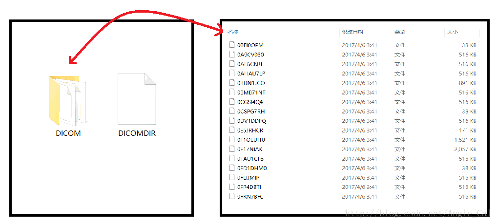
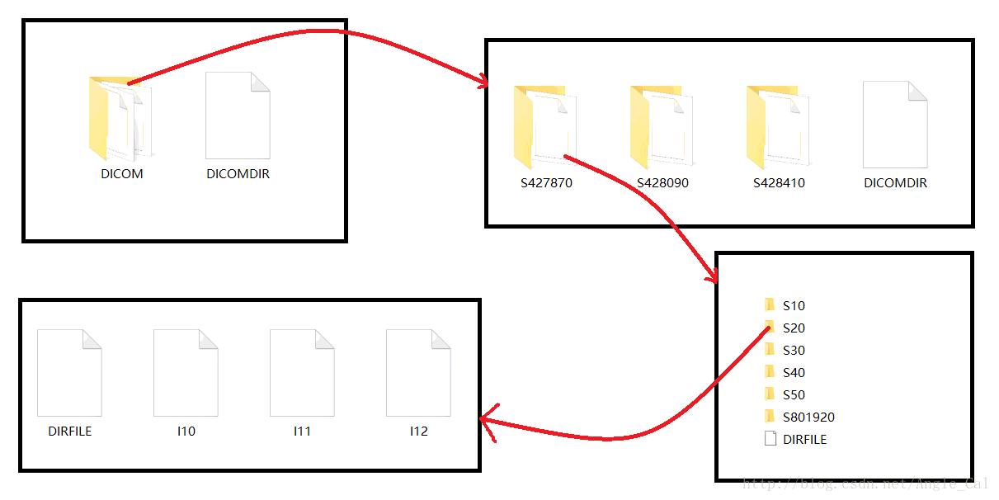
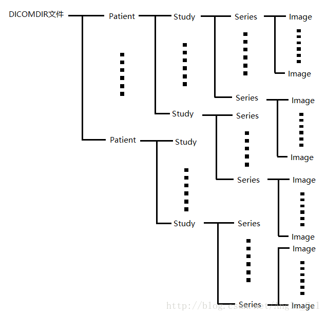
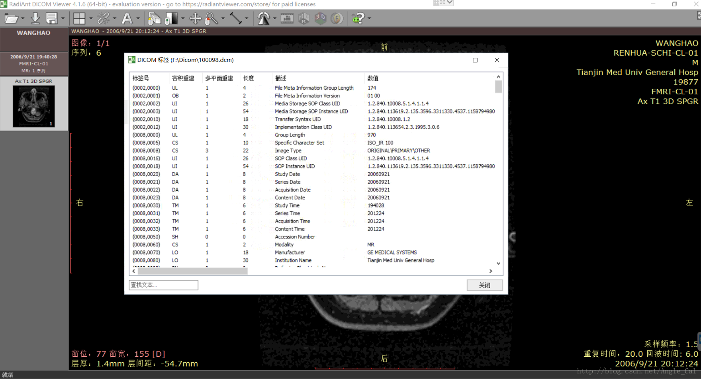

# 03-DICOMDIR文件解析
1.  前言  
    上一篇文章给出了VTK+V+QT的安装方法,其余的两个库,也就是ITK和DCMTK的安装很简单,有一定的CMake使用经验就能很容易的成功编译出我们需要的库.这篇文章主要讲DICOM文件档案的存储形式.
2.  DICOM档案存储形式  
    DICOM图像有三种常见的存在形式:  
    ①单独存储  
    这种形式就是只有一张单张的医学图像,没有任何其他的文件,也没有与这张图片同属一次扫描序列的其他图片文件.  
      
    ②混合存储  
    这种情况指的是一份档案中包含了多个病人和多个序列的图像,并且带有配套的DICOMDIR文件,但是这多个病人和多个序列的图像混在一起存放,不借助其他软件的情况下凭肉眼根本无法分辨出哪些图片是属于同一个病人的.  
      
    ③分层存储  
    这种情况指的是一份档案中包含多个病人和多个序列的图像,并带有配套的DICOMDIR文件,但是这些图片是按照一定规律分层存放的,如果看明白这种规律,我们很容易就能不借助任何软件便分辨出哪些图片是连续的一次扫描,哪些图片是属于同一个病人.  
    
3.  DICOMDIR文件中存储了什么  
    DICOMDIR文件存储了这一份DICOM档案的各种信息,我们可以通过DCMTK的函数打开这个文件并输出成文本文件,来观察其中存储了什么

```
     DcmDicomDir dicomdir("DICOMDIR文件的路径");
     std::filebuf fb;
     fb.open("DicomDir.log", std::ios::out);//输出到文件
     std::ostream out(&fb);
     dicomdir.print(out);
     fb.close();
```

通过观察,很容易发现DICOMDIR文件是一个四层树结构  
  
其中Patient层的每个节点存储一个病人的全部影像资料等信息,Study层的一个节点存储一次检查产生的所有信息,Series存储一次连续扫描所产生的一个图像序列,Image层存储具体的某张图像.  
获取DICOM中保存的信息需要使用DCMTK,具体的使用方法请看代码:

```
DcmDicomDir dicomdir("DICOMDIR文件路径");
DcmDirectoryRecord * DicomDirRootRecord = &(dicomdir.getRootRecord());
DcmDirectoryRecord *   PatientRecord = NULL;//第一层,patient(N)
DcmDirectoryRecord *   StudyRecord = NULL;  //第二层,study (N)
DcmDirectoryRecord *   SeriesRecord = NULL; //第三层,series    (N)
DcmDirectoryRecord *   ImageRecord = NULL;  //第四层,Image (N)
OFString tmpString;
     int i = 0, j = 0, k = 0, l = 0;//四层循环变量
     while (((PatientRecord = DicomDirRootRecord->getSub(i)) != NULL))
     {
         DicomPatient *m_patient = new DicomPatient();
         if (PatientRecord->findAndGetOFString(DCM_PatientID, tmpString).good())
         {
             m_patient->PatientID = tmpString.c_str();
         }
         while (((StudyRecord = PatientRecord->getSub(j)) != NULL))
         {
             DicomStudy *m_study = new DicomStudy();
             if (StudyRecord->findAndGetOFString(DCM_PatientBirthDate, tmpString).good())
             {
                 m_study->PatientBirthDate = tmpString.c_str();
             }
             while (((SeriesRecord = StudyRecord->getSub(k)) != NULL))
             {
                 DicomSeries *m_series = new DicomSeries();
                 if (SeriesRecord->findAndGetOFString(DCM_SeriesNumber, tmpString).good())
                 {
                     m_series->SeriseNumber = tmpString.c_str();
                 }
                 while (((ImageRecord = SeriesRecord->getSub(l)) != NULL))
                 {
                     DicomImage * m_image = new DicomImage();
                     if (ImageRecord->
                     findAndGetOFStringArray(DCM_ReferencedFileID, tmpString, true).good())
                     {
                         m_image->ReferencedFileID = tmpString.c_str();
                     }
                     l++;
                     m_series->ImageList.push_back(m_image);
                 }
                 l = 0;
                 k++;
                 m_study->SeriesList.push_back(m_series);
             }
             k = 0;
             j++;
             m_patient->StudyList.push_back(m_study);
         }
         j = 0;
         i++;
         this->PatientList.push_back(m_patient);
     }
```

需要注意的地方有三点:  
①比如说有一个字段存储在Study中,那么只有在Study中才能读取到他  
②注意变量的类型  
③字段对应的tag在DCMTK的dcdeftag.h文件中可以找到  
4.. DICOM图像文件中存储了什么  
如果我们打开了一张没有DICOMDR的单独存储的DICOM图像,是不是就没办法获得关于这张图片的信息了呢,实际上并不是这样,在DICOM图片文件中,不但保存着图片数据本身,还有和图片属性,图片采集的具体情况,甚至是病人的基本信息相关的很多字段,这里我们使用RadiAnt DICOM Viewer打开一张单独存储的DICOM图片,使用”显示DICOM标签”选项,能够看到,这张单独的DICOM图片中依然存储了很多的信息:  
  
那么如何通过单张图片得到这些信息呢?我们依旧使用DCMTK:

```
DcmFileFormat fileformat;
OFCondition status = fileformat.loadFile("DICOM图片的文件路径");
if(status.good())
{
    if (fileformat.getDataset()->
        findAndGetOFStringArray(DCM_PatientName, temp_OFString, OFTrue).good())
    {
        //TopRightCorner.append("Patient Name:");
        TopRightCorner.append(temp_OFString.c_str());
        TopRightCorner.append("\n");
    }
}
```

搭配适当的tag,使用这种方法就能很方便的从单张DICOM图像中找到这些信息了.上图中RadiAnt界面上显示的那些信息基本上都能通过这种方法读取出来.