# 背景：

&nbsp;&nbsp;&nbsp;&nbsp;&nbsp;&nbsp;&nbsp;&nbsp;最近重新花时间阅读了DICOM标准，顺带着看了一下HL7标准和IHE，对标题中提到的SWF、MWL、SPS和MPPS有了更进一步的认识，现将自己的理解整理出来，算作读书笔记吧。通过对比学习DICOM、HL7和IHE，从而更全面、更清晰的了解医疗信息行业。

# IHE、HL7与DICOM

## DICOM

&nbsp;&nbsp;&nbsp;&nbsp;&nbsp;&nbsp;&nbsp;&nbsp;IHE、HL7与DICOM，先介绍DICOM，即Digital Imaging and Communications in Medicine，是1983年美国放射学会（ACR）和美国电气制造商协会（NEMA）成立了ACR-NEMA数字成像及通信标准委员会，为了实现医学图像及相关数据的存档管理以及远程医疗系统数据的网络共享，起初最早于1985年发布的与设备无关的标准叫做ACR/NEMA1.0，DICOM是改版后的名称。DICOM主要解决了PACS标准化问题，另一个重要意义是为医院的其他医疗信息系统互联提供了统一的接口标准。

&nbsp;&nbsp;&nbsp;&nbsp;&nbsp;&nbsp;&nbsp;&nbsp;医院除了存储影像的PACS系统以外，与信息和流程管理相关的还有HIS和RIS系统，HIS系统是全院级的信息登记系统，覆盖了医院全业务流程，甚至涵盖了像财务管理、人事管理、住院病人管理、药品库管理等，为医院所属各部门提供病人诊疗信息、行政管理信息的收集、存储、处理、提取和数据交换。从HP公司的HIS系统解决方案就足以看出HIS系统的复杂，

> > > > 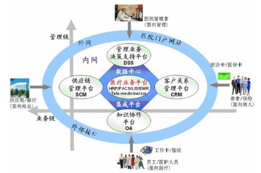

> > > > &nbsp;&nbsp;&nbsp;&nbsp;&nbsp;&nbsp;&nbsp;&nbsp;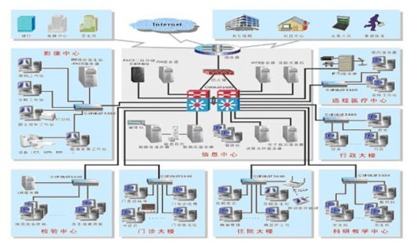

&nbsp;&nbsp;&nbsp;&nbsp;&nbsp;&nbsp;&nbsp;&nbsp;HIS数字化医院解决方案根据医院的业务特征，满足四个面向的目标，即面向医疗，面向管理，面向患者，面对员工，它是最终实现医院数字化建设目标的有效工具。HIS数字化医院解决方案建设整体框架可以概括为：一个中心（数据中心和集成平台HAI）；两卡（即外部就诊卡，医保卡和内部工作卡）；两网（即内网和外网）；五大业务平台（医疗业务平台，客户关系管理平台，供应链管理平台，知识协作平台，管理业务和决策支持平台）；两大体系（管理信息和临床信息）；十大核心系统（HRP，PACS，LIS，EMR，SCM，（OA，Tele-Medicine，无线应用）。

&nbsp;&nbsp;&nbsp;&nbsp;&nbsp;&nbsp;&nbsp;&nbsp;HIS系统需要处理如此多样化的数据，就需要一种通用的数据交换标准接口——HL7（Health Level Seven），HL7标准是目前医疗数据交换标准中应用最广泛的一个基于文本的国际标准，主要应用领域就是HIS、RIS，用于规范HIS、RIS系统及其设备间的文本数据通信，HL7最早是在1987年提出的。

## HL7

&nbsp;&nbsp;&nbsp;&nbsp;&nbsp;&nbsp;&nbsp;&nbsp;HL7规范了医院的HIS、RIS及内部设备之间的通信，而DICOM则涵盖了数字医学图像采集、归档、通信、显示及查询等信息交换的所有范畴，用于实现PACS系统与RIS、HIS的集成。那么是不是有了这两个标准就万事大吉了呢？当然不是。HL7和DICOM标准虽然为信息共享提供了基础，但是两者由于分属不同机构、设计目的，发布时间等都不同导致彼此之间存在着差异，更糟糕的是HL7和DICOM标准处理的**数据对象**不同，HL7偏重于文本数据管理，而DICOM标准在数字图像的通信和管理方面擅长。那么如何让HL7能够顺利的提取DICOM系统中的图像相关信息，DICOM系统顺利提取HL7中的管理信息呢？此刻就该IHE出马了。

## IHE

&nbsp;&nbsp;&nbsp;&nbsp;&nbsp;&nbsp;&nbsp;&nbsp;IHE是1998年，北美放射学会（RSNA）和美国医疗信息与管理协会（HIMSS）联合发起的**医疗机构集成**（Integrating Healthcare Enterprise）项目。目的是为了强化已有的DICOM和HL7通讯标准的协同工作。**IHE并非一种新的标准**，而是提供DICOM和HL7的集成方案，IHE集成方案不对医疗体系内各系统功能的具体实现进行定义，而只关心系统内部各部分之间以及系统与外部环境交互的方式。目前最新的IHE文档中给出了20种集成方案，如下图：

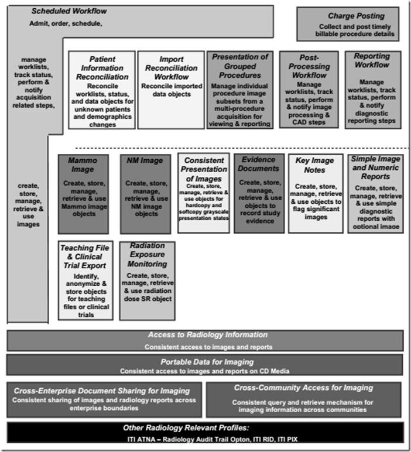

&nbsp;&nbsp;&nbsp;&nbsp;&nbsp;&nbsp;&nbsp;&nbsp;IHE中对集成方案的描述采用用例图（Use Case Diagram）的方式，用Actors表示医疗领域信息系统及其子系统，用Transactions表示Actors之间标准信息的交互。对于后续SWF、MWL、SPS、MPPS等概念的介绍会借鉴IHE文档中的方式。

# SWF+MWL+MPPS+SPS

&nbsp;&nbsp;&nbsp;&nbsp;&nbsp;&nbsp;&nbsp;&nbsp;DICOM标准起初主要是为了实现医疗设备之间影像数据的通讯和管理，经过几次完善也很好的完成了该功能，并成为了行业的统一标准。随着医疗系统的逐步丰富，DICOM标准也进行了许多方面的扩展，新增加了多种IOD（Information Object Definitions），例如MWL（Modality Worklist）、MPPS（Modality Performed Procedure Step）。先前的专栏文章中鲜有提到MWL和MPPS，因为严格来说MWL和MPPS偏向于HIS系统范畴，而DICOM起初的设计目的并不是为了HIS开发，所以至今未曾提到。借着上一篇模拟PACS系统测试的余温，来介绍一下MWL和MPPS概念，使得PACS系统更加接近于医院实际环境中的系统（PACS系统也是可以提供WML和MPPS服务的，相当于嵌入了一个迷你的HIS系统，这种miniHIS在小诊所比较常见）。先借用IHE官网的一个截图来描述一下患者进入医院后的整个就诊流程，从宏观上对医院的整个系统有一个初步认识，如下图所示：

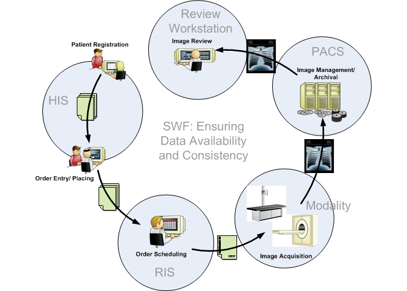

## 1）SWF

&nbsp;&nbsp;&nbsp;&nbsp;&nbsp;&nbsp;&nbsp;&nbsp;上述流程图是IHE众多集成方案中最基础、应用最广泛的一个，叫做Scheduled Workflow Integrated Profile（简称SWF集成方案）。该集成方案是整个IHE信息框架的基础，依托于DICOM3.0标准，顺利解决了HIS、RIS、PACS和数字化影像设备（Digital Imaging Modality）之间的信息传输。为了更清晰说明各个标准的应用场景，将DICOM、HL7、IHE等标准嵌入到上述工作流示意图中，如下所示（原始出处未找到，有知道的请告知我）：

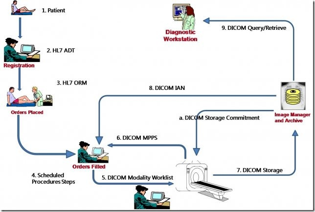

&nbsp;&nbsp;&nbsp;&nbsp;&nbsp;&nbsp;&nbsp;&nbsp;上述截图中箭头所示的整个流程就是IHE中的SWF集成方案，该集成方案规定了患者从登记（registration）、医嘱下达（Orders Placed）、医嘱执行（Orders Filled）、图像采集（Image Acquisition）、图像归档（Image Archive）、查看诊断（Image Viewing/Diagnose）的所有过程中信息交互的一致性。SWF集成方案有以下几大优点：1）减少由于人工输入导致的信息错误，对患者信息掌握更全面，为患者提供更佳的服务；2）提高就诊效率，减少数据的手动输入；3）减少了系统开发和部署成本，各系统可按照SWF集成方案来设计彼此通信的接口。参照IHE文档，给出SWF集成方案的结构图：

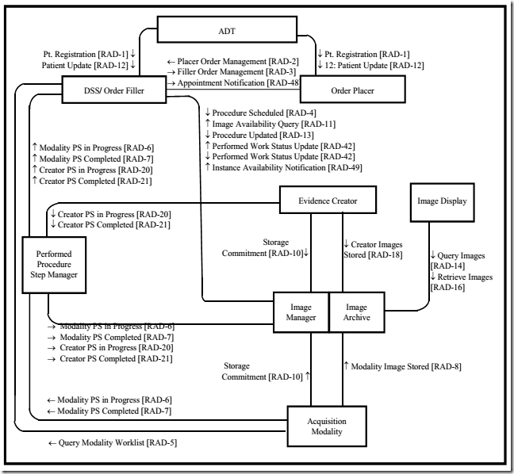

&nbsp;&nbsp;&nbsp;&nbsp;&nbsp;&nbsp;&nbsp;&nbsp;图中详细描述了各个Actors之间的Transactions，下表中标记为R的是实现SWF集成方案必须的，而O表示的是可选，我在图中分别标注了Department System Scheduler和Acquisition Modality中的Query Modality Worklist服务，该服务是我后续要详细介绍的基于DICOM标准的MWL服务，从IHE集成方案的图中就可以看出MWL服务层级以及交互双方。

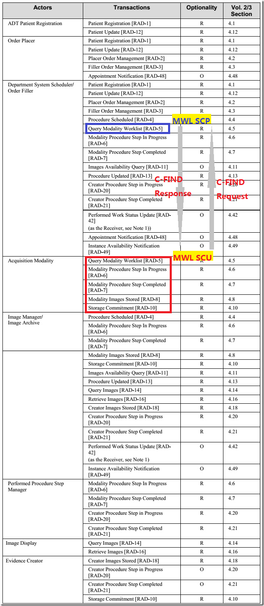

&nbsp;&nbsp;&nbsp;&nbsp;&nbsp;&nbsp;&nbsp;&nbsp;SWF集成方案中主要有三个概念：Order，一次影像服务请求；Request Procedure，“Unit of work resulting in one report with associated codified, billable acts”简单的理解为一次请求操作；Scheduled and Performed Procedure Step，工作流程中预约（Scheduled）和完成（Performed）操作的最小单位。关于SWF的详细介绍参照IHE文档Vol1中的第3章。

## 2）MWL

&nbsp;&nbsp;&nbsp;&nbsp;&nbsp;&nbsp;&nbsp;&nbsp;Modality Worklist服务，简称MWL。Modality Worklist Management服务也是DICOM标准后期为了与HIS系统整合所做的扩展，如下图所示，当患者达到医院或诊所后，DICOM标准中的Patient Management SOP Class开始构建并工作，登记预约检查后生成Study Management SOP Class，如此同时HIS系统会与影像设备（Image Acquisition Modality）发生通讯，Modality利用MWL Management SOP Class来获取影像检查的预约信息和患者相关信息（姓名、年龄、身高、体重等），准备将该信息整合到采集后的图像中。如下图所示，Modality worklist Management服务在设备采集图像开始时（即Acquisition Started）结束，提取的信息在设备中暂存。

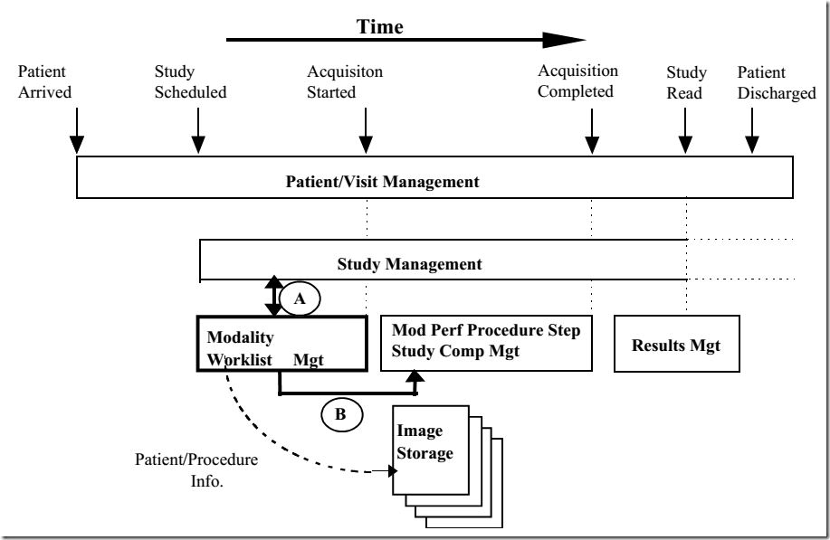

&nbsp;&nbsp;&nbsp;&nbsp;&nbsp;&nbsp;&nbsp;&nbsp;同样在IHE文档vol2中也可以找到关于Worklist服务的相关定义。IHE中依然之规定流程，而不做具体实现的定义。IHE文档VOL2中4.5.1对worklist的使用场景进行了描述，即当患者达到预订流程处（scheduled procedure）时，具体实施人员需要核对相关信息，例如预约的流程是什么？医生或放射医师填写的评论是什么？等。此时实施人员操作采集设备（Acquisition Modality）利用DICOM的Modality Worklist 查询服务从Department System Scheduler/Order Filler下载与预约流程（Scheduled Procedure Step）相关的信息并进行核对，待确定后开启图像检查操作。随后待图像采集完毕会将下载的信息写入到DCM文件头中。

## 3）MPPS

&nbsp;&nbsp;&nbsp;&nbsp;&nbsp;&nbsp;&nbsp;&nbsp;**MWL服务时从DICOM标准相关系统外（如Department System Scheduler )传输信息到影像设备（Acquisition Modality），而MPPS是从影响设备端向外部信息系统中传送消息。**MPPS是Modality Performed Procedure Step的简称，从全称中我们可以看出关键是多了一个Performed单词，言外之意就是当采集设备（Acquisition Modality）在接收到采集任务并开始扫描后（如上图B），设备可以通过MPPS来实现与信息系统的交互，向系统通知设备扫描的状态直到扫描结束。打个比方，在Windows环境下读取一个磁盘文件，当读取指令（Read）发送后直到实际完成读取操作这段时间里，对于操作系统来说是不清楚磁盘具体的运行状况的，而是通过与磁盘驱动程序之间的消息交互来了解具体的读取进度，待读取操作完成后驱动程序会发送完成指令给操作系统，再由操作系统返回给用户。MPPS操作就像操作系统与磁盘驱动程序之间的信息交互过程一样，用于使得医院信息系统（通常是RIS，或者HIS）能够随时掌握成像设备（Acquisition Modality）的进度，了解图像采集是否有异常？如果有异常就需要更新流程消息提示操作者扫描失败；如果运行成功需要更新预约流程标志为完成。MPPS具体的流程示意图如下：

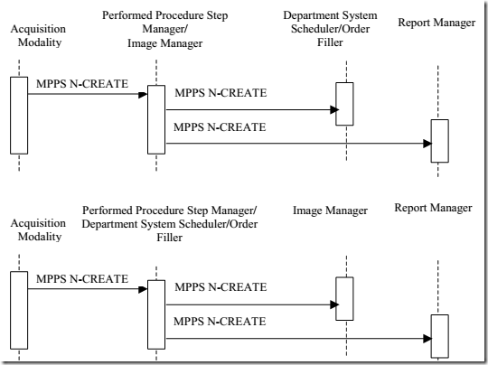

## 4）SPS

&nbsp;&nbsp;&nbsp;&nbsp;&nbsp;&nbsp;&nbsp;&nbsp;SPS与MPPS类似，唯一的区别是一个是预期的操作（Scheduled），一个是具体的操作（Performed）。SPS是在医院信息系统中登记的、由医生开具的检查操作，SPS的预约流程只有在MPPS返回成功后才算一次真实的检查结束，具体的流程模型如下图所示。

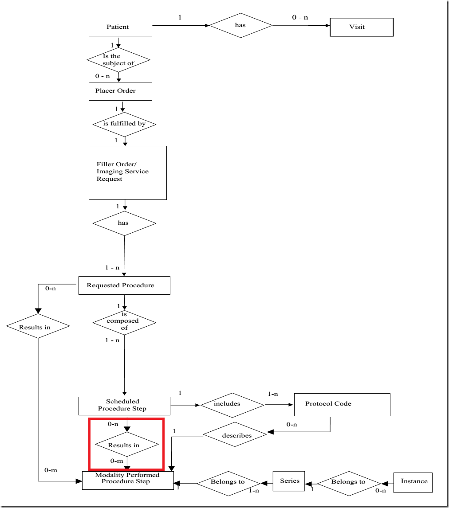

&nbsp;&nbsp;&nbsp;&nbsp;&nbsp;&nbsp;&nbsp;&nbsp;从上图中红色方框标记的Scheduled Procedure Step（SPS）与Modality Performed Procedure Step（MPPS）的对应关系就可以看出，预约的流程（SPS）未必会被执行，即未必会产生实际的检查（MPPS）。以**IHE文档VOL1中3.4.2**的“肺栓塞”病人检查为例，对SPS和MPPS的流程进行一下讲解：第一步，到医院进行挂号登记（此处插一句，挂号是整个就医流程的入口，所以腾讯大笔投资挂号网的目的就是想抢占未来医疗领域的入口，如同在PC端的QQ和手机端的微信一样，腾讯希望垄断医疗领域）预约了两项检查X-ray和NM（如下图中1所示）；第二步，患者到指定的科室（此处是放射科X-ray和NM）进行检查，即**完成预约流程**（如下图中2所示），此时SPS后会记录一条MPPS完成后的扫描结果；倘若患者在做完X-ray检查后未继续到做NM检查，例如此例中的3，那么与NM对应的SPS服务后不会添加MPPS记录。随后关于NM的SPS预约记录会取消。

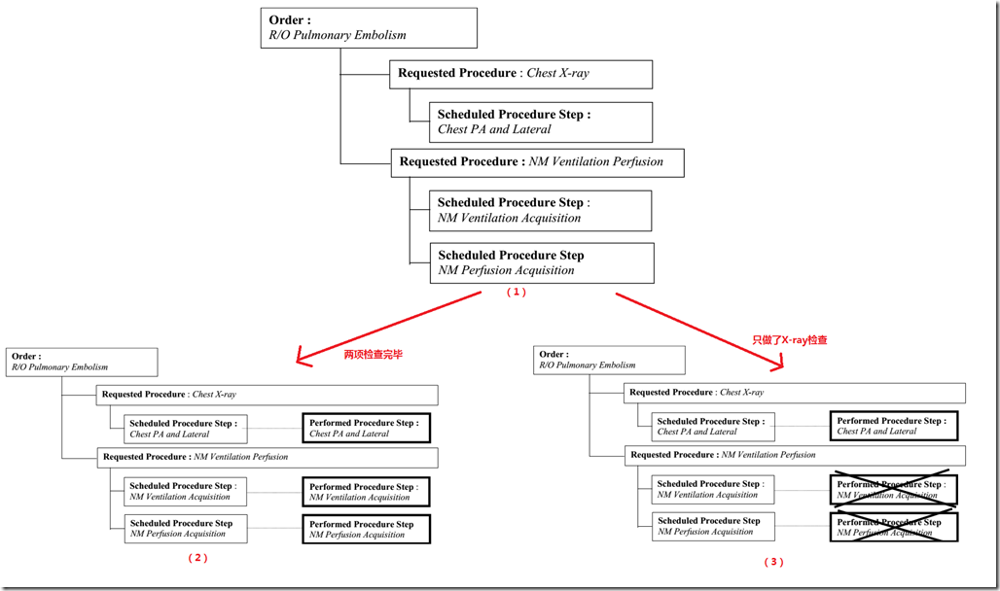

&nbsp;&nbsp;&nbsp;&nbsp;&nbsp;&nbsp;&nbsp;&nbsp;至此对于SWF、MWL、MPPS和SPS等概念的讲解告一段落，短时间内通过简单对比查看IHE、HL7和DICOM标准文档，对诸多概念的理解可能还不是很清晰，如果上述描述有错误会做出及时的更改。

&nbsp;&nbsp;&nbsp;&nbsp;&nbsp;&nbsp;&nbsp;&nbsp;最后补充一点关于PACS系统方面的知识，详情见下节。

# PACS系统

&nbsp;&nbsp;&nbsp;&nbsp;&nbsp;&nbsp;&nbsp;&nbsp;PACS，全称为Picture Archiving and Communication Systems，主要负责医学图像的存储，如CT、US等放射图像，甚至可以用来存储心电等wave类型数据。对于PACS系统此处不做详细介绍，想深入了解的可自行搜索资料，关于PACS介绍的资料很多。该部分想着重介绍一下PACS作为存储医学图像的系统时常见的几种存储方案，并简单的分析各方案的利弊。

&nbsp;&nbsp;&nbsp;&nbsp;&nbsp;&nbsp;&nbsp;&nbsp;在存储之前首先要指定存储的逻辑，也就是如何合理安排归档大量的医学图像，方便快速查找。在PACS系统中，通常采用关系模型数据库（如SQL、DB2、Cache、Oracle等）存储数据，关系数据库是通过具有关联关系的表格来归档数据，通常为了表示DICOM数据的层级关系，PACS系统依据DICOM标准采用**Patient、Study、Series、Image四级表格**来存储，各表之间的关系如DICOM标准第三部分所述：Patient与Study、Study与Series、Series与Image都是1对n的关系。另外除了核心的四级表格以外，PACS系统中也会添加其他与系统相关的表格，例如用户表User，设备表AE等。

&nbsp;&nbsp;&nbsp;&nbsp;&nbsp;&nbsp;&nbsp;&nbsp;在设计完存储逻辑后，就需要选择存储影像数据的具体实施方案，PACS领域中常见的方案主要有以下几种：

## 基于文件系统的存储方案

&nbsp;&nbsp;&nbsp;&nbsp;&nbsp;&nbsp;&nbsp;&nbsp;这种是最简单，也是最容易理解的。我们常见的文件系统，如windows的FAT、NTFS，Linux的Ext等，简单的可以理解为操作系统下的目录式存储，即将需要保存的医学图像以原本的dcm格式存储到指定的目录下。存储目录参照上述四级目录，当客户端需要查询/提取dcm图像时，通过PatientID、StudyID、SeriesID和文件名在PACS四级数据表中检索，最终在image表中找到dcm图像对应的本地存储的全路径，从而获取到图像。

&nbsp;&nbsp;&nbsp;&nbsp;&nbsp;&nbsp;&nbsp;&nbsp;基于文件系统的存储方案首要的优点是实现简单，可以直接借助于操作系统的文件存储子系统。第二个优点是医学图像数据以原本的dcm格式存储在磁盘中，与PACS系统耦合性小。当需要升级或更换PACS系统时，利用常见的文件剪切和拷贝操作就能顺利实现数据的转移。具体的实现思路可参照我早期的一篇博文（[http://blog.csdn.net/zssureqh/article/details/8846337](http://blog.csdn.net/zssureqh/article/details/8846337 "http://blog.csdn.net/zssureqh/article/details/8846337")）。当然此种方式的缺点也很明显——**数据安全性差**，任何任何用户或程序都有权限操作dcm图像存储目录，容易导致数据的误删除，即使利用操作系统提供的API接口也只能简单的设置目录的读写权限，数据稳定性和安全性得不到很好的保证。

## 基于blob的数据库存储方案

&nbsp;&nbsp;&nbsp;&nbsp;&nbsp;&nbsp;&nbsp;&nbsp;数据库除了能够存储上述我们提到的患者信息、设备信息等文字信息外，还可以直接存储二进制块，即BLOG（binary large object），数据库在处理BLOB时的思路是不考虑文件的具体类型，只关心如何处理它。在PACS系统中可以将医学影像当做blob数据直接写入到数据库中，就像上述写入Patient Name、PatientID一样。该种方式的优点较多，首先以统一的方式在数据库中存储患者信息、设备信息和影像信息，使得我们可以使用数据库领域提供的众多工具，而不必考虑我们处理的是DICOM数据。其次可以利用数据库的压缩技术，较DICOM标准中的JPEG无损压缩和JPEG2000压缩节省更多的空间，另外可以使用数据库技术对数据进行加密。完全依赖于数据库技术自然也就带来了缺点，即PACS系统的搭建需要安装相应的数据库支持，PACS操作软件与数据耦合性大，在进行数据迁移时很麻烦。（目前Oracle数据库已经能够直接支持DICOM格式的blob数据存储和数据操作，详情参见[http://www.oracle.com/technetwork/cn/server-storage/linux/dicom-082566.html](http://www.oracle.com/technetwork/cn/server-storage/linux/dicom-082566.html "http://www.oracle.com/technetwork/cn/server-storage/linux/dicom-082566.html")）

## 混合存储方案

&nbsp;&nbsp;&nbsp;&nbsp;&nbsp;&nbsp;&nbsp;&nbsp;有一种混合方案是采用切割DCM原始文件+数据库的方法，即将一个dcm文件切割成多个碎片存储在系统中，同时将碎片之间的链接关系记录在数据库中，该类型的方案在具体的实施中比较少见，也没有查到相关的详细资料。

&nbsp;&nbsp;&nbsp;&nbsp;&nbsp;&nbsp;&nbsp;&nbsp;经过此篇博文的梳理，突发奇想——想利用web服务来搭建一个MWL服务器——想法来源于DCMTK官网wiki中的实例（[http://support.dcmtk.org/docs/file\_wwwapp.html](http://support.dcmtk.org/docs/file_wwwapp.html "http://support.dcmtk.org/docs/file_wwwapp.html")），希望尽快完善该想法，待实现后再将代码贴出来。

# 后续博文介绍：

> **利用DCMTK搭建WML服务器**
> 
> **C#的异步编程模式在fo-dicom中的应用**
> 
> **VMWare三种网络连接模式的实际测试**

**PS1**：感谢博友的细心，已更新WML为MWL，即Modality Worklist 2017.04.27