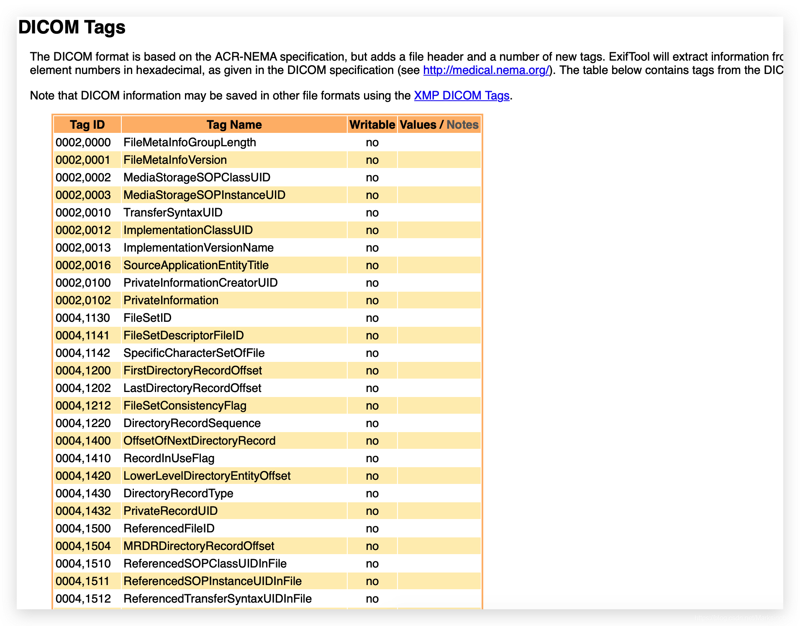

### 1 定义

DICOM（Digital Imaging and Communications in Medicine）即医学数字成像和通信，是医学图像和相关信息的国际标准（ISO 12052）。它定义了质量能满足临床需要的可用于数据交换的医学图像格式。

### 2 包结构
本图错误！！


由上图可知，一个 DICOM 图像的包结构包含三部分（前缀部分未画，值为 DICOM），分别为：

*   **导言**：固定为 128 字节，可直接忽略
*   **前缀部分**：固定为 DICOM，代表此图为 DICOM 格式的数据，若前缀部分不是此固定值，则说明文件损坏，或者这根本就不是一个 DICOM 图像。
*   **`data_element`⭐️**：这一部分是整个图像的重点，以 Tag（后面会详细进行描述） 大小顺序顺序排列值文件末尾。

到此，我们便可以粗略的解读出一张 DICOM 图像大致是由怎么组成的了。

### 3 `data_element`

#### 3.1 节点解读

  
数据节点主要包含两个大类：**显式**与**隐式**，区别之处就在于隐式节点缺少了 `VR`（`Value Representation`，值表示） 标识。

每一个数据节点的数据结构都是一致的，包括

*   **组名**：data\_element 最前面的两个字节，对 data\_element 进行大方向上的分类。
*   **元素号**：元素号又被称为标识号，可以看做是子分类，用于协同组名进行细化的数据项标识。
*   **VR**：可以看做是编程语言中的数据类型，uint，int，long等，在 dicom 的标准中，VR 共有 27 中类型。
*   **值 LEN**：表征像素数据的长度。
*   **像素数据内容**：数据内容的存储是与 VR 是有关联的，VR 不存在时（即隐式），需要通过 tag 进行自行判断与处理。

组名是 dicom 标准中定义好的一种通用的信息标识，通常：

*   0002组描述设备通讯
*   0008组描述特征参数
*   0010组描述患者信息
*   0028组描述图像信息参数

除此之外，还有很多其他组号，常用的数据就那么几个。

#### 3.2 Tag 解读

##### 3.2.1 Tag 分类

第二部分描述的Tag，其实就是：**组名**➕**元素号**，Tag 基本上有三种类型：

*   **文件元节点**：用以确认传输语法。
*   **普通节点**：承载图像处理阶段对数据的加工内容，比如患者信息、医院信息等。
*   **数据节点**：承载图像的像素数据

网上有这样一张图，可供参考。  


> 注: 文件元 tag 以显式 VR 表示。

从上面可以了解到，VR 的种类为 27 （还有一种 UN，Unknown 类型），而 Tag 则有 2000+中。这二者的对应关系很奇妙，可以整理为：

*   不同的 DICOM 图像的同一个 Tag，对应的 VR 类型肯定是相同的。
*   同一个 VR，可能会对应多个类型的 Tag。

比较拗口，但是仔细考虑下这种一对多的关系，应该也是可以理解的。

***

##### 3.2.2 关键 Tag

在 DICOM 图像中，有两个 Tag 最为关键：

*   `0002,0000`，决定普通tag的读取方式 little字节序还是big字节序(也就是平时常说的序列化数据的大小端读取策略)，隐式VR还是显示VR。从网上找了一段代码，可参考如下：

```
switch (VFStr)
{
    case "1.2.840.10008.1.2.1\0"://显示little
        isLitteEndian = true;
        isExplicitVR = true;
        break;
    case "1.2.840.10008.1.2.2\0"://显示big
        isLitteEndian = false;
        isExplicitVR = true;
        break;
    case "1.2.840.10008.1.2\0"://隐式little
        isLitteEndian = true;
        isExplicitVR = false;
        break;
    default:
        break;
}
```

*   `7fe0,0010`，像素数据由此处开始。


##### 3.2.3 深挖指南

Dicom Tags 查找清单：[https://exiftool.org/TagNames/DICOM.html](https://exiftool.org/TagNames/DICOM.html)  


### 4 实测

#### 4.1 操作步骤

以[HexFriend](http://ridiculousfish.com/hexfiend/) 工具打开一张 DICOM 图像为例。

1.  加载 DICOM 图像，查看是否为合法图像。  
    
    
2.  查看 tag 的传输方式  
    
    

从上图可以看到，开始的 tag`0002,0000`标识要以 little 形式读取普通tag。

3.  有第二步知道以小端形式读取 tag，则读取到数据 tag 的时候也应如此。  
    

  
从此处开始，即可读取到对应的像素数据。

#### 4.2 代码

下面以一段 python 代码为例，来测试下对 DICOM 的信息读取与匿名化处理。

##### 4.2.1 环境准备

运行之前需要先安装`pydicom`库，命令如下：

```
pip install pydicom
```

##### 4.2.2 读取DICOM 信息

```python
# coding: utf8

from pydicom import dcmread
filepath = "/tmp/I9500000"
ds = dcmread(filepath)
metas = [
    "PatientID",
    "PatientName",
    "PatientBirthDate",
    "PatientSex",
    "StudyDescription",
    "BodyPartExamined",
    "InstitutionName",
]
for meta in metas:
    print(ds.data_element(meta))


```


##### 4.2.3 匿名化处理

```python
# coding: utf8

from pydicom import dcmread
filepath = "/tmp/I9500000"
ds = dcmread(filepath)
metas = [
    "PatientID",
    "PatientName",
    "PatientBirthDate",
    "PatientSex",
    "StudyDescription",
    "BodyPartExamined",
    "InstitutionName",
]

anonymizations = {
    "PatientName": "ZHANG SAN",
    "PatientBirthDate": "20210102",
    "PatientSex": "M",
}

for anonymizationKey, val in anonymizations.items():
    ds.data_element(anonymizationKey).value = val

# 写回
ds.save_as(filepath)

```

匿名化处理结果  


### 5 回顾

简单回顾下本文，从包结构开始对 DICOM 有一个大致的认识，随着抽丝剥茧，对整个包进行细化拆分。了解到了 data\_element 与 tag 等术语及其各自之间的联系。通过代码简单对 DICOM 图像进行了信息读取与匿名化处理，对 DICOM 有了更深的认识。

此文为基础，后面还会围绕 DICOM 开发一些配套工具。科技，让生活更简单！

参考链接：

[1\. VR 类型详解](https://blog.csdn.net/wenzhi20102321/article/details/75127140)  
[2\. 常见Tag详解](https://blog.csdn.net/wenzhi20102321/article/details/75127101)