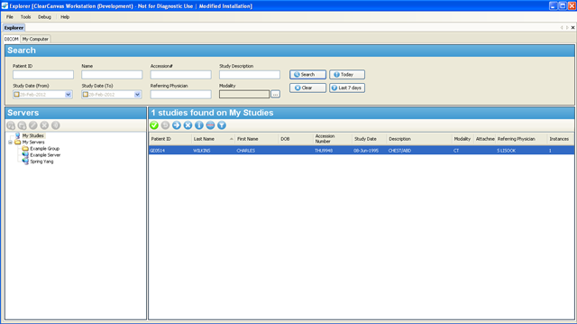
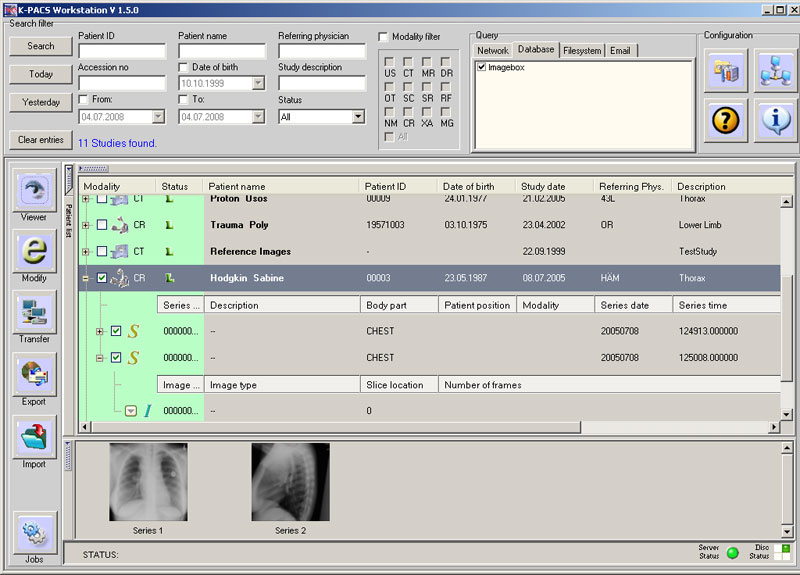
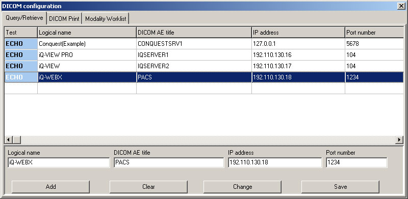
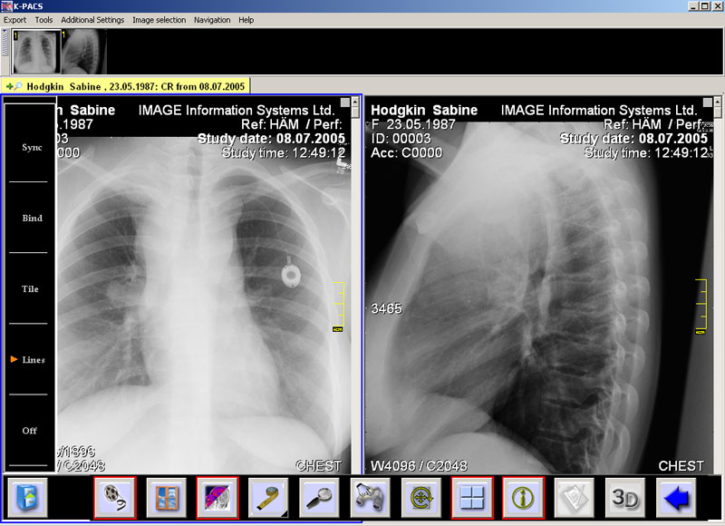
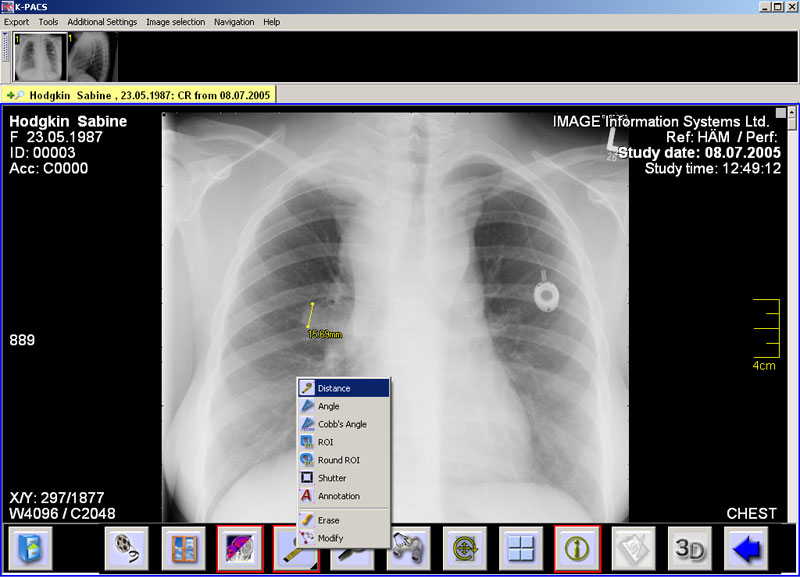
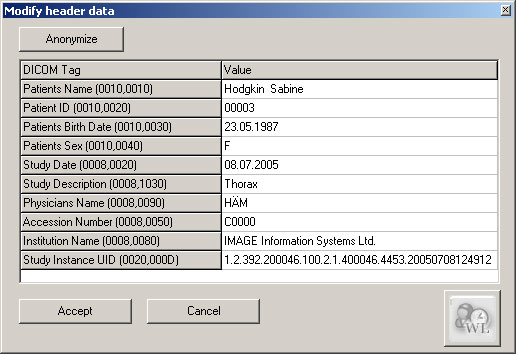
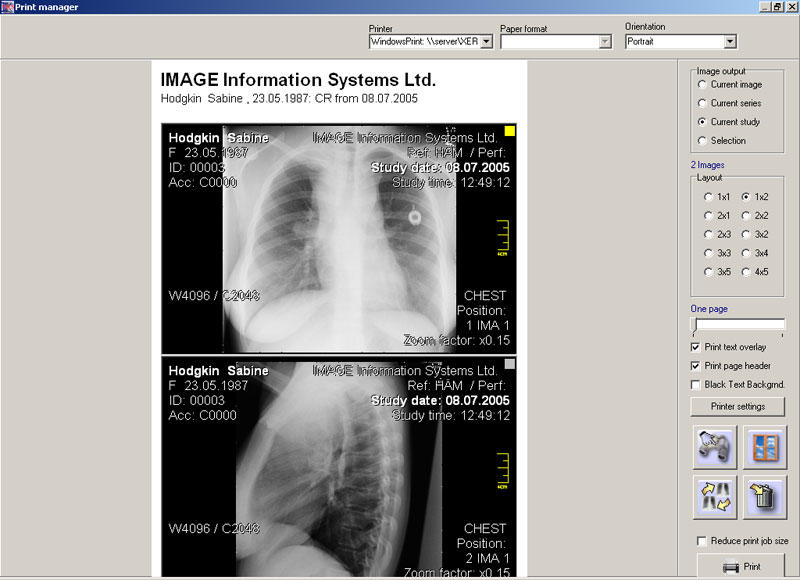

转自：[DICOM开发工具总结\_qimo601的专栏-CSDN博客](https://blog.csdn.net/qimo601/article/details/84288296 "DICOM开发工具总结_qimo601的专栏-CSDN博客")

网上流行的DICOM协议开发工具：

## 1、DICOM开发类库主要有：

**（1）DCMTK(3.6.0)**, [官方下载网站](http://dicom.offis.de/dcmtk.php.en "官方下载网站"),（[如何安装编译DCMTK3.6.0](https://blog.csdn.net/blog/1553222 )）

> DCMTK实现了对DICOM图像存储、传输、图像显示所有操作.
> 
> DCMTK提供了在各种操作系统下使用的可能版本，如LINUX、SUN、MACOS、WINDOWS等
> 
> DCMTK开源项目，BSD license。
> 
> DCMTK只提供静态链接库,和exe程序.如需要更加灵活应用，需要二次开发。
> 
> DCMTK主要开发语言：C++、ANSI C

**（2）Central Test Node,3.0.6** [dicom CTN](http://dl.iteye.com/topics/download/e8534a0e-1e13-3926-ac01-a16318a67bf1) ,[官方下载网站](http://www.downloadatlas.com/dicom/ctn-by-electronic-radiology-lab.html)

CTN包含三个方面：一是遵循DICOM标准开发了所有类库、二是一些应用程序来展示北美医学会的一些学术研究、三是用来可以测试DICOM软件（但一般都用在linux上）

CTN应用在Windows 2000, Windows XP, Linux等

CTN免费软件

CTN主要开发语言：C

**（3）、leadTools** [官方网站](http://www.ahasoft.com.tw/leadtools/)

LEADTOOLS Medical Imaging – 着重于生物医学影像处理，提供API, C++ Class Libraries, .NET, WPF/XAML, COM，包含LEADTOOLS Document Imaging完整功能，完全符合生醫影像標準DICOM。

LEADTOOLS：商业收费

LEADTOOLS：一般用于上层应用程序DICOM图像处理

**(4)、DicomObjects [官方网站](http://www.medicalconnections.co.uk/DicomObjects)**

&nbsp;&nbsp;&nbsp;&nbsp;&nbsp;&nbsp;&nbsp;&nbsp;商业收费软件。

DicomObjects is a toolkit which can make it easy for you to incorporate DICOM into your programs. It is available as either a an "OCX" for use in an ActiveX/COM environment, or as a native .NET DLL.

**(5)、KPACS** [官方网站](http://free-dicom-workstation.com/)

供学习展示用，商业使用需要收费。而且关键功能比如DICOM打印、modality worklist[KPACS.1.6.0下载](http://dl.iteye.com/topics/download/6b1e61a2-e856-333a-8770-0e739e3356f5 "KPACS.1.6.0下载")

**(6)、clear canvas image server**  (http://www.baidu.com/s?wd=clear%20canvas%20image%20server&f=12&rsp=0&oq=ClearCanvas%20ImageServer&ie=utf-8 "clear canvas image server")

开源代码、开发语言：C# 

## 2、DICOM软件测试工具有：

（1）、[DICOM Validation Tool （DVT）](http://www.dvtk.org/modules/wiwimod/index.php?page=DVTk&cmenu=home "DICOM Validation Tool （DVT）")是一个DICOM有效性测试工具，用来测试产品的DICOM兼容性。ADVT顾名思义就是Agfa提供的DICOM Validation Tool。那么ADVT和DVT的关系是什么呢？号称DVT是Agfa在其Advt 2.61版本上发展出来的一个完全免费共享的工具，目的是提供一套独立的工具，任何人都可以用来测试DICOM设备。所以二者虽然有不同，但基本上是可以通用的。DVT比ADVT多了不少扩展功能和有效法则的支持，以方便地支持DICOM标准的发展和扩展，例如它支持DICOM标准里新增加的安全相关的内容，另外DVT也提供了宏定义和更详细的信息提示。

DVTk is an open source project for testing, validating and diagnosing communication protocols and scenario's in medical environments. It supports DICOM, HL7 and IHE integration profiles. The applications from the DVTk Project are must haves for software developers, test engineers and service engineers that work in the healthcare domain. The DVTk project can save you time in your daily work and bring products and services to a higher quality level. Start using DVTk today and see what DVTk can do for you, Explore the new dimension of Integration Testing.

（2）、[JDICOM工具](http://members.chello.at/petra.kirchdorfer/jdicom/ "JDICOM工具")，用于建立DICOM Server，测试DICOM图像传输，打印、收发worklist等应用程序稳定性。请看[JDICOM帮助文档](http://members.chello.at/petra.kirchdorfer/jdicom/JDICOM_manual_V1_0.pdf "JDICOM帮助文档")

（3）、DICOM Server 在线测试。网址：[DICOM Server - My ASP.NET Application](http://dicomserver.co.uk/ "DICOM Server - My ASP.NET Application")

Server is at www.dicomserver.co.uk (87.106.65.167)   Ports are 104 and 11112

这个网站可以提供开发人员远程测试我们的DCMTK代码，提供Support for C-STORE, C-FIND, C-GET & C-MOVE。

（4）、dicom3dsdk： [http://www.dicom3dsdk.com/Download.aspx](http://www.dicom3dsdk.com/Download.aspx "http://www.dicom3dsdk.com/Download.aspx") 以ACTIVEX方式发布，支持cc++、delphi、vb、c#、vb.net等多种编程语言，是你快速开发PACS软件的理想选择。包括功能有：网络通讯：支持标准的DICOM协议，实现了验证、存储、查询、转移、工作列表等功能。

DICOM3DSDK收费软件。

## 3、DICOM图像显示小软件工具有：

[参考免费DICOM图像显示小软件](https://blog.csdn.net/blog/1537482 )

K-PACS的主要界面展示：

**（1）、K-PACS main form with study overview**

 **（2）、DICOM settings – including sample of remote nodes**

 **（3）、Viewer with toolbars and tile-screen**

 **（4）、Active distance measurement**

**（5）、Modifying DICOM header data**

**（6）、Windows Print Manager**

