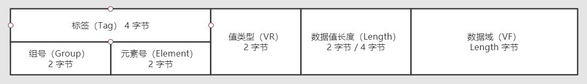
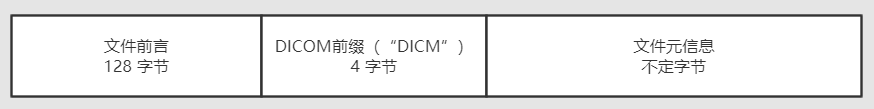
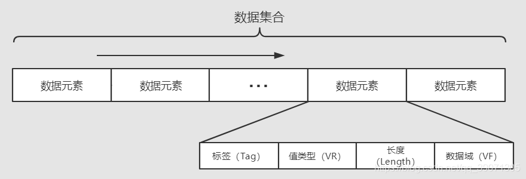
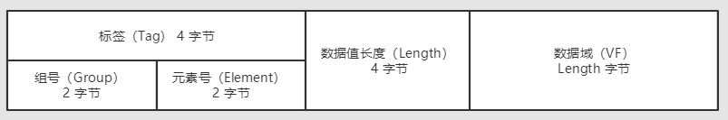
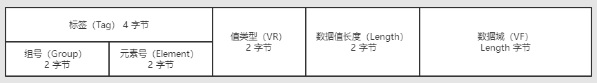
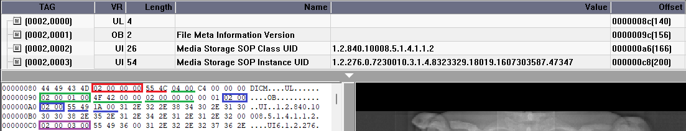
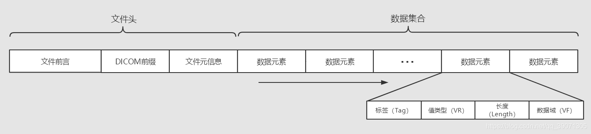
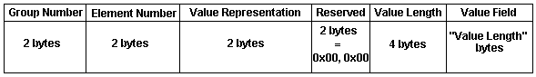
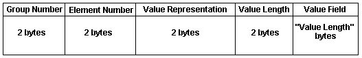
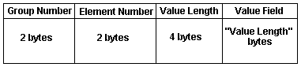

​

 转自[：DICOM文件格式剖析（初识）_MoreThinker的博客-CSDN博客_dicom格式](https://blog.csdn.net/qq_39071305/article/details/101880158 "：DICOM文件格式剖析（初识）_MoreThinker的博客-CSDN博客_dicom格式")

# 初识DICOM（适合初学者）

初识DICOM文件，发现网上的资料有点少，大部分的资料都不全，在这里做一下总结，关于具体的格式会在后续的文章分析

## 复杂的DICOM文件

1.  **在这里先说一下DICOM文件是干嘛的？**  
    DICOM（Digital Imaging and Communications in Medicine）医学数字成像和通信，定义了质量能满足临床需要的，可用于数据交换的医学图像格式。**简单来说，DICOM就是一种医学图像格式的标准**。而其中包含的信息，将是我们探讨的重点。
    
2.  **DICOM文件出现的原因**  
    我们知道很多种图像文件格式了，如：JPEG、BMP、TIFF、GIF等。那么为何又提出了DICOM文件（一般文件后缀名是.dcm或.dic），原因很简单，上述的那些图像格式简单，不能够满足医学方面的需求，因此出现了这种很复杂的DICOM文件，为什么说复杂，我们很快就会知道。
    

## DICOM文件格式

DICOM文件（dcm文件）一般由一个DICOM文件头和一个DICOM数据集组成的。  
在讲文件头和数据集之前，我们先讲一下DICOM文件的一个最基本的结构——**数据元素**

**数据元素**  
由一个唯一的数据元素标签来定义，这个数据元素标签相当于一个唯一识别码  
一个数据元素由若干字段组成，接下来说一下数据元素的主要结构

*   **标签（Tag）**：4字节无符号整数，数据元素的唯一标识。由组号（Group）和元素号（Element）两个部分组成，各占2字节；
*   **值类型（VR 即 Value Representation）**：2字节字符串，是数据元素的数据类型，一般在DICOM标准中有默认的VR字符集编码
*   **数据值长度（Length）**：2字节或4字节（具体取决于传输语法，在后面的文章会讲解）无符号整数，表明了数据值的长度，当数据值占的字节为奇数时，补多一个字节，以偶数进行记录；
*   **数据域（VF 即 Value Field）**：长度为数据值长度，为偶数字节，表明了数据元素的值。  
    

**1. 文件头**  
文件头是用于标识数据集的，首先最前面有128字节的文件前言，4字节的DICOM前缀和文件元信息。  
（1）文件前言：128字节，用于应用简介或是详细说明的固定长度的数据段，当它无内容时，所以字节都为00H；  
（2）DICOM前缀：4字节，包含看一个字符串“DICM”，用于标识该文件是否为DICOM文件；  
（3）文件元信息：字节不定，是一些具有数据元素结构的元素体，包含了文件元信息版本、媒体存储SOP类、传输语法、实现的的设备等。  

**2. 数据集**  
数据集由若干的数据元素组成，存储了图像的信息。其中的数据元素是根据Tag标签值由小到大进行排列的。  

常用的标签主要分为：

*   Patient Tag
*   Study Tag
*   Series Tag
*   Image Tag

Tag对应的数据元素字段，这里不再一一列述，可参见下面的文章  
[dicom文件tag详解：https://blog.csdn.net/wenzhi20102321/article/details/75127101](https://blog.csdn.net/wenzhi20102321/article/details/75127101 "dicom文件tag详解：https://blog.csdn.net/wenzhi20102321/article/details/75127101")

此外还可以将Tag分为文件元Tag、普通Tag以及像素Tag  
文件元Tag：组号为0002的标签，数据元素包含的信息我们在上面讲过了；  
像素Tag：标签号为（7fe00，0010）的Tag，是像素数据的开始的地方；  
普通Tag：除了文件元Tag和像素Tag之外的Tag。  
\*\*注：\*\*我们这里的组号和元素号都是用十六进制来表示。

**特殊的Tag：**

*   （7fe0，0010）像素元素
    
*   **（0002，0010）传输语法（Transfer Syntax UID）**
    

这里重点讲下传输语法，它表明了文件在磁盘中存储的方式，根据显隐式和大小端传输语法分为三类：  
**（1）小端隐式语法  
（2）小端显式语法  
（3）大端显式语法**

这里大小端不做具体的解释，简单说就是读取磁盘数据的顺序。  
这里以（0002,0010）标签为例子，如果是小端读取，则磁盘中存储的是 02 00 10 00；如果是大端读取，则为 00 02 00 10。  
显隐式就是指磁盘内是否有存储VR的数据，隐式则没有，显式则有。

隐式语法的格式如下：  

显式传输语法的格式根据VR类型分为以下两种：  
①VR为OB、OW、OF、UT、UN、SQ  

②VR为标准类型  

**总结：**
**1. 隐式VL都是4字节；**
**2. 显式_标准 VR：2字节；VL：2字节；**
**3. 显式_其他 VR：2字节；保留2字节；VL4字节**
**3. VR跟VL是等长的：要么4字节（显式_其他：加上保留VR是4字节，VL也是4字节），要么2字节（显式_标准 VR：2字节；VL：2字节）**
 

显式_标准：
GE：02 00 00 00：4字节 (0002,0000)
VR：55 4C          :  2字节
VL：04 00          ：2字节
VF：C4 00 00 00
显式_其他：
GE：02 00 00 00：4字节 (0002,0001)
VR：4F 42          :  2字节
RV：00 00          :  2字节
VL：02 00 00 00：4字节
VF：00 01

VR就是数据类型，学过编程语言都会接触到很多的数据类型，而这里的VR跟我们所学的数据类型差不多，不过会有几个比较特殊的，例如OB和SQ，这两种数据类型，会在后面的文章进行专门的讲解。

而VR具体有哪些呢，可以参考其他的文章，这里就不再一一罗列。  
[医学图像之DICOM格式解析](https://www.cnblogs.com/XDU-Lakers/p/9863114.html)

最后这里给出DICOM文件的一个大概的格式：

​
Note: This section makes numerous references to VRs such as OB, OW, SQ, etc. For a listing of default information about these Values Representations, refer to the [Default Value Representation Table](#table).

## Data Element Structure with Explicit VR

When using the Explicit VR structures, the Data Element shall be constructed of four consecutive fields: Data Element Tag, VR, Value Length, and Value. Depending on the VR of the Data Element, the Data Element will be structured as follows:

*   For VRs of OB, OW, SQ and UN, the 16 bits following the two character VR Field are reserved for use by later versions of the DICOM Standard. These reserved bytes shall be set to 0000H and shall not be used or decoded. The Value Length Field is a 32-bit unsigned integer. If the Value Field has an Explicit Length, then the Value Length Field shall contain a value equal to the length (in bytes) of the Value Field. Otherwise, the Value Field has an Undefined Length and a Sequence Delimitation Item marks the end of the Value Field.
*   For VRs of UT the 16 bits following the two character VR Field are reserved for use by later versions of the DICOM Standard. These reserved bytes shall be set to 0000H and shall not be used or decoded. The Value Length Field is a 32-bit unsigned integer. The Value Field is required to have an Explicit Length, that is the Value Length Field shall contain a value equal to the length (in bytes) of the Value Field.  
      
    Note: VRs of UT may not have an Undefined Length, i.e. a Value Length of FFFFFFFFH.

*   For all other VRs the Value Length Field is the 16-bit unsigned integer following the two character VR Field. The value of the Value Length Field shall equal the length of the Value Field.

An example of a Data Element with an Explicit VR, such as would be the case for data type OB, OW, SQ, or UN is shown below:

An example of a Data Element with an Explicit VR, such as would be the case for data types other than OB, OW, SQ, or UN is shown below:

## Data Element Structure with Implicit VR

When using the Implicit VR structure the Data Element shall be constructed of three consecutive fields: Data Element Tag, Value Length, and Value. If the Value Field has an Explicit Length then the Value Length Field shall contain a value equal to the length (in bytes) of the Value Field. Otherwise, the Value Field has an Undefined Length and a Sequence Delimitation Item marks the end of the Value Field.

An example of a Data Element with an Implicit VR is shown below:

# 
Default Value Representation Table

The table below contains the default values for the Value Representations supported by DICOM.

For more information on the structure of this table, refer to [DicomVR](https://www.leadtools.com/help/sdk/v22/dh/di/dicomvr.html).

|     |                    |         |               |        |
| ------ | --------------------- | ---------- | ---------------- | --------- |
| Code   | Name                  | Length     | Restriction      | Unit Size |
| AE     | Application Entity    | 16         | StringMaximum    | 1         |
| AS     | Age String            | 4          | TextFixed        | 1         |
| AT     | Attribute Tag         | 4          | BinaryFixed      | 4         |
| CS     | Code String           | 16         | StringMaximum    | 1         |
| DA     | Date                  | 8          | TextFixed        | 1         |
| DS     | Decimal String        | 16         | StringMaximum    | 1         |
| DT     | Date Time             | 26         | TextMaximum      | 1         |
| FD     | Floating Point Double | 8          | BinaryFixed      | 8         |
| FL     | Floating Point Single | 4          | BinaryFixed      | 4         |
| IS     | Integer String        | 12         | StringMaximum    | 1         |
| LO     | Long String           | 64         | StringMaximum    | 1         |
| LT     | Long Text             | 10240      | TextMaximum      | 1         |
| **OB** | Other Byte String     | 0          | BinaryAny        | 1         |
| **OF** | Other Float String    | 0xFFFFFFFC | BinaryMaximum    | 4         |
| **OW** | Other Word String     | 0          | BinaryAny        | 2         |
| PN     | Person Name           | 64         | TextMaximumGroup | 1         |
| SH     | Short String          | 16         | StringMaximum    | 1         |
| SL     | Signed Long           | 4          | BinaryFixed      | 4         |
| **SQ** | Sequence of Items     | 0          | NotApplicable    | 1         |
| SS     | Signed Short          | 2          | BinaryFixed      | 2         |
| ST     | Short Text            | 1024       | TextMaximum      | 1         |
| TM     | Time                  | 16         | TextMaximum      | 1         |
| UI     | Unique Identifier     | 64         | TextMaximum      | 1         |
| UL     | Unsigned Long         | 4          | BinaryFixed      | 4         |
| **UN** | Unknown               | 0          | BinaryAny        | 1         |
| US     | Unsigned Short        | 2          | BinaryFixed      | 2         |
| **UT** | Unlimited Text        | 0xFFFFFFFE | TextMaximum      | 1         |