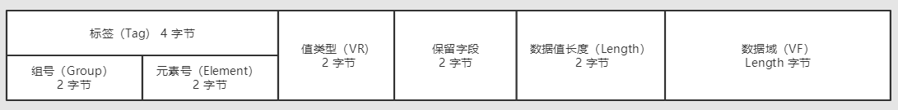

​

 转自[：DICOM文件格式剖析（初识）_MoreThinker的博客-CSDN博客_dicom格式](https://blog.csdn.net/qq_39071305/article/details/101880158 "：DICOM文件格式剖析（初识）_MoreThinker的博客-CSDN博客_dicom格式")

# 初识DICOM（适合初学者）

初识DICOM文件，发现网上的资料有点少，大部分的资料都不全，在这里做一下总结，关于具体的格式会在后续的文章分析

## 复杂的DICOM文件

1.  **在这里先说一下DICOM文件是干嘛的？**  
    DICOM（Digital Imaging and Communications in Medicine）医学数字成像和通信，定义了质量能满足临床需要的，可用于数据交换的医学图像格式。**简单来说，DICOM就是一种医学图像格式的标准**。而其中包含的信息，将是我们探讨的重点。
    
2.  **DICOM文件出现的原因**  
    我们知道很多种图像文件格式了，如：JPEG、BMP、TIFF、GIF等。那么为何又提出了DICOM文件（一般文件后缀名是.dcm或.dic），原因很简单，上述的那些图像格式简单，不能够满足医学方面的需求，因此出现了这种很复杂的DICOM文件，为什么说复杂，我们很快就会知道。
    

## DICOM文件格式

DICOM文件（dcm文件）一般由一个DICOM文件头和一个DICOM数据集组成的。  
在讲文件头和数据集之前，我们先讲一下DICOM文件的一个最基本的结构——**数据元素**

**数据元素**  
由一个唯一的数据元素标签来定义，这个数据元素标签相当于一个唯一识别码  
一个数据元素由若干字段组成，接下来说一下数据元素的主要结构

*   **标签（Tag）**：4字节无符号整数，数据元素的唯一标识。由组号（Group）和元素号（Element）两个部分组成，各占2字节；
*   **值类型（VR 即 Value Representation）**：2字节字符串，是数据元素的数据类型，一般在DICOM标准中有默认的VR字符集编码
*   **数据值长度（Length）**：2字节或4字节（具体取决于传输语法，在后面的文章会讲解）无符号整数，表明了数据值的长度，当数据值占的字节为奇数时，补多一个字节，以偶数进行记录；
*   **数据域（VF 即 Value Field）**：长度为数据值长度，为偶数字节，表明了数据元素的值。  
    

**1. 文件头**  
文件头是用于标识数据集的，首先最前面有128字节的文件前言，4字节的DICOM前缀和文件元信息。  
（1）文件前言：128字节，用于应用简介或是详细说明的固定长度的数据段，当它无内容时，所以字节都为00H；  
（2）DICOM前缀：4字节，包含看一个字符串“DICM”，用于标识该文件是否为DICOM文件；  
（3）文件元信息：字节不定，是一些具有数据元素结构的元素体，包含了文件元信息版本、媒体存储SOP类、传输语法、实现的的设备等。  

**2. 数据集**  
数据集由若干的数据元素组成，存储了图像的信息。其中的数据元素是根据Tag标签值由小到大进行排列的。  

常用的标签主要分为：

*   Patient Tag
*   Study Tag
*   Series Tag
*   Image Tag

Tag对应的数据元素字段，这里不再一一列述，可参见下面的文章  
[dicom文件tag详解：https://blog.csdn.net/wenzhi20102321/article/details/75127101](https://blog.csdn.net/wenzhi20102321/article/details/75127101 "dicom文件tag详解：https://blog.csdn.net/wenzhi20102321/article/details/75127101")

此外还可以将Tag分为文件元Tag、普通Tag以及像素Tag  
文件元Tag：组号为0002的标签，数据元素包含的信息我们在上面讲过了；  
像素Tag：标签号为（7fe00，0010）的Tag，是像素数据的开始的地方；  
普通Tag：除了文件元Tag和像素Tag之外的Tag。  
\*\*注：\*\*我们这里的组号和元素号都是用十六进制来表示。

**特殊的Tag：**

*   （7fe0，0010）像素元素
    
*   **（0002，0010）传输语法（Transfer Syntax UID）**
    

这里重点讲下传输语法，它表明了文件在磁盘中存储的方式，根据显隐式和大小端传输语法分为三类：  
**（1）小端隐式语法  
（2）小端显式语法  
（3）大端显式语法**

这里大小端不做具体的解释，简单说就是读取磁盘数据的顺序。  
这里以（0002,0010）标签为例子，如果是小端读取，则磁盘中存储的是 02 00 10 00；如果是大端读取，则为 00 02 00 10。  
显隐式就是指磁盘内是否有存储VR的数据，隐式则没有，显式则有。

隐式语法的格式如下：  

显式传输语法的格式根据VR类型分为以下两种：  
①VR为OB、OW、OF、UT、UN、SQ  

②VR为其它类型  

VR就是数据类型，学过编程语言都会接触到很多的数据类型，而这里的VR跟我们所学的数据类型差不多，不过会有几个比较特殊的，例如OB和SQ，这两种数据类型，会在后面的文章进行专门的讲解。

而VR具体有哪些呢，可以参考其他的文章，这里就不再一一罗列。  
[医学图像之DICOM格式解析：https://www.cnblogs.com/XDU-Lakers/p/9863114.html](https://www.cnblogs.com/XDU-Lakers/p/9863114.html "医学图像之DICOM格式解析：https://www.cnblogs.com/XDU-Lakers/p/9863114.html")

最后这里给出DICOM文件的一个大概的格式：

​