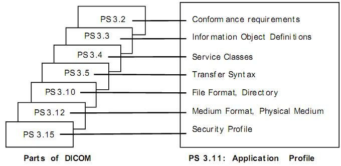

**1 DICOM****的历史及现状**

DICOM(Digital Imaging and Communication in Medicine) 标准最初是由ACR (the American College of Radiology)及NEMA(the National Electrical Manufacturers Association)于1983年组成的联合委员会起草，以后陆续发展成为医疗数字影像及相关信息的传输标准。在DICOM标准正式定名之前，ACR-NEMA曾两次发表相关标准，分别为：发表于1985 年的CR/NEMA PS No.300-1985,Version 1.0,，1986年十月颁为标准；1988年1月颁为标准的CR/NEMA PS No.300-1988,Version 2.0，涵盖Version1.0以及额外的修订，包括对显示设备提供命令支持，并引入新的结构表示图像以及新的数据元素。2006年，ACR-MEMA标准发展到第3版，并改名为DICOM标准，此标准经过其他标准化组织如IEEE，HL7，ANSI， CEN TC251和JIRA等的讨论和审查。

DICOM标准指明了不同厂商需实现的硬件的接口，最小的软件命令集和数据格式的一致性集。此标准建立的目的是推动开放式与厂商无关的医疗数字影像的传输与交换，促进影像储存与传输系统PACS (Picture Archiving and Communication Systems) 的发展与各种医院信息系统HIS (Hospital Information Systems) 的结合，允许所产生的诊所资料库能广泛地经由不同地方的设备来访问。

目前DICOM 标准3.0版比之前的ACR-NEMA标准新增加的部分包括:

1， ACR-NEMA标准原来只适应于点到点（Point to Point）的通讯环境，DICOM3.0扩充到开放式系统互联OSI（Open System InterConnection）及TCP/IP（Transmission Control Protocol/Internet protocol）工业标准的通讯环境。

2， 加入对离线环境下介质通信的规定。ACR-NEMA标准没有指明文件格式，没有选择物理存储介质，也没有指定文件逻辑系统。DICOM3.0支持离线环境下介质的操作，使用工业界标准介质如CD-R和MOD，文件逻辑系统如ISO 9660和PC文件系统如FAT16。

3， 规定了如何声明对命令和交换数据的标准反应的一致性。ACR-NEMA标准仅限于传输数据，但是DICOM通过服务类的概念明确了命令及相关数据的语义。

4， DICOM3.0划分了一致性的层次。ACR-NEMA标准只规定了最低层次的一致性。DCIOM3.0规定标准实现者必须对某一层次使用一个结构化的一致性声明。

5， 为了配合未来新增订的内容能迅速地纳入标准，DICOM3.0标准分为多个部分，藉由ISO 的规定，DICOM3.0的文件已完全依照其标准结构来建立。

6， DICOM3.0增加了一些图像图形之外的信息对象，如心电脑电波形、报告等。

7， DICOM3.0开始采用唯一标示信息对象的技术，方便信息对象（Information Object）在网络环境中无歧义的定义。如：DICOM定义了一系列操作和通知，叫做DICOM消息服务元素。信息对象与这些服务的复合叫做服务\-对象对SOP（Service Object Pair）。这样信息对象通过网络来处理时，它们彼此之间的关联性就不至于混淆。

由于ACR与NEMA在医疗数字影像传输规范上的努力，DICOM3.0已成为北美、欧洲及日本各国在医学信息领域影像应用的标准。而且DICOM标准是一个不断进化的标准，由DICOM标准委员会维护。DICOM委员会成员组织基于使用此协议的用户的反馈可以提出修订提案，这些提案可能在将来的标准中加入，但会寻求与之前版本的有效兼容。

2 **DICOM****的应用范围和目标**

DICOM标准目的是解决医学信息领域中数字信息的交换问题。DICOM通过指定如下内容，方便不同医疗成像设备之间的互操作性。

1， 网络通信。DICOM标准规定了一系列需要被遵守的通信协议，而且需要设备生产商宣称与DICOM标准的一致性；

2， 使用通信协议进行交换的命令及相关信息的语法和语义；

3， 存储介质通信。DICOM标准规定了一系列需要被遵守的存储介质服务、文件格式和医疗目录结构，以方便存取存储在可交换介质上的图像和相关信息；

4， DICOM标准规定必须指明设备实现了标准中的哪些一致性。

具体来说，DICOM标准的目标是：

1， 解决命令及相关数据的语义问题。对于互联的设备，需要有设备如何对命令及相关数据做出反应的标准，而不仅仅在设备间移动数据；

2， 解决离线通信所需要的文件服务、文件格式和信息目录的语义；

3， 解决如何定义标准实现与标准的一致性。特别的，一致性声明必须有足够的信息确定与其它有一致性声明的设备达到什么程度的互操作功能；

4， 方便医疗设备在网络环境中的操作；

5， 解决适应新服务引入的结构化，也就是方便对未来医疗成像应用的支持；

6， 使用现有的普遍适用的国际标准，与已建立的国际标准文档规范保持一致。

但是DICOM并不规定标准的实现细节，也不对标准实现进行测试或验证，更不要求所有设备必须实现标准的全部特征和功能。另外，因为医疗设备可能与其它医疗设备互操作，需要标准覆盖医学信息学的其它领域，但有许多问题是DICOM所能不解决的，所以虽然DICOM能够方便PACS系统解决方案的实现，使用DICOM并不保证PACS的所有目标都能得到满足。

**3 DICOM3.0****内容概要**

图1展示了DICOM标准的基本通信模型，涵盖了网络通信（在线）和存储介质交换（离线）。所有医学应用需依赖以下两个边界或二者之一。

1， Upper Layer Service，在不同物理网络通信支持和协议如TCP/IP的上层并进行抽象；

2， Basic DICOM File Service，对不同的存储介质格式和文件结构进行抽象。

图1 DICOM通信模型

具体来说，DICOM标准包含以下部分，这些部分互相相关但有独立的文档。

**一致性（****PS3.2****）**

此部分要求医疗设备制造商精确地描述其产品的DICOM一致性，须包括一致性需求和一致性声明。一致性需求指明什么需求一定要满足，一致性声明则指明该声明必须遵循的结构。一般而言，一致性声明需包含：

1， 能够识别的信息对象集；

2， 支持的服务类集；

3， 支持的通信协议集或物理存储介质；

4， 支持的安全测量集。

每一个用户都可以从制造商处得到这样一份声明。图2和图3分别表示了如何创建网络通信和存储介质交换的一致性声明。

图2 网络通信一致性声明的创建

图3 存储介质交换一致性声明的创建

**信息对象定义（****IOD – Information Object Definition****）**（PS3.3）

DICOM标准利用面向对象的方法定义了许多信息对象类（Information Object Classes），这些类是现实世界中用于数字医疗图像及相关信息（如波形，结构化报告，放射治疗剂量等）通信的实体的抽象。每一个信息对象类定义包含其目的的描述和属性，但不包含属性值。信息对象的实例则包含属性值，这些属性值可随时间改变以反应这个对象的状态。

信息对象可分为两类：普通型、复合型。普通型信息对象类仅包含现实世界中实体的固有属性，复合型信息对象类则可能还包含与现实世界实体相关而不固有的属性。为了简化信息对象类的定义，信息对象类的相似属性被分为一组，这些成组的属性被指定为独立的模块，并可以被其他复合型信息对象类复用。

**服务类规范****(Service Class Specifications)** （PS3.4）

这部分定义了许多服务类（Service Classes）。一个服务类与一个或多个信息对象通过一个或多个作用于这些信息对象的命令相关联。服务类详细论述了作用于信息对象上的命令及其产生的结果，包括通信服务的提供者和使用者。DICOM标准定义了所有服务类共有的特征，以及对一个服务类的一致性声明如何进行结构化。这部分包含了许多描述服务类细节的规范性附录。

服务类包括存储服务类，查询/获取服务类，基本的工作流管理服务类和打印管理服务类等。

**数据结构及语义（****PS3.5****）**

DICOM标准这部分描述了怎样对信息对象类和服务类进行构造和编码，指定了许多DICOM支持的图像压缩技术（如JPEG有损和无损压缩）。这一部分也定义了如下内容：

1， 一些通用功能的语义，这些功能对许多信息对象是共通的；

2， 构建数据流的编码准则，这些数据流根据数据元素的集合产生，通常被表达为一条消息；

3，DICOM中使用的字符集的编码准则。

**数据字典**（PS3.6）

这一部分在DICOM标准中处于中心地位，描述了所有信息对象是由数据元素组成的，数据元素是对属性值的编码。对每一个数据元素，数据字典包含：

l 它的唯一标签（由组号和元素号组成）；

l 名字；

l 值的表示（VR，Value Representation，如string，integer等）；

l 值的多样性；

l 是否已经废弃。

DICOM在数据字典中也定义了一些有唯一标识的条目，这些条目有：

l 唯一的值，一串64个字符的数字，分为多个部分，通过小数点分开；

l 名字；

l 类型，是信息对象类，数据传输的编码定义或者一些信息对象实例；

l 在DICOM标准的哪一部分被定义。

**消息交换（****PS3.7****）**

这一部分定义了靠消息交换进行通信的医学影像应用所用到的服务和协议。一条消息由命令流和数据流（可选）组成。

DICOM规定了

1， 用于服务类的操作和通知（DIMSE Service）；

2， 建立和终止由网络通信提供的关联规则及未完成事务的影响；

3， 控制命令请求和响应的交换规则；

4，构建命令流和消息的编码规则。

**消息交换的网络通信支持（****PS3.8****）**

这部分说明了在网络环境下的通信服务和支持DICOM应用进行消息交换的必要上层协议。这些通信服务和协议确保DICOM应用之间的通信有效协调地进行。

这些通信服务是OSI表示服务（ISO8822）和OSI联合控制服务元素（ACSE，ISO 8649）的服务子集，这个服务子集被称为上层服务（Upper Layer Service），上层服务使用DICOM上层协议与TCP/IP传输协议连接在一起，允许应用之间建立连接，传输消息以及终止连接。

**用于数据交换的存储介质和文件格式（****PS3.10****）**

 DICOM标准提出了一个通用模型用于医疗成像信息在可移动介质上的存储，目的是提供允许不同类型医疗图像及相关信息在一系列物理存储介质上交换的框架。

DICOM规定了：

1， 一个存储医疗图像及相关信息的层次模型。这个模型引入了介质存储应用配置文件（Media Storage Application Profiles）的概念，这个概念要求介质存储的实现必须声明与DICOM标准中与其应用相关的特定子集的一致性，这个一致性仅包括读写和更新存储的内容；

2， 支持封装任何信息对象的DICOM文件格式；

3， 支持将DICOM文件格式封装为加密安全的DICOM文件格式；

4， 独立于实际物理存储介质及介质格式的DICOM文件服务。

本章定义了不同的介质存储概念：

a) 在单一介质中标示文件集的方法；

b）在一个特定文件系统中命名一个DICOM文件的方法。

图4表示了DICOM的介质通信模型。

图4 DICOM介质通信模型

**介质存储应用配置文件（****Media Storage Application Profiles****）（****PS3.11****）**

DICOM规定介质存储的实现必须声明与DICOM标准中与其应用相关的特定子集的一致性，这些应用相关的特定子集被称为应用配置文件（Application Profiles）。这些一致性声明应用于特定临床应用中存储在介质中的医疗图像及相关信息的交换，并且遵从PS3.10介绍的用于不同类型信息交换的框架。

一个作为附录的应用配置文件应按以下几个主要部分组织：

a) 应用配置文件的名字或者一个相关应用配置文件的列表；

b) 应用配置文件的临床应用上下文描述；

c) 介质存储服务类的定义及应用配置文件和相关选择需要的设备功能；

d) 描述应用配置文件操作需求的信息；

e) 信息对象类及相关信息对象的规范和数据传输编码；

f) 介质格式的选择和使用的物理介质；

g) 其他确保介质交换互操作的参数；

h) 与安全介质存储应用配置文件一起使用的加密技术的安全参数。

如此设计DICOM结构和应用配置机制，扩展额外信息对象类和新交换介质都变得非常方便。图5表示了应用配置文件与DICOM标准其它部分的关系。

图5 应用配置文件与DICOM其它部分的关系

**用于数据交换的存储介质和介质格式（****Storage Functions and Media Formats for Data Interchange****）（****PS3.12****）**

DICOM标准的这一部分通过规定如下内容方便了医疗环境中应用间信息的交换：

A) 描述介质存储模型和特定物理介质及介质格式之间关系；

B) 特定的物理介质特征和相应的介质格式。

**灰度标准显示函数（****PS 3.14****）**

这一部分指定了对灰度图像一致的标准显示函数。为了在不同显示介质（如监视器和打印机）上一致显示图像，这些函数提供了校正特定显示系统的方法。选择的显示函数基于人的视觉感知，人的眼睛对显示设备的亮度范围有非线性的对比度敏感性，这个标准使用Barten人类视觉系统模型。

**安全性和系统管理配置文件（****PS3.15****）**

这一部分指定了标准实现应当遵从的安全性和系统管理配置。安全性和系统管理配置文件参考外部标准协议如DHCP, LDAP, TLS 和 ISCL，安全协议使用如公钥和智能卡的安全技术，数据加密可以使用不同的标准数据加密机制。

但是，这部分不解决安全政策上的问题，由各个地方的管理者建立合适的安全政策，标准仅提供可以用于实现安全政策中DICOM对象交换部分的机制。

**内容映射资源（****Content Mapping Resource****）（****PS 3.16****）**

这一部分规定了：

1， 结构化文档的模板，如DICOM信息对象；

2， 信息对象中使用的编码术语设置；

3， 由DICOM定义和维护的术语辞典；

4， 编码术语在不同国家中的翻译

**解释信息（****PS 3.17****）**

包含说明性信息的附录。

**对****DICOM****持久性物体的网络获取（****WADO****）（****PS 3.18****）**

这部分定义一个存取DICOM持久对象的请求如何表达为一个HTTP URL/URI请求，这个请求包含了一个指针指向一个特定的以它的实例UID表示的DICOM持久对象。

这个请求也指定了相应这个请求的返回结果的格式。

例子：

1，（MIME）内容类型，如以Application/dicom格式还是image/jpeg表示图像，Application/dicom, Application/rtf还是xml表示报告；

2，内容编码；

3， 根据HL7/CDA  Level 1写成的报告。

本文档定义的查询URL的参数是对于HTTP服务器作为一个DICOM SCU（Service Class User信息类用户）从一个合适的DICOM SCP（Service Class Provider，信息类提供者）获取请求对象是充分的。