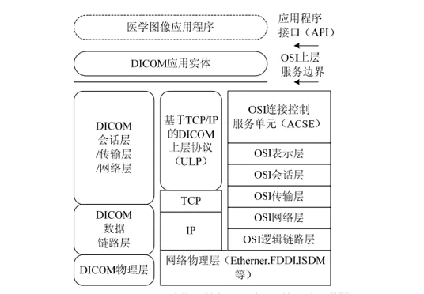
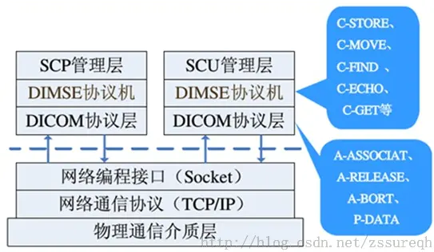
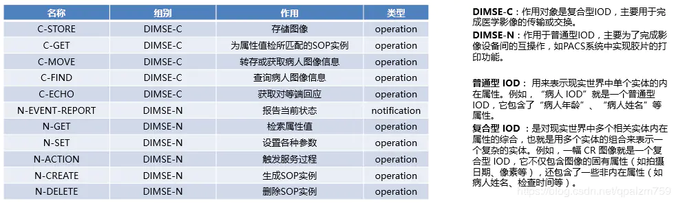
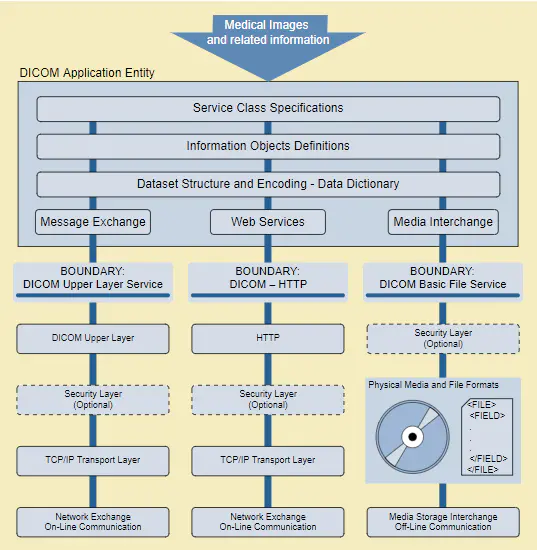
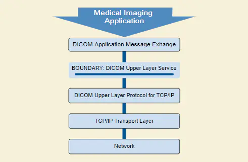
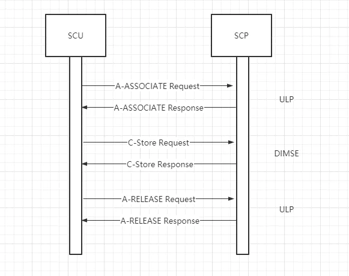

### 协议简介

DICOM（**D**igital **I**maging and **CO**mmunications in **M**edicine）是医学数字成像和通信标准，是医学图像和相关信息的国际标准。

DICOM通信协议是该标准的的一部分，早期标准只支持点到点的数据通信，而DICOM3.0 协议是一种基于开放系统互联协议（Open System Inerconnection， OSI）和传输控制/网际协议(TCP/IP)的上层网络协议。

### 通信模型

DICOM 标准中，采用了 OSI 协议和 TCP/IP 协议作为对 DICOM 网络通信协议的支持。DICOM 网络通信协议是一种应用性协议，它处于 OSI 七层协议的上三层，即应用层、表示层、会话层，而下层主要使用 TCP/IP 协议所提供的服务 。因此，可以说 DICOM 协议是一种基于 TCP/IP 的上层协议。

DICOM 协议包括三个主要部分： DICOM 服务类（DICOM Service Class）、 DICOM 消息服务元素（DICOM Message Service Element， DIMSE） 以及 DICOM上层协议（Upper Layers Protocol， ULP），其中前两部分对应于 OSI 模型的应用层，主要负责消息交换，而 DICOM 上层协议对应于 OSI 模型的表示层和会话层，用来为消息交换提供服务支持。DICOM 协议通过 TCP/IP 进行底层数据的传输。

图1

### 应用层协议

主要包含面向医学图像应用的 DICOM 服务类和用于消息交换的DICOM 消息服务元素（DIMSE）。

#### DICOM 服务类

DICOM 标准定义服务类是为了完成一些特定的应用功能，如图像存储、查询/检索、打印管理等。在讲服务类之前需要明白一个概念：**IOD** （Information Object Definition， 信息对象定义）, IOD 与面向对象编程中的“类”的定义比较相似，对具有相同属性的一类事物的抽象。

服务类描述了有关指令和数据的语义，它和信息对象 IOD 共同构成了 DICOM 的基本单元，**称为“服务-对象对”（Service-Object Pair，SOP）**。一个 SOP 类的实现称为 SOP 实例，如图像存储、查询等应用功能就是通过 SOP 实例来完成的。下表介绍了 DICOM3.0 标准最常用的服务类及其相应的功能。

| 服务类名称 | 功能描述 |
| --- | --- |
| Image storage | 用于医学图像的存储 |
| Image find | 用于查找图像的信息 |
| Image move | 提供图像的接收和转发服务 |
| Image query/retrieve | 提供图像的检索、查询服务 |
| Result management | 提供对检查、诊断结果的管理服务 |
| Image print | 提供图像的打印管理服务 |

#### DIMSE 消息服务元素

DIMSE（标准文件中第7部分）为对等DICOM应用实体进行医学影像及相关信息交换提供了一种应用服务元素定义（Application Service Element），包括服务和协议（DIMSE Service 和DIMSE Protocol）。

图2

DIMSE协议规定了构造消息必需的编码规则, 一条DICOM MESSAGE由固定的指令集合（Command Set），外加可选择的数据集合（Data Set）构成，可以简单的理解为Command Set就是各种服务的请求和应答消息（如c-store）；而Data Set可以认为类似于DCM后缀的文件，是我们希望在对等DICOM实体间进行传输的信息。

DIMSE服务因操作SOP类型的不同分为**DIMSE-C Services**和**DIMSE-N Services**，DIMSE-C服务支持在对等DICOM实体间进行Composite SOP Instance操作(Operation )，主要包括C-ECHO、C-FIND、C-STORE、C-MOVE、C-GET等；而DIMSE-N服务支持Normalized SOP Instance操作,同时提供通知（notification）服务，主要包括N-EVENT-REPORT、N-GET、N-SET、N-CREATE、N-ACTION、N-DELETE。

*   操作服务：指DICOM通信双方中的一个应用实体（SCU方）向另一个应用实体（SCP方）请求完成某种功能的服务时所执行的操作。
*   通知服务：被用于一个应用实体（SOP）向另一个应用实体（SCU方）告知响应的事件的发生或者状态的变化。
    
      
    
    
     图3
    

DIMSE中的所有操作和通知都是确认服务（confirmed services），即一方发出的请求都需要得到对方的应答，DIMSE-C服务在医学领域应用最广泛，常见的PACS、HIS、RIS、LIS等系统都会用到，而DIMSE-N服务主要应用在MPPS和DICOM打印中，日常学习中可能没有实际应用和测试的机会。

> zssure 在博客中将DIMSE作为OSI中的表示层（能为不同的客户端提供数据和信息的语法转换内码，使系统能解读成正确的数据。同时，也能提供压缩解压、加密解密。），在DICOM标准中并没有明确按照OSI 划分层次，下图是标准中给出的DICOM通信模型以及DICOM网络协议体系结构。
 
 
图4
 
 
图5
我的理解是DIMSE可以类比HTTP协议，是对socket中数据流内容进行特定的数据组织，通常说HTTP是个应用层协议，那将DIMSE归为应用层也是有道理的。

### DICOM上层协议（ULP）

从DICOM通讯模型上可以看出DICOM网络协议是建立在TCP/IP层之上的，最底层的是DICOM Upper Layer Protocol（ULP），该部分主要负责与TCP相对接，当 DICOM 应用实体通过 DIMSE 完成消息交换后，需要 DICOM 上层协议层 ULP 来提供传输支持。它的作用主要包括：

*   传送和接收 DIMSE 命令流(Command Set)和数据流(Data Set)，提供网络传输支持。
*   提供应用层的连接控制服务，如在通信双方之间建立、释放和终止关联等 。

ULP 提供 5 种连接控制服务，包括：A-ASSOCIATE、A-RELEASE、A-ABORT、P-DATA、A-P-ABORT。

*   A-ASSOCIATE 用来在通信实体双方间协商并建立关联，交换一些初始化信息，因此它是一个证实性服务；
*   A-RELEASE 用于在完成传输后释放关联，它是一个正常的中止方式，不会造成应用数据的丢失，也是一种证实性服务；
*   A-ABORT 是当通信出现异常时用来终止关联，有可能造成一些暂存数据的丢失，它是一个非证实性服务；
*   P-DATA 用来传输 DIMSE 命令流和数据流，通信实体一方一旦把 DIMSE 消息流传送出去就认定另一方能够准确无误地收到，因此它是一个非证实性服务；
*   A-P-ABORT 也是用来终止关联，主要是用于当网络连接失败时，使得上层能够及时获得操作响应信息。

ULP 提供了 7 个协议数据单元（Protocol Data Unit， PDU）来实现上述的 5 种服务 。

*   A-ASSOCIATE-RQ 建立ASSOCIATE请求
*   A-ASSOCIATE-AC 接受ASSOCIATE建立
*   A-ASSOCIATE-RJ 拒绝ASSOCIATE建立
*   P-DATA-TF 进行数据传输
*   A-RELEASE-RQ ASSOCIATE释放请求
*   A-RELEASE-RP ASSOCIATE释放响应
*   A-ABORT ASSOCIATE终止

### DICOM通信基本流程

DICOM 标准中，通信双方的两个应用实体间用于信息交换的连接称为“关联”。在 DICOM通信过程中，首先必须进行关联协商，确定传输的数据类型和信息的编码方式等；协商成功，建立“关联”后，才能进行数据传输，实现不同的通信功能；数据传输结束后，释放“关联”。下面是以C-Store 服务为例描述的影像文件的传输过程。

图6

参考文档：

1.  [https://blog.csdn.net/qpalzm759/article/details/90264304](https://links.jianshu.com/go?to=https%3A%2F%2Fblog.csdn.net%2Fqpalzm759%2Farticle%2Fdetails%2F90264304)
2.  [百度百科-DICOM](https://links.jianshu.com/go?to=https%3A%2F%2Fbaike.baidu.com%2Fitem%2FDICOM%2F2171358%3Ffr%3Daladdin)
3.  [https://blog.csdn.net/zssureqh/article/details/39098621](https://links.jianshu.com/go?to=https%3A%2F%2Fblog.csdn.net%2Fzssureqh%2Farticle%2Fdetails%2F39098621)
4.  [https://www.cnblogs.com/Alex80/p/5145977.html](https://links.jianshu.com/go?to=https%3A%2F%2Fwww.cnblogs.com%2FAlex80%2Fp%2F5145977.html)
5.  [https://www.dicomstandard.org/current/](https://links.jianshu.com/go?to=https%3A%2F%2Fwww.dicomstandard.org%2Fcurrent%2F)

本文主要参考 [https://blog.csdn.net/qpalzm759/article/details/90264304](https://links.jianshu.com/go?to=https%3A%2F%2Fblog.csdn.net%2Fqpalzm759%2Farticle%2Fdetails%2F90264304)，在其基础上进行了一些增删。

  
  
作者：rdgbrain  
链接：https://www.jianshu.com/p/6f178fc98a04  
来源：简书  
著作权归作者所有。商业转载请联系作者获得授权，非商业转载请注明出处。