原文名称：[!DICOM医学图像处理：全面解析DICOM3.0标准中的通讯服务模块](http://blog.csdn.net/zssureqh/article/details/39098621)

# 背景：

&nbsp;&nbsp;&nbsp;&nbsp;&nbsp;&nbsp;&nbsp;&nbsp;最近在做关于PACS终端与RIS系统之间进行worklist查询的相关调试工作，因此又重新对DICOM3.0标准中关于网络传输的部分进行了阅读，在此将本周的工作进行一下总结，以加深对DICOM3.0标准的认识，从底层更加清晰的了解worklist查询、C-STORE、C-FIND等各种服务。

# 要点：

## 1）名词简称

&nbsp;&nbsp;&nbsp;&nbsp;&nbsp;&nbsp;&nbsp;&nbsp;该部分中会出现很多的常见名词的缩写，因此为了更好的理解其含义，先给出各个名词所对应的全称，这里没有用中文进行翻译原因有二，其一是因为英文很简单，而且表意很清楚，其二是因为目前DICOM3.0标准还没有官方的中文版，所以我也不敢造次进行翻译。  

&nbsp;&nbsp;&nbsp;&nbsp;&nbsp;&nbsp;&nbsp;&nbsp;常见的简称及其全称如下：

> **ACSE：Association Control Service Element**
> 
> **AE：Application Entity**
> 
> **CMIS：Common Management Information Service**
> 
> **CMISE：Common Management Information Serivce Element**
> 
> **DICOM：Digital Imaging and Communications in Medicine**
> 
> **DIMSE：DICOM Messsage Service Element**
> 
> **DIMSE-C：DICOM Message Service Element-Composite**
> 
> **DIMSE-N：DICOM Message Service Element-Normalized**
> 
> **HL7：Health Level 7**
> 
> **OSI：Open Systems Interconnection**
> 
> **PDU：Protocol Data Unit**
> 
> **PDV：Protocol Data Value**
> 
> **SOP：Service Object Pair**
> 
> **TCP/IP：Transmission Control Protocol/Internet Protocol**
> 
> **DUL：Dicom Upper Layers**

## 2）DICOM网络通信模型

&nbsp;&nbsp;&nbsp;&nbsp;&nbsp;&nbsp;&nbsp;&nbsp;DICOM网络服务是建立在传统OSI七层模型之上的端到端的通讯服务，包括服务端和客户端。其基本的通讯服务模型如下图所示：

> > > 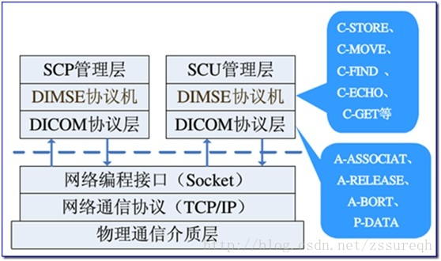

> > > 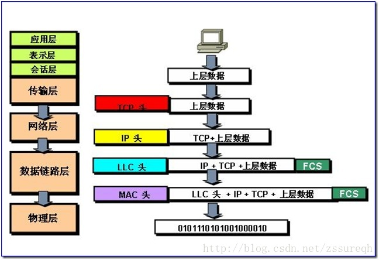

&nbsp;&nbsp;&nbsp;&nbsp;&nbsp;&nbsp;&nbsp;&nbsp;与传统的OSI七层模型对比一下，可以看出DICOM3.0标准中所描述的DICOM网络通讯服务所包含的并非是OSI七层中简单的某一层，而是对从传输层/网络层向上的各层都分别进行了详细的描述和定义。下一节我会针对DICOM3.0标准的几个部分分别来详细介绍一下DICOM网络通讯服务的各个层，或者说各个模块。

## 3）DICOM3.0标准对DICOM网络通信的描述

&nbsp;&nbsp;&nbsp;&nbsp;&nbsp;&nbsp;&nbsp;&nbsp;&nbsp;下面直接给出DICOM3.0标准中的几个附图，首先从整体上对DICOM3.0标准有一个把握，如下所示：

> > > > > 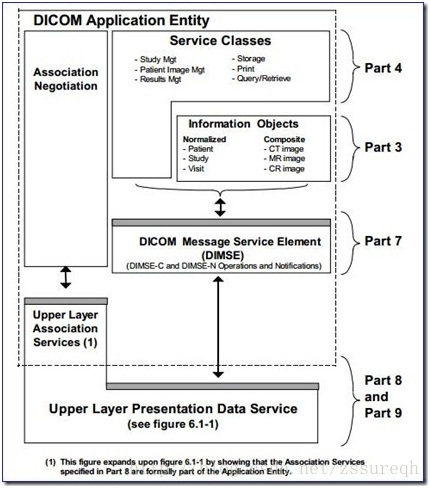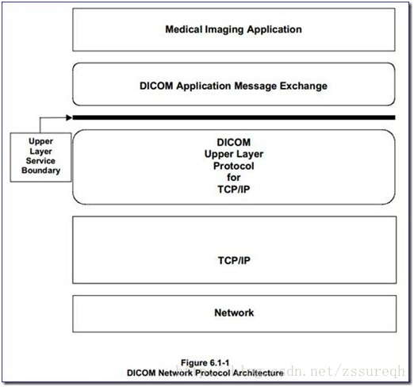

&nbsp;&nbsp;&nbsp;&nbsp;&nbsp;&nbsp;&nbsp;&nbsp;从右图可以看出DICOM通讯模型是建立在TCP/IP层之上的，最底层的是**DICOM Upper Layer Protocol**，该部分主要负责与TCP相对接，在此之上就是DICOM3.0标准给出的**DICOM通讯模型**，与上一节中的OSI七层模型相比可知，DICOM通讯模型涵盖了**会话层（Session）、表示层（Presentation）和应用层（Application）**。**会话层（Session）**主要负责为通讯双方制定通信方式，并创建、注销会话。该部分对应的是DICOM3.0标准中的第8部分，即**ACSE（Association Control Service Element）**；**表示层（Presentation）**能为不同的客户端提供数据和信息的语法转换内码，使系统能解读成正确的数据。同时，也能提供压缩解压、加密解密。与之相对应的是**DIMSE服务**，即DICOM3.0标准的第7部分，该部分给出了众多服务（**C-STORE、C-FIND、C-GET、C-MOVE、C-ECHO**）的编码格式。

&nbsp;&nbsp;&nbsp;&nbsp;&nbsp;&nbsp;&nbsp;&nbsp;左图是右图中**DICOM Upper Layer Service**以上服务内部结构的细化，从中也可以看出与之相对应的DICOM3.0的各个部分。下面给出一个更全面的结构示意图：

> 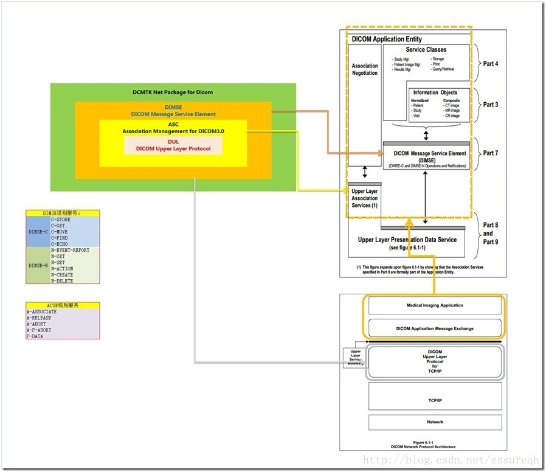

&nbsp;&nbsp;&nbsp;&nbsp;&nbsp;&nbsp;&nbsp;&nbsp;上图中在简单的对DICOM3.0标准中的截图进行组合后，也给出了DCMTK源码库中与各个层相对应模块的名称，从名称简写上也可以看出整个DICOM网络通信是如何完成的。其中与DICOM通信服务相关的几个文件有**dimse.h、assoc.h、dul.h**（顺序按照OSI七层模型从上到下），其中**dimse.h**文件中给出了DIMSE层的各种信息的结构体（如**T\_DIMSE\_Message、T\_DIMSE\_C\_EchoRQ、T\_DIMSE\_C\_EchoRSP**等）以及各种服务的函数（如**DIMSE\_echoUser、DIMSE\_sendEchoResponse、DIMSE\_storeUser、DIMSE\_storeProvider**等）。**dimse.h**文件中定义的各类服务函数，都会有一个关于网络连接的参数**T\_ASC\_Association \*assoc**，如下图：

> > > > > 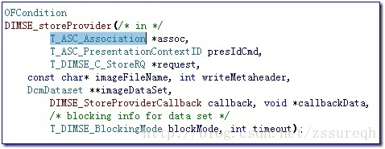

&nbsp;&nbsp;&nbsp;&nbsp;&nbsp;&nbsp;&nbsp;&nbsp;从参数类型就可以猜出该类型定义在**assoc.h**文件中（如下图），**assoc.h**文件的备注指出该文件为DICOM网络应用提供了连接管理（**association management**），文件中定义的所有结构都是为了支持连接建立的（如**表示上下文、抽象语义、传输语义、最大PDU长度**等等）。同时文件中也指出了其中的函数利用的是DICOM Upper Layer的服务来实现的。而**T\_ASC\_Association**结构就代表一次活动链接。

> > > > 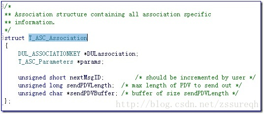

&nbsp;&nbsp;&nbsp;&nbsp;&nbsp;&nbsp;&nbsp;&nbsp;既然assoc.h头文件已经指明了该模块是在Dicom Upper Layer基础上实现的，因此可以猜到链接的各类函数的源代码实现中必定调用了**dul.h**文件中的函数，此处已**ASC\_initializeNetwork**函数为例，如下图所示，该函数内部直接调用了**DUL\_InitializeNetwork**函数，想必如果按照上面我们的分析，继续追踪下去的话，一定就会出现TCP层的函数，即我们常用的**套接字socket函数**（如果读者喜欢可自行查看**dul.h**中函数的源代码，例如**DUL\_initializeNetwork**函数中通过**initializeNetworkTCP**函数直接使用了socket的常见操作函数，如**socket建立套接字函数**、**setsockopt设置套接字函数**、**bind绑定套接字函数** 等等）

> > > 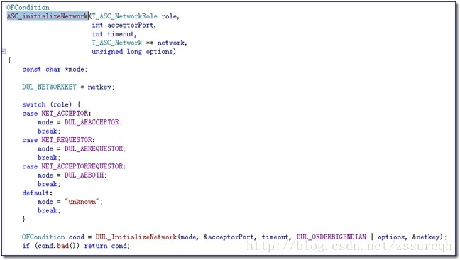

&nbsp;&nbsp;&nbsp;&nbsp;&nbsp;&nbsp;&nbsp;&nbsp;至此通过查看DCMTK开源库源码，使得我们对上面的整体结构图有了更直观的认识，从而对DICOM3.0标准也有了更好的了解。

# 实际工程测试：

&nbsp;&nbsp;&nbsp;&nbsp;&nbsp;&nbsp;&nbsp;&nbsp;在查看完DCMTK源码设计后，为了更真实的感受和掌握DICOM网络通讯的过程，此处以常见的PACS与RIS系统之间的worklist查询服务和DICOM的C-STORE图像存储服务为例，对服务端与客户端通讯的真实数据包进行抓取分析，从而更好、更直观的认识DICOM通讯服务。

## 1）测试工具：

&nbsp;&nbsp;&nbsp;&nbsp;&nbsp;&nbsp;&nbsp;&nbsp;为了仿真DICOM的通讯模型，自然需要构造服务和客户两端，DCMTK开源库的bin中给我们提供了很好的工具。此处选用的工具分两类

|   |   |
| --- | --- |
| **服务端** | **客户端** |
| **wlmscpfs.exe** | **findscu.exe** |
| **storescp.exe** | **storescu.exe** |

&nbsp;&nbsp;&nbsp;&nbsp;&nbsp;&nbsp;&nbsp;&nbsp;另外为了与DICOM3.0中对DICOM网络服务的各种结构（如**DIMSE、PDU**）和指令（**A-ASSOCIATION、C-FIND**）的详细介绍进行对比，将本地模拟的服务端与客户端的通讯数据包进行了抓取，利用的本地回路抓包工具室RawCap.exe，将抓取的数据包存成pcap文件，然后利用Wireshark工具强大的统计分析功能进行直观的对比分析。

|   |   |
| --- | --- |
| **本地回路抓包工具** | **RawCap.exe** |
| **数据包分析查看工具** | **Wireshark** |

## 2）worklist查询服务的通讯过程分析

> 第一步，启动本地回路抓包工具，RawCap.exe 5 dumpfile.pcap（可以利用RawCap.exe -h来查看RawCap.exe工具的使用）
> 
> 第二步，启动worklist服务端程序，wlmscpfs.exe –d 104 –dfp wlistdb >worklist-server.txt（利用shell的重定向将调试信息保存到worklist-server.txt中）
> 
> 第三步，启动workist查询客户端程序，findscu.exe –d 127.0.0.1 104 testqry.wl –aec OFFIS >worklist-client.txt（testqry.wl文件是上一篇博文[http://blog.csdn.net/zssureqh/article/details/38775315](http://blog.csdn.net/zssureqh/article/details/38775315 "http://blog.csdn.net/zssureqh/article/details/38775315")中测试使用的，其中设定了PatientID=123456）
> 
> 然后等待整个通讯过程截止，RawCap.exe会得到一个名为dumpfile.pcap的数据包文件，另外也会得到服务端和客户端的两个调试信息文本文件，分别是worklist-server.txt和worklist-client.txt。

 **注意**：**有些时候利用重定向将调试信息输出到文本文件会发生中断错误，因此也可以直接将结果显示到console窗口，然后将其手动拷贝存储到相应的文件中**。我在本机的操作如下图所示：

> 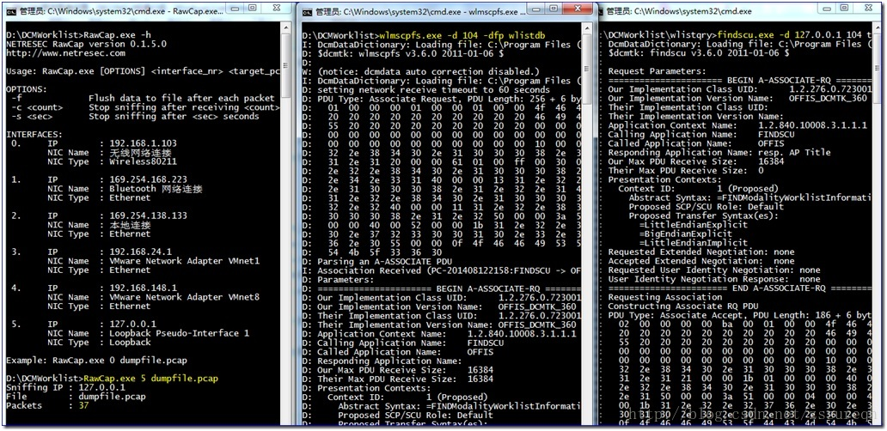

&nbsp;&nbsp;&nbsp;&nbsp;&nbsp;&nbsp;&nbsp;&nbsp;至此整个数据抓取和信息记录的任务就完成了，接下来就是我们的分析阶段了。

 **首先**直接使用文本编辑器打开两个调试信息文本文件，我在本地的结果如下图所示：

> 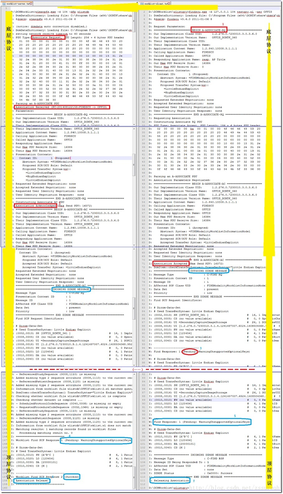

&nbsp;&nbsp;&nbsp;&nbsp;&nbsp;&nbsp;&nbsp;&nbsp;调试信息中也基本给出了我们想要的数据，例如**A-ASSOCIATE-AC、A-ASSOCIATE-RQ、DIMSE MESSAGE**等。上图中的边缘附件的黄色箭头示意的是两端（即两个DICOM AE）进行真实交流时数据流流过的各层的顺序，这与OSI中的类似。途中红色矩形框表示的1、2、3、4等是DICOM协议层（**association**）的交互顺序，从数据中可以看出association层对一些底层结构（如**PDU、PDV**）进行了约定；蓝色框标示的是DIMSE协议层，该层主要定义的是DICOM的各种服务，如**C-STORE、C-FIND**等。

&nbsp;&nbsp;&nbsp;&nbsp;&nbsp;&nbsp;&nbsp;&nbsp;然后，我们利用Wireshark工具打开dumpfile.pcap数据包文件。

> 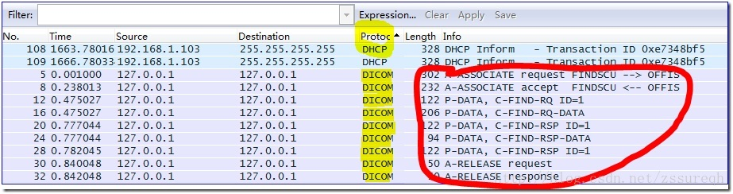

&nbsp;&nbsp;&nbsp;&nbsp;&nbsp;&nbsp;&nbsp;&nbsp;利用Protocol的筛选，我们只观察DICOM协议的相关数据包（有兴趣的可以将整个过程的所有数据包分析一下）。如上图所示，可以清晰的看到findscu客户端与worklist服务端的交互过程。双击其中的第一条交互信息，如下图所示：

> 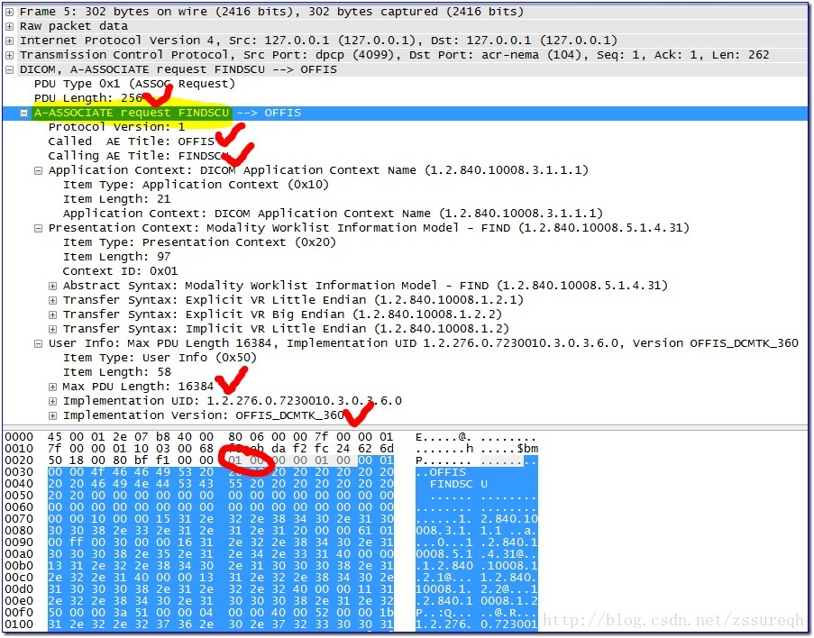

&nbsp;&nbsp;&nbsp;&nbsp;&nbsp;&nbsp;&nbsp;&nbsp;此图中可以清晰的看到完整的association层的数据包，如图总红色圆圈所示，01类型代表的正是ASSOCIATE-RQ PDU 类型，而随后紧跟着的就是DICOM3.0第8部分Table 9-11中约定的各个字段。

## 3）C-STORE服务提供者（SCP）、使用者（SCU）通讯过程分析

&nbsp;&nbsp;&nbsp;&nbsp;&nbsp;&nbsp;&nbsp;&nbsp;该部分的测试流程与2）中worklist查询的测试流程是相同的。

> 第一步，启动本地回路抓包工具，RawCap.exe 5 dumpfile.pcap（可以利用RawCap.exe -h来查看RawCap.exe工具的使用）
> 
> 第二步，启动storescp服务端程序，storescp.exe -d 104 -aet OFFIS >storescp.txt（利用shell的重定向将调试信息保存到storescp.txt中）
> 
> 第三步，启动storescu请求客户端程序，storescu.exe –d 127.0.0.1 104 –f test.dcm –aec OFFIS >storescu.txt（test.dcm是一个标准的dcm文件）
> 
> 然后等待整个通讯过程截止，RawCap.exe会得到一个名为dumpfile.pcap的数据包文件，另外也会得到服务端和客户端的两个调试信息文本文件，分别是storescp.txt和storescu.txt。

&nbsp;&nbsp;&nbsp;&nbsp;&nbsp;&nbsp;&nbsp;&nbsp;分析过程也与2）中相同，此处就不细说了，只给出结果图。

> 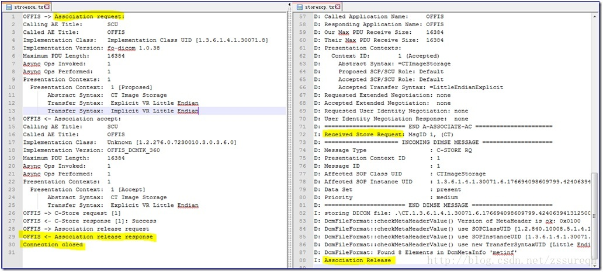

> 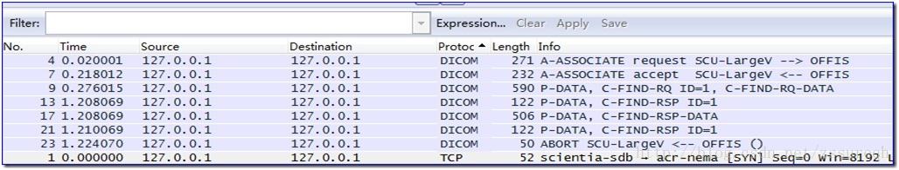

> 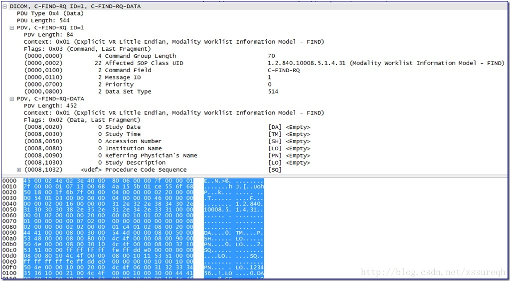

# 【备注】：

&nbsp;&nbsp;&nbsp;&nbsp;&nbsp;&nbsp;&nbsp;&nbsp;正是利用上述工具，解决了上一篇博文[利用fo-dicom发送C-Find查询Worklist](http://blog.csdn.net/zssureqh/article/details/38986721)失败的问题。具体的排查过程就是先利用DCMTK开源工具包进行模拟，然后利用工具抓取数据包分析结果，在确定无误的情况下，转而转到fo-dicom环境下，同样抓取数据包分析错误原因。然后单步调试到fo-dicom开源库的C-FInd发起函数CreateWorklistQuery中，确定了问题出现的原因。具体的链接可以参见我的Github：[https://github.com/zssure-thu/fo-dicom](https://github.com/zssure-thu/fo-dicom "https://github.com/zssure-thu/fo-dicom")。该分支中我暂时记录了此次修改的代码，等待后续进一步确认。

*博文中的具体文件已经上传到CSDN，*链接为：[http://download.csdn.net/detail/zssureqh/7870789](http://download.csdn.net/detail/zssureqh/7870789http://)

  

**后续专栏文章预告：**

**1）storescp.exe与sotrescu.exe的源码剖析：学习C-STORE请求**

**2）Dcmtk与fo-dicom保存文件的不同设计模式：单线程VS多线程**

**3）wlmscpfs.exe与findscu.exe的源码剖析：学习C-FIND请求**