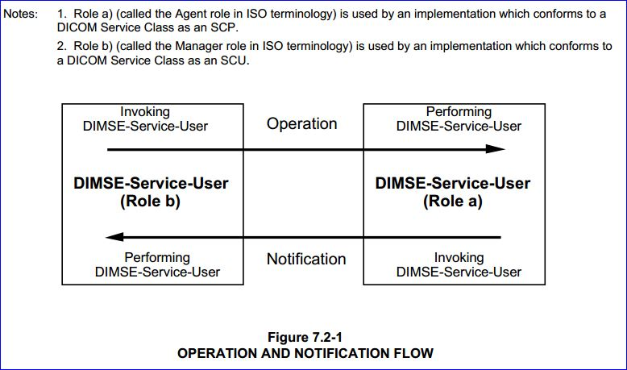
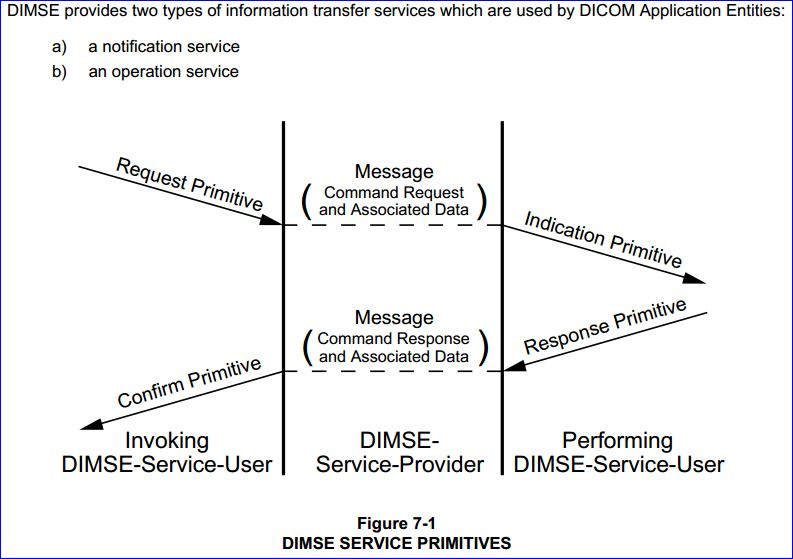
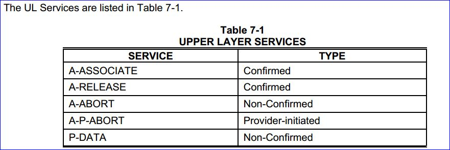
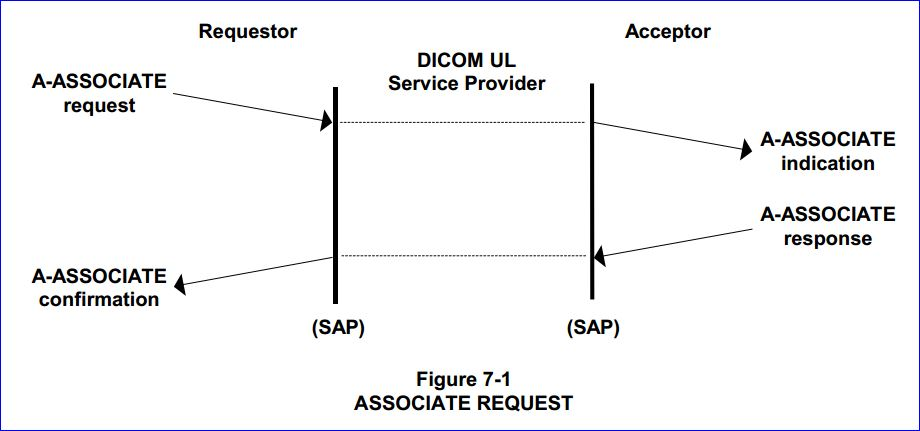
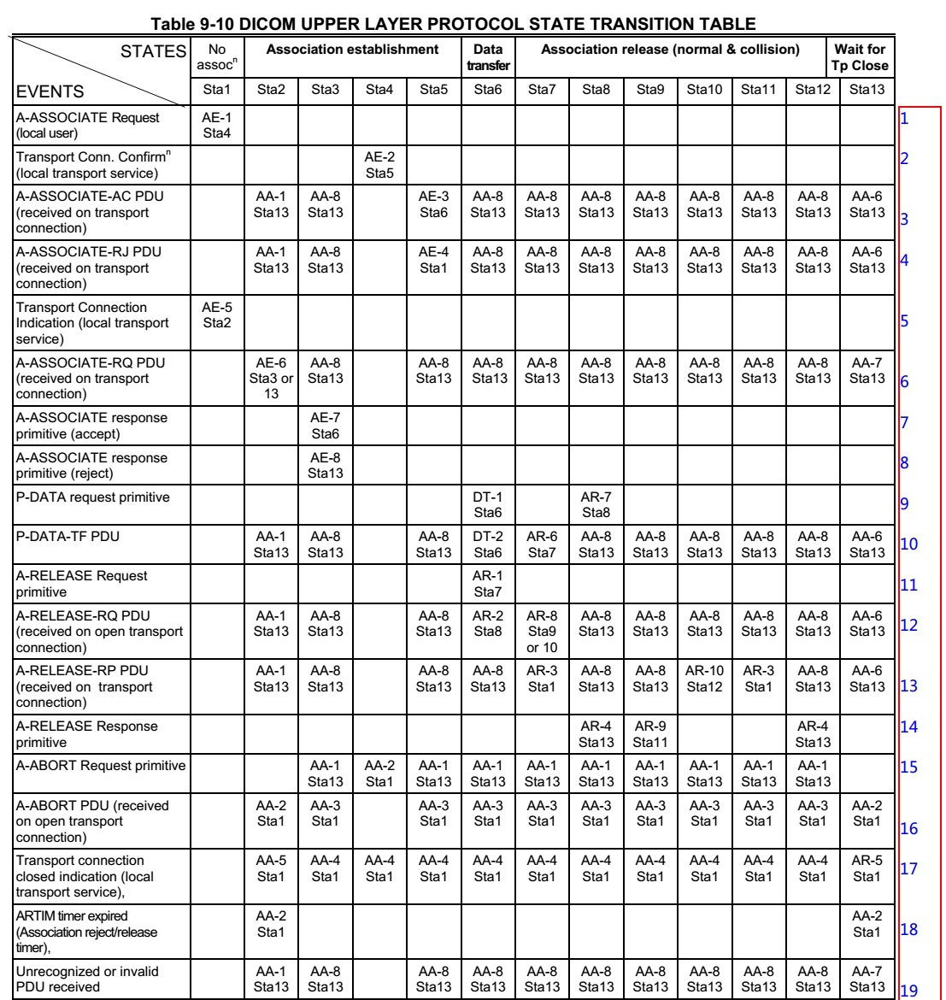
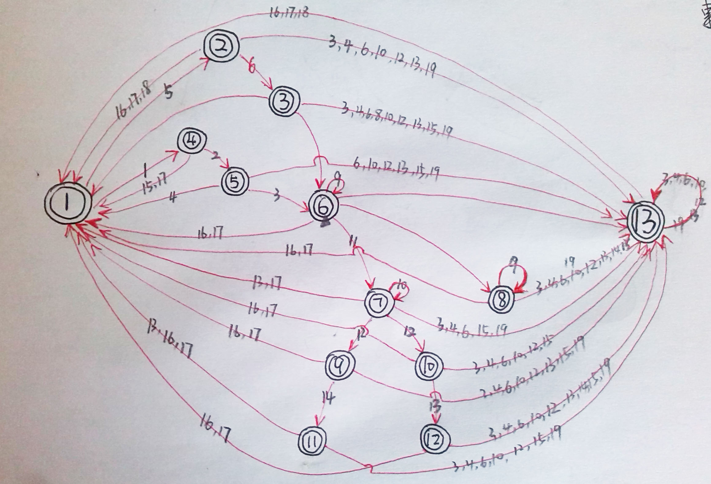

## 题记：

近一年来一直坚持周末写博客，整理工作和闲暇之余的点点滴滴。对于新知识点、新技术的涉猎会单独成文，因此与DICOM相关的知识统一放在了**DICOM医学图像处理** 专栏里，其实DICOM英文全称是Digital Imaging and Communications in Medicine，即医学数字成像和通信。这就表明DICOM标准至少应该分成**图像处理**和**网路通信**两大部分。之前也探讨过**[DICOM医学图像处理：DICOM网络传输](http://blog.csdn.net/zssureqh/article/details/41016091)** 的问题，总而言之由于历史原因和自身懒惰一直没有抽出精力再开一个专栏，暂且如此吧。虽然没有重新开专栏，但是为了方便大家分类查阅，在2015新一年里我将按照标题前缀来简单划分一下类别：与图像处理相关的，诸如压缩/解压缩、字段增删改、图像数据处理，专栏博文标题继续以原本的**DICOM医学图像处理：** 为前缀，而与DICOM网络传输相关的将前缀更换为更简洁的**DICOM：**。  

## 背景：

之前博文中专门梳理过DICOM标准中与网络传输相关的内容（详情参见：**[DICOM医学图像处理：全面解析DICOM3.0标准中的通讯服务模块](http://blog.csdn.net/zssureqh/article/details/39098621)** 、**[DICOM医学图像处理：DICOM网路传输](http://blog.csdn.net/zssureqh/article/details/41016091)** ），近期在重新整理fo-dicom开发的PACS相关测试用例时，对fo-dicom和mDCM两个库进行了再一次比较，与此同时重新翻阅了DICOM3.0标准中的部分章节，发觉之前曾经忽略了其中的很多细节，特编写此文。一来对之前该系列博文的疏忽和BUG进行补充修复，二来加深一下DICOM网络传输的了解。  
**PS:** DICOM医学图像处理专栏中的每一篇文章成文之前，我都尽我所能查阅、翻译相关资料，编写、调试本地示例，以求文章的高质量，但毕竟个人时间和精力所限，博文中难免会有纰漏，建议阅读时请尽可能先浏览该主题的最新发表博文，因为那里往往会给出之前博文中的错误。另外如果发现问题欢迎留言或邮件交流。  

## DICOM网络传输：

### DIMSE：

DICOM3.0标准的第7部分标题为“Message Exchange”，从标题可以看出第7部分着重介绍DICOM协议中的网络传输部分。官方对于该部分的介绍如下：

>   
> This Part of the DICOM Standard specifies the **DICOM Message Service Element (DIMSE)** . The DIMSE defines an Application Service Element (both the **service** and **protocol**) used by peer DICOM Application Entities for the purpose of exchanging medical images and related information.  
>   
> The DIMSE provides its services by relying on the **DIMSE protocol**. The DIMSE protocol defines the encoding rules necessary to construct Messages. A Message is composed of a Command Set (defined in this part of the DICOM Standard) followed by a conditional Data Set (defined in PS 3.5).  
>   
>   

按照之前[DICOM医学图像处理：全面分析DICOM3.0标准中的通讯服务模块](http://blog.csdn.net/zssureqh/article/details/39098621)中的描述，将DIMSE归类为**表示层**，用于指出DICOM协议中提供的各项基础服务，也就是DIMSE Protocol中规定的 **服务原语** （Service Primitives），为对等DICOM 应用实体（Application Entity）之间交流服务。如下图所示：  
  
  
这里所谓的DICOM Application Entity，从**实际**来看就是我们现实生活中看到的使用DICOM标准的各种软件或应用，也可以指安装此软件或应用的设备；从**概念** 来看，就是由DICOM3.0标准中的第3部分（Information Object Definitions）、第4部分（Service Class Specifications）、第5部分（Data Structure and Encoding）、第6部分（Data Dictionary）共同定义出的模型。  
DIMSE中消息由指令（Command）和数据集（Data Set）构成，详细结构这里就不介绍了，有兴趣可翻阅DICOM3.0标准第7部分第6.3章节。这里我们主要介绍一下DIMSE协议规定的服务，为了更好地理解下文，在阅读之前请转到**“知识点补充”**一节，熟悉相关概念，了解彼此之间的区别，尤其是SCP（Service Class Provider）与DIMSE-Service-Provider、SCU（Service Class User）与DIMSE-Service-User。  
DIMSE消息服务元素支持对等DIMSE-Service-User之间交互，其中对DIMSE-Service-User双方分别扮演invoking DIMSE-service-user和performing DIMSE-service-user角色。这与我们常提到的SCU和SCP相似，一方触发（invoking)，一方响应(performing）。虽然双方扮演的角色不同，但是名称中都带有user，意思就是说双方都是DIMSE协议的使用者，这就是与传统SCU、SCP容易混淆的地方。具体的区别可参见**“知识点补充”**一节。  
DIMSE提供的两种服务示意图如下：  
  
  
DIMSE服务是在连接建立基础之上，即DIMSE层下方是DICOM Upper Layer Protocol层，关于DICOM Upper Layer协议的介绍在DICOM3.0标准中第8部分。

### DICOM Upper Layer Service：

DICOM3.0标准第8部分标题为“Network Communication Support for Message Exchange”，该部分描述了DICOM应用实体间用于通信（Communicaton）的通用服务（generic services）。该类服务与OSI模型中的会话层、表示层和应用层相关，DICOM标准将其统一称之为UL Service，该服务是ACSE服务（Association Control Service Element）和OSI表示层服务的子集。刚刚上文提到的DICOM标准第7部分中详细介绍如何使用Upper Layer Service来完成DICOM应用实体间的交互。  
UL Service上层服务包括A-ASSOCIATE、A-RELEASE、A-ABORT、A-P-ABORT、P-DATA五种，如下图所示：  
  
  
对于上图中的各种服务，DICOM3.0第8部分给出了详细定义，例如在对等DICOM实体间交互使用的各种参数。这里以A-ASSOCIATE为例简单介绍一下，如下图所示：  
  
  
上图是A-ASSOCIATE服务的整个流程，从图中可以更清晰、更直观的看出之前invoking DIMSE-service-user/performing DIMSE-service-user与SCU/SCP概念之间的区别，图中左右两侧的Requestor和Acceptor（左右两侧都是协议栈的上层N）相对于中间（中间是协议栈中的下层N-1）来说都是服务的使用者，即invoking DIMSE-service-user和performing DIMSE-service-user。而如果从服务实现角度来看一方是请求端（Requestor），一方是响应端（Acceptor），也就是DICOM中最常见到的SCU和SCP。

### DICOM Upper Layer Protocol for TCP/IP：

服务是建立和依托于协议之上的，DICOM标准第8部分第9章着重介绍了DICOM UL Service使用的协议。UL Protocol建立在TCP/IP协议之上，在网络交互中DICOM上层实体（即DICOM UL entity）由系统指定的端口号来标定。因此在通信过程中需要建立TCP连接，一个TCP链接应当只支持一个且仅有一个DICOM UL Association。

### DICOM Upper Layer State Machine：

与传统TCP连接建立相似，当DICOM上层实体欲建立一个链接时，会发出TRANSPORT CONNECT请求原语到TCP传输层。一旦接收到TCP传输层的连接确认语义，此时会在建立起的TCP连接上发送A-ASSOCIATE-RQ PDU。  
连接建立后，在TCP连接之上传输PDUs（PDU的结构详细介绍参照DICOM3.0标准第8部分第9.3节）遵循**DICOM上层协议状态机** ，即**DICOM Upper Layer State Machine** 。状态机（尤其是有限状态机，Finite State Machine）是软件工程领域的一种重要工具，很多应用的模型都是状态机，例如代码的编译，在《编译原理》一书中有对状态机的介绍；例如数字电路（单片机/嵌入式开发）中，各种事务和中断之间的时序逻辑设计；乃至我们当今使用的计算机就是使用有限状态机作为计算模型的等等。百度百科中对于有限状态机FSM，Finite State Machine的介绍如下：  

>   
> 除了建模这里介绍的反应系统之外，有限状态自动机在很多不同领域中是重要的，包括电子工程、 语言学、计算机科学、哲学、生物学、数学和逻辑学。有限状态机是在自动机理论和计算理论中研究的一类自动机。在计算机科学中，有限状态机被广泛用于建模应用行为、硬件电路系统设计、软件工程，编译器、网络协议、和计算与语言的研究。  
>   

DICOM UL Service Protocol是建立在TCP协议之上的，TCP协议通常使用一个具有[11种状态的有限状态机](http://www.2cto.com/net/201111/112030.html)11种状态的有限状态机来表示，在DICOM3.0标准第8部分第9.2章节中给出的DICOM Upper Layer State Machine使用了多大13中状态（State）来描述整个流程。与其相关的事件（Event）有19种，可触发的动作（Action）多达28种，整个状态转移表相当复杂，如下图所示：  
  
  
DICOM3.0标准中给出的是一张二维状态转移表，查看起来比较累，不够直观，下图是我手绘的状态机转换图，由于手头没有顺手的UML建模工具只能手绘，大家就将就看看吧。  
  
  
上图中的圆圈代表的是DICOM Upper Layer Protocol的各种状态，带箭头的连线是个状态之间的转换，箭头连线上的数字分别代表各种触发状态改变的事件。理解了上图就应该理解了整个DICOM通讯建立的基本流程，由于时间关系在本博文中就不对该状态图详细展开了，后续博文中会以fo-dicom、dcmtk为实例详细介绍状态图中的各种状态。  

## fo-dicom实例讲解：

之前专栏里介绍过fo-dicom的设计结构，这里简单的说一下其中关于DICOM网络通讯服务的基类是DicomService，至于实例讲解部分，这里先做个预告，下一篇博文中再详细介绍。

## 知识点补充：

### 协议Protocol：

协议Protocol：这里的协议指的是计算机领域的网络协议（其他非相关领域，诸如贸易之类的，请大家自行脑补，我不懂）。协议为计算机网络中进行数据交换而建立的规则、标准或约定的集合。由三个要素组成，即语义、语法和时序。百度百科的描述为：  

>   
> (1) 语义。语义是解释控制信息每个部分的意义。它规定了需要发出何种控制信息，以及完成的动作与做出什么样的响应。  
> (2) 语法。语法是用户数据与控制信息的结构与格式，以及数据出现的顺序。  
> (3) 时序。时序是对事件发生顺序的详细说明。（也可称为“同步”）。  
> 人们形象地把这三个要素描述为：语义表示要做什么，语法表示要怎么做，时序表示做的顺序。  
>   

### 服务原语Service Primitive：

服务原语（Service Primitives）：用户和协议实体间的接口,实际上是一段程序代码，但其具有不可分割性。通过服务原语能实现服务用户和服务提供者间的交流。服务原语只有四种类型，分别是**请求（Request）、指示（Indication）、响应（Response）、确认（Confirm）。**  
**【注】：** 与协议不同的是，服务原语用于服务提供者与服务用户，而协议是用于服务用户之间的通信.协议是控制对等实体之间通信的规则，是水平的。服务是下层通过层间接口向上层提供的功能，是垂直的。协议的实现保证了能够向上一层提供服务，要实现本层协议还需使用下层提供的服务。  

### DICOM中各种user/provider：

*   **DIMSE-service-user**：that part of an application entity which makes use of the DICOM Message Service Element.  
    
*   **DIMSE-service-provider**： an abstraction of the totality of those entities which provide DIMSE services to peer DIMSE-service-users.  
    
*   **invoking DIMSE-service-user**：the DIMSE-service-user that invokes a DIMSE operation or notification.  
    
*   **performing DIMSE-service-user**：the DIMSE-service-user that performs a DIMSE operation or notification invoked by a peer DIMSE-service-user.  
    
*   **Service Class User**：role of an Application Entity that uses a DICOM network service;typically, a client. Examples: imaging modality (image storage SCU, and modality worklist SCU),imaging workstation (image query/retrieve SCU)  
    
*   **Service Class Provider**： role of an Application Entity that provides a DICOM network service; typically, a server that performs operations requested by another Application Entity(Service Class User). Examples: Picture Archiving and Communication System (image storage SCP, and image query/retrieve SCP), Radiology Information System (modality worklist SCP).  
    

**【注】：** 要区分invoking DIMSE-service-user/performing DIMSE-service-user与Service Class SCU/Service Class SCP就需要提到上文中的协议（Protocol）和服务（Service）。以OSI开放模型中的七层协议为例，invoking DIMSE-service-user/performing DIMSE-service-user的命名方式是以服务和协议角度出发，模型上层依赖于模型下层，在对等实体中所有对等实体两端的DIMSE上层（DIMSE-service-user）都是DIMSE下层（DIMSE-service-provider）服务的使用者；Service Class SCU/Service Class SCP是从现实建模角度出发，将DICOM网络通信对等实体两端分别看成服务使用者和服务提供者。  

### 状态机State Machine：

**状态机中的状态(State):**状态，State，就是一个系统在其生命周期中某一时刻的运行情况，此时系统会执行一些动作，或者等待一些外部输入。  
**状态机中的事件(Event):**事件，Event，就是在一定时间和空间上发生的对系统有意义的事情。  
**状态机中的动作(Action):**当一个事件被状态机系统分发，即响应该事件，此刻系统会通过相关动作来完成响应。