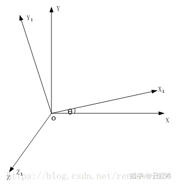
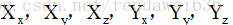

转自：[Dicom中的Image Orientation/Position的理解 - 知乎](https://zhuanlan.zhihu.com/p/368456396 "Dicom中的Image Orientation/Position的理解 - 知乎")

在DICOM中，是通过Image Position和Image Orientation来描述当前的图像和人体坐标系的相对位置的。

打开DCM文件时，会发现下边的两个tag

(0020,0032) DS ImagePosition(Patient) "-20.000000\\-150.000000\\150.000000 "

(0020,0037) DS ImageOrientation(Patient) "0.000000\\1.000000\\0.000000\\0.000000\\0.000000\\-1.000000"

也就是这两个tag来描绘出当前图像的位姿情况，也就是用这两个量来进行定位线的计算，VR，MPR的空间计算。

要想理解这两个量，首先要搞明白在三维空间中的坐标变换，这个变换包括位置变换和姿态的变换，也就是运动学中常常称作的位姿变换。首先有原始坐标系o，

​

​​其中，O₁坐标系是绕z轴以O系统的基础上旋转了θ的一个角度，我们可以把这个矩阵记录为

​

，那么依次类推，通过一系列这样的变换，我们可以得到最终的变换矩阵为

​。

这里，我们把T记为

但是我们知道我们图像是一个2维的量，由于当前图像像素点的z方向坐标相对于当前图像的坐标系的值都为0，当前图像的坐标点可以用(x,y,0)的向量来表示，表示在齐次坐标方式就为（x,y,0,1）。那么，这时想要计算出图像上的某个点相对于原始坐标系的坐标，就直接和转换矩阵T相乘即可，记为

​

所以，Image Orientation的6个量就显而易见为

​

。Image Position中的三个量为

​

原始坐标系，规定人体的左边是X轴的方向，从面部指向背部的方向表示y轴的方向。Dicom中规定的坐标系是以人坐标系为绝对坐标系的。

下面给一个旋转坐标推导的实例，

## 1 VR应用中由A（从前胸方向）方位转换到H（从头方向）位置的转化

A 从前胸方向

H 从头的方向

## 2 旋转矩阵推导过程

2.0 Step0 原始坐标系展示

体数据位姿

旋转矩阵

2.1 Step1 绕X轴旋转90度

体数据位姿

旋转矩阵

2.2 step2 绕z轴旋转再旋转180度

体数据位姿

旋转矩阵

最后得到旋转矩阵，

​

这个矩阵的含义是，Step2后的坐标系，相对于原始坐标系的旋转矩阵。在实际的项目中，可以直接用此矩阵来和体数据中的像素点的坐标进行相乘，就能得到体数据中像素的坐标点在原始坐标系中的坐标。