# Fo-Dicom开源库的模块划分
DICOM（Digital Imaging and Communications in Medicine）是医学图像和相关信息的国际标准，广泛应用于医学影像领域。FO-DICOM是一个开源的DICOM库，提供了丰富的功能和模块，用于处理DICOM数据、实现DICOM网络通信、对图像数据进行处理等。在本文中，我们将介绍FO-DICOM库中各个模块的功能和特点，帮助读者了解如何利用FO-DICOM库进行DICOM数据的处理和应用开发。

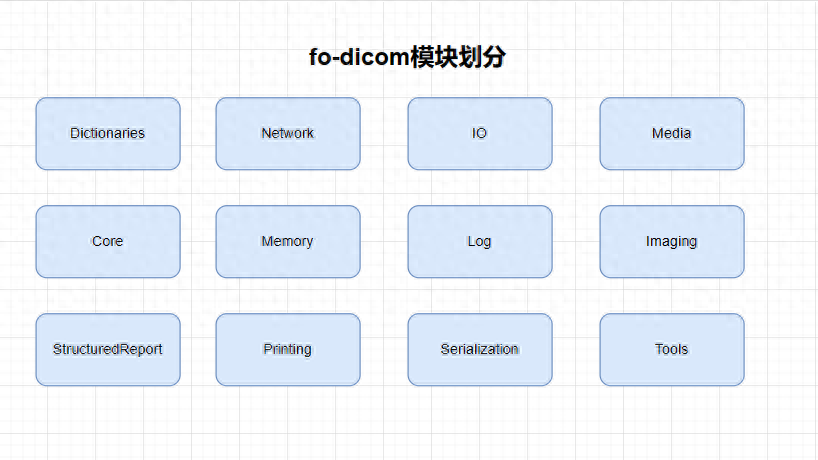

### 1\. Dictionaries

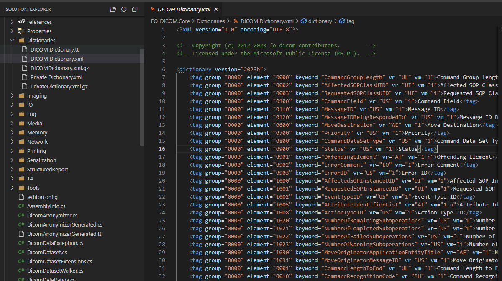

*   **内容**：包含DICOM标准中使用的数据元素的定义和描述，例如标签、VR（值表示）、描述等。
*   **举例**：DICOM数据元素的定义和描述，如（0010,0010）Patient’s Name，VR为PN，描述为"Patient’s Name"。

### 2\. Network

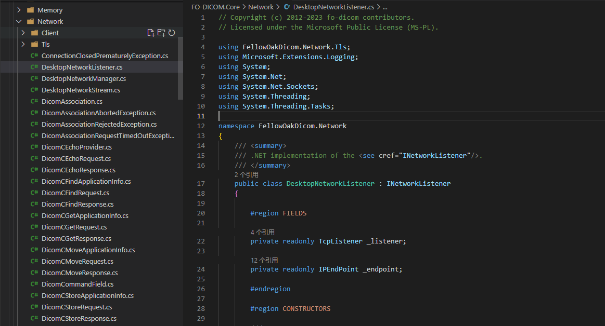

*   **内容**：实现了DICOM网络通信协议，包括服务类用户（SCU）和服务类提供者（SCP）的功能。
*   **举例**：实现了DICOM网络通信协议，包括C-ECHO、C-FIND、C-MOVE等服务类的功能。

### 3\. IO

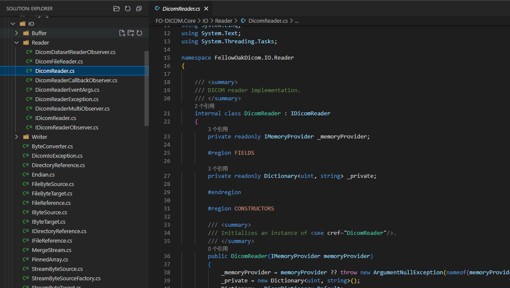

*   **内容**：提供了对DICOM文件的输入输出操作，包括读取和写入DICOM文件的功能。
*   **举例**：读取和写入DICOM文件的功能，包括读取和解析DICOM文件，以及创建和写入DICOM文件。

### 4\. Media

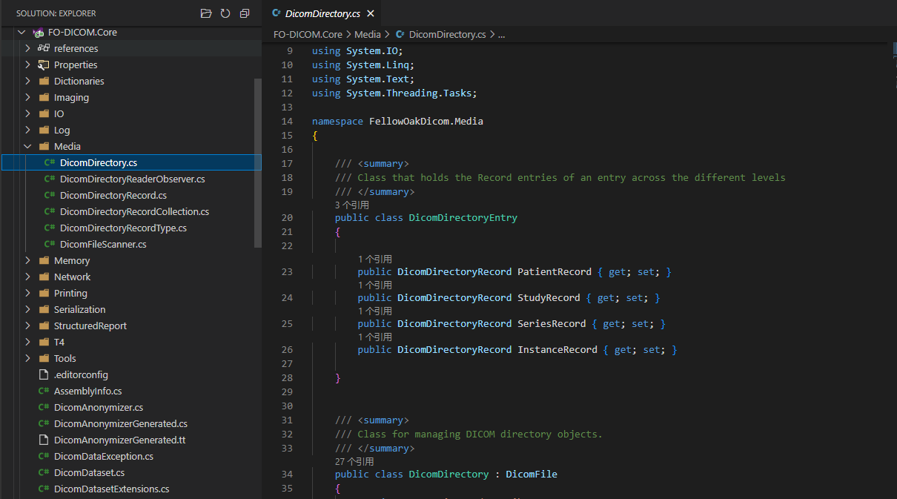

*   **内容**：包含了DICOM介质存储相关的功能，例如读取和写入DICOM介质存储的数据。
*   **举例**：读取和写入DICOM介质存储的数据，例如读取和解析DICOM光盘中的数据，以及将数据写入DICOM介质存储设备。

### 5\. Core

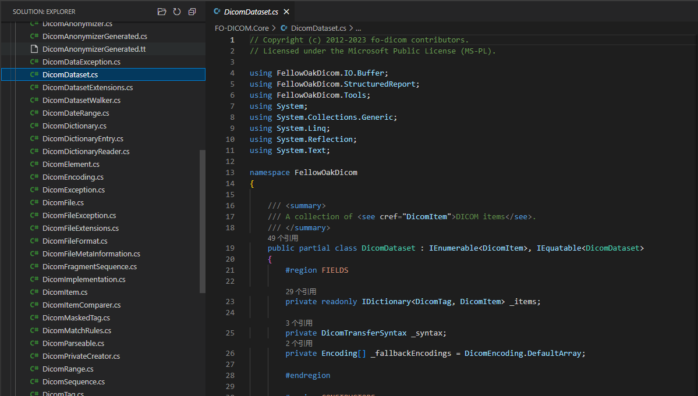

*   **内容**：包含了DICOM数据模型的核心实现，包括数据集、元素、值表示等。
*   **举例**：实现了DICOM数据模型的核心功能，包括数据集的创建、元素的访问和修改，以及值表示的解析和处理。

### 6\. Memory

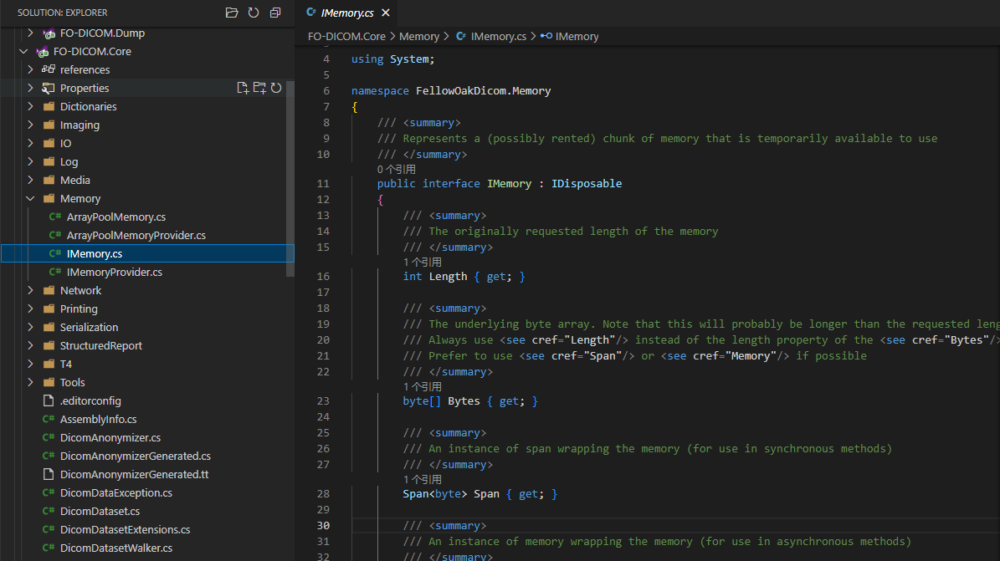

*   **内容**：提供了对内存中DICOM数据的操作和管理功能。
*   **举例**：对内存中DICOM数据的操作和管理功能，包括内存中图像数据的加载、存储和释放。

### 7\. Log

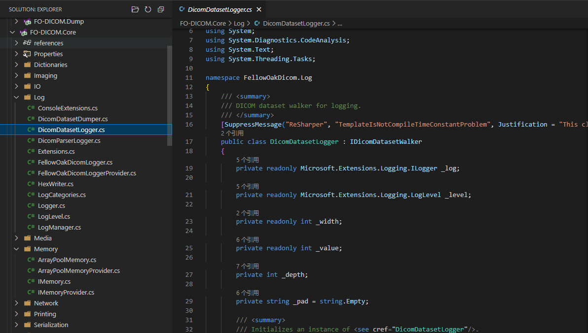

*   **内容**：提供了日志记录和输出功能，用于记录库的运行状态和调试信息。
*   **举例**：记录库的运行状态和调试信息，包括输出运行日志、错误日志等。

### 8\. Imaging

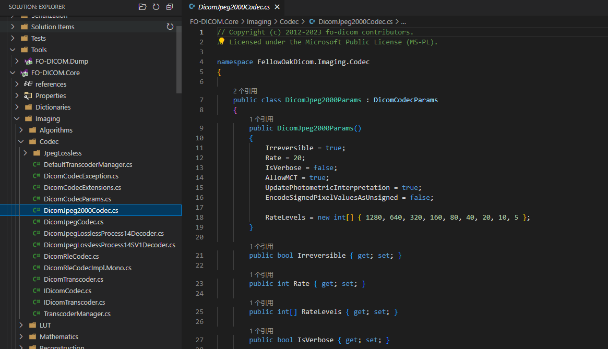

*   **内容**：包含了对DICOM图像数据的处理和显示功能。
*   **举例**：对DICOM图像数据的处理和显示功能，包括图像解码、显示、调整和分析。

### 9\. StructuredReport

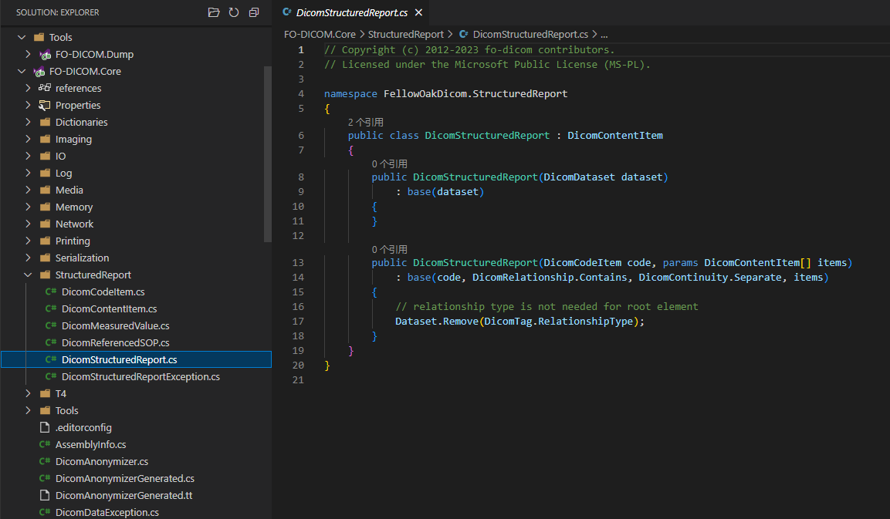

*   **内容**：提供了对结构化报告的解析和处理功能。
*   **举例**：对结构化报告的解析和处理功能，包括提取报告中的信息、解析报告的结构等。

### 10\. Printing

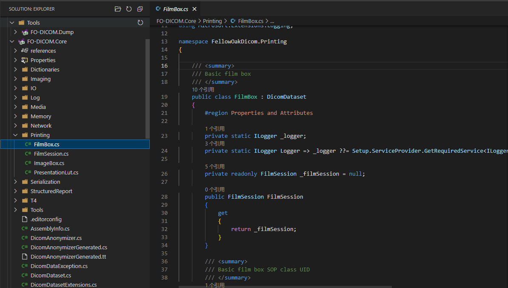

*   **内容**：实现了DICOM打印协议相关的功能，包括打印图像和报告。
*   **举例**：实现了DICOM打印协议相关的功能，包括打印图像和报告到DICOM打印设备。

### 11\. Serialization

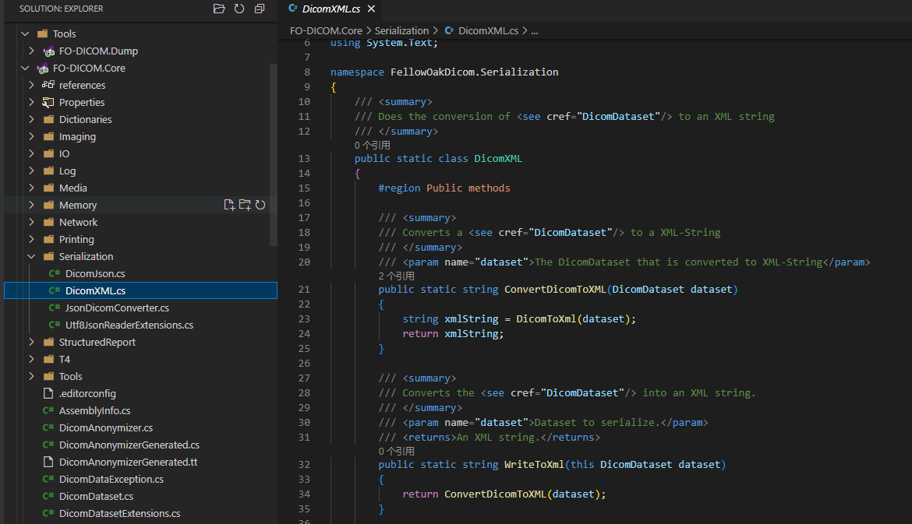

*   **内容**：提供了DICOM数据的序列化和反序列化功能。
*   **举例**：提供了DICOM数据的序列化和反序列化功能，包括将DICOM数据序列化为字节流，以及将字节流反序列化为DICOM数据。

### 12\. Tools

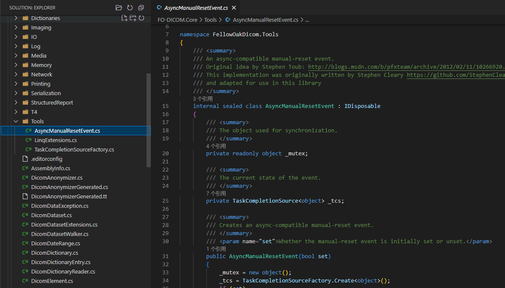

*   **内容**：包含了一些辅助工具和实用程序，用于辅助DICOM数据的处理和应用开发。
*   **举例**：包含了一些辅助工具和实用程序，如DICOM文件查看器、数据转换工具等，用于辅助DICOM数据的处理和开发应用程序。

以上是对FO-DICOM中每个模块的简要介绍，每个模块都承担着不同的功能和责任，共同构成了FO-DICOM库的完整功能。