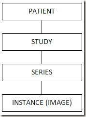

**概要**

在用DCMTK库来写query和retrieve的时候，查询条件的定义不是很清楚。那么，DICOM的query和数据库的select 有什么区别呢?

Query即C-Find, Retrieve 即C-Move, 在放射影像设备、系统中是仅次于C-store（发送影像）应用最多的命令, 相较c-sore, c-find/c-move 要复杂很.....

**Query/retrieve 简化序列图 (只有一个c-move-rsp 回合)**

对于SCU (发起方)

通俗来讲Query 是指请求对方系统把 请求某个级别(Patient/Study/Series/Image)的信息传送给自己。当然也可以进行关联查询要求对方把各个级别的信息都返回给自己。

Retrieve是指SCU通过Query 拿到信息后，要求对方根据请求级别 (Patient/Study/Series/Image) 发送影像给己方。

对于SCP (服务提供方)

需要提供各个级别的服务供SCU Query/Retrieve.

**C-Find/C-Move 有几个重要的概念**

一个是 **模型**（Information model）,

Patient root

Study root

Patientstudy root

一个是 **级别**（Query/retrieve level）

Patient level, study level, series level, image level

Patient root 下可有包含patient Level 在内的四个level

Study root 下只有三个level, study root 下不能q/r patient level 信息与影像。

**C-find**

既然需要依据某个条件查询一组或某个patient/study/series/image, 必须需要一个或一组查询键值, 同时需要告诉对方应该返回什么, 还有怎样区分每组数据。DICOM 中定义的query key, return key and unique key.

Unique key 为 patient id, study instance UID, series instance UID, SOP instance UID.

Query key 对应每个level 有不同的值，常见的比如检查级的studydate, 序列级的modality等，具体参见DICOM和IHE.

Unique key 必须在返回列中，否则SCU无法区分各组数据。

有些Q/R SCP 支持关联查询，SCU 可以根据Study level的query key来获取series.

**C-move 相对简单**

SCU 发送请求前，启动一个storage SCP 用于接收影像，

依据c-find 的返回结果，读取unique key,

Patient root

Patient level Patient id

Study level patient id, study instance UID

Series level patient id, study instance UID, series instance UID

Image level patient id, study instance UID, series instance UID, SOP instance UID

Study root

Study level study instance UID

Series level study instance UID, series instance UID

Image level study instance UID, series instance UID, SOP instance UID

每个level, 自己及上一个级别的unique key 必须提供作为query key.

C-move 中还有一个概念叫Retrieve Destination AE. 通俗讲，就是告诉对方应该发送影像到什么地方。对于SCU, 通常它可以让他发送给自己，也可以让它发送给另一个AE（甚至另一台机器，系统）。这一点也是C-move 和C-Get的区别所在，C-get 只能要求对方发给自己。

Q/R SCU告诉对方(Q/R SCP) unique key 和retrieve destination, SCP通过解析retrieve destination AE title 获取在SCP方注册的IP和端口，发送影像至此storage SCP, 同时发送c-move-rsp 到 Q/R SCU. 当影像发送结束后会发送实际统计结果至Q/R SCU.

我们来一个简单有查询定义:

~~~csharp
// Fill the query object
DCXOBJ obj = new DCXOBJ();
DCXELM  el = new DCXELM();

el.Init((int)DICOM_TAGS_ENUM.QueryRetrieveLevel);
el.Value = "PATIENT";
obj.insertElement(el);

el.Init(0x00100010);
el.Value = "R*";
obj.insertElement(el);

el.Init(0x00100020);
obj.insertElement(el);

el.Init((int)DICOM_TAGS_ENUM.PatientsSex);
obj.insertElement(el);

el.Init((int)DICOM_TAGS_ENUM.PatientsBirthDate);
obj.insertElement(el);
~~~
相对应的SQL语句就是:

~~~csharp
SELECT [PATIENT NAME] , [PATIENT ID], [PATIENT SEX], [PATIENT BIRTH DATA]
FROM PATIENT
WHERE [PATIENT NAME] like "R%"
~~~
下面是Study层次的实例图
|   |   |
| --- | --- |
| // Fill the query objec tDCXOBJ obj = new DCXOBJ(); DCXELM el = new DCXELM(); |   |
| el.Init((int)DICOM_TAGS_ENUM.studyInstanceUID); obj.insertElement(el); | SELECT\[STUDY INSTANCE UID\], |
| el.Init((int)DICOM_TAGS_ENUM.StudyDate); obj.insertElement(el); | \[STUDY DATE\], |
| el.Init((int)DICOM_TAGS_ENUM.StudyDescription); obj.insertElement(el); | \[STUDY DESCRIPTION\], |
| el.Init((int)DICOM_TAGS_ENUM.ModalitiesInStudy); obj.insertElement(el); | \[MODALITIES IN STUDY\] |
| el.Init((int)DICOM_TAGS_ENUM.QueryRetrieveLevel); el.Value = "STUDY"; obj.insertElement(el); | FROM STUDY |
| el.Init((int)DICOM_TAGS_ENUM.patientName); el.Value = "REIMOND^GOLDA"; obj.insertElement(el); | WHERE\[PATIENT NAME\] = ‘REIMOND^GOLDA’ |
| el.Init((int)DICOM\_TAGS\_ENUM.patientID); el.Value = "123456789"; obj.insertElement(el); | AND\[PATIENT ID\] = ‘123456789’ |

以上例子就相当于是

~~~csharp
SELECT [PATIENT NAME] , [PATIENT ID], [STUDY INSTANCE UID], [STUDY DATE], [STUDY DESCRIPTION], [MODALITIES IN STUDY]
FROM STUDY
WHERE [PATIENT NAME] = ‘REIMOND^GOLDA’ AND [PATIENT ID] = ‘123456789’
~~~
以下是where时候的参照表

|   |   |   |
| --- | --- | --- |
| 符号 | 意思 | 相当于SQL 的意思 |
| \* | 零个或更多的字符，简单的说n个字符. | WHERE PATIENT NAME LIKE “COHEN%” |
| ? | 一个字符 | “COH?N” 可以符合 “COHEN” 和 “COHAN” 还有这个 “COH N”我不建议使用这个 |
| \- | 对于时间和日期来的描述FROM – TO 以下格式YYYYMMDD-YYYYMMDD | WHERE STUDY DATE BETWEEN 19950101 AND 20110911 |
| YYYYMMDD- | WHERE STUDY DATE >= 19950101 |
| \-YYYYMMDD | WHERE STUDY DATE <= 20110911 |
| \\ | 符合条件的值LOCALIZER\\AXIAL | WHERE IMAGE TYPE in (‘LOCALIZER’, ‘AXIAL’) |

以下这张图展示了query的level

以下是一个模型来验证query的level

|   |   |   |   |
| --- | --- | --- | --- |
| **UID** | **Name** | **Query Levels** | **Comment** |
| **1.2.840.10008.5.1.4.1.2.1.1** | **Patient Root Query/Retrieve Information Model - FIND** | **PATIENT****STUDY****SERIES****IMAGE** | **Use it!** |
| **1.2.840.10008.5.1.4.1.2.1.2** | **Patient Root Query/Retrieve Information Model - MOVE** | **PATIENT****STUDY****SERIES****IMAGE** | **Use it!** |
| **1.2.840.10008.5.1.4.1.2.2.1** | **Study Root Query/Retrieve Information Model - FIND** | **STUDY****SERIES****IMAGE** | **Use it if Patient root doesn’t work for you** |
| **1.2.840.10008.5.1.4.1.2.2.2** | **Study Root Query/Retrieve Information Model - MOVE** | **STUDY****SERIES****IMAGE** | **Use it if Patient root doesn’t work for you** |
| **1.2.840.10008.5.1.4.1.2.3.1** | **Patient/Study Only Query/Retrieve Information Model - FIND (Retired)** | **PATIENT****STUDY** | **Don’t use** |
| **1.2.840.10008.5.1.4.1.2.3.2** | **Patient/Study Only Query/Retrieve Information Model - MOVE (Retired)** | **PATIENT****STUDY** | **Don’t use** |

**参考资料**

1、[http://dicomiseasy.blogspot.com/2012/01/dicom-queryretrieve-part-i.html](http://dicomiseasy.blogspot.com/2012/01/dicom-queryretrieve-part-i.html)

２、[http://blog.csdn.net/lucky2all/article/details/3307753](http://blog.csdn.net/lucky2all/article/details/3307753)