下文中的worklist交互的测试数据，请在资源中下载，需要wireshark将文件打开，并且加入过滤条件ip.addr == 192.168.2.193 and tcp.port == 104 ，并且选择dicom协议。

##  0. Modality Worklist通讯

&nbsp;&nbsp;&nbsp;&nbsp;&nbsp;&nbsp;&nbsp;&nbsp;在DICOM通讯中，当数据通过TCP层后，数据流就进入了DICOM的会话层（ACSE），详细介绍可在标准第８章中。ACSE(Association Control Service Element)，包含了7种类型的协议数据单元，分别是A-ASSOCIATE-RQ PDU（Protocol Data Units），A-ASSOCIATE-AC PDU，A-ASSOCIATE-RJ PDU，P-DATA-TF PDU，A-RELEASE-RQ PDU，A-RELEASE-RP PDU，A-ABORT PDU。这些服务数据单元构成了ACSE服务组。解析数据流时，当第一个字节的值是4的时候，就代表PDU是一个P-DATA类型，应当由DIMSE层来处理；相反，如果是其他值，就属于a-associate-rq, a-associate-rj, a-associate-ac, a-release-rq, a-release-rsp, a-abort6种类型PDU中的一种，直接在ACSE层内进行处理。具体的解析过程，本文以一个Modality Worklist（C-Find）的例子来介绍，如下图：

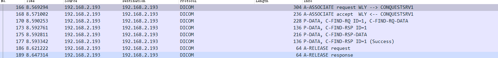
Worklist 消息交互过程

## 1. A-ASSOCIATE-rq

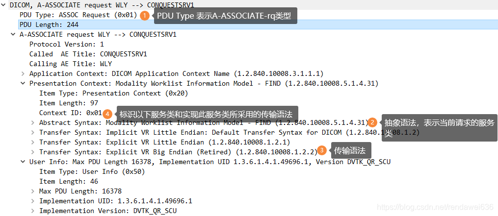
图：A-ASSOCIATE-rq 字段说明

&nbsp;&nbsp;&nbsp;&nbsp;&nbsp;&nbsp;&nbsp;首先由SCU向SCP发起建立连接建立连接请求，此过程主要是要协商是否能够提供此服务，以及在实际通讯中所使用的传输语法，传输语法主要是指显式或者隐式VR以及大小尾编码方式；从上图中可以看出，在1标记处，能看到PDU的Type是0x01，是A-ASSOCIATE-req类型的PDU；SCU的AE Title是WLY（占用16个字节），SCP的AE Title是CONQUESTSRV1（占用16个字节）；之后有32个字节的保留区域不存放任何信息；
### 1.1 请求头
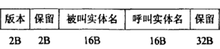
图：A-ASSOCIATE-rq 字节流占位

具体的字节占位，请看下图中所示： 
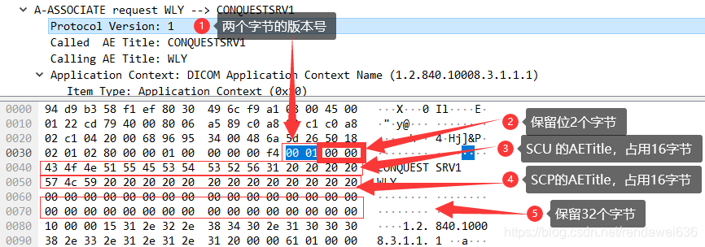
图：A-ASSOCIATE-rq 二进制流占位

### 1.2 应用上下文（类型=0x10）

&nbsp;&nbsp;&nbsp;&nbsp;&nbsp;&nbsp;&nbsp;&nbsp;&nbsp;应用上下文，大家可以不必关注，这个只是标识DICOM通讯类型的标识，所有通讯都是一致的；下图是应用上下文的二进制的占位

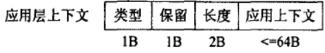
应用上下文二进制流占位

具体的二级制流如下
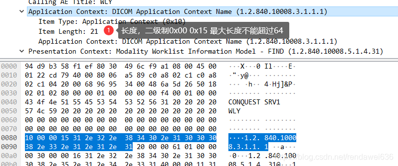
图：应用上下文二进制流

### 1.3 表示上下文（类型=0x20）

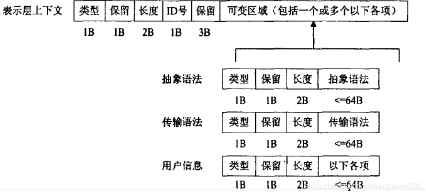
图：表示上下文二进制流占位

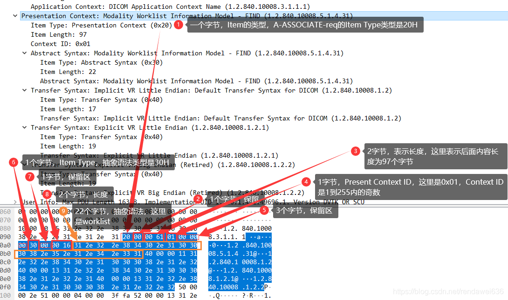
图：表示上下文二进制流

### 1.4 User Info（类型=0x50）

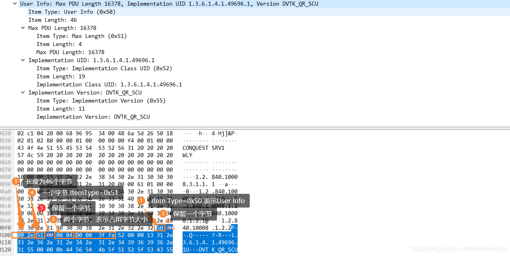
图：User Info 二进制流

通过对request的分析后，后续的PDU将只针对内部关键的信息进行说明。

## 2. A-ASSOCIATE-ac

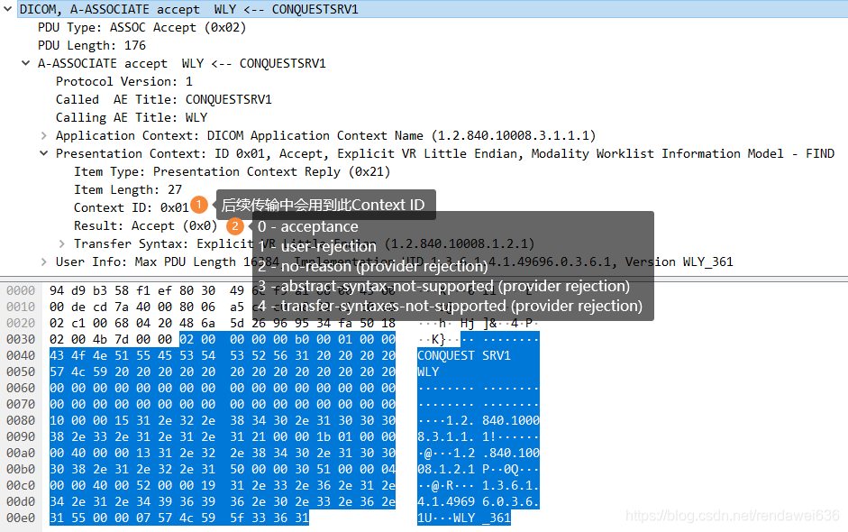
A-ASSOCIATE-ac 二进制流

## 3. A-ASSOCIAT-rj PDU

## 5  A-RELEASE request

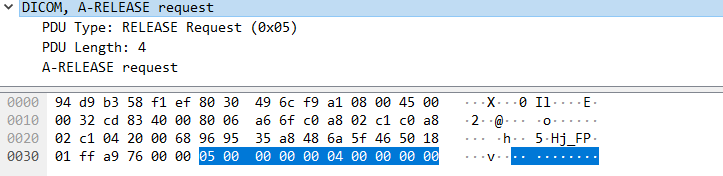
图：A-RELEASE request

## 6  A-RELEASE response
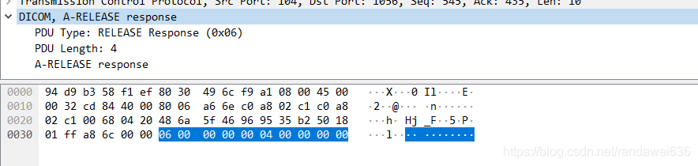
图：A-RELEASE response

## 7  A-ABORT

## 4. P-DATA-TF PDU （C-FIND-RQ）**
### 4.0 DICOM数据通讯概要介绍
&nbsp;&nbsp;&nbsp;&nbsp;&nbsp;&nbsp;&nbsp;DICOM通讯和TCP IP的设计原理别无二致。从**用户数据**发送到网络上的数据的过程中，要经历多层协议处理，每经一层，就会加入用来描述当前层含义的数据字段，例如，我们熟悉的TCP层，会在用户的数据流前，加入目标端口，源端口，TCP层用来模拟链接通道的Sequence Number和Acknowlegment Number等的字段。

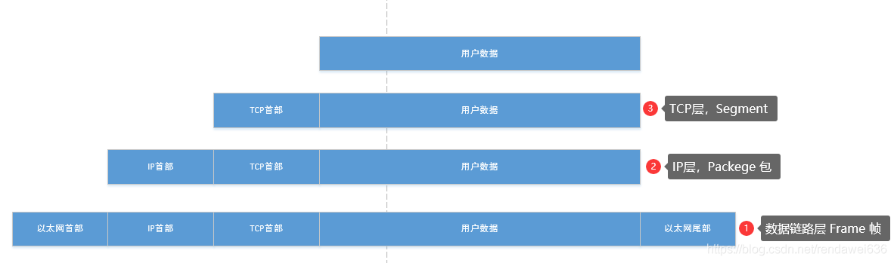
TCP IP协议栈示意图

&nbsp;&nbsp;&nbsp;&nbsp;&nbsp;&nbsp;&nbsp;&nbsp;在DICOM通讯中，当数据通过TCP层后，数据流就进入了DICOM的会话层（ACSE）。解析数据流时，当第一个字节的值是4的时候，就代表PDU是一个P-DATA类型，应当由DIMSE层来处理；

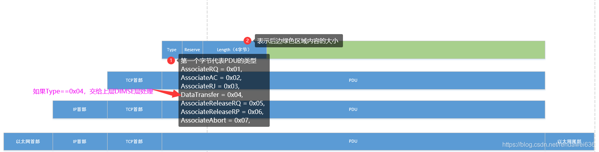

ACSE层数据流示意图

&nbsp;&nbsp;&nbsp;&nbsp;&nbsp;&nbsp;&nbsp;&nbsp;&nbsp;&nbsp;当会话层接收到PDU，并且PDU的Type是4的时候，ACSE层协议，擦掉PDU头信息（去掉6个字节），将信息流变为PDVs（Presentation Data Values ）后，将数据流交给表示层来解析。详细介绍，可参考第七章。在表示层DIMSE层中，提供了C-Find, C-Store, C-Move, C-Get, C-Echo, N-EVENT-REPORT， N-GET，N-SET， N-CREATE， N-DELETE， N-ACTION 11种类型的服务，这些服务成为了DIMSE服务组。

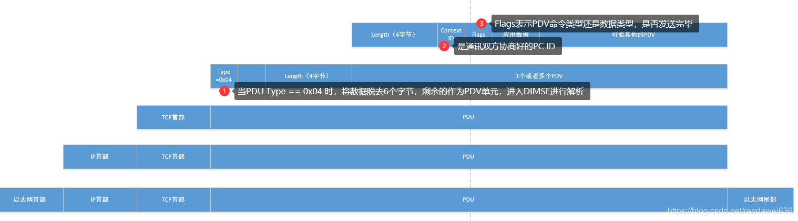

DIMSE层数据流示意图

 能标识当前PDV是什么类型，数据流中，有一个Flags标识，具体的含义见下图。DIMSE中消息由指令（Command）和数据集（Data Set）构成。

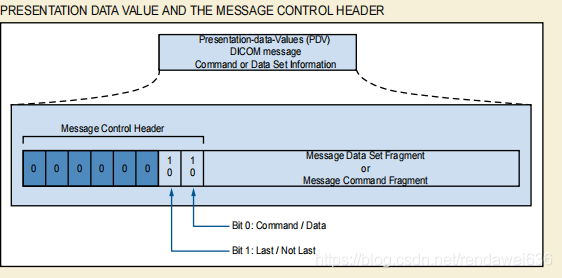
图：PDV类型含义

### 4.1 P-DATA-TF PDU （C-FIND-RQ、C-FIND-RQ-DATA）
&nbsp;&nbsp;&nbsp;&nbsp;&nbsp;&nbsp;&nbsp;SCU发送端WLY向SCP服务端CONQUESTSRV1发送C-FIND的DIMSE消息，服务端解析当前的PDU，发现其类型是0x04。那么，后续的解析工作，就将PDU的头信息去掉后，交给DIMSE层来进行处理，详细的解释见下图，其中，橘黄色2位置，表示当前的PDV是一个命令集。在命令集中，请求的Message ID是1，注意，服务方要对当前的请求进行应答，必须也要携带此Message ID，来表示应答信息是对此请求进行的响应。

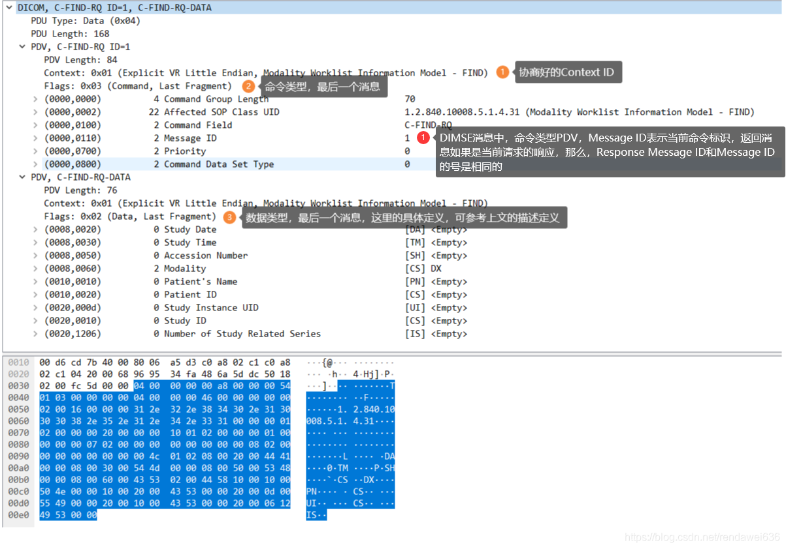
图：Worklist请求信息组成的PDU二进制流

### 4.2 P-DATA-TF PDU （C-FIND-RSP）

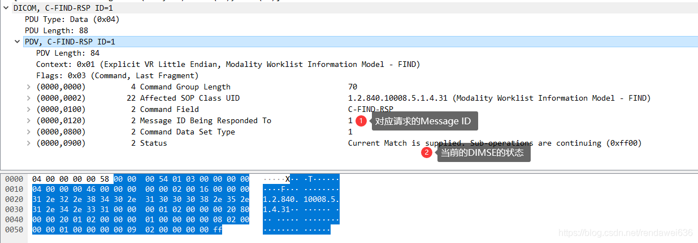
图：C-FIND-RSP的命令集二进制流

&nbsp;&nbsp;&nbsp;&nbsp;&nbsp;服务端接收到C-FIND-RQ后，将回复请求端信息。在回复命令信息中，Status是一个重要的概念，如果是Pending，表示对应客户端请求（回复数据流的Message ID Being Responsed To的值和请求端的Message ID的值相同）的回复数据流还未结束。具体的含义，可以在第4章中进行查询。下边给出Status的可能的值

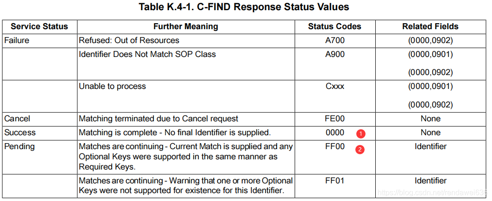
图：C-FIND Response中的Status的值

### 4.3  P-DATA-TF PDU（C-FIND-RSP-DATA）
该PDV是数据集，存放的是从服务端返回的查询结果

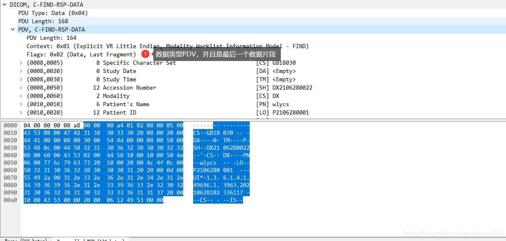
图：服务端回复客户端查询信息的数据集二级制信息流

### 4.4 P-DATA-TF PDU （C-FIND-RSP）
该PDV是命令集，【标识】对应MessageID=1的查询已结束

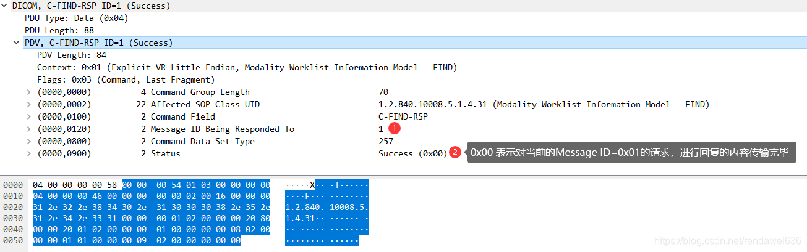
图：回复命令集二进制流
