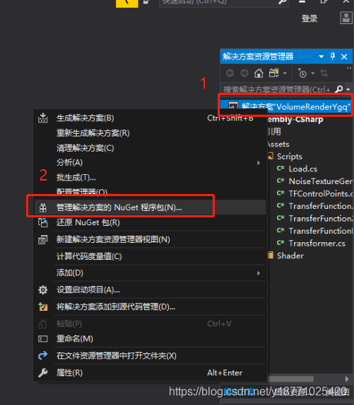
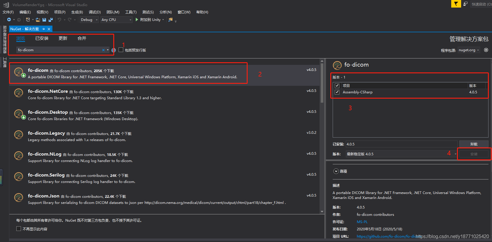

# 安装fo-dicom

### 在vs中安装fo-dicom

*   点击解决方案，右键选择管理解决方案的NuGet程序包  
    
    
*   打开窗口后，在浏览框输入fo-dicom进行搜索，然后选择fo-dicom，勾选后点击安装即可  
    
    

# 读取Dicom文件并获取PixelData信息

我是对一个文件夹中的多个Dicom文件进行遍历读取，也可以访问单个，自行修改

详细细节看**代码以及注释**，代码如下（部分代码可能需要根据自己的数据修改）：

**使用到的库文件，有些可能用不上**
~~~csharp
using Dicom;
using Dicom.Imaging;
using Dicom.Imaging.Render;
using System;
using System.Collections.Generic;
using System.IO;
using UnityEditor;
using UnityEngine;
~~~

实现代码
~~~csharp
string path = @"D:\DICOM";            //Dicom文件存储路径
//读取Dicom文件
if (!path.Equals(string.Empty))       //判断Dicom文件夹是否为空
{
    DirectoryInfo root = new DirectoryInfo(path);    //获取指定路径下的文件目录
    foreach (FileInfo f in root.GetFiles())//遍历文件夹下的每个文件
    {
        string filename = path + "\\" + f.Name; //得到单个文件的文件路径名
        var dcmFile = DicomFile.Open(filename); // 打开dcm文件
        var pixelData = PixelDataFactory.Create(DicomPixelData.Create(dcmFile.Dataset), 0); //获取第0帧的pixeldata，想获取其他帧修改即可，我的数据只有一帧，返回IPixelData类型      
        //获取单个Dicom数据中，（w，h）处的像素信息             
        if (pixelData is Dicom.Imaging.Render.GrayscalePixelDataS16)
        {
            float[] pixel_data = new float[pixelData.Width * pixelData.Height]; //存储本dcm文件所有点的像素  
            for (int w = 0; w < pixelData.Width; w++)
            {
                for (int h = 0; h < pixelData.Height; h++)
                {
                    float pixel = Convert.ToSingle(pixelData.GetPixel(w, h));//将获取到的像素转换为float类型
                    pixel_data[w * 512 + h] = pixel;
                }
            }
        }
    }
}
~~~