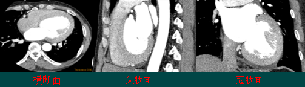
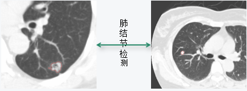
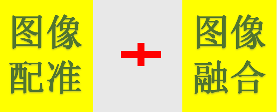

​

 转自：[医学影像后处理技术超详细收藏版（上）](https://mp.weixin.qq.com/s/wPXTteugHTWM0-9GZmJclA "医学影像后处理技术超详细收藏版（上）")

***导语：***

医学图像后处理是通过综合运用计算机图像处理技术，医学知识，将由各种数字化成像技术所获得的人体信息按照一定的需要在计算机上表现出来，使之满足医疗需要的一系列技术的总称。

*   弥补影像设备成像不足
    
*   提供解剖学信息和病理生理学信息
    
*   打破传统的医学获取和观察方式
    
*   提供包括三维可视化、图像分割、病变检测和图像融合配准的高级应用
    

**一、医学影像后处理功能**

两个大方向：辅助观察和辅助诊断

辅助观察是通过向医生提供更多的观察方式，给医生更多的参考，有利于医生更加快速做出正确的诊断。

辅助诊断是提供给医生一些诊断的建议，包括测量得到的数据、分割和检测的结果，以及融合配准后新图像的信息。

辅助观察有：

1、多平面重建(Multi-Planar Reformation, MPR)

MPR是把横断面的像素叠加起来回到三维容积排列上，根据需要组成的不同方位，重新组合新的断层图像。

​

较好地显示组织器官内复杂解剖关系，弥补横断图像观察的不足，有利于病变的准确定位。

2、曲面重建(CPR)

CPR与MPR类似，不同点是叠加成三维容积排列后，重新选取截面时按曲线走行。

​

优点：帮助医生在短时间内观察和研究血管组织。

缺点：重建路径的偏差对较小病灶容易遗漏或造成假性狭窄。

3、表面遮盖(SSD)

SSD是提取组织结构边缘的体素信息，把容积数据转换为一系列多边形表面片拟合的等值面，然后根据光照、明暗模型进行消隐和渲染。

​

编辑

用途：胸腹大血管、肺门及肺内血管、肠系膜血管、肾血管及骨与关节的三维显示。

缺点：容易造成虚假显示或显示面上产生空洞，且无法显示数据体内部的细节信息。

4、最大密度投影(MIP)

MIP是沿着虚拟的操作者视线方向，将相对密度最高的体素值投射到屏幕上，而形成的新的投影平面。

​

编辑

优势：较真实的反映组织的密度差异，主要用于显示具有相对较高密度的组织结构。

用途：观察血管的狭窄、扩张、充盈和缺损，可发现血管钙化，显示骨折情况，反映骨密度变化，清晰显示对内固定装置。

5、最小密度投影(MinIP)

MinIP与MIP相似，是将每一条沿视线方向所遇到的体素最小值投影到二维平面上，从而形成MinIP重建图像。

​

编辑

优势：主要用于显示密度差异较大的低密度结构组织，典型应用于肺疾病检测。

用途：肺部气管直观、立体的显示；肺气肿、间质性肺炎等弥漫性肺疾病诊断；屏蔽肺血管和肺裂等高密度结构；在术前为外科医生提供有价值的指导信息。

6、容积重现(VR)

VR是沿着虚拟操作者视线方向，将容积数据的所有体素的颜色和透明度的进行融合后，投射到屏幕上，实现三维显示。

​

编辑

优势：最大限度的保留了原始数据的细节，能够显示具有高质量的三维立体空间关系组织，而且操作简便。

用途：用于血管、骨骼、关节、尿路、支气管树、肌束的三维显示。

7、虚拟内窥镜(VE)

VE是利用医学影像作为原始数据，融合图像处理、计算机图形学、科学计算可视化、虚拟现实技术，模拟传统光学内窥镜的一种技术。

​

编辑

优势：克服传统光学内窥镜需要插入体内的缺点，是一种完全无接触的检查方法。

用途：应用于辅助诊断、手术规划、实现手术的精确定位和医务人员的培训等；可用于具有空腔结构的器官检查。

辅助诊断包括：

1、测量

图像测量是指对图像中目标或区域的特征进行测量，包括图像的灰度特征、纹理特征和几何特征。

​

编辑

​

编辑

定量分析腔体、肿瘤的体积，血管的直径，三维区域的平均密度；

二维基础上的距离、面积、角度和统计分布等测量；

三维基础上的空间距离、曲线长度、表面积和体积等测量；

鉴别有无病变、病灶的大小和空间方位，提供定性诊断及预测的参考依据。

2、分割

根据目标物体特征，把图像划分为若干个互不相交的区域，使得这些特征在同一区域内，表现为一致性或相似性，在不同区域表现明显不同。

​

编辑

可辅助医生进行诊断和制定对病人的治疗方案；

用于医学图像的分析，如三维重建；

用于计算机引导于术，如外科手术的制定，病理的研究；

有利于数据的压缩和传输，提高在PACS和远程传输的应用。

3、检测

计算机辅助检测是利用先进的计算机软硬件来分析和处理医学图像，以发现并检出病变，从而辅助医生临床诊断，提高工作效率。

方法：特征分析法、双能量减影法和时间减影法。

应用：乳腺、胸部。

检测(作用)

乳腺：可提供乳腺癌诊断的敏感度，降低致密型乳腺内病变、直径小的钙化灶、导管内癌及浸润性导管癌的漏诊率。

​

编辑

胸部：胸片的心脏和肺野的自动分析，肺结节、气胸的检测，肿块和钙化的分类、鉴别。

​

编辑

4、配准融合(配准)

配准：是指对于一幅医学图像采用一种(或一系列)空间变换，使它与另一幅医学图像上的对应点达到空间上的一致。

​

编辑

融合：将两幅(或两幅以上)来自不同成像设备或不同时刻获取的已配准图像，采用某种算法把各个图像的优点或互补性有机结合起来，获得信息量更为丰富的新图像技术。

​

编辑

用于临床医疗诊断

用于外科手术、放射治疗计划的制定

病理变化的跟踪和治疗效果的评价

勾画肿瘤的轮廓线

计算放射剂量的大小及剂量分布

**二、医学影像后处理应用**

医学影像后处理已经可以应用到大部分组织器官的影像结果分析中，针对不同部位的不同疾病都有特定的方法和流程来进行分析。

1、脑部

a、脑部灌注增强造影

脑部的生理性功能活动以及病理活动与组织血流微循环状态密切相关。

脑部灌注增强造影对脑部组织生理、病理变化非常敏感。

可了解血液动力学及功能上的变化。

可比CT平扫等常规影像技术更早更准确地诊断脑组织缺血等疾病。

**灌注成像的理论基础**

核医学放射性示踪剂稀释理论以及中心容积定律：

血容量=血流量×平均通过时间

通过直接测量CT值随时间的变化曲线获得组织内碘对比剂浓度随时间变化的曲线(Time-Density Curve, TDC)，从而获得：

*   脑血流量(Cerebral Blood Flow, CBF)
    
*   脑血容量(Cerebral Blood Volume, CBV)
    
*   平均通过时间(Mean Transit Time, MTT)
    
*   达峰时间(Time TO Peak, TTP)
    

表1 脑局部缺血的病理生理变化

​

编辑

表2 脑梗死前期脑局部缺血影像分期

​

编辑

**灌注图像后处理算法**

最大斜率法

​

编辑

最大斜率法把器官或组织看作一个“黑箱”，示踪剂经由一条动脉进入“黑箱”，然后快速渗透到毛细血管和细胞外间质中，经过很短的一段时间后开始从一条静脉随血流流出。

组织中的对比剂总量等于流入的对比剂总量减去流出的对比剂总量。

去卷积法

​

编辑

模型原理：

房室模型的一种，研究器官或组织的系统响应函数。对理想状态下，瞬时注射单位质量的示踪剂产生的组织增强曲线，即组织的脉冲响应函数(IRF)进行处理。脉冲响应函数反映了物质在组织中随着时间的分布情况 。

**灌注图像后处理结果**

​

编辑

CT脑灌注分析参数结果伪彩图(CBF，CBV，MTT，TTP)

​编辑

MR灌注分析参数结果伪彩图(CBF，CBV，MTT，TTP)

心脏

影像诊断方式

*   X射线(X-Ray)
    
*   超声心动图(Ultrasonic Echocardiogram, UCG)
    
*   心血管造影(Angiography)
    
*   血管内超声(Intravascular Ultrasound, IVUS)
    
*   放射性核素检查
    
*   核磁共振(Magnetic Resonance, MR)
    
*   计算机断层(Computed Tomography, CT)
    

影像诊断缺点

*   只能定性观察，没有定量信息
    
*   严重依赖医生的经验和能力
    
*   影像诊断早期困难
    
*   影像诊断受医生个人工作状态影像严重
    

心脏CAD

*   心脏组织自动分割
    
*   血管树解析
    
*   血管病变组织检测与分析
    

&nbsp;&nbsp;&nbsp;&nbsp;&nbsp;&nbsp;&nbsp;&nbsp;&nbsp;------血管狭窄度检测与分析

&nbsp;&nbsp;&nbsp;&nbsp;&nbsp;&nbsp;&nbsp;&nbsp;&nbsp;------血管斑块检测与分析

心脏组织自动分割

心脏组织自动分割包括：左心房、左心室、右心房、右心室、升主动脉和左右冠状动脉的分割。

​编辑

心脏VR视图可直观展示各支冠脉血管与心脏的对应关系。其劣势是无法显示血管腔内病变，且有些冠状动脉无法得到最佳显示角度。

​编辑

冠状动脉的VR视图只显示部分升主动脉和冠状动脉血管，可转动图像至最佳角度显示需要观察的冠状动脉。

血管树解析

血管树的解析过程是冠脉中心线的自动提取和分析的过程。

​编辑

在心血管的狭窄分析与检测、虚拟内窥镜自动导航漫游、冠状动脉多平面重建的视图显示、血管曲面重建等图像几何形态分析及相关领域中，管状器官的中心线具有非常广泛的应用。

血管病变组织检测与分析

血管狭窄度检测与分析

直径(面积)测量法：

将狭窄处官腔直径(面积)与相邻近端和远端正常官腔直径作比较，得出比值。

​编辑

狭窄度评判标准：

*   狭窄度<30%，认为正常；
    
*   狭窄度<50%且>30%，认为轻度狭窄；
    
*   狭窄度<70%且>50%，认为中度狭窄；
    
*   狭窄度>70%，认为重度狭窄。
    

血管病变类型：

*   A型病变：指不连续(<10mm)、同心等病变；
    
*   B型病变：指连续(10~20mm)、偏心等病变；
    
*   C型病变：指弥漫性病变(>20%)、远端极度扭曲等病变。
    

CT评价血管钙化的量化分析方法：

*   Agatston积分法
    
*   容积积分法
    
*   质量积分法
    

血管的边缘性测量：

*   粗糙度
    
*   圆度
    
*   丰度
    
*   椭圆度
    

​编辑

肺

肺癌的发病率和死亡率持续上升。

肺癌在男性肿瘤疾病中已居首位，在女性中仅次于乳腺癌。

我国肺癌患者居世界首位。

有效手段是“早期发现、早期诊断、早期治疗”。

X射线和CT。

肺CAD

*   肺功能分析
    

&nbsp;&nbsp;&nbsp;&nbsp;&nbsp;-----肺功能定量分析

&nbsp;&nbsp;&nbsp;&nbsp;&nbsp;-----肺气肿检测

*   肺结节检测
    

&nbsp;&nbsp;&nbsp;&nbsp;------结节提取

   ------结节定量分析

   ------结节随访

肺功能分析

肺功能定量分析

平均CT值、容积、标准方差、面积、气体容积、组织容积、组织重量、密度以及不同像素区间的百分比。

​

编辑

肺气肿检测

包括肺气肿区域检测和肺气肿定量分析，其定量分析指标有肺气肿体积、肺气肿区域百分比、严重程度和是否存在肺大泡。

​

编辑

肺气肿的CT影像表现为灰度值低于肺实质的黑色大泡。一般采取基于图像灰度的方法检测肺气肿。

肺结节检测

结节提取：

&nbsp;&nbsp;&nbsp;&nbsp;&nbsp;-------结节检测

&nbsp;&nbsp;&nbsp;&nbsp;&nbsp;-------结节分割

结节定量分析：

结节的CT均值、CT最大值、CT最小值、体积、重量、中心位置像素坐标等信息。

结节随访：

同时观察新旧两套肺CT序列，配准两套数据的结节，评估结节的倍增率和倍增时间。

结肠

计算机断层扫描结肠成像（Computed Tomography colonography, CTC）是一种微创技术，是一种替代光学结肠镜检查结直肠息肉的方法 。

2D横截面CT图像或者结肠内空气3D表面的形式呈现。

与光学结肠镜检查方式相媲美。

多层螺旋CT带来大的数据量。

电子清肠

*   部分容积图像分割法
    
*   区域增长与Level Set相结合方法
    
*   基于形状信息的分割方法
    
*   双能量CT(Dual-Energy Computed Tomography, DECT)
    

结肠CAD(虚拟内窥)

虚拟内窥功能包括沿着中心线方向的虚拟自动漫游，以及手动漫游。

​

编辑

结肠CAD(虚拟切开)

结肠虚拟切开包括“立方体虚拟切开”来显示360 度的三维全景和切开在一个平面上显示的整个结肠二维全景。

​

编辑

结肠CAD(息肉检测)

结肠息肉指的是隆起于结肠黏膜表面的边界清楚的病灶，根据病变性质及形态特征，为分为腺瘤和息肉两大类。

​

编辑

虚拟结肠镜和光学结肠镜下的息肉

泌尿

*   慢性肾脏病(chronic kidney disease, CKD)患者已占到人口的7%~10%，其中，美国成人CKD的患病率约为11%，我国南方城市人群调查显示CKD的患病率为10.1%。
    
*   尿毒症属于慢性肾衰竭不断发展过程中的最后阶段，是严重危害人类生命健康的几大杀手之一。
    
    ​
    
    编辑
    

影像学测量肾小球率过滤的研究现状

CT检查：

依据在于每个像素内平扫和增强前后CT值变化与对比剂浓度成比例，利用所得到CT值可计算肾脏的对比剂清除率。

方法：Patlak曲线法、改良的Patlak曲线方法，Lee三室模型，以及Lee三室RPF模型等等。

MR检查：

MR动态对比增强成像序列有良好的时间、空间分辨率，快速成像序列可接近实时监测Gd对比剂在肾内的转运过程。

方法：Gates’法类似模型，重叠合法，两室模型Baumann、Rudin方法和Patlak-Rutland方法及多室动力学模型方法。

肾小球率过滤的测量

*   GFR测定过程中的医学概念
    
    红细胞压积值：
    
    红细胞压积值(hematocrit, HCT)：又称红细胞比容 / 比积，也称血细胞比容，红细胞压积值，是值红细胞占血浆的百分比。
    

四肢

骨密度测量(Bone Mineral Density, BMD)

图像拼接

肾小球滤过率：

是指单位时间从肾小球滤过的血浆容量(ml/min)。

*   GFR的测量
    
    \------自动测量GFR
    

&nbsp;&nbsp;&nbsp;&nbsp;------手动测量GFR

骨密度测量

*   骨质疏松症
    

&nbsp;&nbsp;&nbsp;&nbsp;&nbsp;&nbsp;&nbsp;------骨密度降低所引发的主要病症

&nbsp;&nbsp;&nbsp;&nbsp;&nbsp;&nbsp;&nbsp;------高骨折风险

*   股骨近端和腰椎发生骨折的危险最高
    
*   欧盟: 每年约400,000例
    

&nbsp;&nbsp;&nbsp;&nbsp;&nbsp;&nbsp;&nbsp;------与年龄相关(骨折易发年龄: 

&nbsp;&nbsp;&nbsp;&nbsp;&nbsp;&nbsp;&nbsp;&nbsp;&nbsp;&nbsp;&nbsp;&nbsp;&nbsp;&nbsp;&nbsp;&nbsp;女40%, 男13%, >50 岁)

骨密度测量(方法)

*   X射线摄片
    
*   光子吸收法
    
*   双能X射线吸收法
    
*   超声测量法
    
*   定量CT(Quantitative Computed Tomography, QCT)
    

QCT测量骨密度

对平片的手动测量

BMD = a × CTValue + b

​

编辑

对三维重建序列的测量

&nbsp;&nbsp;&nbsp;&nbsp;&nbsp;-----测量部位的分割

&nbsp;&nbsp;&nbsp;&nbsp;&nbsp;-----皮质骨与松质骨的分离

&nbsp;&nbsp;&nbsp;&nbsp;&nbsp;-----数值的测量

​

编辑

图像拼接(背景)

图像拼接是将数张有重叠部分的图像(可能是不同时间、不同视角或者不同传感器获得的)拼成一幅大型的无缝高分辨路图像的技术。

​

编辑

图像拼接(结果)

​

编辑

小结：

明天更新医学影像后处理技术超详细收藏版（下）

​