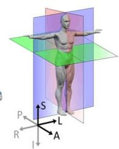
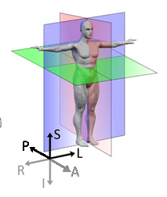
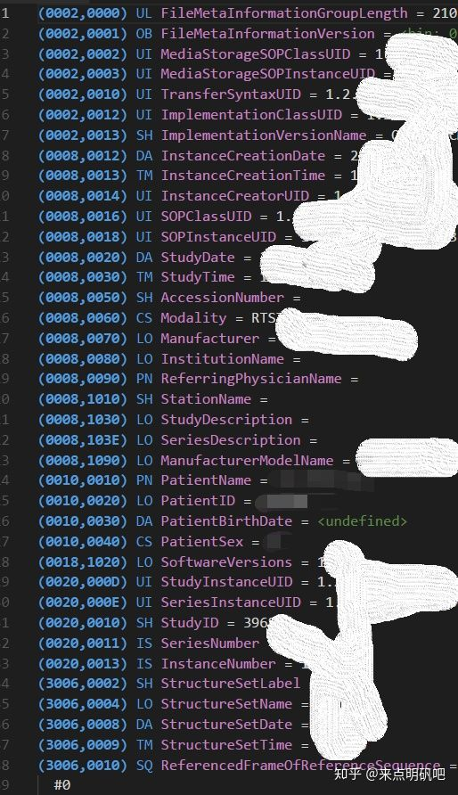
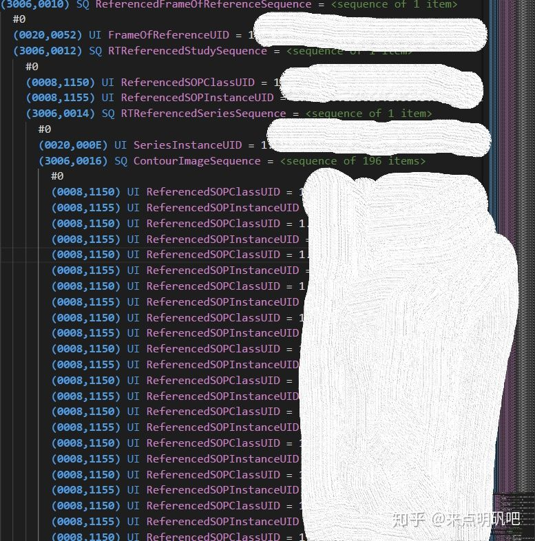
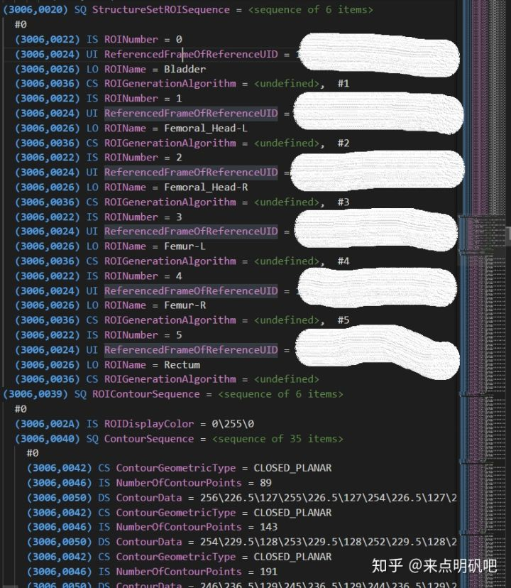
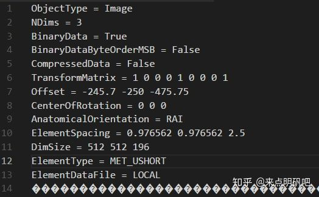
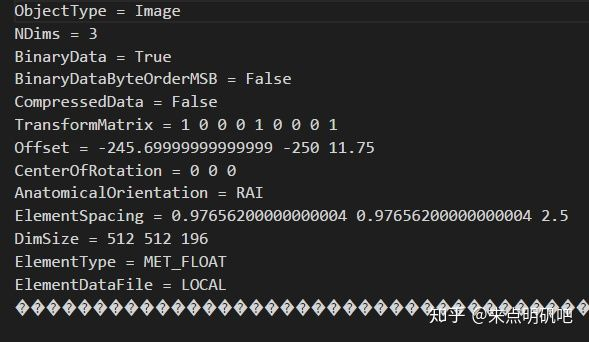

## 转自：[医学影像处理相关知识整理（一） - 知乎](https://zhuanlan.zhihu.com/p/77791840 "医学影像处理相关知识整理（一） - 知乎")

## **Segmentation to RT structure**

近日做医疗影像处理相关的内容，感慨于这方面资料不全、散碎，遂记录自己获得的一些资料以供日后查阅。

## **DICOM**

DICOM 是医学图像和相关信息的国际标准，它定义了满足临床需要的可用于数据交换的医学图像格式，被广泛用于放射、成像的诊疗诊断设备。也就是说，在医院放射科使用的设备上读取的影像基本都是DICOM格式，包括CT、MRI、超声等。

DICOM格式的图像，每一张都带有除像素（体素）信息之外的大量信息。其信息组成主要有以下几部分：

*   **Patient**：病人信息
*   **Study**：诊疗信息，如检查时间、检查部位、ID等
*   **Series**：序列号、图像坐标信息等。图像坐标信息主要关注：
    *   **SliceThickness**：层厚，即每张切片之间的间距
    *   **ImagePositionPatient**：该张切片坐标原点（图像左上角，二维图中向下为y轴，向右为x轴）在空间中的坐标（x，y，z）
    *   **ImageOritentationPatient**：六元组，当前切片的x、y轴与解剖学坐标系间的关系。

> 此处涉及矢状面、冠状面、横断面  
> 简单的记忆方式是：矢状面即一支箭射中人所形成的面，正中二分人体。  
> 冠状面可想象古代官帽，从头顶向地面的切面。  
> 横断面即腰斩平面。  
> 在下图中，红色切面为矢状面，紫色切面为冠状面，绿色切面为横断面。

 

常见应为下图，即LPS


> 六元组所表示的，即是与这三个面的夹角关系，以余弦值呈现。  
> 影像上，正方向为L、S、P。  
> 用（x1，x2，x3，y1，y2，y3）来表示的话，x1、x2、x3分别表示x轴与L、P、S间的夹角余弦值，y1、y2、y3则表示y轴与L、P、S间的夹角余弦值。  
> 使用这个六元组可以判断图像区域是否为矩形（两向量点乘为0），以及与解剖学坐标的关系。当这个六元组只含有0、1、-1时，代表切片一定与某解剖学平面平行。  
> 更多内容可以参见此博客，讲解得很详细。  
> [https://blog.csdn.net/zssureqh/article/details/61636150](https://link.zhihu.com/?target=https%3A//blog.csdn.net/zssureqh/article/details/61636150 "https://blog.csdn.net/zssureqh/article/details/61636150")

*   **Image**：图像信息。主要关注：
    *   **PixelSpacing**：二元组。用来表示当前二维图像坐标上，xy轴的单位长度，在实际坐标系中所占据的长度。
    *   **Rows、Columns**：行列信息。
    *   **Bits Allocated、Bits Stored**：每个像素分配的位数、存储位数
    *   **Window Center、Window Width**：窗位、窗宽
    *   **Rescale Slope、Rescale Intercept** ：斜率、截距。主要用在图像可视化中。

除了上述四个部分 tag 信息外，就是 PixelData 信息。此处存储的既是该张切片的像素信息。

DICOM 文件可以使用 pydicom 库来进行读写，该库提供了非常全面的操作。

在 vscode 中搜索 dicom 有一个插件可以用来看 dicom 文件信息。

## **segmentation**

segmentatiom 是对 DICOM 序列文件进行器官分割、靶区勾画后的结果，以 nifti 格式给出（也可以为其他格式，但存储形式基本都是裸数据，直接给出分割结果的数组）。其中的信息为三维数组形式，每个体素点存储该点对应图像的分割结果：

```
0：代表此点为background，或此次标注中不关注的区域
1~n：代表此点为对应的区域。
其中 1~n 所代表的器官、区域由分割程序定义
```

## **RT structure**

RT structure 文件是导入到放疗系统中所需的 DICOM 文件，其中存储了每个结构区域的组成，以及相对应的原始 DICOM 序列标识和部分病人信息。其主要结构分为三个部分：

*   首先为头部信息，其中存储了诸如 patientname、patientid 一类的病人信息，以及 DICOM 信息。



*   第二部分为 reference 信息，即该 RT structure 文件参考的 dicom 序列文件。



*   第三部分即是结构信息，存储各个区域的构成点、参考dicom文件等。



若要解析 RT structure 文件可以从以上三部分入手

## **segmentation to RT structure**

近期所做的工作主要是将已经生成的分割、勾画信息结合原始的 DICOM 序列文件，生成 RT structure 文件（后简称 RTs ），以供医生后续使用。

主要思路为：nifti->mha->RTs

### **nifti->mha**

mha 是一种 metadata 格式，其中存储了头部信息和像素信息。与 mha 格式类似的是 mhd 格式，区别在于 mhd 将头部信息存储于一个单独的 .raw 文件中，本身只存储数据信息。



上图即为一个 mha 文件所存储的头部信息，可以看到，它存储了维度、原点、方向、像素间距等信息，这部分信息在后续构建 RTs 时是非常重要的。

那么，在初步了解 mha 文件的构成后，要将 nii 文件转换为 mha 文件就比较简单了。

思路为：

*   使用 SimpleITK 库读取 nii 文件中储存的体素信息。
*   使用 pydicom 库读取参考的 DICOM 序列文件信息。然后使用这里得到的信息用于构建 mha 头部信息。
*   最后再使用 SimpleITK 库写 mha 文件

一个简单的可执行示例代码如下：

```
import SimpleITK as sitk
import pydicom
reader=sitk.ReadImage("labels.nii")
referencect=pydicom.read_file("file_path.dcm")##输入参考的 dicom 文件，一个即可
​
ConstPixelSpacing =(float(referencect.PixelSpacing[0]), float(referencect.PixelSpacing[1]), float(referencect.SliceThickness))
​
Origin = referencect.ImagePositionPatient
​
img=sitk.GetArrayFromImage(reader) #z y x
img2=sitk.GetImageFromArray(img) #z y x
img2.SetSpacing(ConstPixelSpacing)
img2.SetOrigin(Origin)
sitk.WriteImage(img2,"testmha.mha")
```

上例代码仅显示如何构建一个 mha 文件，在 nii 转化 mha 中还有很多细节需要主要：

*   在一个 DICOM 序列中，你最终参考的 DICOM 文件将决定你构建的 mha 文件头部信息中 `offset` 项，该项将影响到构建 RTs 时切片的走向。例如若你选择的 DICOM 文件为切片中最顶部的一张，则你的整个结构由于层厚大于0，将向上生长，与真实结构相反。因此选择哪张切片作为参考，要结合层厚来确定。通常层厚大于0，因此选择最底部的切片作为参考。
*   SimpleITK 库在读入 nii 文件生成数组时，将以 (z,y,x) 形式生成数组，如果同样以 SimpleITK 库写文件，可以不用注意，但若还有其他诸如可视化等需求，应注意坐标对应。
*   写 mha 文件时，可能出现 PixelSpacing、Origin 由于浮点数精度而不完全等于元数据的问题。如下图所示，此问题我暂未想到解决方案，但由于在后续生成 RTs 并无影响，因此暂时忽略此问题。



### **mha->RTs**

将 mha 转换为 RTs 文件是一个比较棘手的问题，一开始我预备在了解 RTs 文件的结构后，手动构造 RTs 文件，但考虑到可靠性（有可能信息转换不完全或兼容性不够好，毕竟医学的东西谨慎一点更好），最终没有采用手动构造的方法，而是使用了 plastimatch 这个比较成熟的软件来进行。但不排除后续使用自己写的代码来完成这个步骤的可能性。

plastimatch 提供了 DICOM RT 导出功能，支持从 mha 文件导出 RTs，同时也支持 nii 导出 RTs。

> 在我成功从 mha 导出 RTs 后，试图简化步骤直接从 nii 到 RTs，但经过尝试后发现 nii 到 RTs 的结果与 mha 到 RTs 并不相同（很奇怪），且并不正确，同时，从 nii 到 RTs 所需的时间非常久，在五分钟以上，而使用 nii->mha->RTs 耗时不到 30s  
> 这个结果令人费解，mha 文件的信息都是从 nii 中解析得到，导出 RTs 所使用的参考 dicom 序列也都相同，却导向了不同的结果。我最初猜测是由于 nii 中数组方向可能有问题，但在我修改方向重写 nii 后结果依然不对。

那么在安装 plastimatch 后，使用如下三条指令即可使用 mha 生成 RTs：

```
plastimatch adjust --input testmha.mha --pw-linear "0,0,1,1,2,2,3,4,4,8,5,16" --output TEMP-1.mha
plastimatch convert --input TEMP-1.mha --output-img TEMP-2.mha --output-type uint32
plastimatch convert --input-ss-img TEMP-2.mha input-ss-list structure_ref.txt --referenced-ct renference_files/ --output-dicom DICOM-OUT
```

接下来解释一下上述三条指令：

1.  第一条指令的目的是将 mha 文件存储的体素的信息做一个变换，遵循 0->0，1->1，2->2，3->4，4->8，依次类推。如果你的勾画结果并非是以位图方式存储（即第 0bit 为 1 表示该点为第 0 种结构，第 1bit 为 1 表示该点为第 1 种结构），那么你就需要这个操作将其转换为该格式，以方便后续处理。
2.  第二条指令的目的是转换 mha 文件中的信息为 uint32 存储。
3.  第三条指令生成 RTs 文件，其中`input-ss-list structure_ref.txt` 后续阐述。`referenced-ct renference_files/` 指定要参考的 DICOM 序列所在的文件夹，最终将在 `DICOM-OUT` 目录下生成 RTs 文件。

### **structure\_ref.txt**

该文件遵循下述格式：

```
0|0 255 0|Bladder
1|0 0 255|Femoral_Head-L
2|255 0 255|Femoral_Head-R
3|0 255 255|Femur-L
4|255 255 0|Femur-R
5|122 122 122|Rectum
```

在未指定该文件时，生成的 RTs 文件中结构名是没有指定的，将以 unknown structure 的名字呈现，这对后续医生的操作是不利的，因此需要指定上述文件，以形成 value-color-structure\_name 的对应关系。此处的 value，即 0、1、2...等值，是指对应 bit 位为 1。因此前述第一条指令的转换操作就是不可缺少的，将普通的值转换为对应的 bit 位为 1 的值，才能正确标识结构名字。

## **others**

此处列出一些可能有用的库：

SimpleITK：支持较多格式的文件，提供了一些处理图像内容的操作。

pydicom：提供对 DICOM 文件读写、修改的操作。

itk、vtk：前者提供处理，后者提供显示，是医学影像处理中常用的库。

dicom2nifti：dicom 文件转 nii 文件等操作。

gdcm2vtk：提供 vtk 支持的格式文件转换 dicom 文件等操作。

此外还有 gdcm、dcmtk 等库尚未详看。

plastimatch 这个软件也提供了很丰富的功能，最重要的是在它的 mail list 中，开发者会回复使用相关问题。

后续可能会调研图像显示相关的资料并更新。

不过没搞明白一通操作下来是什么目的，既然已有勾画信息，再弄rts有什么其他用途

因为勾画信息不是医生做的，是用AI做的。AI做的勾画信息不是RTs结构的，医生没办法在现在的放疗系统上使用，所以要转一下。

mha可以转回nii吗？要怎么转？

从mha文件里面提取像素信息，然后保存为nii就可以了，nii本质上就是裸数据