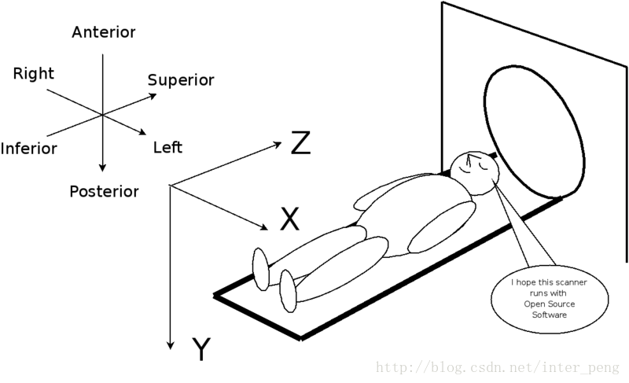
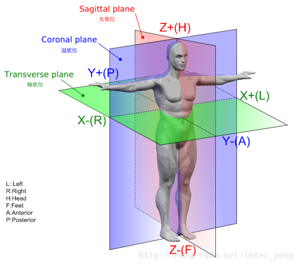
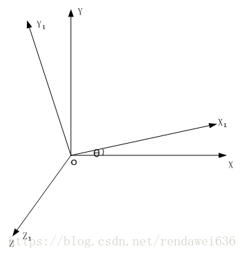
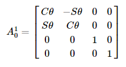
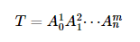
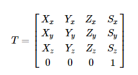
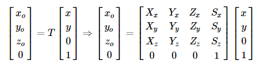
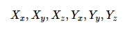
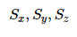

# 医疗图像解析

## Dicom

后缀： `.dcm`、`.DCM`  
Dicom中规定的坐标系是以人坐标系为绝对坐标系的，规定X轴正向指向病人的左侧，Y轴正向指向病人的背部，Z轴正向指向病人的头部。但是，坐标点的位置，每个厂商都有自己的看法  
下图展示了成像过程中对应的坐标系  
成像坐标系  


三视图  


[图片信息中的Tag说明](https://www.jianshu.com/p/ccf714028fd6)  
在DICOM中，是通过Image Position和Image Orientation来描述当前的图像和人体坐标系的相对位置的。  
解析举例

```python
import dicom
import pylab
import os


dcm_img_base_url = "/home/fan/datas/dcmFile"
ds = dicom.read_file(os.path.join(dcm_img_base_url, "N2D_0020.dcm"))
print("图片中存在的属性： ", ds.dir("pat"))
print("病人方位： ", ds.PatientOrientation)
# 以下两个属性标签描述图像位置信息
print("图像病人方向： ", ds.ImageOrientationPatient)
print("图像病人位置： ", ds.ImagePositionPatient)
# CT矩阵
pix = ds.pixel_array
# 打印图片
pylab.imshow(pix, cmap=pylab.cm.bone)
pylab.show()

ds1 = dicom.read_file(os.path.join(dcm_img_base_url, "N2D_0140.dcm"))
pix1 = ds1.pixel_array
pylab.imshow(pix1, cmap=pylab.cm.bone)
pylab.show()


```

以上使用的图片为ADNI数据集中的一个`.nii`图像转换为Dicom图像后的一个图片  
图片中存在的部分信息为  
ImageOrientationPatient: \['1', '-2.18345624778243e-11', '0', '2.1834562200241e-11', '1', '2.1834562200241e-11'\]  
ImagePositionPatient: \['-101.501693725586', '-141.694915766789', '-90.989616394043'\]  
之后我们需要使用这两个量来进行定位线的计算，VR，MPR的空间计算  
这两个量使用的空间坐标系  


原始坐标系为O，O<sub>1</sub>坐标系绕z轴以O系统的基础上旋转了θ的一个角度，我们可以把这个矩阵记录为



通过一系列这样的变换，我们可以得到最终的变换矩阵为



把T记为



我们的图像是一个2维的量，由于当前图像像素点的z方向坐标相对于当前图像的坐标系的值都为0，当前图像的坐标点可以用(x,y,0)的向量来表示，表示在齐次坐标方式就为（x,y,0,1），那么，这时想要计算出图像上的某个点相对于原始坐标系的坐标，就直接和转换矩阵T相乘即可，记为




Image Orientation的6个量就显而易见为



Image Position中的三个量为



## 引用

[Dicom中的Image Orientation/Position的理解和应用](https://blog.csdn.net/rendaweibuaa/article/details/80960386)  
[医学影像处理软件之Image Orientation相关介绍](https://blog.csdn.net/inter_peng/article/details/38173007)  
[医学图像数据格式: DICOM](https://www.jianshu.com/p/ccf714028fd6)