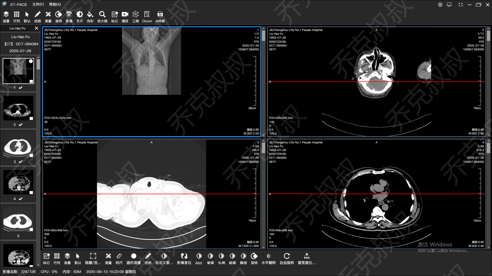
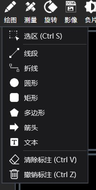
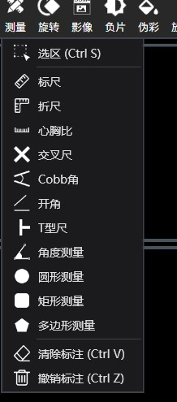
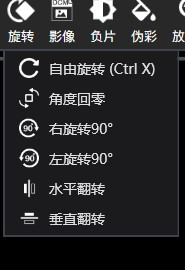
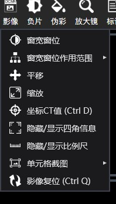
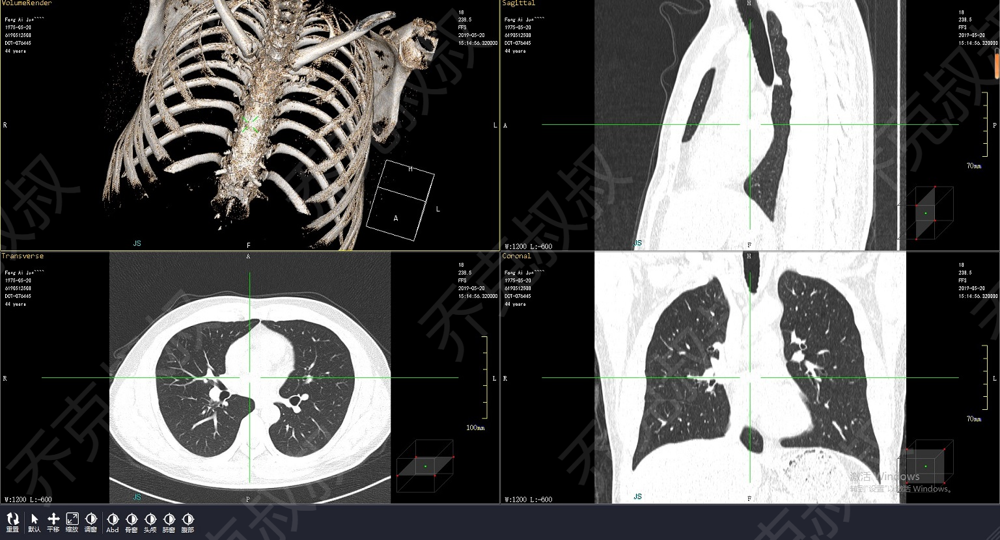
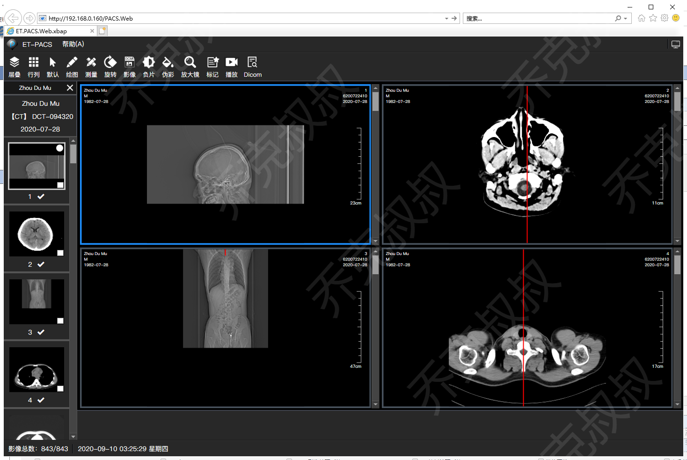
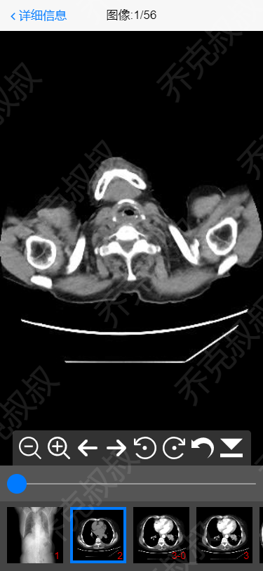
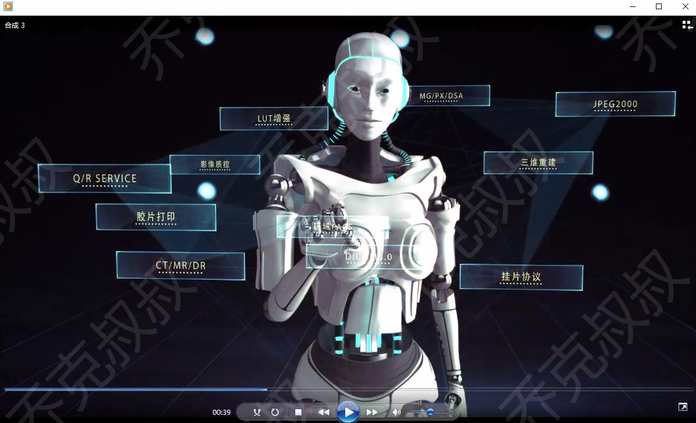
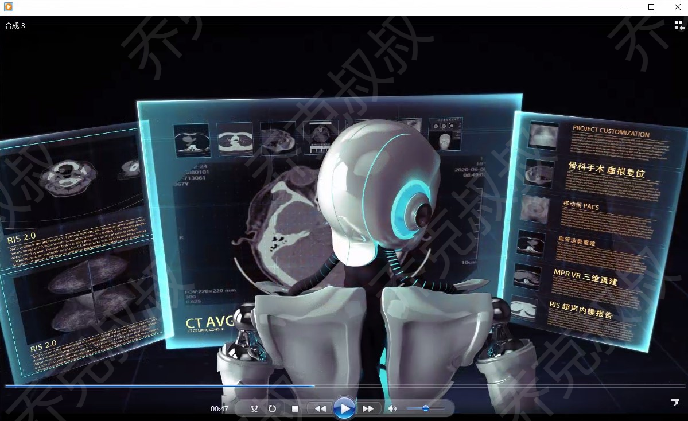

 [C#开发PACS医学影像处理系统(一)：开发背景和功能预览](https://www.cnblogs.com/Uncle-Joker/p/13646949.html)

本系列文章将从以下模块和大家分享和讨论使用C#开发医学软件PACS和RIS系统，

国内相关资料比较少，也借此机会丰富一下医学软件开发生态，讨论技术难点，希望大家互相帮助共同进步。

**章节介绍及截图预览：**

（一）PACS客户端：客户端功能和相关医学知识

部分功能菜单：

（二）PACS三维：MRP、MIP、VR

（三）PACS网页端：开发Web版本的PACS

（四）PACS移动端：基于HTML5

（五）PACS服务端：架构、收图、归档

（六）PACS与RIS系统的通信与集成

（七）视频特效教程：使用Adobe After Effects 制作软件宣传视频

 C#开发PACS、RIS、3D医学影像处理系统系列教程 目录整理：

### 菜鸟入门篇

PACS客户端：

[C#开发PACS医学影像处理系统(一)：开发背景和功能预览](https://www.cnblogs.com/Uncle-Joker/p/13646949.html "C#开发PACS医学影像处理系统(一)：开发背景和功能预览")

[C#开发PACS医学影像处理系统(二)：界面布局之菜单栏](https://www.cnblogs.com/Uncle-Joker/p/13650213.html "C#开发PACS医学影像处理系统(二)：界面布局之菜单栏")

[C#开发PACS医学影像处理系统(三)：界面布局之工具栏](https://www.cnblogs.com/Uncle-Joker/p/13650330.html "C#开发PACS医学影像处理系统(三)：界面布局之工具栏  ")

[C#开发PACS医学影像处理系统(四)：界面布局之状态栏](https://www.cnblogs.com/Uncle-Joker/p/13650514.html "C#开发PACS医学影像处理系统(四)：界面布局之状态栏")

[C#开发PACS医学影像处理系统(五)：查询病人信息列表](https://www.cnblogs.com/Uncle-Joker/p/13651660.html "C#开发PACS医学影像处理系统(五)：查询病人信息列表 ")

[C#开发PACS医学影像处理系统(六)：加载Dicom影像](https://www.cnblogs.com/Uncle-Joker/p/13665748.html "C#开发PACS医学影像处理系统(六)：加载Dicom影像")

[C#开发PACS医学影像处理系统(七)：读取影像Dicom信息](https://www.cnblogs.com/Uncle-Joker/p/13666034.html "C#开发PACS医学影像处理系统(七)：读取影像Dicom信息")

[C#开发PACS医学影像处理系统(八)：单元格变换](https://www.cnblogs.com/Uncle-Joker/p/13666817.html "C#开发PACS医学影像处理系统(八)：单元格变换")

[C#开发PACS医学影像处理系统(九)：序列控件与拖拽](https://www.cnblogs.com/Uncle-Joker/p/13672042.htm "C#开发PACS医学影像处理系统(九)：序列控件与拖拽")

[C#开发PACS医学影像处理系统(十)：Dicom影像下载策略与算法](https://www.cnblogs.com/Uncle-Joker/p/13667467.html "C#开发PACS医学影像处理系统(十)：Dicom影像下载策略与算法")

[C#开发PACS医学影像处理系统(十一)：Dicom影像挂片协议](https://www.cnblogs.com/Uncle-Joker/p/13677272.html "C#开发PACS医学影像处理系统(十一)：Dicom影像挂片协议")

[C#开发PACS医学影像处理系统(十二)：绘图处理之图形标记](https://www.cnblogs.com/Uncle-Joker/p/13677726.html "C#开发PACS医学影像处理系统(十二)：绘图处理之图形标记")

[C#开发PACS医学影像处理系统(十三)：绘图处理之病灶测量](https://www.cnblogs.com/Uncle-Joker/p/13679635.html "C#开发PACS医学影像处理系统(十三)：绘图处理之病灶测量")

[C#开发PACS医学影像处理系统(十四)：处理Dicom影像窗宽窗位](https://www.cnblogs.com/Uncle-Joker/p/13683841.html "C#开发PACS医学影像处理系统(十四)：处理Dicom影像窗宽窗位")

[C#开发PACS医学影像处理系统(十五)：Dicom影像交叉定位线算法](https://www.cnblogs.com/Uncle-Joker/p/13686618.html "C#开发PACS医学影像处理系统(十五)：Dicom影像交叉定位线算法")

[C#开发PACS医学影像处理系统(十六)：2D处理之影像平移和缩放](https://www.cnblogs.com/Uncle-Joker/p/13690213.html "C#开发PACS医学影像处理系统(十六)：2D处理之影像平移和缩放")

[C#开发PACS医学影像处理系统(十七)：2D处理之影像旋转和翻转](https://www.cnblogs.com/Uncle-Joker/p/13690483.html "C#开发PACS医学影像处理系统(十七)：2D处理之影像旋转和翻转")

[C#开发PACS医学影像处理系统(十八)：Dicom使用LUT色彩增强和反色](https://www.cnblogs.com/Uncle-Joker/p/13690710.html "C#开发PACS医学影像处理系统(十八)：Dicom使用LUT色彩增强和反色")

[C#开发PACS医学影像处理系统(十九)：Dicom影像放大镜](https://www.cnblogs.com/Uncle-Joker/p/13690862.html "C#开发PACS医学影像处理系统(十九)：Dicom影像放大镜")

PACS三维处理医学图像：

[C#开发PACS医学影像三维重建(一):使用VTK重建3D影像](https://www.cnblogs.com/Uncle-Joker/p/13692517.html "C#开发PACS医学影像三维重建(一):使用VTK重建3D影像")

C#开发PACS医学影像三维重建(二):使用VTK进行体绘制

C#开发PACS医学影像三维重建(三):纹理映射与颜色传输

C#开发PACS医学影像三维重建(四):3D网格平滑效果

C#开发PACS医学影像三维重建(五):基于梯度透明的组织漫游

C#开发PACS医学影像三维重建(六):三维光源与阴影效果

C#开发PACS医学影像三维重建(七):空间测量与标注

C#开发PACS医学影像三维重建(八):VR体绘制

C#开发PACS医学影像三维重建(九):MPR三视图切面重建

C#开发PACS医学影像三维重建(十):MIP最小密度投影

C#开发PACS医学影像三维重建(十一):CPR曲面重建

C#开发PACS医学影像三维重建(十二):VE虚拟内镜技术

[C#开发PACS医学影像三维重建(十三):基于人体CT值从皮肤渐变到骨骼的梯度透明思路](https://www.cnblogs.com/Uncle-Joker/p/16224192.html "C#开发PACS医学影像三维重建(十三):基于人体CT值从皮肤渐变到骨骼的梯度透明思路")

### 熟手进阶篇

医学影像算法：

[C#处理医学影像(一):基于Hessian矩阵的血管肺纹理骨骼增强对比](https://www.cnblogs.com/Uncle-Joker/p/14262455.html "C#处理医学影像(一):基于Hessian矩阵的血管肺纹理骨骼增强对比")

[C#处理医学影像(二):基于Hessian矩阵的医学影像增强与窗宽窗位](https://www.cnblogs.com/Uncle-Joker/p/14272728.html "C#处理医学影像(二):基于Hessian矩阵的医学影像增强与窗宽窗位")

[C#处理医学影像(三):基于漫水边界自动选取病灶范围的实现思路](https://www.cnblogs.com/Uncle-Joker/p/16021914.html "C#处理医学影像(三):基于Hessian矩阵的医学影像增强与窗宽窗位")

C#处理医学影像(四):影像锐化增强对比

PACS网页端 开发Web版本的PACS：

C#开发Web端PACS(一):基于PACS客户端思想重写Web端

C#开发Web端PACS(二):使用 .Net MVC 开发手机端PACS服务端

C#开发Web端PACS(三):使用HTML5和CSS3开发PACS手机端页面

C#开发Web端PACS(四):Web端与服务端的DICOM传输

C#开发Web端PACS(五):Web端的平移缩放旋转2D操作

C#开发Web端PACS(六):Web端的窗宽窗位调整

C#开发Web端PACS(七):将移动端接入微信公众号实现医院云胶片

### 登峰造极篇

C#开发基于Python人工智能的肺结节自动检测

C#开发基于Python人工智能的脊柱侧弯曲率算法

C#开发基于Python机器学习的医学影像骨骼仿真动画

C#开发基于Python机器学习的术后恢复模拟

C#开发基于U3D的VR眼镜设备虚拟人体三维重建

C#开发基于全息投影的裸眼3D医学影像显示技术

### 周边附加篇

胶片打印：

[C#开发医学影像胶片打印系统(一)：万能花式布局的实现思路](https://www.cnblogs.com/Uncle-Joker/p/14705974.html "C#开发医学影像胶片打印系统(一)：万能花式布局的实现思路")

C#开发医学影像胶片打印系统(二)：胶片打印机通讯

C#开发医学影像胶片打印系统(三)：Pacs二维功能在排版中的应用

PACS服务端：

C#开发PACS医学影像处理系统服务端(一):医疗设备的连接与收图

C#开发PACS医学影像处理系统服务端(二):高并发架构

PACS与RIS系统的通信与集成

在RIS系统中调起PACS并打开Dicom影像

云PACS与远程会诊

C#开发PACS医学影像处理系统之云PACS(区域PACS)(一):架构概述

C#开发PACS医学影像处理系统之云PACS(区域PACS)(二):远程会诊与双向转诊

科幻级视频特效：

使用Adobe After Effects 制作PACS影像处理系统宣传视频

本文作者：乔克灬叔叔

本文链接：https://www.cnblogs.com/Uncle-Joker/p/13646949.html

版权声明：本作品采用 [许可协议](https://www.cnblogs.com/Uncle-Joker/p/13646949.html)进行许可。