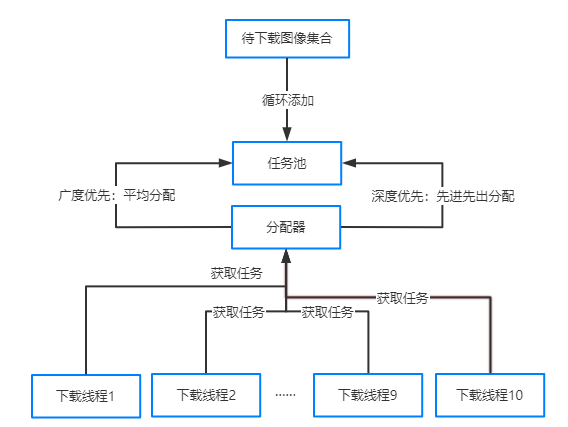

**1.传输协议**

当我们PACS客户端接收到下载命令时需要根据dcm文件的url来下载，这里推荐使用http协议，支持大文件的断点续传。

**2.下载策略**

假设有10个序列，每个序列有100张图像，

**①广度优先**：将任务池中的下载任务平均分配到10个序列，每个序列都同时下载，

**优点**：是每个序列都能分布加载，当用户切换序列到单元格时不需要等待。

**缺点**：当图像特别多的时候，比如CT薄层，序列切换图像滚动时显示不完整。

**②深度优先**：将任务池中的下载任务根据先进先出原则分配到排序在前的序列，下载完一个后再开始下一个。

**优点和缺点恰好和广度优先策略相反。**

**那么鱼和熊掌能不能兼得呢？能。**

**默认使用广度优先，当用户点击某个序列时，一般认为是用户优先想看的序列，**

**则为该序列加速，该序列视为特殊加速序列，下载任务排满，其他序列仍然是平均分配。**

**看效果：**

最后附上http下载的关键代码：
~~~
/// 

/// 下载文件
/// 

/// <param name="url">下载地址</param>
/// <param name="path">本地路径</param>
public static bool DownLoadFile(string url, string path)
{bool flag = false;
    long SPosition = 0;
    FileStream FStream = null;
    Stream myStream = null;

    try
    {
        //判断要下载的文件是否存在
        if (File.Exists(path))
        {
            //打开上次下载的文件
            FStream = File.OpenWrite(path);
            //获取已经下载的长度
            SPosition = FStream.Length;
            long serverFileLength = GetHttpLength(url);
            if (serverFileLength == -1)
            {
                //本地文件
                return true;
            }
            if (serverFileLength == 0)
            {
                return false;
            }
            if (SPosition == serverFileLength)
            {
                //文件是完整的，直接结束下载任务
                return true;
            }
            if (SPosition > serverFileLength)
            {
                SPosition = 0;
                FStream.Seek(0, SeekOrigin.Current);
            }
            else
            {
                FStream.Seek(SPosition, SeekOrigin.Current);
            }
        }
        else
        {
            FStream = new FileStream(path, FileMode.Create);
            SPosition = 0;
        }

        //打开网络连接
        HttpWebRequest myRequest = (HttpWebRequest)HttpWebRequest.Create(url);
        if (SPosition > 0)
        {
            //设置Range值
            myRequest.AddRange(SPosition);
        }
        //向服务器请求,获得服务器的回应数据流
        myStream = myRequest.GetResponse().GetResponseStream();
        //定义一个字节数据
        byte[] btContent = new byte[512];
        int intSize = 0;
        intSize = myStream.Read(btContent, 0, 512);
        while (intSize > 0)
        {
            FStream.Write(btContent, 0, intSize);
            intSize = myStream.Read(btContent, 0, 512);
        }
        flag = true;
    }
    catch (Exception ex)
    {
        flag = false;
        LogApi.WriteLog("下载文件时异常:" + path);
        LogApi.WriteErrLog(ex);
    }
    finally
    {
        //关闭流
        if (myStream != null)
        {
            myStream.Close();
            myStream.Dispose();
        }
        if (FStream != null)
        {
            FStream.Close();
            FStream.Dispose();
        }
    }
    return flag;
}
~~~