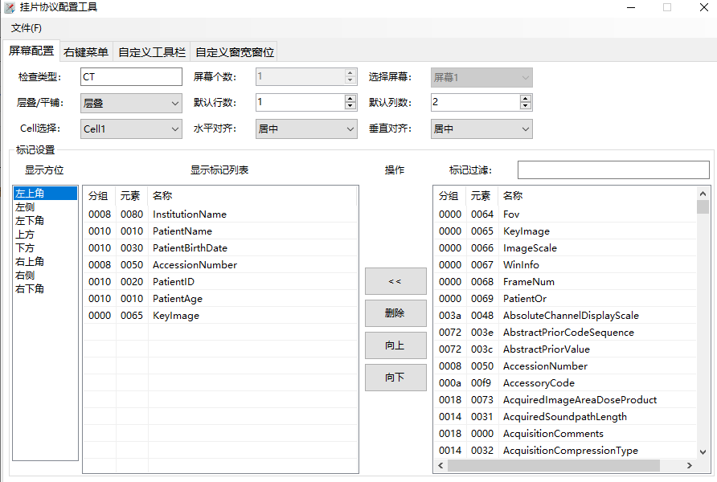
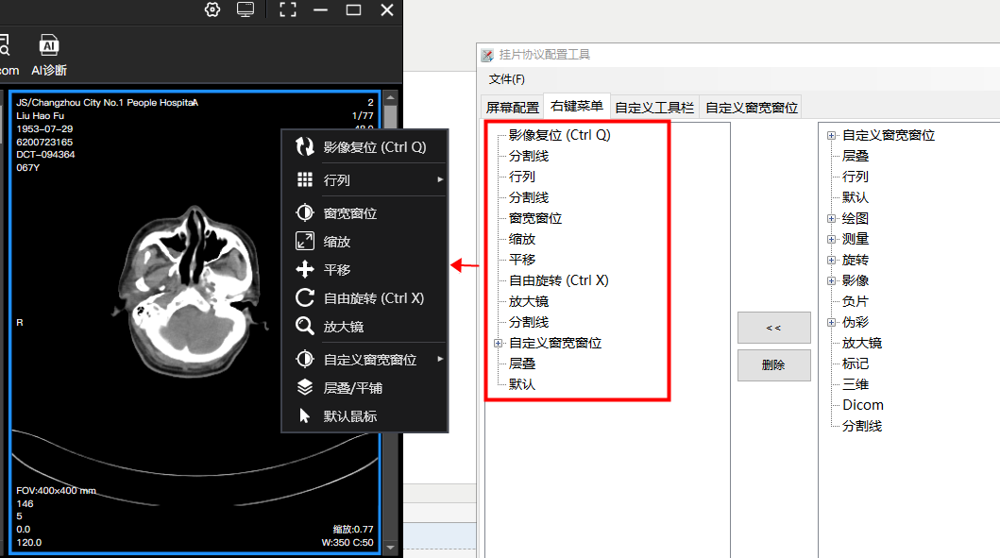
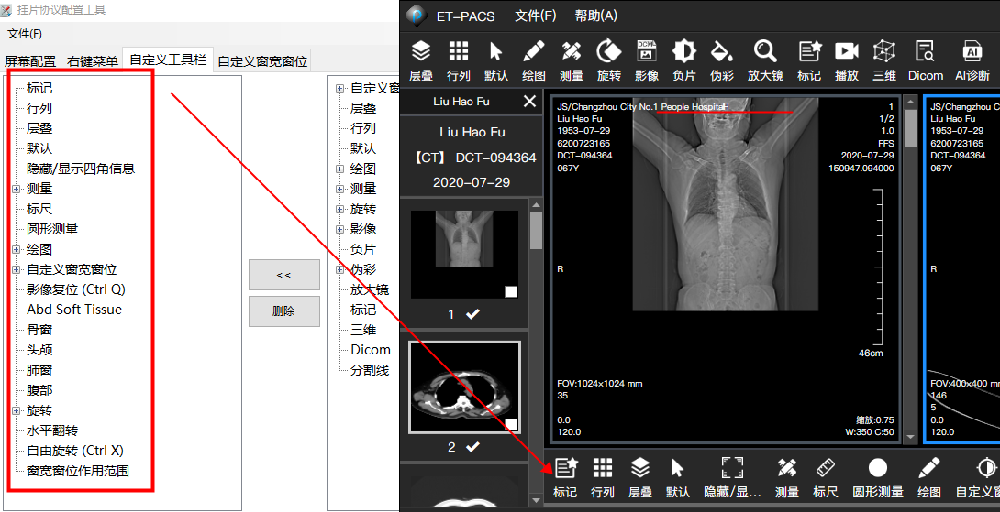
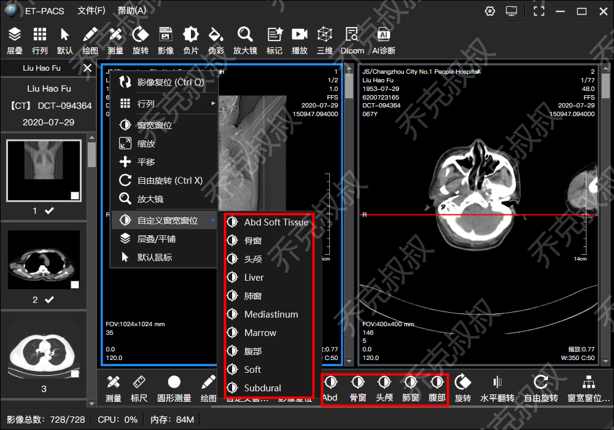
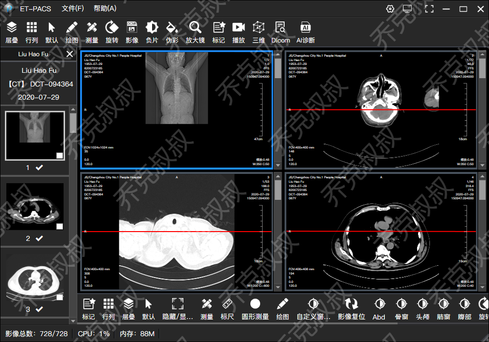
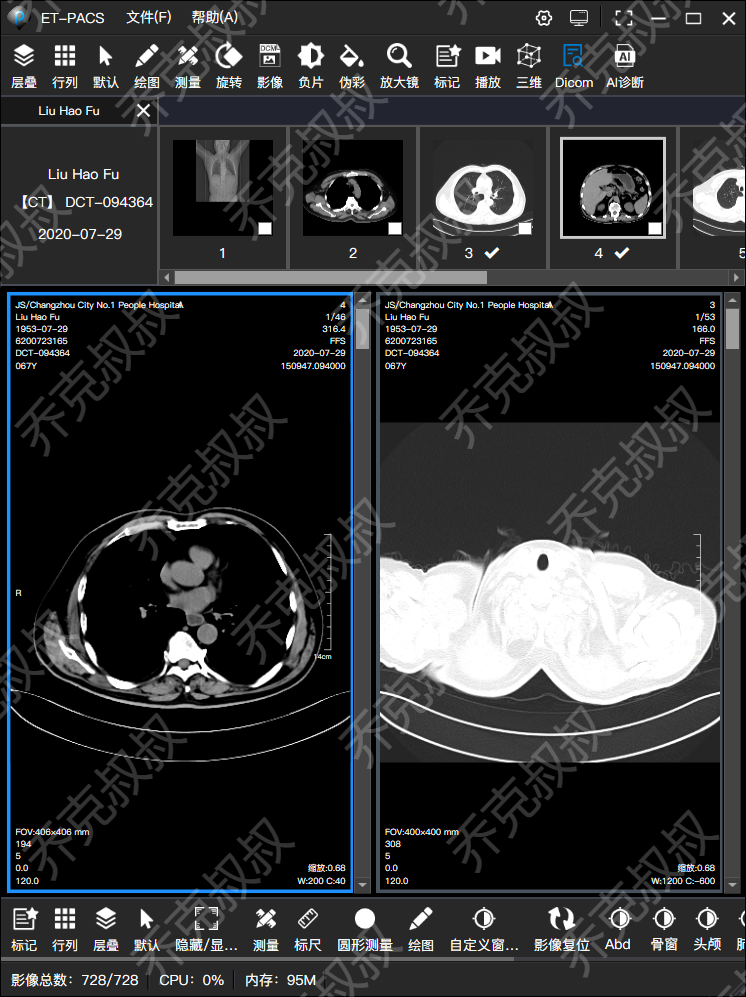

通俗点说，挂片协议可以看作整个系统的一个相对复杂一点的配置文件，可以用JSON或XML格式来读取与保存，

另外，可以制作一个独立的exe配置程序来管理这些挂片协议。

假设配置了CT的挂片协议的右键菜单，那么在打开CT影像时则是对应的不同的动态的右键菜单，如下图：

 ****

 CT影像的自定义工具栏，如下图：

CT影像的自定义窗宽窗位，如下图：

 

协议格式可以参考XML格式：
~~~xml
<?xml version="1.0" encoding="utf-8"?>
  <Modality>CT</Modality>
  <ScreenCount>1</ScreenCount>
  <Screens>
    <Screen>
      <ScreenIndex>0</ScreenIndex>
      <Primary>true</Primary>
      <Layout>STACK</Layout>
      <RowCount>1</RowCount>
      <ColCount>2</ColCount>
      <Annotations>
        <Annotation>
          <Location>TopLeft</Location>
          <AnnotationTags>
            <long>524416</long>
            <long>1048592</long>
            <long>1048624</long>
            <long>524368</long>
            <long>1048608</long>
            <long>1052688</long>
            <long>101</long>
          </AnnotationTags>
        </Annotation>
      </Annotations>
      <Cells>
        <Cell>
          <CellIndex>1</CellIndex>
          <HorizontalAlign>Center</HorizontalAlign>
          <VerticalAlign>Center</VerticalAlign>
        </Cell>
        <Cell>
          <CellIndex>2</CellIndex>
          <HorizontalAlign>Center</HorizontalAlign>
          <VerticalAlign>Center</VerticalAlign>
        </Cell>
      </Cells>
    </Screen>
  </Screens>
</HangingProtocol>
~~~

**其中需要注意的是序列控件的布局，不同的医院和不同设备需要根据情况自动布局调整。**

**1.横屏显示器：序列列表在左侧或右侧，尽可能的控制上下位置来留给图像。**

**2.竖屏显示器：序列列表在上侧或下侧，尽可能的控制左右位置来留给图像。**

