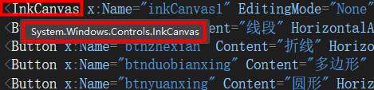
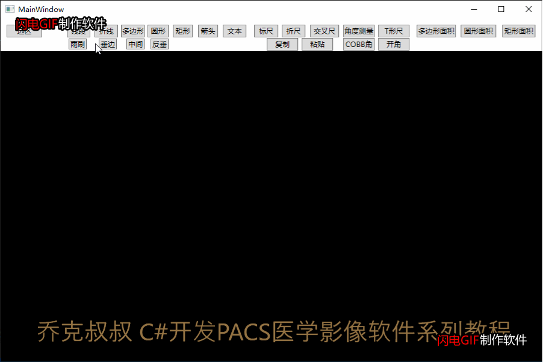
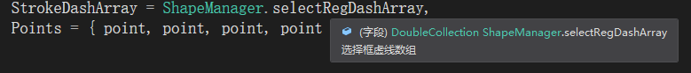
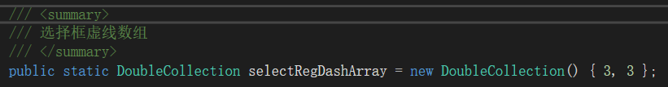
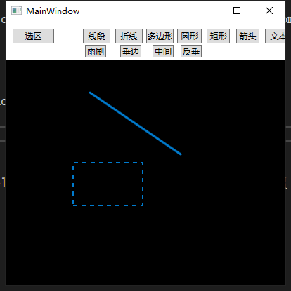
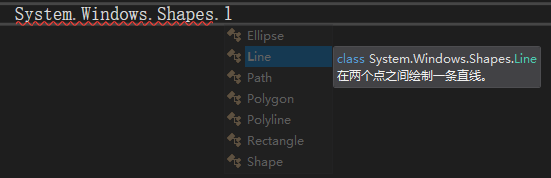

在医生实际使用过程中，对于有病灶的影像需要一些2D绘图操作，例如对于病灶的标记和测量，

这就牵涉到在WPF中的2D绘图操作技术，一般的思路是监听鼠标的按下和抬起以及运动轨迹，目前整理出的常用绘图和测量功能如下：

**图形标记类：（测量类请参考本系列文章：绘图处理之测量工具）**

|   |   |
| --- | --- |
| 功能 | 说明 |
| 选区 | 蚂蚁线选择框 |
| 线段 | 线段标记 |
| 折线 | 折线标记 |
| 圆形 | 空心圆形 |
| 矩形 | 空心矩形 |
| 多边形 | 空心多边形 |
| 箭头 | 指向作用 |
| 文本 | 文本标记 |
| 清除所有标记 | 清空单元格绘图对象 |
| 撤销上个标记 | 删除上一个绘图对象 |

在WPF中， 推荐使用InkCanvas控件。

**最终效果：**

**1.在你的C#工程中添加一个图形类作为操作基类：**
~~~
/// 

/// 图形信息
/// 

public class ShapeInfo
{
    #region -----声明变量-----

    /// 

    /// 图形操作类型
    /// 

    public DrawAction shapeType = DrawAction.None;

    /// 

    /// 控件画布对象
    /// 

    public InkCanvas inkCanvas;

    /// 

    /// 单位图形画布对象
    /// 

    public Canvas canvas;

    /// 

    /// 图形
    /// 

    public Shape shape;

    /// 

    /// 控制点矩形对象集合
    /// 

    public Dictionary<string, Ellipse> CtrlPoints;

    /// 

    /// 范围选区矩形对象
    /// 

    public Polygon regionRect;

    /// 

    /// 当前形状的几何体
    /// 

    public Geometry geometry;

    /// 

    /// 是否为测量行为
    /// 

    public bool isMeasure = false;

    /// 

    /// 测量对象集合
    /// 

    public List<TextBlock> measureList = new List<TextBlock>();

    #endregion

    #region -----基类虚方法-----

    /// 

    /// 绘制图形
    /// 

    /// <param name="point">鼠标坐标</param>
    public virtual void DrawShape(Point point) { }

    /// 

    /// 图形绘制完成
    /// 

    /// <param name="point">鼠标坐标</param>
    /// <param name="isCallBack">是否回调</param>
    public virtual bool DrawDone(Point point, bool isCallBack) { return true; }

    /// 

    /// 绘制完成回调函数
    /// 

    /// <param name="point">鼠标坐标</param>
    /// <param name="isCallBack">是否回调</param>
    public delegate bool DrawDoneCallBack(Point point, bool isCallBack);

    /// 

    /// 绘制完成回调函数对象
    /// 

    public DrawDoneCallBack drawDoneCallBack;

    /// 

    /// 选区移动回调函数
    /// 

    /// <param name="curPoint">当前鼠标坐标</param>
    /// <param name="downPoint">按下鼠标坐标</param>
    public delegate void RegionRectMoveCallBack(Point curPoint, Point downPoint);

    /// 

    /// 选区移动回调函数对象
    /// 

    public RegionRectMoveCallBack regionRectMoveCallBack;

    #endregion
　　}
~~~

2.创建图形标记的子类来继承基类，例如绘制一个线段：
~~~
/// 

/// 线段图形信息
/// 

public class LineInfo : ShapeInfo
~~~

在此类中创建绘制方法

~~~
/// 

/// 创建线段
/// 

/// <param name="point">起点坐标</param>
public void CreateLine(Point point)
{
    Line line = new Line
    {
        //线段颜色
        Stroke = ShapeManager.shapeColor,
        //线段粗细
        StrokeThickness = ShapeManager.shapeThickness,
        //圆角顶点
        StrokeLineJoin = PenLineJoin.Round,
        StrokeEndLineCap = PenLineCap.Round,
        StrokeStartLineCap = PenLineCap.Round,
        //起点的X、Y坐标
        X1 = point.X,
        Y1 = point.Y,
        //终点的X、Y坐标
        X2 = point.X,
        Y2 = point.Y,
    };

  　　　　　　Canvas canvas = new Canvas();
    canvas.Children.Add(line);
    inkCanvas.Children.Add(canvas);
}
~~~
监听鼠标的的运动轨迹并重新绘制：
~~~
/// 

/// 绘制图形
/// 

/// <param name="point">当前坐标</param>
public override void DrawShape(Point point)
{
    line.X2 = point.X;
    line.Y2 = point.Y;
}
~~~
绘制控制点：一个白色的圆形内嵌一个黑色的圆形，作为绘图完成之后的控制点
~~~
/// 

/// 绘制控制点
/// 

/// <param name="point">鼠标坐标</param>
/// <param name="tag">控制点标志</param>
/// <returns></returns>
public Ellipse DrawCtrlPoint(Point point, string tag)
{
    Ellipse ctrlPoint = new Ellipse
    {
        StrokeThickness = ShapeManager.ctrlPointThickness,
        Stroke = ShapeManager.ctrlPointColor,
        Fill = ShapeManager.ctrlPointFill,
        Width = ShapeManager.ctrlPointWidth,
        Height = ShapeManager.ctrlPointHeight,
        Margin = new Thickness(point.X - 5, point.Y - 5, point.X - 5, point.Y - 5),
        Visibility = Visibility.Hidden,
    };
    if (!CtrlPoints.Keys.Contains(tag))
    {
        CtrlPoints.Add(tag, ctrlPoint);
        canvas.Children.Add(ctrlPoint);
        ctrlPoint.Tag = tag;
    }
    return ctrlPoint;
}
~~~
**看效果：**

 

蚂蚁线选区：
~~~
/// 

/// 创建选择框
/// 

/// <param name="point">起点坐标</param>
public void CreateSelected(Point point)
{

    Polygon selectedPoly = new Polygon
    {
        Stroke = ShapeManager.selectRegColor,
        StrokeThickness = ShapeManager.selectRegThickness,
        StrokeDashArray = ShapeManager.selectRegDashArray,
        Points = { point, point, point, point },
    };
    canvas.Children.Add(selectedPoly);
    inkCanvas.Children.Add(canvas);
}
~~~
其中要注意的是绘制模式改成虚线并控制间隔才能变成蚂蚁线：

 

 

那么以此类推，通过命名空间System.Windows.Shapes，我们可以继续绘制其他图形了

最后，关于撤销上个标记和清除所有标记，只需要将图形对象保存在LIst集合中，

需要删除或撤销的时候从集合中移除，并在画布中移除即可。