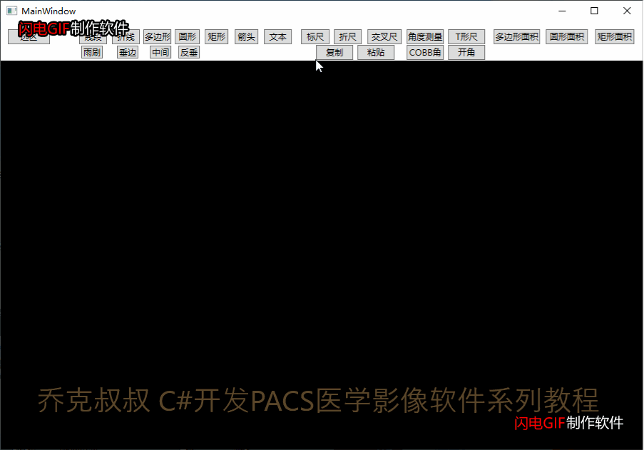
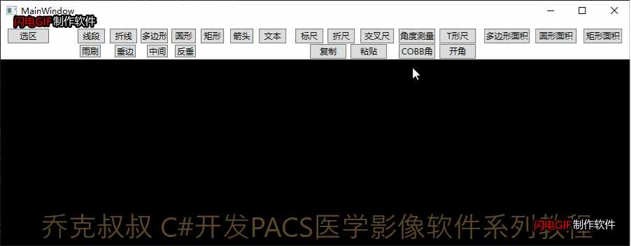
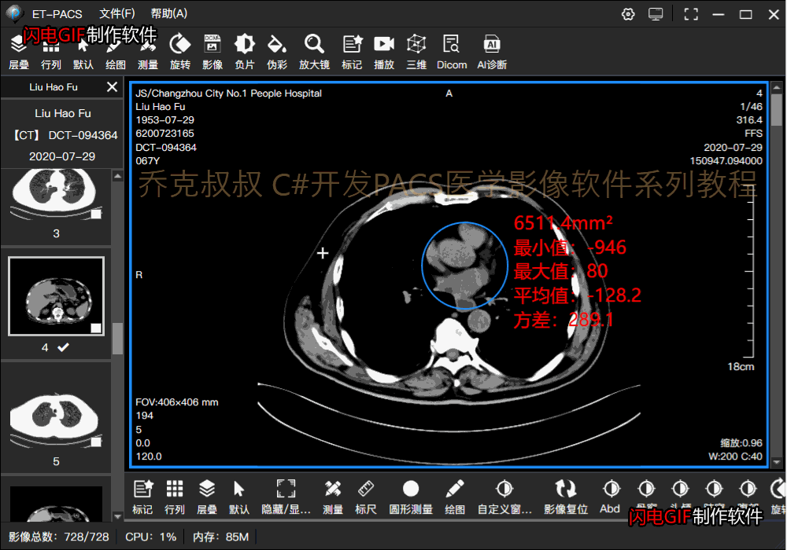
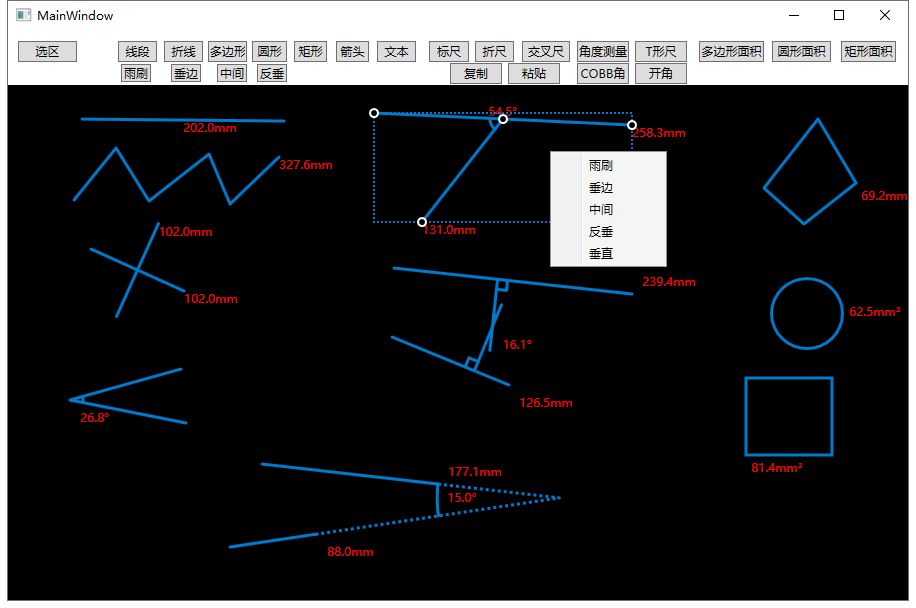

接上一篇文章，当我们可以绘制图形标记后，就可以在此操作类上面进行扩展，

比如测量类工具，目前整理出的常用绘图和测量功能如下：

**测量工具类：（图形标记类请参考本系列文章：**[绘图处理之图形标记](https://www.cnblogs.com/Uncle-Joker/p/13677726.html "C#开发PACS医学影像处理系统(十二)：绘图处理之图形标记")**）**

|   |   |
| --- | --- |
| 功能 | 说明 |
| 标尺 | 线段长度测量 |
| 折尺 | 曲线长度测量  |
| 心胸比 | 两根线段按比例测量  |
| 交叉尺 | 两根线段互相垂直测量  |
| Cobb角 | 两根线段的垂线交点角度测量，一般用于脊柱曲率  |
| 开角 | 两根线段的延长交点的角度测量 |
| T型尺 | 两根线段相交的任意角度摇摆测量和长度测量 |
| 角度测量 | 角度测量 |
|  圆形测量 | 圆形或椭圆面积测量，包括CT值，平均值，方差，最大最小值 |
| 矩形测量  | 矩形面积测量，包括CT值，平均值，方差，最大最小值 |
| 多边形测量  | 多边形面积 |

**以线段测量为例，看效果：**

 在绘制图形的基础上，我们创建一个Text Block来显示测量结果：
~~~
//文本对象
TextBlock txtMeasure;

/// 

/// 创建测量结果文本
/// 

/// <param name="point"></param>
public void CreateMeasure(Point point)
{
    if (!isMeasure)
    {
        return;
    }

    txtMeasure = new TextBlock();
    txtMeasure.Text = "0.0mm";
    txtMeasure.FontSize = ShapeManager.shapeMeasureFontSize;
    txtMeasure.Foreground = ShapeManager.shapeMeasureColor;
    txtMeasure.Height = 30;
    txtMeasure.Width = 100;
    txtMeasure.SetValue(Canvas.LeftProperty, point.X);
    txtMeasure.SetValue(Canvas.TopProperty, point.Y);
    canvas.Children.Add(txtMeasure);
    measureList.Add(txtMeasure);

}
~~~

计算两点之间的距离：其中dpi是缩放比例
~~~
/// 

/// 求平面中两点之间距离
/// 

/// <param name="p1">点1</param>
/// <param name="p2">点2</param>
/// <returns></returns>
public static double GetDistance(Point p1, Point p2)
{
    double result = 0;
    result = Math.Sqrt((p1.X * dpiX - p2.X * dpiX) * (p1.X * dpiX - p2.X * dpiX) + (p1.Y * dpiY - p2.Y * dpiY) * (p1.Y * dpiY - p2.Y * dpiY));
    return result;
}
~~~

一些角度类型的测量计算相对复杂一点，需要计算角度大小和绘制弧线

~~~
/// 

/// 弧线画笔对象
/// 

public Stroke circleStroke;

/// 

/// 绘制角度弧线
/// 

private void DrawAxiesCircle(Point point0, Point point1, Point point2)
{

    if (inkCanvas.Strokes.Count > 0 && circleStroke != null)
    {
        if (inkCanvas.Strokes.Contains(circleStroke))
        {
            inkCanvas.Strokes.Remove(circleStroke);
        }
    }

    //计算角度
    double a = Math.Sqrt((point1.X - point2.X) * (point1.X - point2.X) + (point1.Y - point2.Y) * (point1.Y - point2.Y));
    double b = Math.Sqrt((point1.X - point0.X) * (point1.X - point0.X) + (point1.Y - point0.Y) * (point1.Y - point0.Y));
    double c = Math.Sqrt((point2.X - point0.X) * (point2.X - point0.X) + (point2.Y - point0.Y) * (point2.Y - point0.Y));
    double cTheta = (a * a + b * b - c * c) / (2 * a * b);
    double theta = Math.Acos(cTheta) * 180 / Math.PI;

    //绘制弧线
    double r = 30;
    r = a > b ? b : a;
    double rMax = a;
    if (rMax > b)
    {
        rMax = b;
    }
    if (r > 0.5 * rMax)
    {
        r = 0.5 * rMax;
    }

    double theta0 = Math.Atan((point1.Y - point2.Y) / (point2.X - point1.X + 1e-10)) * 180 / Math.PI;
    if (point1.X > point2.X)
    {
        theta0 = 180 + theta0;
    }
    List<Point> pointList = new List<Point>();
    double sin_ab = ((point2.X - point1.X) * (point0.Y - point1.Y) - (point2.Y - point1.Y) * (point0.X - point1.X)) / (a * b); ;
    if (sin_ab <= 0)
    {

        if (theta < 1)
        {
            for (double delta = 0.0001; delta <= theta;)
            {
                double th = delta + theta0;
                pointList.Add(new Point(point1.X + r * Math.Cos(th * Math.PI / 180), point1.Y - r * Math.Sin(th * Math.PI / 180)));
                delta = delta + 0.0001;
            }
        }
        else if (theta > 1 && theta < 20)
        {
            for (double delta = 0.01; delta <= theta;)
            {
                double th = delta + theta0;
                pointList.Add(new Point(point1.X + r * Math.Cos(th * Math.PI / 180), point1.Y - r * Math.Sin(th * Math.PI / 180)));
                delta = delta + 0.01;
            }
        }
        else
        {
            for (double delta = 0; delta <= theta; delta++)
            {
                double th = delta + theta0;
                pointList.Add(new Point(point1.X + r * Math.Cos(th * Math.PI / 180), point1.Y - r * Math.Sin(th * Math.PI / 180)));
            }
        }
    }
    else
    {
        if (theta < 1)
        {
            for (double delta = -theta; delta <= 0;)
            {
                double th = delta + theta0;
                pointList.Add(new Point(point1.X + r * Math.Cos(th * Math.PI / 180), point1.Y - r * Math.Sin(th * Math.PI / 180)));
                delta = delta + 0.0001;
            }
        }
        else if (theta > 1 && theta < 20)
        {
            for (double delta = -theta; delta <= 0;)
            {
                double th = delta + theta0;
                pointList.Add(new Point(point1.X + r * Math.Cos(th * Math.PI / 180), point1.Y - r * Math.Sin(th * Math.PI / 180)));
                delta = delta + 0.01;
            }
        }
        else
        {
            for (double delta = -theta; delta <= 0; delta++)
            {
                double th = delta + theta0;
                pointList.Add(new Point(point1.X + r * Math.Cos(th * Math.PI / 180), point1.Y - r * Math.Sin(th * Math.PI / 180)));
            }
        }
    }
    if (pointList.Count > 0)
    {
        StylusPointCollection point = new StylusPointCollection(pointList);
        circleStroke = new Stroke(point)
        {
            DrawingAttributes = inkCanvas.DefaultDrawingAttributes.Clone(),
        };
        inkCanvas.Strokes.Add(circleStroke);
        txt.Text = theta.ToString(ShapeManager.measureDigit) + "°";
    }
    ReSetAnglePoint();
}
~~~
在圆形和矩形的面积测量中，我们可以使用GetArea()方法来获取图形面积：

~~~
  　　　 /// 

        /// 计算面积测量结果
        /// 

        public void CalculateMeasure()
        {
            if (!isMeasure)
            {
                return;
            }
            Ellipse ellipse = (Ellipse)shape;
            ellipse.UpdateLayout();
            txtMeasure.Text = Math.Sqrt(ellipse.RenderedGeometry.GetArea()).ToString(ShapeManager.measureDigit) + "mm²";
            ReSetMeasurePoint();
        }
~~~

**其他一些需要注意的细节：**

**1.当单元格放大缩小时，图形也要重新计算各个控制点的位置来同步放大或缩小**

监听画布大小变化事件：

`private void ToolInkCanvas_SizeChanged(object sender, SizeChangedEventArgs e)`

重新绘制元素：
~~~
/// 

/// 重新绘制画布元素大小
/// 

public void ReSetShapeSize()
{
    for (int i = 0; i < shapeManager.shapeList.Count; i++)
    {
        sizeScaleX = ToolInkCanvas.ActualWidth / shapeManager.shapeList[i].cvsWidth;
        sizeScaleY = ToolInkCanvas.ActualHeight / shapeManager.shapeList[i].cvsHeight;

        shapeManager.shapeList[i].cvsWidth = ToolInkCanvas.ActualWidth;
        shapeManager.shapeList[i].cvsHeight = ToolInkCanvas.ActualHeight;

        if (shapeManager.shapeList[i] is TextInfo)
        {
            shapeManager.shapeList[i].ReSetScalePoints(sizeScaleX, sizeScaleY, "text", shapeManager.shapeList[i]);
        }
        else if (shapeManager.shapeList[i] is CrossRulerInfo)
        {
            shapeManager.shapeList[i].ReSetScalePoints(sizeScaleX, sizeScaleY, "crossRuler", shapeManager.shapeList[i]);
        }
        else if (shapeManager.shapeList[i] is AngleRulerInfo)
        {
            shapeManager.shapeList[i].ReSetScalePoints(sizeScaleX, sizeScaleY, "angle", shapeManager.shapeList[i]);
        }
        else if (shapeManager.shapeList[i] is TRulerInfo)
        {
            shapeManager.shapeList[i].ReSetScalePoints(sizeScaleX, sizeScaleY, "tRulerInfo", shapeManager.shapeList[i]);
        }
        else if (shapeManager.shapeList[i] is CobbAngleInfo)
        {
            shapeManager.shapeList[i].ReSetScalePoints(sizeScaleX, sizeScaleY, "cobbAngleInfo", shapeManager.shapeList[i]);
        }
        else if (shapeManager.shapeList[i] is OpenAngleInfo)
        {
            shapeManager.shapeList[i].ReSetScalePoints(sizeScaleX, sizeScaleY, "openAngleInfo", shapeManager.shapeList[i]);
        }
        else
        {
            shapeManager.shapeList[i].ReSetScalePoints(sizeScaleX, sizeScaleY);
        }
    }
}
~~~

**2.文字可能会挡住图像，要能分离并拖动到其他位置，监听鼠标事件和重新设置位置即可。**

 **3.标记的复制与粘贴，思路是将List集合中用户所选定的标记插入到另一个单元格的List集合中，并支持Ctrl C和Ctrl V 快捷键。**

测量标记汇总（Demo）：

